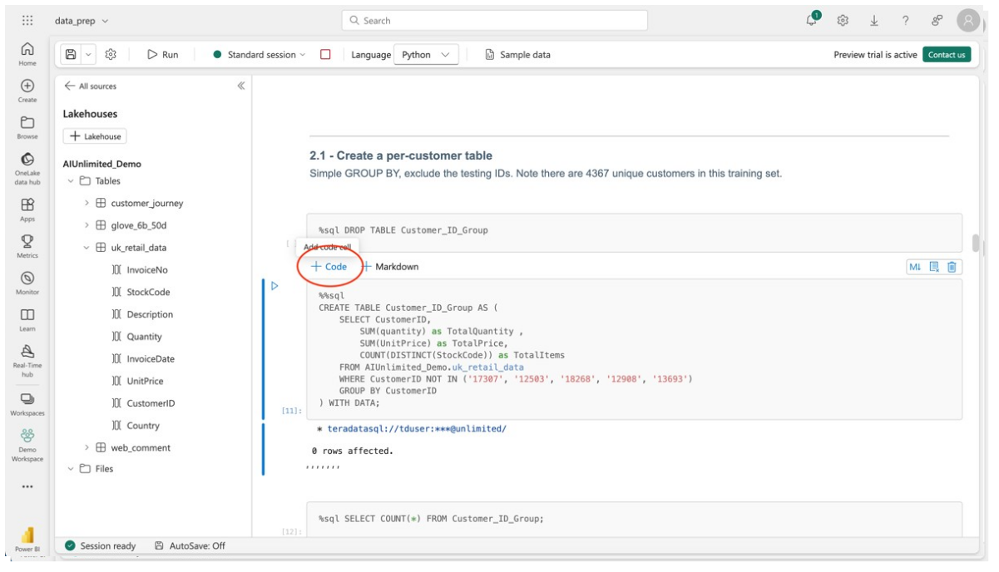
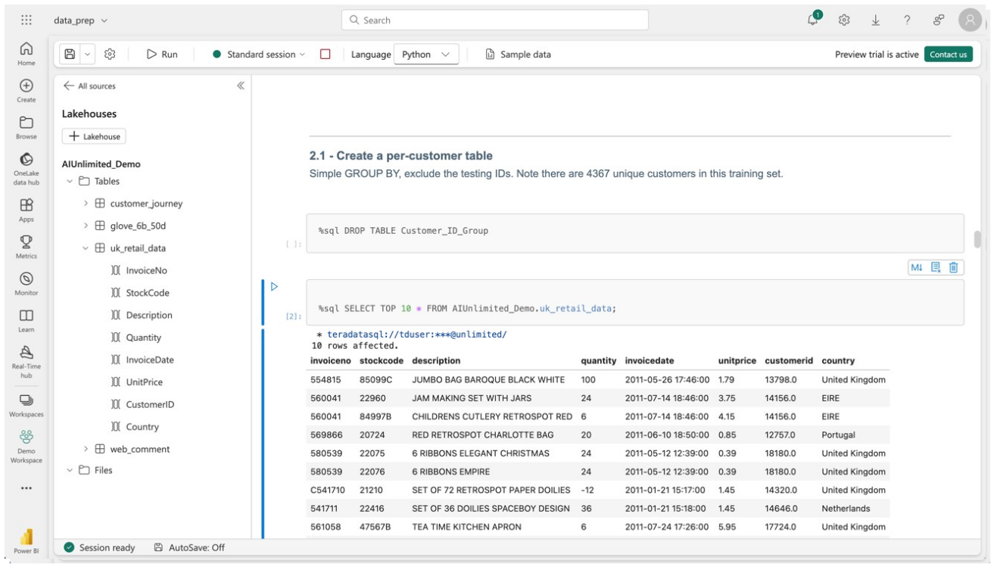
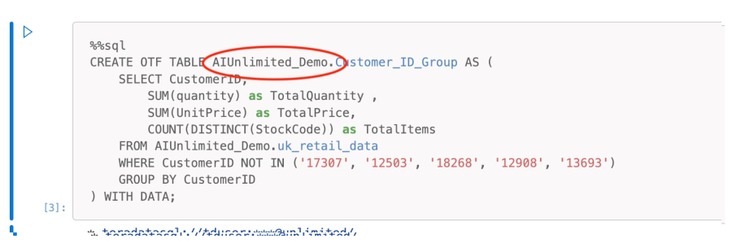
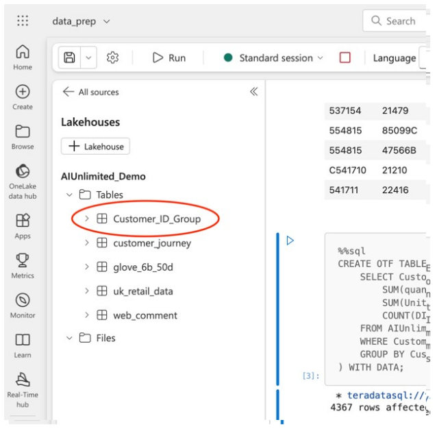
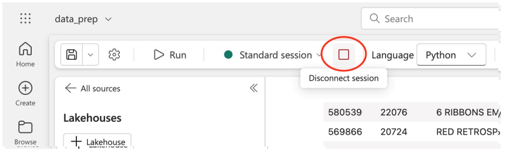
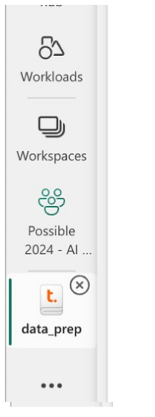
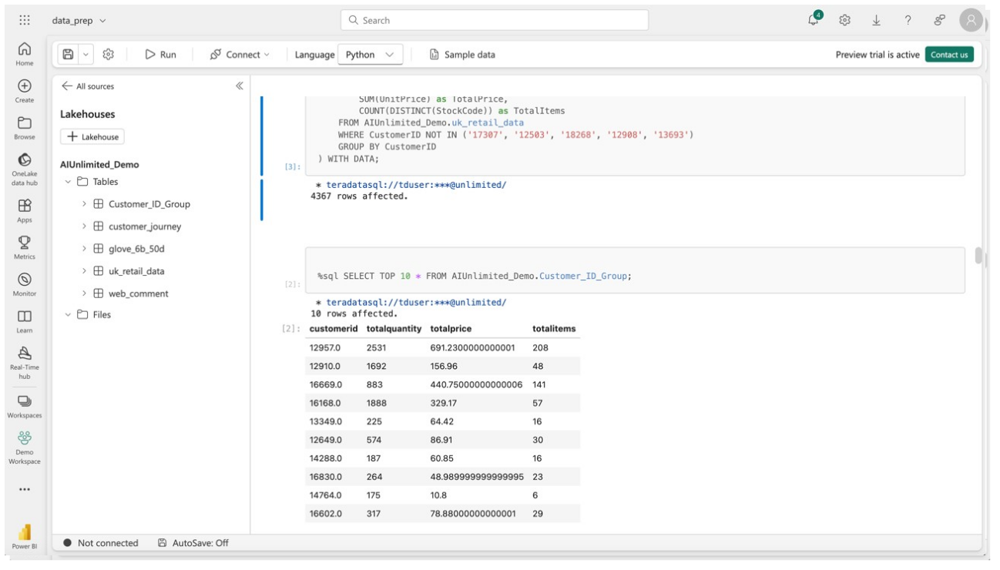

import Tabs from '@theme/Tabs';
import TabItem from '@theme/TabItem';

# Try out the use case

The sample notebook has information about applying the AI Unlimited in-database functions to different stages of data preparation for a hypothetical use case. The other sample notebooks, financial customer journey and user segmentation, do the same thing. We will not cover those details here and will instead let you discover that through the notebook itself.  By default, the sample notebooks create tables in memory that are destroyed when the notebook is closed or disconnected. In this section we will look at how to:
- Select tables from the Lakehouse explorer as an easy, optional way to find data
- Write to the lakehouse 
- Find data between sessions

## Evaluate a table in the notebook

Scroll down to section 2.1

In this section, the sample notebook demonstrates modifying a dataset that is unique in one dimension (“invoiceno”) to be unique by the desired dimension for analysis (“customerid”). 

The “drop table” cell simply clears the table from memory in case the user has already run the following cell with the “SUM(quantity)” expression.

Before the cell with “CREATE OTF TABLE” let’s add a code cell to look at the data before it is transformed.

The option to create a new cell appears above an existing cell when you select it. Select the cell with the “CREATE OTF TABLE” expression and select “+Code.”

Once the cell is created, select the “uk_retail_data” table from the Lakehouse explorer and drag it into the cell. This action always drops a “SELECT TOP 10” from the selected table expression into the cell and makes it easy to move from browsing tables to quickly adding the desired table name to a cell.

Run the cell and you will see that the top ten have “invoices” as a dimension with unique values. But, we want to analyze by “customerid.”

Running a cell will automatically connect the notebook to a “standard session.”

:::note
“High-concurrency” sessions are not available in preview.
:::

## Write to OneLake

In the next cell with “SUM(quantity)” you can see an expression to modify the table to aggregate invoice data by customerid. As it is written it will create this table in memory. This new table will be lost when you close the notebook or become inactive. 

To write the created table to OneLake, we will append the target lakehouse name to the front of the table.

Add the destination lakehouse followed by a period, “AIUnlimited_Demo.”, to the front of “Customer_ID_Group,” the table being created.  The “CREATE OTF TABLE” expression is used by AI Unlimited to write a delta lake or Iceberg table and is necessary when writing to OneLake. 

You should see your new table appear in the explorer.

To limit your consumption of compute while staying in the notebook, you can disconnect from the engine by selecting the stop icon to disconnect the session. This will destroy the engine along with any data created during the session unless it was explicitly written to OneLake. The table Customer_ID_Group will still be in our lakehouse.

## Save your work

Now let’s save the notebook. Any changes we made in code or markdown will persist when we reopen the notebook. 

We can close the notebook by simply clicking the “x” button in the tab on the sidebar. This automatically disconnects the session if and releases the engine and destroys any data that was not written to OneLake.

## Pick up where we left off

Find and reopen the “data_prep” table in your workspace. Connect to the AIUnlimited_demos lakehouse in the Lakehouse explorer.

Go back to section 2.1. See the Top 10 results for UK_retail_data.

Beneath the cell with “CREATE OTF TABLE” that we edited to write to OneLake, create another code cell.

Drag our new table, “Customer_ID_Group,” into the cell and run it.

See that the new table with aggregated values has “customerid” as a unique value. We are now ready to create fit tables for our analysis.

