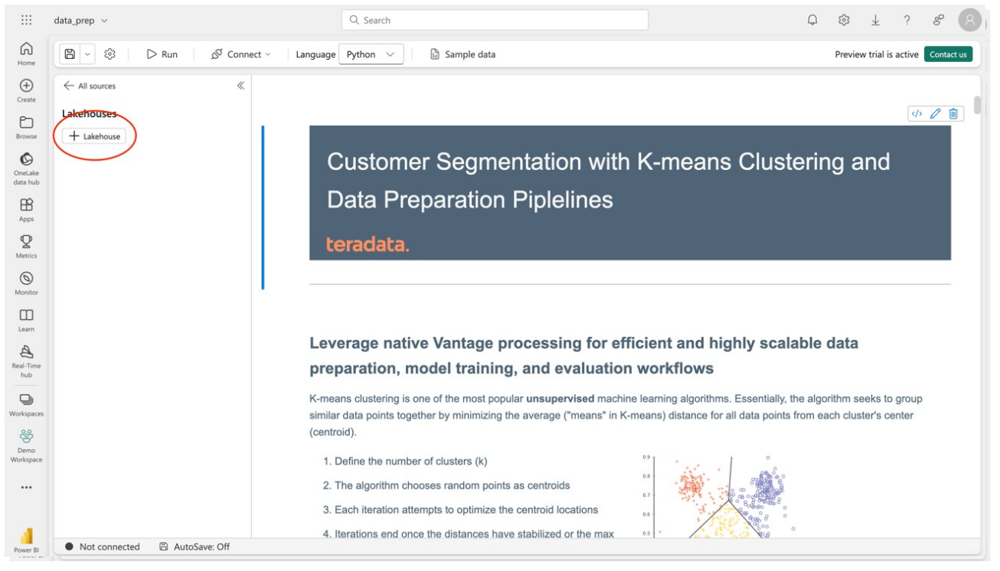
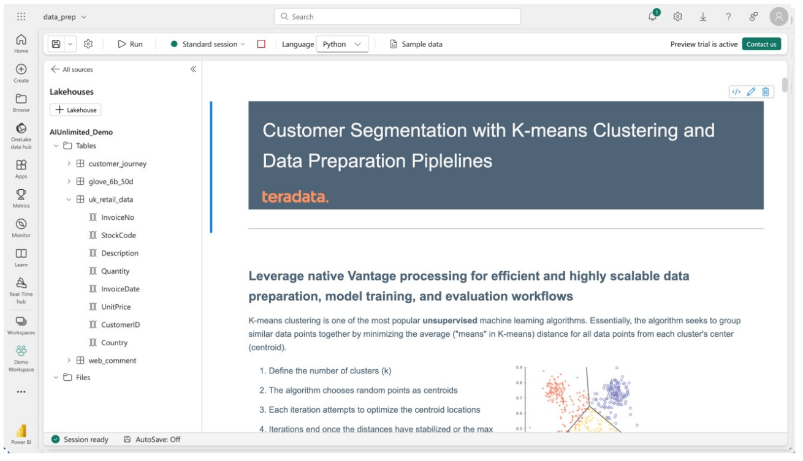

# Connect to the sample lakehouse

To the left of the notebook is the Lakehouse explorer. This feature connects directly to OneLake to make it easy to browse data, and acts independently of the notebook itself. Connecting to a lakehouse allows you to view the tables and their columns as well as any other files or resources in the sidebar. Within the notebook itself, you can write and read from any data source you have access to at any time. 

Let’s connect to the AIUnlimited_Demo lakehouse that was just created.

Select  “+Lakehouse.”

Select the AIUnlimited_Demo lakehouse and then “Connect” in the lower right.

You can now browse the contents of the lakehouse. Expand any table to reveal its columns.
