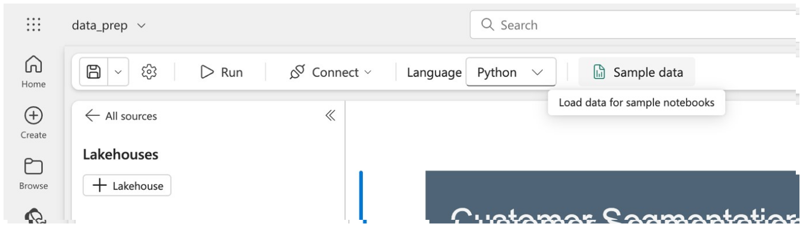

import Tabs from '@theme/Tabs';
import TabItem from '@theme/TabItem';

# Create an AI Unlimited notebook from your workspace

Once the AI Unlimited Workload has been added to the capacity for your workspace, you can create an AI Unlimited notebook. To do so:
1.	Within the workspace, select “+ New item.”
2.	Scroll down to “Prepare data” or “Analyze and train data” to find and create the notebook.

You will be prompted to name the notebook. For consistency with these directions, name the notebook “data_prep.”

## Create a sample notebook

After naming your notebook, select the “Sample data preparation” tile to create notebook pre-populated with a data preparation use case that demonstrates AI Unlimited in-database functions against sample data to evaluate large data sets, create fit tables, and normalize data. 

Before using the sample notebook, you will need to load the sample data to your workspace. You do this by selecting “Sample data” from the toolbar along the top of the notebook. 

Then, select the “Data preparation” dataset.  The first time you load a dataset it will create a lakehouse item in Fabric named AIUnlimited_demo. Future sample data sets will be added to that same lakehouse. 

:::note
If you do want to change the name of the lake house, take special note of the cell at the very top of the notebook. Changing “AIUnlimited_Demo” here to your chosen name will allow you to easily run all of the cells in the notebook.
:::