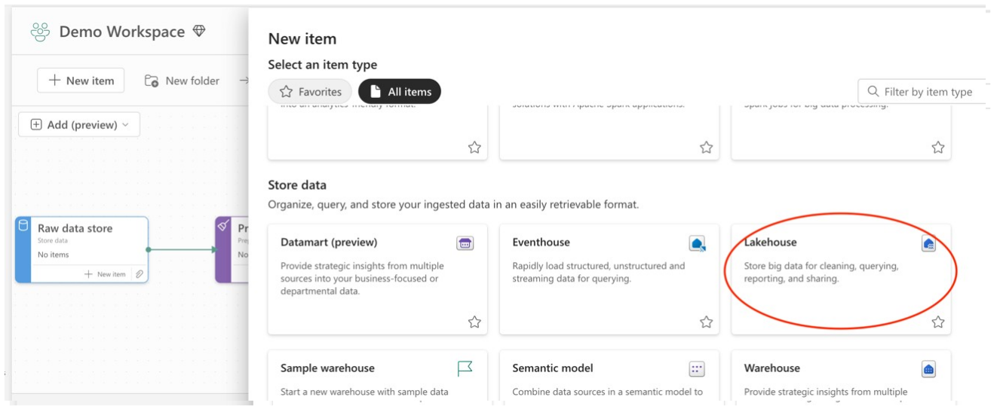
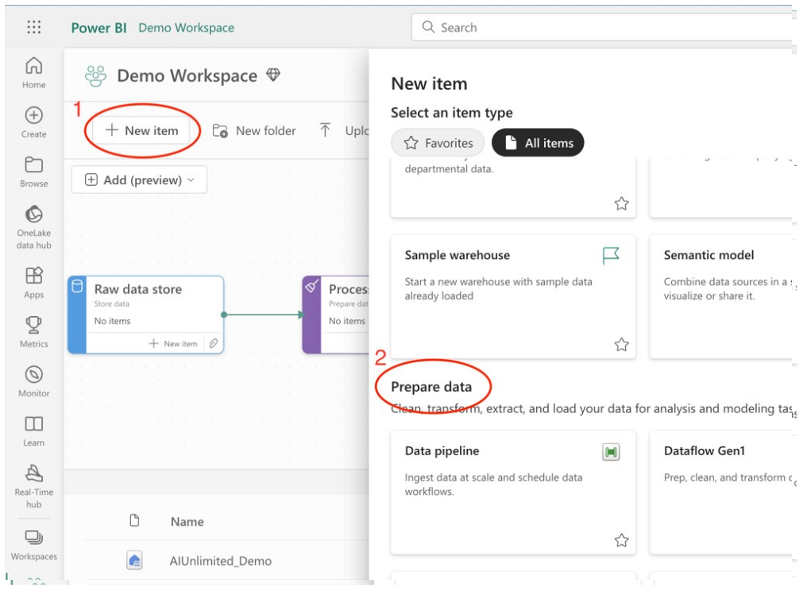
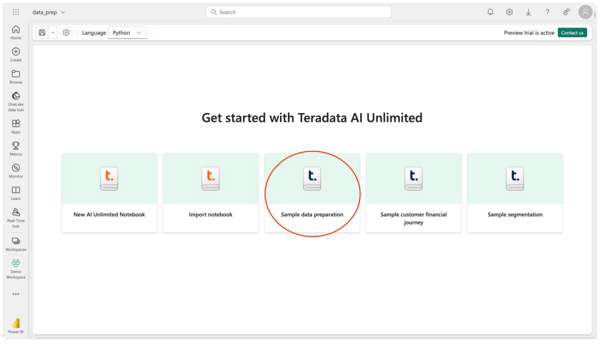

import Tabs from '@theme/Tabs';
import TabItem from '@theme/TabItem';

# Create a lakehouse and notebook

First you'll create a lakehouse. Then you'll create a notebook and populate it with the data preparation use case.

## Create a lakehouse to use with sample notebooks

The simplest way to use sample data is to create a new lakehouse item in your workspace named “AIUnlimited_Demo.” This way, when you're done with the sample, you can simply delete the lakehouse. To create a new lakehouse, in your workspace select “+ New item,” scroll down to “Store data,” and select the lakehouse item. Name the lakehouse “AIUnlimited_Demo” so that it works with the sample notebook's configuration.

:::note
Later in these instructions we'll say how to use an existing lakehouse, if that's what you prefer to do.
::: 

## Create an AI Unlimited notebook from your workspace

Once the AI Unlimited Workload has been added to the capacity for your workspace, you can create an AI Unlimited notebook.
1.	Within the workspace, select “+ New item.”
2.	Scroll down to “Prepare data” or “Analyze and train data” to find and create the notebook.

You will be prompted to name the notebook. For consistency with these directions, name the notebook “data_prep.”

## Create the sample notebook

After naming your notebook, select the “Sample data preparation” tile to pre-populate the notebook with a data preparation use case that demonstrates AI Unlimited in-database functions against sample data to evaluate large data sets, create fit tables, and normalize data. 
