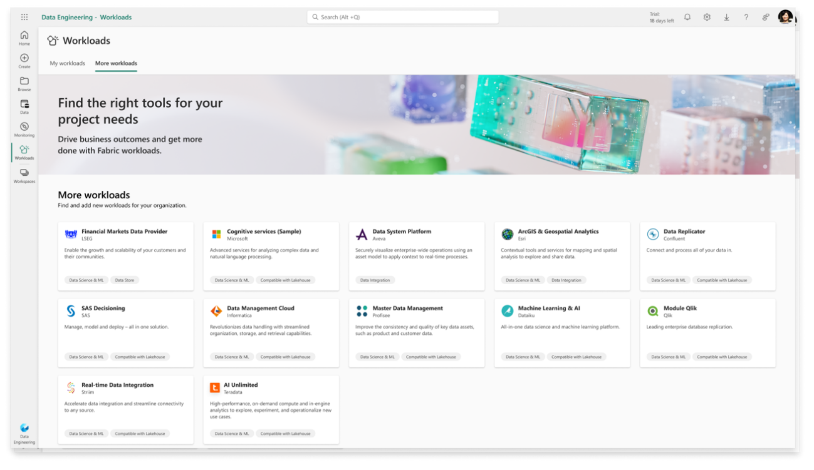

# Get started with the AI Unlimited Fabric Workload preview

AI Unlimited, the Teradata on-demand, advanced analytic compute engine, is now available in preview through Microsoft Fabric. This integration brings powerful Teradata analytic compute capabilities together with Microsoft Fabric comprehensive data management and lifecycle applications. It is now easier than ever for developers (data scientists, data engineers, and ML engineers) to rapidly experiment, prototype, iterate, and operationalize at scale.

If AI Unlimited has not yet been added to your workspace, find it by going to the Workload Hub and selecting “More Workloads” in the upper left. After selecting AI Unlimited, you can add it to the capacities associated with the workspaces you want to use it in. You will need to ask your Azure admin to provide consent to add AI Unlimited to your Azure tenant before using. 

:::note
During the preview period, AI Unlimited servers are in the US only. AI Unlimited will not store data but your data will be sent to the US East region for processing. If you are outside of the US, please consult your company’s data policy before using the AI Unlimited Workload.
:::

Once AI Unlimited it has been added, you can find it in the Workload Hub under “My Workloads.” You can go there to view the content and documents, and to manage capacities. 

