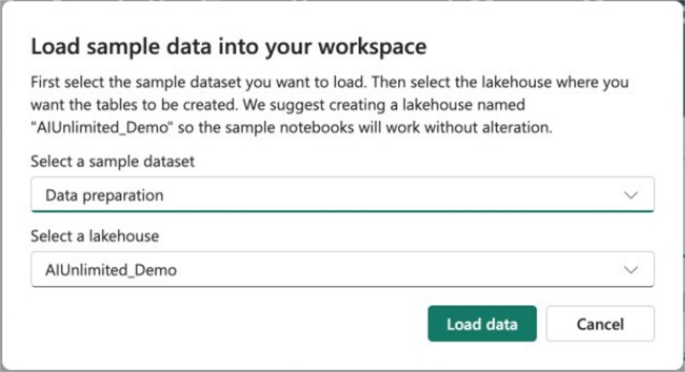

import Tabs from '@theme/Tabs';
import TabItem from '@theme/TabItem';

Before using the sample notebook, you'll need to load the sample data to your workspace. You do this by selecting “Sample data” from the toolbar along the top of the notebook. 

Select the “Data preparation” dataset. This is tied to the data preparation sample notebook. Then select the “AIUnlimited_Demo” lakehouse you created in the earlier step. If you chose not to create a new lakehouse, select the name of the lakehouse you want to use.  

If you are using a pre-existing lakehouse, look at the cell at the very top of the notebook. Change “AIUnlimited_Demo” to the name of your chosen lakehouse to allow you to easily run all the cells in the notebook.