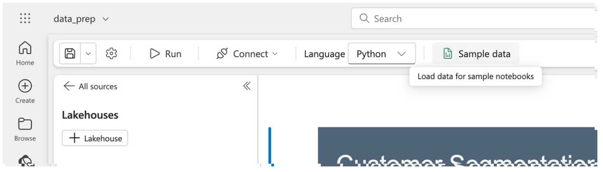
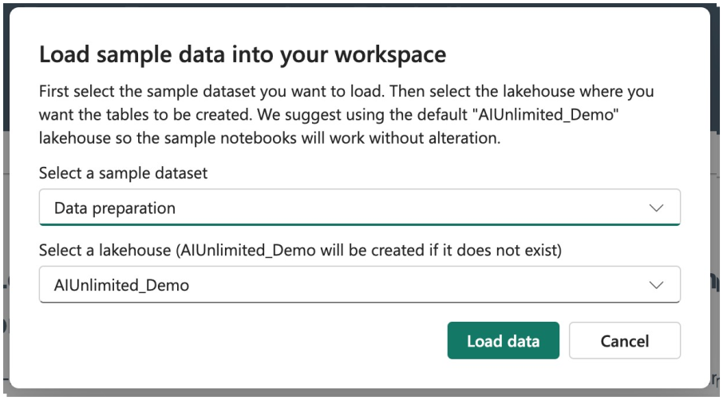

import Tabs from '@theme/Tabs';
import TabItem from '@theme/TabItem';

Before using the sample notebook, you will need to load the sample data to your workspace. You do this by selecting “Sample data” from the toolbar along the top of the notebook. 

Then, select the “Data preparation” dataset.  The first time you load a dataset it will create a lakehouse item in Fabric named AIUnlimited_Demo. Future sample data sets will be added to that same lakehouse. 

:::note
If you do want to change the name of the lakehouse, take special note of the cell at the very top of the notebook. Changing “AIUnlimited_Demo” here to your chosen name will allow you to easily run all of the cells in the notebook.
:::