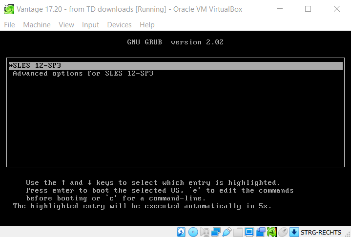
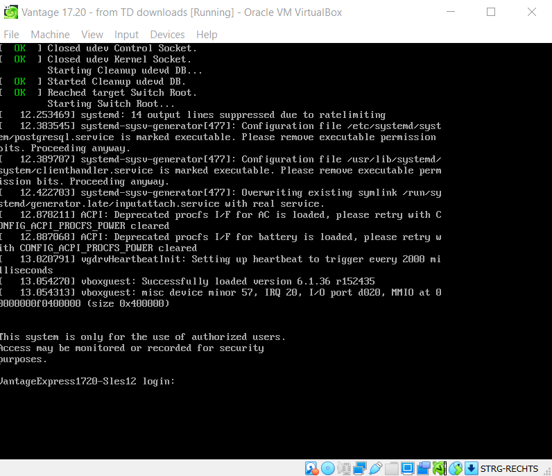
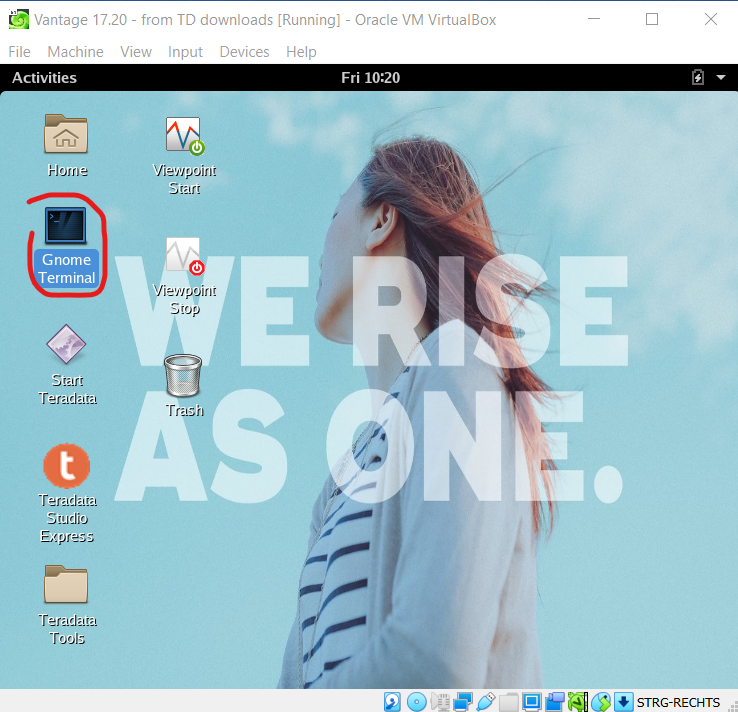
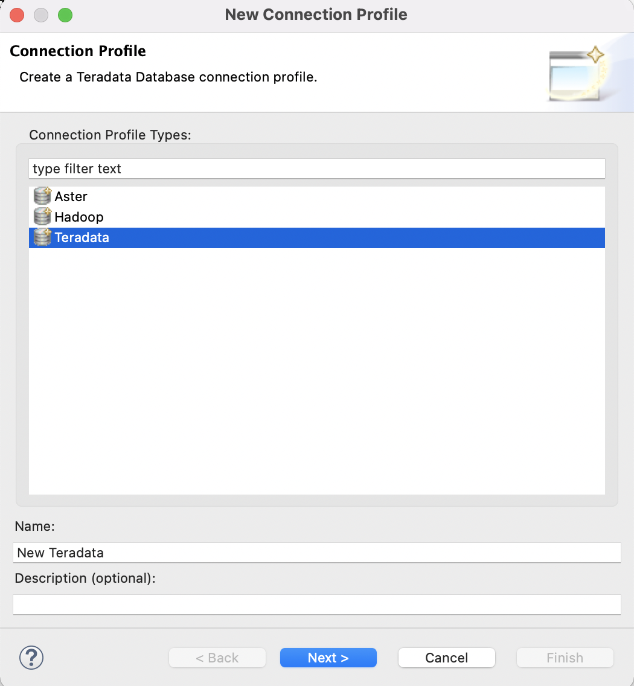

- Presione <kbd>[ENTER]</kbd> para seleccionar la partición de arranque `LINUX`resaltada.


- En la siguiente pantalla, presione <kbd>ENTER</kbd> nuevamente para seleccionar el kernel SUSE Linux predeterminado.



- Después de completar la secuencia de arranque, aparecerá un mensaje de inicio de sesión en la terminal como se muestra en la captura de pantalla a continuación. No introduzca nada en la terminal. Espere hasta que el sistema inicie la GUI.



- Después de un tiempo, aparecerá el siguiente mensaje, asumiendo que no introdujo nada después del mensaje de inicio de sesión del comando anterior. Presione el botón `okay` en la pantalla a continuación.


- Una vez que la máquina virtual esté activa, verá su entorno de escritorio. Cuando se le solicite nombre de usuario/contraseña, introduzca `root` para ambos.


- La base de datos está configurada para iniciarse automáticamente con la máquina virtual. Para confirmar que la base de datos se ha iniciado, vaya al escritorio virtual e inicie `Gnome Terminal`.



- En la terminal, ejecute el comando `pdestate`, que le informará si Vantage ya se inició:

Para pegar en Gnome Terminal, presione <kbd>SHIFT+CTRL+V</kbd>. :::

```bash
watch pdestate -a
```

Debe esperar hasta que vea el siguiente mensaje:

```bash
PDE state is RUN/STARTED.
DBS state is 5: Logons are enabled - The system is quiescent
```

<details>  <summary>Vea ejemplos de mensajes que <code>pdestate</code> devuelve cuando la base de datos todavía se está inicializando.</summary>  <pre> PDE state is DOWN/HARDSTOP.  PDE state is START/NETCONFIG.  PDE state is START/GDOSYNC.  PDE state is START/TVSASTART.  PDE state is START/READY. PDE state is RUN/STARTED.  DBS state is 1/1: DBS Startup - Initializing DBS Vprocs PDE state is RUN/STARTED.  DBS state is 1/5: DBS Startup - Voting for Transaction Recovery PDE state is RUN/STARTED.  DBS state is 1/4: DBS Startup - Starting PE Partitions PDE state is RUN/STARTED. </pre> </details>

- Ahora que la base de datos está activa, regrese al escritorio virtual y ejecute `Teradata Studio Express`


- Cuando lo inicie por primera vez, se le ofrecerá una visita guiada. Una vez que cierre la visita guiada, verá una ventana del asistente para agregar una nueva conexión. Seleccione `Teradata`:



- En la siguiente pantalla, conéctese a la base de datos en su host local usando `dbc` como nombre de usuario y contraseña:


