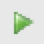

import GettingStartedQueries from './getting-started-queries.mdx';

### Ejecutar consultas de muestra
1. Ahora ejecutaremos algunas consultas en la máquina virtual. Para evitar problemas de copiar y pegar entre el host y la máquina virtual, abriremos este inicio rápido en la máquina virtual. Vaya al escritorio virtual, inicie Firefox y apúntelo a este inicio rápido.
2. Una vez en Teradata Studio Express, vaya a la perspectiva `Query Development` (vaya al menú superior y seleccione `Window` -> `Query Development`).
3. Conéctese utilizando el perfil de conexión creado previamente haciendo doble clic en `Database Connections` -> `New Teradata`.
4. Mediante el usuario `dbc`, crearemos una nueva base de datos llamada `HR`. Copie/pegue esta consulta y ejecútela presionando el botón Ejecutar consulta () o presionando la tecla <kbd>[F5]</kbd>:

<GettingStartedQueries />