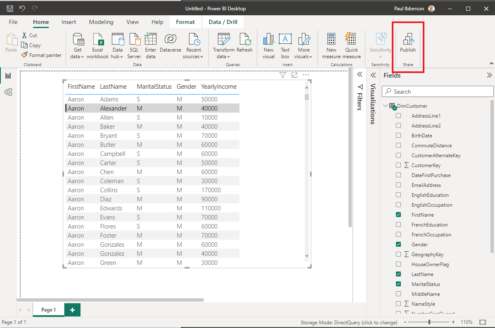

import ClearscapeDocsNote from '../_partials/vantage_clearscape_analytics.mdx'

# Crear visualizaciones en Power BI mediante Vantage

## Información general

:::note
Esta guía incluye contenido de la documentación de productos de Microsoft y Teradata.
:::

Este artículo describe el proceso de conexión de Power BI Desktop a Teradata Vantage para crear fantásticos informes y visualizaciones de los datos.  Power BI admite Teradata Vantage como fuente de datos y puede usar los datos subyacentes como cualquier otra fuente de datos en Power BI Desktop.

[Power BI](https://docs.microsoft.com/en-us/power-bi/power-bi-overview) es una colección de servicios de software, aplicaciones y conectores que trabajan juntos para convertir sus fuentes de datos no relacionadas en información coherente, visualmente inmersiva e interactiva.

**Power BI consta de:**
* Una aplicación de escritorio de Windows, llamada [Power BI Desktop](https://docs.microsoft.com/en-us/power-bi/fundamentals/desktop-what-is-desktop)
* Un servicio SaaS (Software como Servicio) en línea, llamado [Servicio de Power BI](https://docs.microsoft.com/en-us/power-bi/fundamentals/power-bi-service-overview)
* [Power BI móvil](https://docs.microsoft.com/en-us/power-bi/consumer/mobile/mobile-apps-for-mobile-devices) Aplicaciones para dispositivos Windows, iOS y Android

Estos tres elementos (Power BI Desktop, el servicio Power BI y las aplicaciones móviles) están diseñados para permitir a las personas crear, compartir y consumir información empresarial de la forma que les resulte más eficaz a ellos o a su rol.

Un cuarto elemento, [Servidor de informes de Power BI](https://docs.microsoft.com/en-us/power-bi/report-server/get-started), le permite publicar informes de Power BI en un servidor de informes local, después de crearlos en Power BI Desktop.

Power BI Desktop admite Vantage como fuente de datos de terceros, no como fuente de datos "nativa".  En su lugar, los informes publicados en el servicio Power BI deberán utilizar el componente [de puerta de enlace de datos local](https://docs.microsoft.com/en-us/power-bi/connect-data/service-gateway-onprem) para acceder a Vantage.

Esta guía de introducción le mostrará cómo conectarse a Teradata Vantage. El conector Teradata de Power BI Desktop usa el [Proveedor de datos .NET para Teradata](https://downloads.teradata.com/download/connectivity/net-data-provider-for-teradata). Debe instalar el controlador en ordenadores que usen Power BI Desktop. La instalación única del Proveedor de datos .NET para Teradata admite la aplicación Power BI Desktop de 32 o 64 bits.

## Prerrequisitos
Se espera que esté familiarizado con los servicios de Azure, Teradata Vantage y Power BI Desktop.

Necesitará las siguientes cuentas y sistema.

* Power BI Desktop es una aplicación gratuita para Windows. (Power BI Desktop no está disponible para Mac. Puede ejecutarse en una máquina virtual, como [Parallels](https://www.parallels.com) o [VMware Fusion](https://www.vmware.com/products/fusion.html) o [Boot Camp](https://support.apple.com/en-vn/boot-camp) de Apple, pero esto queda fuera del alcance de este artículo).

* Una instancia de Teradata Vantage con un usuario y contraseña. El usuario debe tener permiso para los datos que Power BI Desktop puede usar. Se debe poder acceder a Vantage desde Power BI Desktop.

        <ClearscapeDocsNote />

* El [Proveedor de datos .NET para Teradata](https://downloads.teradata.com/download/connectivity/net-data-provider-for-teradata).

## Primeros pasos
### Instalar Power BI Desktop
Puede instalar Power BI Desktop desde [Microsoft Store](https://aka.ms/pbidesktopstore) o puede [descargar el instalador](https://aka.ms/pbiSingleInstaller) y ejecutarlo directamente.

### Instale el proveedor de datos .NET para Teradata
Descargue e instale la última versión del [Proveedor de datos .NET para Teradata](https://downloads.teradata.com/download/connectivity/net-data-provider-for-teradata).

Tenga en cuenta que hay varios archivos disponibles para descargar. El archivo que busca comienza con "tdnetdp".

### Conectarse a Teradata Vantage
* Ejecute Power BI Desktop, que tiene un icono amarillo. 

* Si se muestra la pantalla de inicio (presentación), haga clic en Obtener datos.
        

De lo contrario, si se encuentra en el formulario principal de Power BI, asegúrese de estar en la cinta _Inicio_ y haga clic en _Obtener datos_. Haga clic en _Más…_.
    

* Haga clic en _Base de datos_ a la izquierda.
* Desplácese por la lista de la derecha hasta que vea _Base de datos Teradata_. Haga clic en _Base de datos Teradata_y, a continuación, haga clic en el botón _Conectar_.

(“Teradata Database” y “Teradata Vantage” son sinónimos en este artículo).

* En la ventana que aparece, introduzca el nombre o la dirección IP de su sistema Vantage en el cuadro de texto. Puede elegir _Importar_ datos directamente en el modelo de datos de Power BI o conectarse directamente a la fuente de datos mediante [DirectQuery](https://docs.microsoft.com/en-us/power-bi/desktop-use-directquery) y hacer clic en _OK_.

(Haga clic en Opciones _Avanzada_ para enviar una declaración SQL hecha a mano).

Para las credenciales, tiene la opción de conectarse con su inicio de sesión de _Windows_ o nombre de usuario de _Base de datos_ definido en Vantage, que es más común. Seleccione el método de autenticación apropiado e introduzca su nombre de usuario y contraseña. Haga clic en _Conectar_.

También tiene la opción de autenticarse con un servidor LDAP. Esta opción está oculta de forma predeterminada.

Si configura la variable de entorno, _PBI_EnableTeradataLdap_, en _true_, el método de autenticación LDAP estará disponible.

Tenga en cuenta que LDAP no es compatible con la puerta de enlace de datos local, que se utiliza para los informes que se publican en el servicio Power BI. Si necesita autenticación LDAP y utiliza la puerta de enlace de datos local, deberá enviar un incidente a Microsoft y solicitar soporte.

Alternativamente, puede [configurar SSO basado en Kerberos desde el servicio Power BI en fuentes de datos locales](https://docs.microsoft.com/en-us/power-bi/connect-data/service-gateway-sso-kerberos) como Teradata.

Una vez que se haya conectado al sistema Vantage, Power BI Desktop recuerda las credenciales para futuras conexiones al sistema. Puede modificar estas credenciales yendo a _Archivo > Opciones y configuración > Configuración de la fuente de datos_.

La ventana del Navegador aparece después de una conexión exitosa. Muestra los datos disponibles en el sistema Vantage. Puede seleccionar uno o más elementos para usar en Power BI Desktop.

Puede obtener una vista previa de una tabla haciendo clic en su nombre. Si desea cargarla en Power BI Desktop, asegúrese de hacer clic en la casilla de verificación junto al nombre de la tabla.

Puede _Cargar_ la tabla seleccionada, lo cual la llevará a Power BI Desktop. También puede _Editar_ la consulta, lo cual abrirá un editor de consultas para que pueda filtrar y ajustar el conjunto de datos que quiere cargar.

_Editar_ puede llamarse _Transformar datos_, según la versión de Power BI Desktop que tenga.

Para obtener información sobre cómo unir tablas, consulte la función [Crear y administrar relaciones en Power BI Desktop](https://docs.microsoft.com/en-us/power-bi/desktop-create-and-manage-relationships).

Para publicar su informe, haga clic en _Publicar_ en la cinta _Inicio_ de Power BI Desktop.

Power BI Desktop le pedirá que guarde su informe. Elija _Mi espacio de trabajo_ y haga clic en _Seleccionar_. 

Una vez publicado el informe, haga clic en _Entendido_ para cerrar. También puede hacer clic en el enlace que tiene el nombre del informe en el enlace.

Este es un ejemplo de un informe creado en Power BI Desktop.

## Siguientes pasos
Puede combinar datos de muchos orígenes con Power BI Desktop. Consulte los siguientes enlaces para obtener más información.

* [¿Qué es Power BI Desktop?](https://docs.microsoft.com/en-us/power-bi/desktop-what-is-desktop)
* [Orígenes de datos en Power BI Desktop](https://docs.microsoft.com/en-us/power-bi/desktop-data-sources)
* [Dar forma y combinar datos con Power BI Desktop](https://docs.microsoft.com/en-us/power-bi/desktop-shape-and-combine-data)
* [Conectarse a libros de Excel en Power BI Desktop](https://docs.microsoft.com/en-us/power-bi/desktop-connect-excel)
* [Introducir datos directamente en Power BI Desktop](https://docs.microsoft.com/en-us/power-bi/desktop-enter-data-directly-into-desktop)

import CommunityLinkPartial from '../_partials/community_link.mdx';

<CommunityLinkPartial />
