import ClearscapeDocsNote from '../_partials/vantage_clearscape_analytics.mdx'

# ModelOps: importar e implementar su primer modelo BYOM

## Información general

Este tutorial le ayudará a empezar a utilizar rápidamente ClearScape Analytics ModelOps. Analizaremos brevemente los conceptos clave para que pueda empezar a importar sus primeros modelos BYOM a ModelOps. En otros tutoriales de este sitio de inicio rápido tendrá la oportunidad de profundizar en otros patrones de implementación y automatización con ClearScape Analytics ModelOps.

En este tutorial aprenderá lo siguiente:

* ¿Cuál es la diferencia entre las funciones BYOM y BYOM de ModelOps?

* Importación de su primer modelo BYOM (Bring Your Own Model) en el registro de modelos a través de la interfaz gráfica de usuario

* Implementación del modelo en Vantage con capacidades de programación y supervisión automatizadas

## Prerrequisitos

Proporcionamos un cuaderno asociado y datos de muestra que puede importar a su entorno ClearScape para acceder y ejecutar todos los ejemplos de código incluidos en el inicio rápido. [Descargar los cuadernos y datos de muestra de ModelOps](../modelops/attachments/ModelOps_Quickstart_BYOM.zip)

* Acceso a una instancia de Teradata Vantage con ClearScape Analytics (incluye ModelOps)

* Acceda a un entorno de Jupyter Notebook o utilice el que está disponible en ClearScape Analytics Experience:


<ClearscapeDocsNote />


## Conceptos clave relevantes inicialmente

### BYOM en Teradata Vantage

El paquete BYOM (Bring Your Own Model) de Vantage ofrece a los científicos y analistas de datos la capacidad de poner en práctica modelos predictivos en Vantage. Los modelos predictivos entrenados en herramientas externas se pueden utilizar para puntuar los datos almacenados en Vantage mediante las funciones de predicción de BYOM. 

Cree o convierta su modelo predictivo utilizando un formato de intercambio de modelos compatible (PMML, MOJO, ONNX, Dataiku y DataRobot están disponibles actualmente), impórtelo en una tabla de Vantage y utilice las funciones BYOM PMMLPredict, H2OPredict, ONNXPredict, DataikuPredict o DataRobotPredict para puntuar sus datos con el modelo.

### BYOM en Teradata Vantage con ModelOps

En ModelOps, el paquete BYOM viene mejorado con capacidades adicionales de gobernanza, automatización y supervisión para científicos de datos e ingenieros de aprendizaje automático, con la posibilidad de aplicarlo todo sin codificación. Además de los formatos compatibles del paquete BYOM, ModelOps amplía la posibilidad de importar y puntuar modelos dentro de Vantage a scripts de Python, scripts de R y modelos aceleradores de puntuación SAS. 
Una vez que haya creado o convertido su modelo compatible usando un formato admitido (PMML, MOJO, ONNX, Dataiku, DataRobot, script de Python, script de R y modelo acelerador de puntuación SAS), puede usar la interfaz gráfica de usuario de ModelOps o el SDK de código de ModelOps para realizar la importación al registro de modelos. 

### Descripción de los puntos centrales de la metodología ModelOps
En este tutorial, le mostraremos el proceso completo utilizando el Notebook asociado y la interfaz gráfica de usuario de ModelOps. 


## Pasos de esta guía

1. Creación de un proyecto y una conexión (ModelOps)
2. Configuración del entorno (Notebook)
3. Creación de conjuntos de datos (ModelOps)
4. Entrenar un modelo y exportarlo a PMML (Notebook)
5. Importar PMML a Vantage mediante funciones BYOM (Notebook)
6. Importar PMML a Vantage mediante la interfaz gráfica de usuario ModelOps (ModelOps)
7. Realice un ciclo de vida automatizado: evaluación, aprobación e implementación (ModelOps)
8. Reglas de alerta predeterminadas y personalizadas para monitoreo (ModelOps)
9. Métricas y gráficos de evaluación personalizados (Notebook)

## 1\. Crear un proyecto

Inicie sesión en ModelOps y vaya a la pantalla Proyectos.

Haga clic en el botón CREATE PROJECT ubicado en la parte superior derecha de la pantalla. Estamos usando un código de demostración clonado en ModelOps con esta ruta: /app/built-in/demo-models como repositorio git. Recomendamos clonar en la instancia propia de repositorio git el git público de modelos de demostración: https://github.com/Teradata/modelops-demo-models.git en la rama "tmo"


Dentro del panel de la hoja de creación del proyecto, incluya los siguientes valores:

* Nombre: "BYOM Quickstart"

* Descripción: "BYOM Quickstart"

* Grupo: DEMO

* Ruta: /app/built-in/demo-models

* Credenciales: Sin credenciales

* Rama: tmo

Haga clic en el botón TEST GIT CONNECTION. Si la prueba es correcta, haga clic en la opción para guardar y continuar.


## Crear una conexión personal

En esta guía omitiremos la creación de una conexión de servicio, así que haga clic en SAVE & CONTINUE y posteriormente en NEXT para crear una conexión personal. 


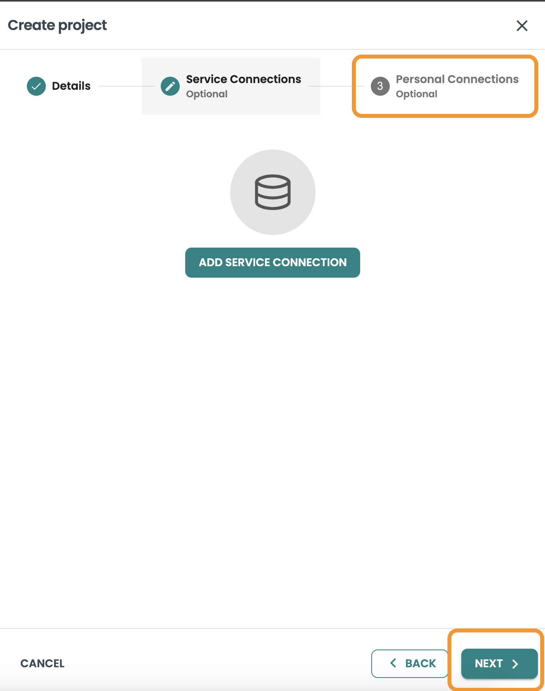

Dentro de la conexión personal del panel de la hoja de creación de proyectos, incluya los siguientes valores:

* Nombre: Quickstart Personal

* Descripción: Quickstart Personal Connection

* Host: ClearScape-url

* Base de datos: demo_user

* Nombre de la base de datos VAL: "VAL"

* Nombre de la base de datos BYOM: "MLDB"

* Mecanismo de inicio de sesión: "TDNEGO"

* Nombre de usuario: demo_user

* Contraseña: your-password

Pruebe la conexión de Vantage haciendo clic en el botón TEST CONNECTION.

Haga clic en la opción para guardar.


Así se mostrará el panel Proyectos con el nuevo proyecto creado:


## Panel de comprobación del estado de la conexión

Entre en el proyecto haciendo clic en él y acceda a la Configuración en el menú de la izquierda. Utilice la opción Ver detalles de su conexión


A continuación, debe aparecer el panel de comprobación de estado, donde se mostrará si los derechos asociados a SQLE, BYOM y VAL están habilitados para el usuario de la conexión. Si aparece algún error, póngase en contacto con el administrador de base de datos para aplicar los derechos específicos. Revise el script bteq de incorporación que se proporciona en los archivos adjuntos del inicio rápido para saber cuáles son los comandos GRANT específicos que se requieren.


## 2\. Configuración del entorno (Notebook)

Siga el cuaderno (Notebook) adjuntado en este inicio rápido para realizar la configuración del entorno y las comprobaciones a nivel de la base de datos.

## 3\. Creación de conjuntos de datos (ModelOps)

Haga clic en el proyecto que acaba de crear y, posteriormente, en el botón Conjuntos de datos ubicado en el menú de la izquierda. Haga clic en CREATE DATASET TEMPLATE.


Introduzca los siguientes valores:

* Nombre: dataset

* Descripción: dataset

* Catálogo de funciones: Vantage

* Base de datos: your-db

* Tabla: aoa_statistics_metadata


Haga clic en Siguiente e introduzca la consulta de características: esta consulta se utilizará para identificar la tabla de características, y también puede validar estadísticas y obtener una vista previa de los datos:

``` sql
SELECT * FROM pima_patient_features
```

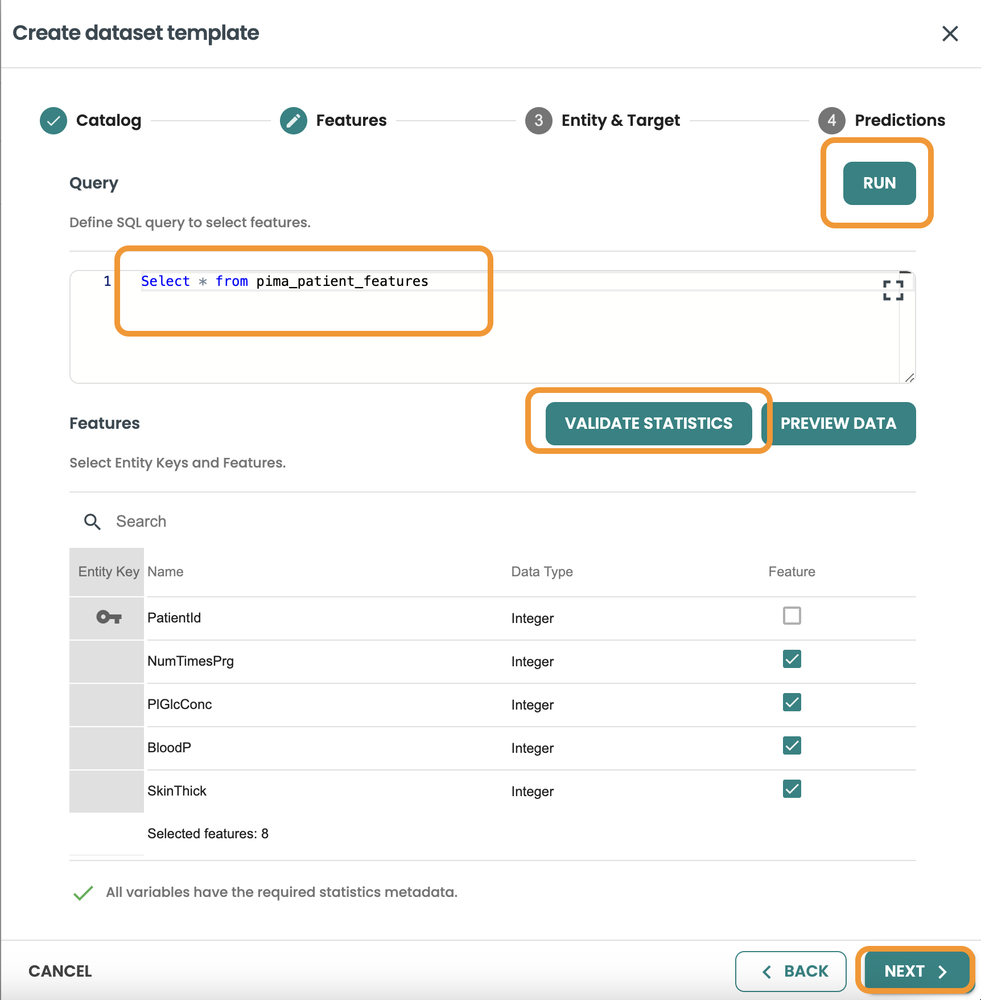


Continúe a Entidad y destino e incluya la consulta: esta consulta se utilizará para unir las características basadas en la misma entidad y para filtrar las filas de los conjuntos de datos de Entrenamiento, Evaluación y Puntuación.

Debe seleccionar HasDiabetes como la variable de destino de esta consulta y, posteriormente, Validar estadísticas

``` sql
SELECT * FROM pima_patient_diagnoses
```


Continúe con Predicciones e incluya los detalles de la base de datos, la tabla y la consulta: esta consulta se utilizará como entrada de la ejecución de su modelo en Producción cuando este modelo se implemente como lote (BATCH).(Nota: los modelos BYOM solo se pueden implementar como lote en ModelOps versión 7)

* Base de datos: your-db

* Tabla: pima_patient_predictions

* Consulta:

``` sql
SELECT * FROM pima_patient_features WHERE patientid MOD 5 = 0
```


### Crear conjunto de datos de entrenamiento

Haga clic en crear conjunto de datos, ingrese el nombre y la descripción y seleccione entrenamiento y haga clic en siguiente.

En esta consulta queremos filtrar y obtener el 80 % de las filas del conjunto de datos, usamos `MOD 5 <> 0` para obtener esto:

``` sql
SELECT * FROM pima_patient_diagnoses WHERE patientid MOD 5 <> 0
```


Confirme la consulta y haga clic en crear.

### Crear conjunto de datos de evaluación

Haga clic en crear conjunto de datos, ingrese el nombre y la descripción y seleccione evaluación y haga clic en siguiente.

En esta consulta queremos filtrar y obtener el 20% de las filas del conjunto de datos, usamos MOD 5 = 0 para obtener esto:

``` sql
SELECT * FROM pima_patient_diagnoses WHERE patientid MOD 5 = 0
```


Confirme la consulta y haga clic en crear.

Así es como deben mostrarse ambos conjuntos de datos para Entrenamiento y Evaluación

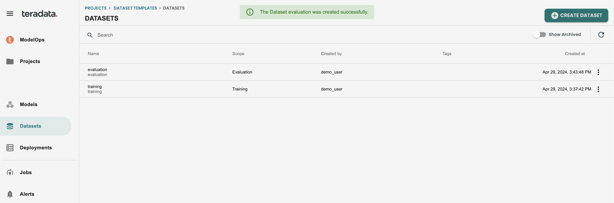

## 4\. Entrenar un modelo y exportarlo a PMML (Notebook)

Siga el cuaderno adjunto en esta guía de inicio rápido para realizar el entrenamiento del modelo, la conversión y la descarga del archivo pmml del modelo para los siguientes pasos.

## 5\. Importar PMML a Vantage mediante funciones BYOM (Notebook)

Siga el cuaderno adjunto en este inicio rápido para utilizar y comprender las funciones del paquete BYOM; de esta manera publicaremos los modelos en Vantage, pero no en el registro de ModelOps y no tendremos capacidades de gobernanza, automatización o supervisión.

## 6\. Importar PMML a Vantage mediante la interfaz gráfica de usuario ModelOps (ModelOps)

### Importar a ModelOps 

Vaya a Modelos en el menú de la izquierda y haga clic en DEFINE BYOM MODEL


Rellene los campos con estos valores como ejemplo:

* Nombre: byom

* Descripción: byom

* Formato: PMML

Haga clic en Guardar modelo e Importar versiones


Complete el campo de identificación externa para rastrearlo desde la herramienta de entrenamiento y cargue el archivo model.pmml - NOTA: debe tener exactamente este nombre: model.pmml

* Identificación externa: 001

* Archivo modelo: model.pmml


### Habilitar la evaluación y la supervisión automatizados predeterminados 

En esta pantalla vamos a mantener marcada la capacidad Habilitar supervisión. 

Tenemos que seleccionar el conjunto de datos de entrenamiento que se utilizó para este modelo pmml durante el entrenamiento. Ya hemos creado este conjunto de datos anteriormente, por lo que seleccionamos

Posteriormente presionamos VALIDATE. 

Las funciones de predicción BYOM generan una salida basada en un JSON, diferente para cada modelo BYOM. Necesitamos saber el campo específico que es el objetivo/salida de nuestra predicción para poder usarlo en nuestra lógica de evaluación y generar métricas del modelo (exactitud, precisión, etc.). Para esto, necesitamos una expresión CAST en el archivo de salida JSON.

Hemos incluido un enlace Generar para ayudarnos a validar e implementar esta expresión CAST. Haga clic en el botón Generar para pasar a la pantalla de ayuda y obtener la expresión.

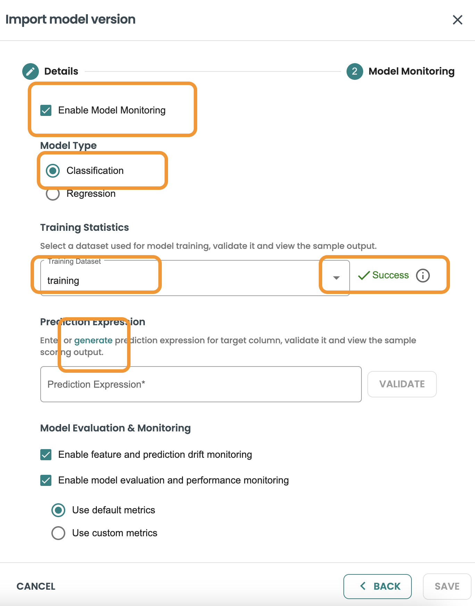

Ahora seleccione la variable de destino/salida de nuestra predicción. En este caso de demostración es: predicted_HasDiabetes.

Haga clic en Guardar y deje que el ayudante copie la expresión para usted. 


Esta es la expresión CAST, haga clic en Guardar en el cuadro de diálogo:
CAST(CAST(json_report AS JSON).JSONExtractValue('$.predicted_HasDiabetes') AS INT)


Ahora puede validar la expresión CAST y hacer clic en Guardar:


Un nuevo trabajo para MODEL IMPORT y otro trabajo para COMPUTE STATISTICS se ejecutará durante unos minutos. 


## 7\. Realice un ciclo de vida automatizado: evaluación, aprobación e implementación (ModelOps)

### Evaluar la versión del modelo en ModelOps

Una vez finalizados los trabajos, estará disponible una nueva versión del modelo en el catálogo de versiones de modelos de este modelo BYOM, como se muestra en la siguiente imagen. Haga clic en la versión del modelo para acceder al ciclo de vida:


El modelo está en la fase IMPORT. Ahora podemos evaluar el modelo, haga clic en EVALUATE para ejecutar el trabajo de evaluación predeterminado automatizado.


Seleccione el conjunto de datos de evaluación y haga clic en EVALUATE MODEL. 


Esto creará un nuevo trabajo para la evaluación y mostrará el registro. Esta pantalla se puede cerrar con el botón X en la parte superior derecha.


Puede acceder en cualquier momento a la pantalla JOBS del menú de la izquierda. Para volver al registro solo tiene que hacer clic en los 3 puntos del trabajo y en VIEW DETAILS. Así es como debe verse:


Una vez finalizado el trabajo, el modelo estará en la fase EVALUATE en la pantalla de ciclo de vida. Vaya a la versión del modelo para verlo.

Puede consultar todos los detalles del paso de evaluación, incluido un informe de evaluación (REPORT), donde verá las métricas y los gráficos que generó la lógica de evaluación predeterminada. NOTA: estas métricas son predeterminadas para los modelos de clasificación y regresión y se pueden personalizar con una plantilla codificada que se compartirá más adelante en el inicio rápido.


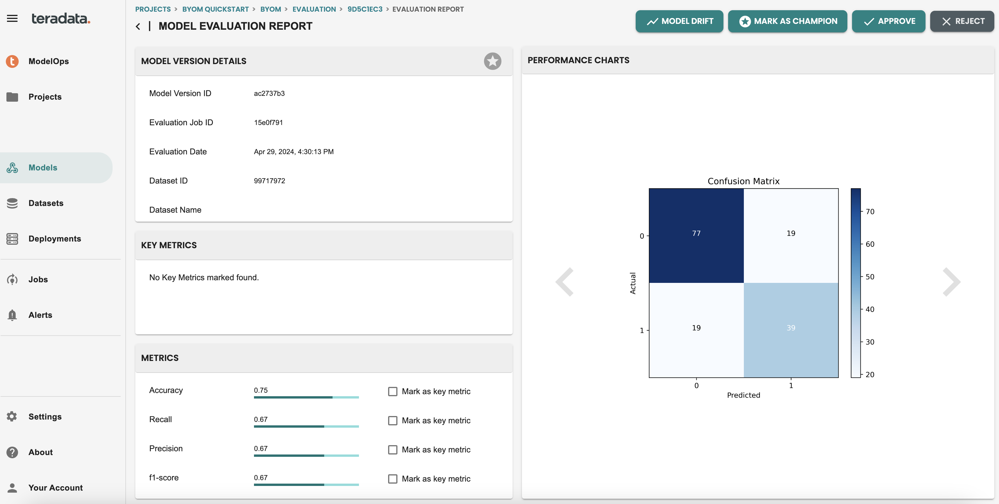

### Aprobar la versión del modelo

Una vez evaluada la versión del modelo, está lista para ser aprobada o rechazada. Esta aprobación se puede realizar a través de la pantalla de ciclo de vida del modelo, en la pantalla de informes del modelo y también se puede realizar a través de REST API integrando una herramienta externa, como los sistemas de gestión de casos Jira/BPM.

Vamos entrar en el cuadro de diálogo Aprobación e incluiremos la siguiente descripción, a modo de ejemplo: 

* Comentario de aprobación: Ir a producción


### Implementar la versión del modelo y programar la puntuación

Para implementar el modelo, debe utilizar el botón DEPLOY en la pantalla del ciclo de vida del modelo.


Para los modelos BYOM, el objetivo de implementación disponible es In-Vantage, ya que queremos aprovechar las funciones de predicción BYOM en Vantage:


Publicar el modelo: seleccione la conexión a Vantage que se utilizará para publicar el modelo, la base de datos y la tabla. Aquí utilizaremos la conexión creada y la tabla que creamos para almacenar los modelos BYOM: aoa_byom_models. Haga clic en Siguiente después de incluir estos detalles

* Conexión: personal

* Base de datos: demo_user

* Tabla: aoa_byom_models


Ahora, en el paso de Programación, puede habilitar la programación y seleccionar cuál es la frecuencia/cadencia de esta puntuación. Mantenga marcada la casilla de verificación Habilitar programación y seleccione "Manual". En esta demostración, dentro de clearscape.teradata.com, para ahorrar recursos, las opciones de programación están deshabilitadas. Cualquier opción de programación está disponible, ya que podemos incluir una expresión CRON.

En esta pantalla también seleccionaremos la plantilla de conjunto de datos que se utilizará al puntuar el modelo en producción. Se utilizarán los detalles de predicción del conjunto de datos, como la consulta de entrada y la tabla de predicción de salida que definimos en el paso Conjuntos de datos.

Haga clic en Implementar para finalizar este paso

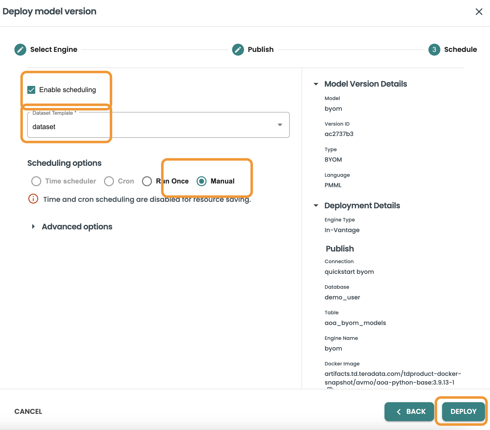

El agente ModelOps ejecutará un nuevo trabajo de implementación. Una vez finalizado, habrá una nueva implementación disponible en la sección Implementaciones del menú de la izquierda.

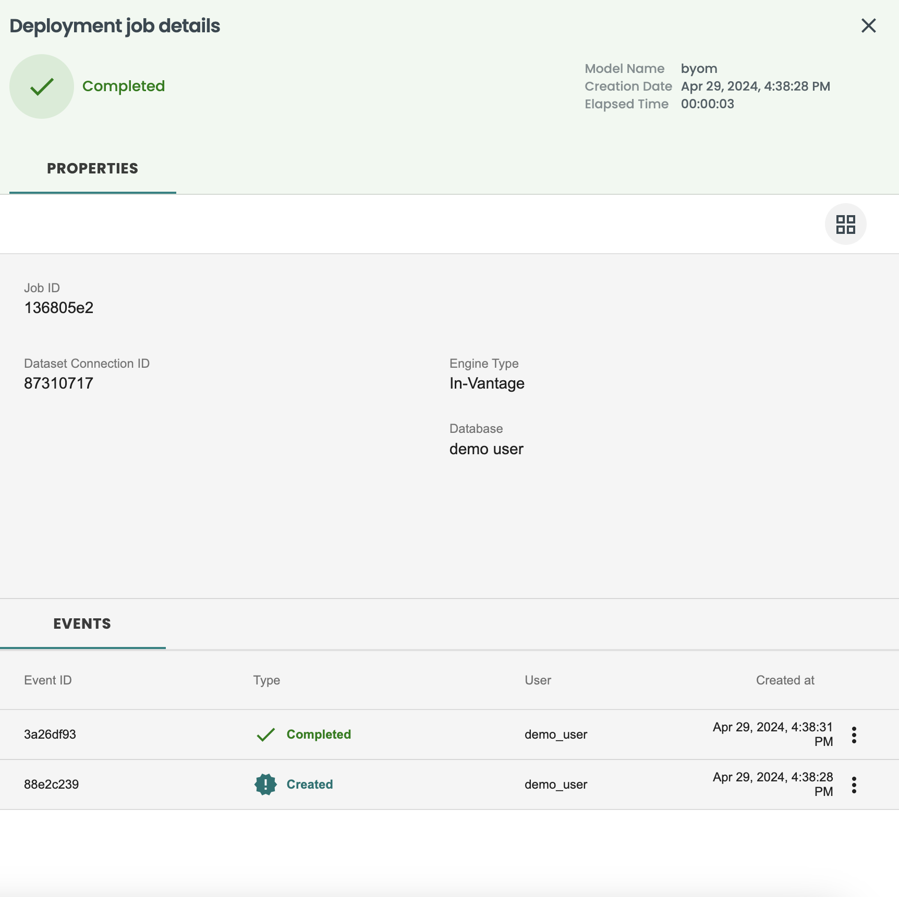

### Detalles de implementación que incluyen historial de trabajos, desfase de funciones/predicciones y supervisión de rendimiento

Vaya al menú de la izquierda Implementaciones y vea que la nueva implementación del modelo BYOM está disponible, haga clic en ella para ver los detalles y vaya a la pestaña Trabajos


En la pestaña Trabajos verá el historial de ejecuciones de este modelo implementado. Vamos a ejecutar ahora una nueva puntuación utilizando el botón Ejecutar ahora. Este botón también se puede programar externamente a través de REST API


Después de ejecutar el trabajo de puntuación, debe tener este aspecto:

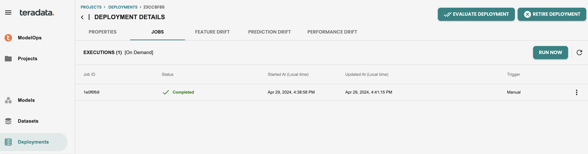

Y podemos acceder a los detalles de salida de este trabajo, haciendo clic en los tres puntos a la derecha, y ver las predicciones


Ahora que hemos ejecutado un trabajo en producción, las capacidades de supervisión predeterminadas están habilitadas; puede verificar tanto el desfase de la función como de la predicción para ver individualmente por función el cálculo del histograma y el KPI del índice de estabilidad de la población (PSI) para la supervisión del desfase


En la pestaña Métricas de rendimiento, vemos que solo hay un único punto de datos de métricas, esto se debe a que la supervisión del rendimiento se basa en trabajos de evaluación. Por lo tanto, vamos a crear un nuevo conjunto de datos y ejecutaremos una nueva evaluación en esta implementación para simular que tenemos datos nuevos y queremos verificar el rendimiento de mi modelo comparando las métricas con la evaluación anterior.

### Supervisión del rendimiento con un nuevo conjunto de datos

Vamos a crear un nuevo conjunto de datos de evaluación en el menú de la izquierda Conjuntos de datos.

Utilizaremos la misma plantilla de conjunto de datos que creamos y crearemos un nuevo conjunto de datos con los siguientes detalles

* Nombre: evaluation2

* Description: evaluation2

* Alcance: evaluación

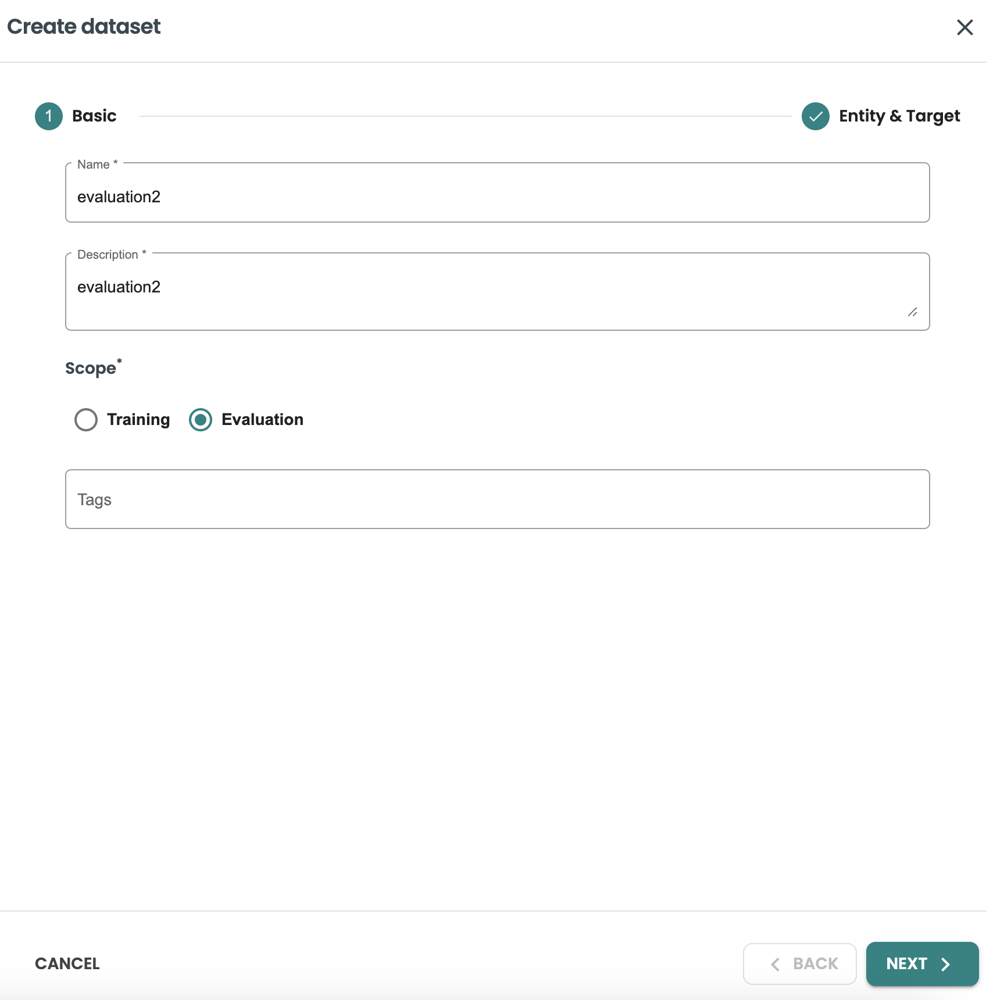

Y vamos a simular la nueva evaluación con una nueva consulta de conjunto de datos

``` sql
SELECT * FROM pima_patient_features WHERE patientid MOD 10 = 0
```

Y haga clic en la opción para crear para generar un nuevo conjunto de datos para evaluación

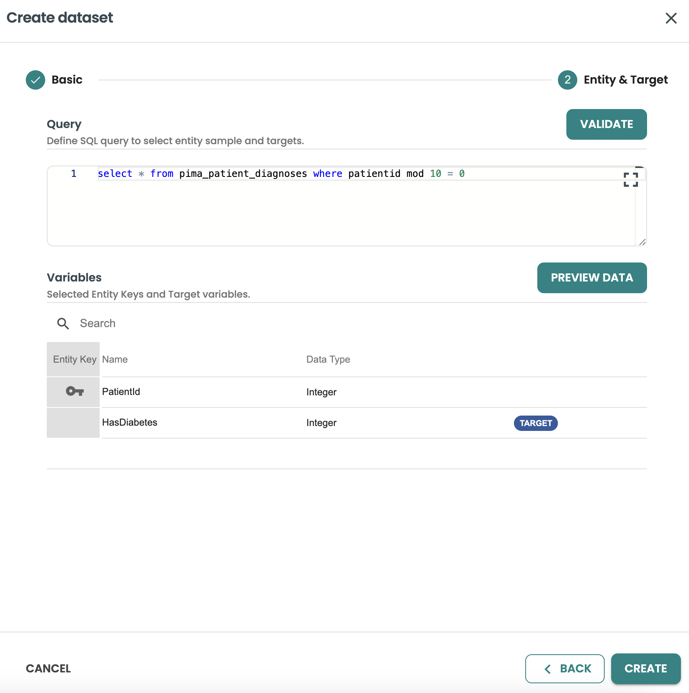

Ahora puede volver a su implementación para evaluar la versión del modelo implementada:


Utilice el nuevo conjunto de datos creado en el panel de trabajo Evaluación:

* Plantilla de conjunto de datos: dataset

* Conjunto de datos: evaluate2

y haga clic en EVALUATE para el modelo


Una vez finalizado el trabajo de evaluación, las métricas de rendimiento mostrarán un nuevo conjunto de métricas con el nuevo conjunto de datos utilizado:


## 8\. Reglas de alerta predeterminadas y personalizadas para monitoreo (ModelOps)

### Habilitar las alertas

Las alertas predeterminadas en ModelOps se activan en la pantalla de modelos. Hay una columna Habilitar alertas en esta tabla, actívela para empezar con las alertas predeterminadas

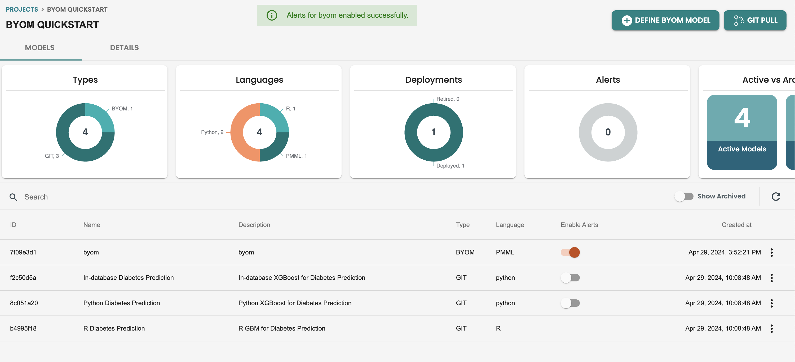

Una vez habilitadas estas alertas, puede verificar la definición de la alerta predeterminada, yendo al modelo y accediendo a la pestaña ALERT:


### Actualización de reglas de alerta

Podemos crear nuevas alertas, como nuevas reglas para supervisar el rendimiento o actualizar las reglas de alerta predeterminadas. 

Vamos a hacer una edición de alerta, en la supervisión del desfase de la función. Haga clic en la edición de alerta


Aquí puede actualizar los campos. Vamos a actualizar el umbral de valor de 0,2 a 0,18 y haremos clic en UPDATE


Después de editar la regla, la pantalla de alertas debe tener este aspecto:


### Revisión de alertas

Ahora que hemos editado la alerta, debemos esperar 1 minuto hasta que aparezca una nueva alerta en la herramienta ModelOps. Esta alerta también se puede configurar para enviar un correo electrónico a un conjunto de direcciones de correo electrónico.

Ahora que hemos recibido la alerta, podemos ver un círculo rojo en las alertas del menú de la izquierda

Podemos acceder directamente a la versión del modelo desde esta pantalla haciendo clic en modelid

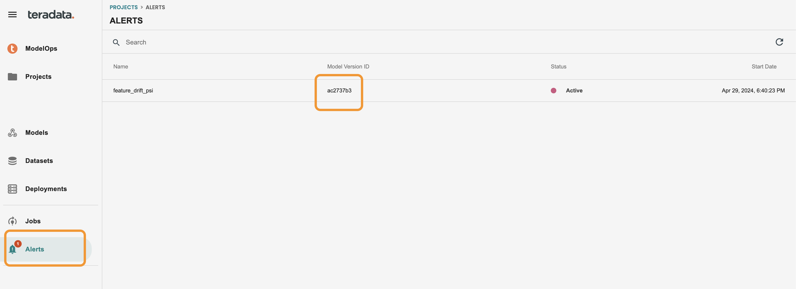

Una vez que estamos en la pantalla del ciclo de vida del modelo, vemos un acceso directo a Desfase del modelo, vamos entrar

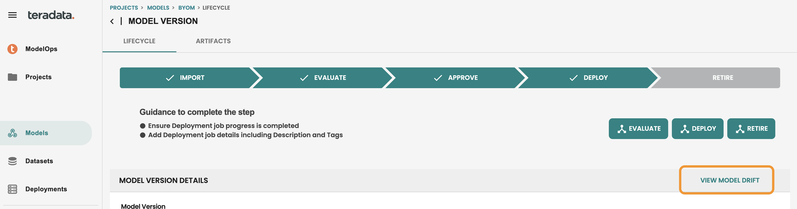

Posteriormente, podemos ver las funciones individuales en rojo en la pestaña de desfase de características del modelo implementado. Esta alerta indica que los últimos datos de puntuación tienen un desfase respecto a los datos de entrenamiento con ese valor del índice de estabilidad de la población (PSI), y los equipos ya pueden tomar medidas proactivas para evaluar el desfase del modelo y reemplazar el modelo en producción si es necesario


## 9\. Métricas y gráficos de evaluación personalizados (Notebook)

Siga el cuaderno adjunto en este inicio rápido para comprender la metodología para crear lógica, métricas y gráficos de evaluación personalizados

## Resumen

En este inicio rápido, hemos aprendido cuál es la diferencia entre las funciones BYOM y el patrón BYOM de ModelOps, cómo importar modelos con la interfaz gráfica de usuario de ModelOps y cómo automatizar la puntuación y la supervisión del modelo obteniendo alertas de métricas de calidad del modelo y desfase de datos

## Lectura adicional

[Guía del usuario de ClearScape Analytics ModelOps](https://docs.teradata.com/search/documents?query=ModelOps&sort=last_update&virtual-field=title_only&content-lang=)

import CommunityLinkPartial from '../_partials/community_link.mdx';

<CommunityLinkPartial />
