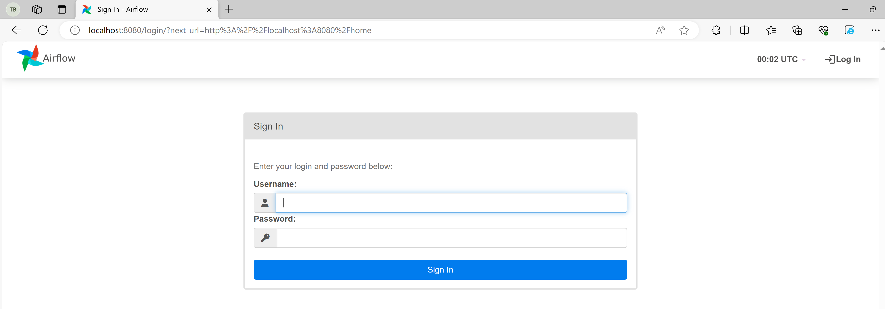
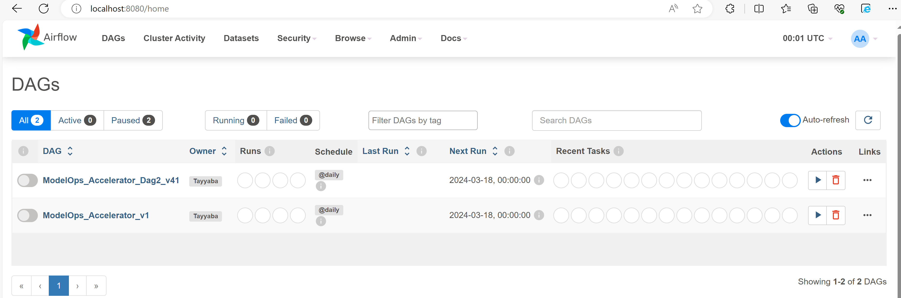

import ClearscapeDocsNote from '../_partials/vantage_clearscape_analytics.mdx'

# Ejecute flujos de trabajo de Airflow con ModelOps - Model Factory Solution Accelerator

## Información general

El objetivo de **Model Factory Solution Accelerator** de **ClearScape Analytics** es optimizar y acelerar el proceso completo de desarrollo, implementación y gestión de modelos de aprendizaje automático dentro de una organización en **Escala horizontal** mediante la puesta en funcionamiento de **cientos de modelos para un dominio empresarial, todo a la vez**. Aprovecha la escalabilidad de las analíticas en bases de datos y la apertura de los formatos de modelos de socios compatibles, como H2O o Dataiku. Esta combinación única mejora la eficacia, la escalabilidad y la coherencia en las distintas fases del ciclo de vida del aprendizaje automático en entornos empresariales. 
    
Mediante la incorporación de prácticas recomendadas, automatización y flujos de trabajo estandarizados, Model Factory Solution Accelerator permite a los equipos seleccionar rápidamente los datos que se utilizarán, configurar el modelo requerido, garantizar la repetitividad e implementar múltiples modelos de **ilimitado** directamente en entornos de producción. En última instancia, tiene como objetivo reducir el tiempo de generación de valor para las iniciativas de aprendizaje automático y promover un enfoque más estructurado y eficiente para crear e implementar modelos a escala. Aquí se muestra el diagrama de un flujo de trabajo automatizado:


Estos son los pasos para implementar Model Factory Solution Accelerator con Airflow y ClearScape Analytics ModelOps. Apache Airflow se utiliza para la programación y organización de flujos de trabajo o canalizaciones de datos. Por lo tanto, en este tutorial, estamos creando un DAG (gráfico acíclico dirigido) de Airflow que se ejecutará para automatizar el ciclo de vida de ModelOps.

## Prerrequisitos

* En este tutorial se implementa en la máquina local utilizando el IDE de **Visual Studio Code**. 

Para ejecutar comandos de shell, puede instalar la extensión de VS Code **"Remote Development"** mediante el enlace siguiente. Este paquete de extensión incluye la extensión WSL, además de las extensiones Remote - SSH y Dev Containers, para que pueda abrir cualquier carpeta en un contenedor, en una máquina remota o en WSL:
[Marketplace de VS Code](https://marketplace.visualstudio.com/items?itemName=ms-vscode-remote.vscode-remote-extensionpack).

* Acceso a una instancia de Teradata Vantage con ClearScape Analytics (incluye ModelOps)


<ClearscapeDocsNote />


## Configuración de Visual Studio Code e instalación de Airflow en docker-compose

* Abra Visual Studio Code y seleccione la opción Abrir una ventana remota. Luego seleccione Conectarse a WSL-Ubuntu

* Seleccione Archivo > Abrir carpeta. A continuación, seleccione la carpeta elegida o cree una nueva con este comando: mkdir [nombre_carpeta]

* Configure la variable de entorno AIRFLOW_HOME. Airflow requiere un directorio de inicio y usa ~/airflow de forma predeterminada, pero puede establecer una ubicación diferente si lo prefiere. La variable de entorno AIRFLOW_HOME se utiliza para informar a Airflow de la ubicación deseada.

``` bash 
AIRFLOW_HOME=./[folder_name]
```

* Instale la versión estable 2.8.2 de apache-airflow desde el repositorio de PyPI:

``` bash  
    AIRFLOW_VERSION=2.8.2

    PYTHON_VERSION="$(python3 --version | cut -d " " -f 2 | cut -d "." -f 1-2)"

    CONSTRAINT_URL="https://raw.githubusercontent.com/apache/airflow/constraints-${AIRFLOW_VERSION}/constraints-${PYTHON_VERSION}.txt"

    pip install "apache-airflow==${AIRFLOW_VERSION}" --constraint "${CONSTRAINT_URL}" --default-timeout=100
```

* Instale la versión estable del proveedor Airflow Teradata desde el repositorio PyPI.

``` bash  
pip install "apache-airflow-providers-teradata" --default-timeout=100
```

* Instale Docker Desktop para poder usar el contenedor Docker para ejecutar Airflow. Asegúrese de que Docker Desktop esté en ejecución.

* Compruebe la versión de Docker mediante este comando:

``` bash  
docker --version
```

Compruebe la versión de Docker Compose. Docker Compose es una herramienta para definir y ejecutar aplicaciones multicontenedor

``` bash  
docker-compose --version
```

Para implementar Airflow en Docker Compose, debe obtener docker-compose.yaml mediante este comando curl.

``` bash , id="Fetch docker-compose yaml", role="content-editable emits-gtm-events"
    curl -LfO 'https://airflow.apache.org/docs/apache-airflow/2.8.2/docker-compose.yaml'
```

Cree estas carpetas para usarlas más tarde mediante el siguiente comando: 

``` bash , id="Create Airflow folders", role="content-editable emits-gtm-events"
mkdir -p ./dags ./logs ./plugins ./config
```


## Configuración de Model Factory Solution Accelerator

Cree un archivo de configuración dentro de la carpeta de configuración y establezca los parámetros con los valores correspondientes según el modelo que quiera entrenar.

<details>

<summary>Haga clic para revelar el código Python</summary>

<pre>
```python  
from configparser import ConfigParser
import os

config = ConfigParser()

config['MAIN'] = {
    "projectId": "23e1df4b-b630-47a1-ab80-7ad5385fcd8d",
    "bearerToken": os.environ['BEARER_TOKEN'],
    "trainDatasetId": "ba39e766-2fdf-426f-ba5c-4ca3e90955fc",
    "evaluateDatasetId": "74489d62-2af5-4402-b264-715e151a420a",
    "datasetConnectionId" : "151abf05-1914-4d38-a90d-272d850f212c",
    "datasetTemplateId": "d8a35d98-21ce-47d0-b9f2-00d355777de1"
}

config['HYPERPARAMETERS'] = {
    "eta": 0.2,
    "max_depth": 6
}

config['RESOURCES'] = {
    "memory": "500m",
    "cpu": "0.5"
}

config['MODEL'] = {
    "modelId": "f937b5d8-02c6-5150-80c7-1e4ff07fea31",
    "approvalComments": "Approving this model!",
    "cron": "@once",
    "engineType": "DOCKER_BATCH",
    "engine": "python-batch",
    "dockerImage": "artifacts.td.teradata.com/tdproduct-docker-snapshot/avmo/aoa-python-base:3.9.13-1"
}


with open('./config/modelOpsConfig.ini', 'w') as f:
    config.write(f)
```
</pre>
</details>
Ahora copie el token Bearer desde la interfaz de usuario de ModelOps (Menú izquierdo -> Su cuenta -> Detalles de la sesión) y configúrelo aquí como una variable de entorno mediante el siguiente comando:

``` bash , id="Bearer token", role="content-editable emits-gtm-events"
export BEARER_TOKEN='your_token_here'
```

Ahora puede ejecutar el archivo de configuración creado previamente, lo cual creará un nuevo archivo ini dentro de la carpeta de configuración que contiene todos los parámetros necesarios que se utilizarán en el paso de creación de DAG.

``` python , id="Create config ini", role="content-editable emits-gtm-events"
python3 createConfig.py
```

## Crear un DAG de Airflow que contenga el ciclo de vida completo de ModelOps

Ahora puede crear un DAG con el siguiente código de Python. Agregue este archivo de código de Python dentro de la carpeta dags. Este DAG contiene 5 tareas del ciclo de vida de ModelOps (es decir, entrenar, evaluar, aprobar, implementar y retirar)


<details>

<summary>Haga clic para revelar el código Python</summary>

<pre>
```python  
import base64
from datetime import datetime, timedelta, date
import json
import os
import time

from airflow import DAG
from airflow.operators.python import PythonOperator

import requests

from configparser import ConfigParser

# Read from Config file
config = ConfigParser()
config.read('config/modelOpsConfig.ini')

config_main = config["MAIN"]
config_hyper_params = config["HYPERPARAMETERS"]
config_resources = config["RESOURCES"]
config_model = config["MODEL"]

# Default args for DAG
default_args = {
    'owner': 'Tayyaba',
    'retries': 5,
    'retry_delay': timedelta(minutes=2)
}

def get_job_status(job_id):

    # Use the fetched Job ID to check Job Status
    headers_for_status = {
    'AOA-PROJECT-ID': config_main['projectid'],
    'Authorization': 'Bearer ' + config_main['bearertoken'],
    }

    status_response = requests.get('https://airflow-u9usja4twtauvt3s.env.clearscape.teradata.com:8443/modelops/core/api/jobs/' + job_id + '?projection=expandJob', headers=headers_for_status)
    status_json = status_response.json()
    job_status = status_json.get('status')
    return job_status


def train_model(ti):

    headers = {
    'AOA-Project-ID': config_main['projectid'],
    'Accept': 'application/json, text/plain, */*',
    'Accept-Language': 'en-US,en;q=0.9',
    'Authorization': 'Bearer ' + config_main['bearertoken'],
    'Content-Type': 'application/json',
    }

    json_data = {
        'datasetId': config_main['trainDatasetId'],
        'datasetConnectionId': config_main['datasetConnectionId'],
        'modelConfigurationOverrides': {
            'hyperParameters': {
                'eta': config_hyper_params['eta'],
                'max_depth': config_hyper_params['max_depth'],
            },
        },
        'automationOverrides': {
            'resources': {
                'memory': config_resources['memory'],
                'cpu': config_resources['cpu'],
            },
            'dockerImage':  config_model['dockerImage'],
        },
    }

    
    response = requests.post('https://airflow-u9usja4twtauvt3s.env.clearscape.teradata.com:8443/modelops/core/api/models/' + config_model['modelid'] + '/train', headers=headers, json=json_data)
    
    json_data = response.json()

    # Get the Training Job ID
    job_id = json_data.get('id')
    ti.xcom_push(key='train_job_id', value=job_id)

    job_status = get_job_status(job_id)
    print("Started - Training Job - Status: ", job_status)

    while job_status != "COMPLETED":
        if job_status=="ERROR":
            print("The training job is terminated due to an Error")
            ti.xcom_push(key='trained_model_id', value='NONE') # Setting the Trained Model Id to None here and check in next step (Evaluate)
            break
        elif job_status=="CANCELLED":
            ti.xcom_push(key='trained_model_id', value='NONE') 
            print("The training job is Cancelled !!")
            break
        print("Job is not completed yet. Current status", job_status)
        time.sleep(5) #wait 5s
        job_status = get_job_status(job_id)

    # Checking Job status at the end to push the correct trained_model_id
    if(job_status == "COMPLETED"):
        train_model_id = json_data['metadata']['trainedModel']['id']
        ti.xcom_push(key='trained_model_id', value=train_model_id)
        print('Model Trained Successfully! Job ID is : ', job_id, 'Trained Model Id : ', train_model_id, ' Status : ', job_status)
    else:
        ti.xcom_push(key='trained_model_id', value='NONE')
        print("Training Job is terminated !!")


def evaluate_model(ti):

    trained_model_id = ti.xcom_pull(task_ids = 'task_train_model', key = 'trained_model_id')

    headers = {
    'AOA-Project-ID': config_main['projectid'],
    'Accept': 'application/json, text/plain, */*',
    'Accept-Language': 'en-US,en;q=0.9',
    'Authorization': 'Bearer ' + config_main['bearertoken'],
    'Content-Type': 'application/json',
    }

    json_data = {
        'datasetId': config_main['evaluatedatasetid'],
        'datasetConnectionId': config_main['datasetConnectionId'],
        'modelConfigurationOverrides': {
            'hyperParameters': {
                'eta': config_hyper_params['eta'],
                'max_depth': config_hyper_params['max_depth'],
            },
        },
        'automationOverrides': {
            'resources': {
                'memory': config_resources['memory'],
                'cpu': config_resources['cpu'],
            },
            'dockerImage':  config_model['dockerImage'],
        },
    }

    if trained_model_id == 'NONE':
        ti.xcom_push(key='evaluated_model_status', value='FALIED')
        print("Evaluation cannot be done as the Training Job was terminated !!") 
    else:
        response = requests.post('https://airflow-u9usja4twtauvt3s.env.clearscape.teradata.com:8443/modelops/core/api/trainedModels/' + trained_model_id + '/evaluate', headers=headers, json=json_data)
        json_data = response.json()

        # Get the Evaluation Job ID
        eval_job_id = json_data.get('id')
        ti.xcom_push(key='evaluate_job_id', value=eval_job_id)

        job_status = get_job_status(eval_job_id)
        print("Started - Job - Status: ", job_status)

        while job_status != "COMPLETED":
            if job_status=="ERROR":
                print("The evaluation job is terminated due to an Error")
                # Set the Trained Model Id to None here and check in next step (Evaluate)
                break
            elif job_status=="CANCELLED":
                print("The evaluation job is Cancelled !!")
                break
            print("Job is not completed yet. Current status", job_status)
            time.sleep(5) # wait 5s
            job_status = get_job_status(eval_job_id)

        # Checking Job status at the end to push the correct evaluate_job_id
        if(job_status == "COMPLETED"):
            ti.xcom_push(key='evaluated_model_status', value='EVALUATED')
            print('Model Evaluated Successfully! Job ID is : ', eval_job_id, ' Status : ', job_status)
        else:
            ti.xcom_push(key='evaluated_model_status', value='FAILED')
            print("Evaluation Job is terminated !!")


def approve_model(ti):

    evaluated_model_status = ti.xcom_pull(task_ids = 'task_evaluate_model', key = 'evaluated_model_status')

    if evaluated_model_status == 'FAILED':
        ti.xcom_push(key='approve_model_status', value='FALIED')
        print("Approval cannot be done as the Evaluation was failed !!") 
    else:
        trained_model_id = ti.xcom_pull(task_ids = 'task_train_model', key = 'trained_model_id') 

        headers = {
        'AOA-Project-ID': config_main['projectid'],
        'Accept': 'application/json, text/plain, */*',
        'Accept-Language': 'en-US,en;q=0.9',
        'Authorization': 'Bearer ' + config_main['bearertoken'],
        'Content-Type': 'application/json',
        }

        json_data = {
            "comments": (base64.b64encode(config_model['approvalComments'].encode()).decode())
        }

        response = requests.post('https://airflow-u9usja4twtauvt3s.env.clearscape.teradata.com:8443/modelops/core/api/trainedModels/' + trained_model_id + '/approve' , headers=headers, json=json_data)
        response_json = response.json()
        approval_status = response_json['status']
        if(approval_status == 'APPROVED'):
            ti.xcom_push(key='approve_model_status', value='EVALUATED')
            print('Model Approved Successfully! Status: ', approval_status)
        else:
            ti.xcom_push(key='approve_model_status', value='FAILED')
            print('Model not approved! Status: ', approval_status)


def deploy_model(ti):

    approve_model_status = ti.xcom_pull(task_ids = 'task_approve_model', key = 'approve_model_status')

    headers = {
        'AOA-Project-ID': config_main['projectid'],
        'Accept': 'application/json, text/plain, */*',
        'Accept-Language': 'en-US,en;q=0.9',
        'Authorization': 'Bearer ' + config_main['bearertoken'],
        'Content-Type': 'application/json',
    }


    json_data = {
        'engineType': config_model['engineType'],
        'engineTypeConfig': {
            'dockerImage':  config_model['dockerImage'],
            'engine': "python-batch",
            'resources': {
                'memory': config_resources['memory'],
                'cpu': config_resources['cpu'],
            }
        },
        'language':"python",
        'datasetConnectionId': config_main['datasetConnectionId'],
        'datasetTemplateId': config_main['datasetTemplateId'],
        'cron': config_model['cron'],
        'publishOnly': "false",
        'args':{}
    }

    if approve_model_status == 'FAILED':
        ti.xcom_push(key='deploy_model_status', value='FALIED')
        print("Deployment cannot be done as the model is not approved !!") 
    else:
        trained_model_id = ti.xcom_pull(task_ids = 'task_train_model', key = 'trained_model_id') 

        response = requests.post('https://airflow-u9usja4twtauvt3s.env.clearscape.teradata.com:8443/modelops/core/api/trainedModels/' + trained_model_id + '/deploy', headers=headers, json=json_data)
        json_data = response.json()

        # Get the Deployment Job ID
        deploy_job_id = json_data.get('id')
        ti.xcom_push(key='deploy_job_id', value=deploy_job_id)

        # deployed_model_id = json_data['metadata']['deployedModel']['id']

        job_status = get_job_status(deploy_job_id)
        print("Started - Deployment Job - Status: ", job_status)

        while job_status != "COMPLETED":
            if job_status=="ERROR":
                ti.xcom_push(key='deploy_model_status', value='FAILED')
                print("The deployment job is terminated due to an Error")
                break
            elif job_status=="CANCELLED":
                ti.xcom_push(key='deploy_model_status', value='FAILED')
                print("The deployment job is Cancelled !!")
                break
            print("Job is not completed yet. Current status", job_status)
            time.sleep(5) # wait 5s
    job_status = get_job_status(deploy_job_id)

    # Checking Job status at the end to push the correct deploy_model_status
    if(job_status == "COMPLETED"):
        ti.xcom_push(key='deploy_model_status', value='DEPLOYED')
        print('Model Deployed Successfully! Job ID is : ', deploy_job_id, ' Status : ', job_status)
    else:
        ti.xcom_push(key='deploy_model_status', value='FAILED')
        print("Deployment Job is terminated !!")


def retire_model(ti):

    deployed_model_status = ti.xcom_pull(task_ids = 'task_deploy_model', key = 'deploy_model_status')

    if deployed_model_status == 'FAILED':
        ti.xcom_push(key='retire_model_status', value='FALIED')
        print("Retirement cannot be done as the model is not deployed !!") 
    else:
        trained_model_id = ti.xcom_pull(task_ids = 'task_train_model', key = 'trained_model_id') 

        headers = {
        'AOA-Project-ID': config_main['projectid'],
        'Accept': 'application/json, text/plain, */*',
        'Accept-Language': 'en-US,en;q=0.9',
        'Authorization': 'Bearer ' + config_main['bearertoken'],
        'Content-Type': 'application/json',
        }

        # Identifying the deployment ID
        get_deployment_id_response = requests.get('https://airflow-u9usja4twtauvt3s.env.clearscape.teradata.com:8443/modelops/core/api/deployments/search/findByStatusAndTrainedModelId?projection=expandDeployment&status=DEPLOYED&trainedModelId=' + trained_model_id , headers=headers)
  
        get_deployment_id_json = get_deployment_id_response.json()
        deployment_id = get_deployment_id_json['_embedded']['deployments'][0]['id']

        json_data = {
            "deploymentId": deployment_id
        }

        # Retire the specific deployment
        retire_model_response = requests.post('https://airflow-u9usja4twtauvt3s.env.clearscape.teradata.com:8443/modelops/core/api/trainedModels/' + trained_model_id + '/retire', headers=headers, json=json_data)
        retire_model_response_json = retire_model_response.json()

                # Get the Evaluation Job ID
        retire_job_id = retire_model_response_json.get('id')
        ti.xcom_push(key='retire_job_id', value=retire_job_id)

        job_status = get_job_status(retire_job_id)
        print("Started - Job - Status: ", job_status)

        while job_status != "COMPLETED":
            if job_status=="ERROR":
                print("The Retire job is terminated due to an Error")
                # Set the Trained Model Id to None here and check in next step (Evaluate)
                break
            elif job_status=="CANCELLED":
                print("The Retire job is Cancelled !!")
                break
            print("Job is not completed yet. Current status", job_status)
            time.sleep(5) # wait 5s
            job_status = get_job_status(retire_job_id)

        # Checking Job status at the end to push the correct evaluate_job_id
        if(job_status == "COMPLETED"):
            ti.xcom_push(key='retire_model_status', value='RETIRED')
            print('Model Retired Successfully! Job ID is : ', retire_job_id, ' Status : ', job_status)
        else:
            ti.xcom_push(key='retire_model_status', value='FAILED')
            print("Retire Job is terminated !!")


with DAG(
    dag_id = 'ModelOps_Accelerator_v1',
    default_args=default_args,
    description = 'ModelOps lifecycle accelerator for Python Diabetes Prediction model',
    start_date=datetime.now(), # Set the start_date as per requirement
    schedule_interval='@daily'
) as dag:
    task1 = PythonOperator(
        task_id='task_train_model',
        python_callable=train_model
    )
    task2 = PythonOperator(
        task_id='task_evaluate_model',
        python_callable=evaluate_model
    )
    task3 = PythonOperator(
        task_id='task_approve_model',
        python_callable=approve_model
    )
    task4 = PythonOperator(
        task_id='task_deploy_model',
        python_callable=deploy_model
    )
    task5 = PythonOperator(
        task_id='task_retire_model',
        python_callable=retire_model
    )
    

task1.set_downstream(task2)
task2.set_downstream(task3)
task3.set_downstream(task4)
task4.set_downstream(task5)
```
</pre>
</details>

## Inicializar Airflow en Docker Compose

Al inicializar los servicios de Airflow, como la base de datos interna de Airflow, para sistemas operativos distintos de Linux, es posible que reciba una advertencia de que AIRFLOW_UID no está configurado, pero puede ignorarla con seguridad configurando su variable de entorno mediante el siguiente comando.

``` bash , id="UID Airflow variable", role="content-editable emits-gtm-events"
echo -e "AIRFLOW_UID=5000" > .env
```

Para ejecutar migraciones de bases de datos internas y crear la primera cuenta de usuario, inicialice la base de datos mediante este comando:

``` bash , id="", role="content-editable emits-gtm-events"
docker compose up airflow-init
```

Una vez completada la inicialización, deber ver un mensaje parecido a este:

``` bash , id="Check Airflow init", role="content-editable emits-gtm-events"
 airflow-init_1       | Upgrades done
 airflow-init_1       | Admin user airflow created
 airflow-init_1       | 2.8.2
 start_airflow-init_1 exited with code 0
```

## Limpiar el entorno de demostración de Airflow

Puede limpiar el entorno que eliminará los DAG de ejemplo precargados mediante este comando:

``` bash , id="Docker compose down", role="content-editable emits-gtm-events"
docker-compose down -v
```

Posteriormente, actualice este parámetro en el archivo docker-compose.yaml como se indica a continuación:

``` bash , id="Docker compose yaml", role="content-editable emits-gtm-events"
AIRFLOW__CORE__LOAD_EXAMPLES: 'false'
```

## Iniciar Airflow con Model Factory Solution Accelerator

Inicie Airflow mediante este comando:

``` bash , id="Docker compose up", role="content-editable emits-gtm-events"
docker-compose up -d
```


## Ejecute DAG de Airflow de Model Factory Solution con ModelOps

* Ya puede acceder a la interfaz de usuario de Airflow mediante la dirección http://localhost:8080/



* Inicie sesión con el nombre de usuario: airflow y la contraseña: airflow. En el menú de DAG podrá ver los DAG que ha creado.



* Seleccione su último DAG creado y el gráfico tendrá un aspecto similar al siguiente:


* Ahora puede activar el DAG usando el icono de reproducción en la parte superior derecha.

* Puede consultar los registros seleccionando cualquier tarea y posteriormente haciendo clic en el menú de registros:

* En la sección Trabajos de ModelOps de ClearScape Analytics puede ver que los trabajos han empezado a ejecutarse:


* Ahora puede ver que todas las tareas se ejecutaron correctamente.


## Resumen

Este tutorial tiene como objetivo proporcionar un ejercicio práctico sobre cómo instalar un entorno Airflow en un servidor Linux y cómo utilizar Airflow para interactuar con una base de datos Teradata Vantage. Se proporciona un ejemplo adicional sobre cómo integrar Airflow y la herramienta de modelado y mantenimiento de datos dbt para crear y cargar una base de datos Teradata Vantage.

## Lectura adicional
* [ModelOps documentatioN](https://docs.teradata.com/search/documents?query=ModelOps&sort=last_update&virtual-field=title_only&content-lang=).
