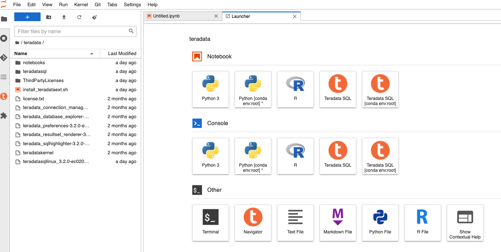
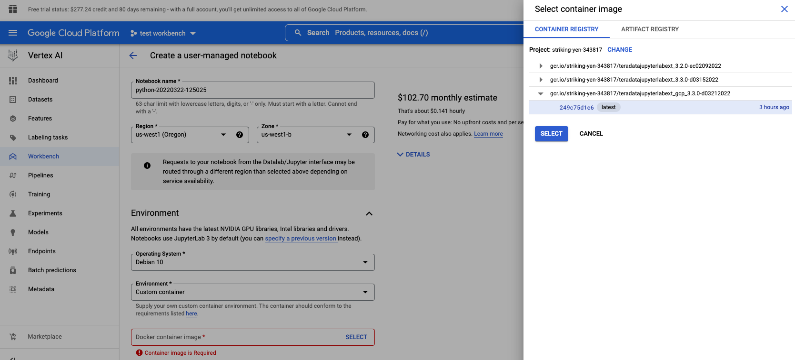

import ClearscapeDocsNote from '../_partials/vantage_clearscape_analytics.mdx'
import JupyterClearscapeNote from '../_partials/jupyter_notebook_clearscape_analytics_note.mdx';

# Integrar las extensiones de Teradata Jupyter con Google Vertex AI


<JupyterClearscapeNote />

## Información general
Las extensiones de Teradata Jupyter proporcionan el kernel Teradata SQL y varias extensiones de interfaz de usuario para permitir a los usuarios acceder y navegar fácilmente por la base de datos de Teradata desde el entorno Jupyter. Google Vertex AI es la nueva plataforma ML unificada de Google Cloud. Vertex AI Workbench proporciona un entorno de desarrollo basado en Jupyter para todo el flujo de trabajo de ciencia de datos. Este artículo describe cómo integrar nuestras extensiones de Jupyter con Vertex AI Workbench para que los usuarios de Vertex AI puedan aprovechar nuestras extensiones de Teradata en su proceso de aprendizaje automático.

El banco de trabajo Vertex AI admite dos tipos de cuadernos: cuadernos administrados y cuadernos administrados por el usuario. Aquí nos centraremos en los cuadernos administrados por el usuario. Mostraremos dos formas de integrar nuestras extensiones de Jupyter con cuadernos administrados por el usuario: usar un script de inicio para instalar nuestro kernel y nuestras extensiones o usar un contenedor personalizado.

## Prerrequisitos

* Acceso a una instancia de Teradata Vantage
  <ClearscapeDocsNote />
* Cuenta de Google Cloud con Vertex AI habilitado
* Almacenamiento en Google Cloud para almacenar scripts de inicio y el paquete de extensiones de Teradata Jupyter

## Integración

Hay dos formas de ejecutar Teradata Jupyter Extensions en Vertex AI:

1. [Utilizar un script de inicio](#use-startup-script)
2. [Utilizar un contenedor personalizado](#use-custom-container)

Estos dos métodos de integración se describen a continuación.

### Utilizar un script de inicio

Cuando creamos una nueva instancia de cuaderno, podemos especificar un script de inicio. Este script se ejecuta una sola vez después de crear la instancia. Estos son los pasos:

1. Descargar el paquete de extensiones Jupyter de Teradata

Vaya a la página [Módulos Vantage para Jupyter](https://downloads.teradata.com/download/tools/vantage-modules-for-jupyter) para descargar el paquete de extensiones Teradata Jupyter versión Linux.

2. Cargue el paquete en un depósito de almacenamiento de Google Cloud.

3. Escriba un script de inicio y cárguelo en el depósito de almacenamiento en la nube

A continuación se muestra un script de muestra. Obtiene el paquete de extensión Teradata Jupyter del depósito de almacenamiento en la nube e instala el kernel y las extensiones de Teradata SQL.

``` bash , role="content-editable"
#! /bin/bash

cd /home/jupyter
mkdir teradata
cd teradata
gsutil cp gs://teradata-jupyter/* .
unzip teradatasql*.zip

# Install Teradata kernel
cp teradatakernel /usr/local/bin

jupyter kernelspec install ./teradatasql --prefix=/opt/conda

# Install Teradata extensions
pip install --find-links . teradata_preferences_prebuilt
pip install --find-links . teradata_connection_manager_prebuilt
pip install --find-links . teradata_sqlhighlighter_prebuilt
pip install --find-links . teradata_resultset_renderer_prebuilt
pip install --find-links . teradata_database_explorer_prebuilt

# PIP install the Teradata Python library
pip install teradataml

# Install Teradata R library (optional, uncomment this line only if you use an environment that supports R)
#Rscript -e "install.packages('tdplyr',repos=c('https://r-repo.teradata.com','https://cloud.r-project.org'))"
```


4. Cree un nuevo cuaderno y agregue el script de inicio desde el depósito de almacenamiento en la nube.


5. Es posible que el proceso de creación del cuaderno tarde unos minutos en completarse. Cuando termine, haga clic en `Open notebook`.


### Utilizar un contenedor personalizado

Otra opción es proporcionar un contenedor personalizado al crear un cuaderno.

1. Descargar el paquete de extensiones Jupyter de Teradata

Vaya a la página [Módulos Vantage para Jupyter](https://downloads.teradata.com/download/tools/vantage-modules-for-jupyter) para descargar el paquete de extensiones Teradata Jupyter versión Linux.

2. Copie este paquete en su directorio de trabajo y descomprímalo.

3. Crear una imagen de Docker personalizada

El contenedor personalizado debe exponer un servicio en el puerto 8080. Se recomienda crear un contenedor derivado de una imagen de Google Deep Learning Containers, porque esas imágenes ya están configuradas para ser compatibles con los cuadernos administrados por el usuario.

A continuación se muestra un Dockerfile de muestra que puede utilizar para crear una imagen de Docker con el kernel Teradata SQL y las extensiones instaladas:

``` bash
# Use one of the deep learning images as base image
# if you need both Python and R, use one of the R images
FROM gcr.io/deeplearning-platform-release/r-cpu:latest

USER root

##############################################################
# Install kernel and copy supporting files
##############################################################

# Copy the kernel
COPY ./teradatakernel /usr/local/bin

RUN chmod 755 /usr/local/bin/teradatakernel

# Copy directory with kernel.json file into image
COPY ./teradatasql teradatasql/

# Copy notebooks and licenses
COPY ./notebooks/ /home/jupyter
COPY ./license.txt /home/jupyter
COPY ./ThirdPartyLicenses/ /home/jupyter

# Install the kernel file to /opt/conda jupyter lab instance
RUN jupyter kernelspec install ./teradatasql --prefix=/opt/conda

##############################################################
# Install Teradata extensions
##############################################################

RUN pip install --find-links . teradata_preferences_prebuilt && \
    pip install --find-links . teradata_connection_manager_prebuilt && \
    pip install --find-links . teradata_sqlhighlighter_prebuilt && \
    pip install --find-links . teradata_resultset_renderer_prebuilt && \
    pip install --find-links . teradata_database_explorer_prebuilt

# Give back ownership of /opt/conda to jovyan
RUN chown -R jupyter:users /opt/conda

# PIP install the Teradata Python libraries
RUN pip install teradataml

# Install Teradata R library (optional, include it only if you use a base image that supports R)
RUN Rscript -e "install.packages('tdplyr',repos=c('https://r-repo.teradata.com','https://cloud.r-project.org'))"
```

4. En su directorio de trabajo (donde descomprimió el paquete de extensiones de Teradata Jupyter), ejecute `docker build` para crear la imagen:

``` bash , id="jupyterlab_ext_on_vertex_first_run", role="content-editable emits-gtm-events
docker build -f Dockerfile imagename:imagetag .
```

5. Envíe la imagen de la ventana acoplable al registro de contenedores o al registro de artefactos de Google

Consulte la siguiente documentación para enviar la imagen de la ventana acoplable al registro:

* [Registro de contenedores: insertar y extraer imágenes](https://cloud.google.com/container-registry/docs/pushing-and-pulling)
* [Registro de artefactos: insertar y extraer imágenes](https://cloud.google.com/artifact-registry/docs/docker/pushing-and-pulling?hl=en)

6. Crear un nuevo cuaderno

En la sección `Environment`, establezca el campo `custom container` en la ubicación de su contenedor personalizado recién creado:


## Lectura adicional
* [Sitio web de extensiones de Jupyter de Teradata](https://teradata.github.io/jupyterextensions)
* [Guía de instalación de módulos Teradata Vantage™ para Jupyter](https://docs.teradata.com/r/KQLs1kPXZ02rGWaS9Ktoww/root)
* [Guía del usuario del paquete Teradata® para Python](https://docs.teradata.com/r/1YKutX2ODdO9ppo_fnguTA/root)
* [Documentación de Vertex AI: crear una imagen de contenedor personalizada para entrenamiento](https://cloud.google.com/vertex-ai/docs/training/create-custom-container)
* [Documentación de Vertex AI: crear una instancia de cuadernos administrada por el usuario mediante un contenedor personalizado](https://cloud.google.com/vertex-ai/docs/workbench/user-managed/custom-container)
* [Documentación de Vertex AI: crear una instancia de cuadernos administrada por el usuario](https://cloud.google.com/vertex-ai/docs/workbench/user-managed/create-new)

import CommunityLinkPartial from '../_partials/community_link.mdx';

<CommunityLinkPartial />
