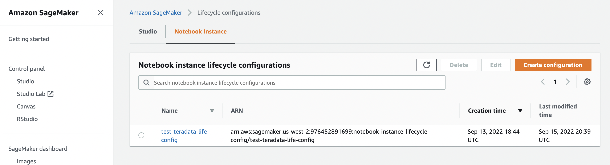

import ClearscapeDocsNote from '../_partials/vantage_clearscape_analytics.mdx'
import JupyterClearScapeNote from '../_partials/jupyter_notebook_clearscape_analytics_note.mdx';

# Integrar las extensiones de Teradata Jupyter con una instancia de cuaderno de SageMaker


<JupyterClearScapeNote />

### Información general
Las extensiones de Teradata Jupyter proporcionan el kernel Teradata SQL y varias extensiones de interfaz de usuario para permitir a los usuarios acceder y navegar fácilmente por la base de datos de Teradata desde el entorno Jupyter. Este artículo describe cómo integrar nuestras extensiones de Jupyter con la instancia del cuaderno de SageMaker.

### Prerrequisitos


* Acceso a una instancia de Teradata Vantage
  <ClearscapeDocsNote />
* Cuenta de AWS
* Depósito de AWS S3 para almacenar scripts de configuración del ciclo de vida y paquete de extensiones de Teradata Jupyter

### Integración

SageMaker admite la personalización de instancias de cuadernos mediante scripts de configuración del ciclo de vida. A continuación, mostraremos cómo usar scripts de configuración del ciclo de vida para instalar nuestro kernel y extensiones de Jupyter en una instancia de cuaderno.

### Pasos para integrar con la instancia de cuaderno

1. Descargar el paquete de extensiones Jupyter de Teradata

Descargue la versión de Linux desde https://downloads.teradata.com/download/tools/vantage-modules-for-jupyter y cárguela en un depósito de S3. Este paquete comprimido contiene el kernel y las extensiones de Teradata Jupyter. Cada extensión tiene 2 archivos, el que tiene "prebuilt" en el nombre es una extensión prediseñada que se puede instalar usando PIP, el otro es una extensión fuente que debe instalarse usando "jupyter labextension". Se recomienda utilizar extensiones prediseñadas.

2. Cree una configuración de ciclo de vida para la instancia de cuaderno.


A continuación se muestran scripts de ejemplo que obtienen el paquete Teradata del depósito S3 e instalan el kernel y las extensiones de Jupyter. Tenga en cuenta que on-create.sh crea un entorno conda personalizado que persiste en el volumen EBS de la instancia de cuaderno para que la instalación no se pierda después de reiniciar el cuaderno. on-start.sh instala el kernel de Teradata y las extensiones en el entorno conda personalizado.

on-create.sh

``` bash , role="content-editable
#!/bin/bash

set -e

# This script installs a custom, persistent installation of conda on the Notebook Instance's EBS volume, and ensures
# that these custom environments are available as kernels in Jupyter.
 

sudo -u ec2-user -i <<'EOF'
unset SUDO_UID
# Install a separate conda installation via Miniconda
WORKING_DIR=/home/ec2-user/SageMaker/custom-miniconda
mkdir -p "$WORKING_DIR"
wget https://repo.anaconda.com/miniconda/Miniconda3-4.6.14-Linux-x86_64.sh -O "$WORKING_DIR/miniconda.sh"
bash "$WORKING_DIR/miniconda.sh" -b -u -p "$WORKING_DIR/miniconda"
rm -rf "$WORKING_DIR/miniconda.sh"
# Create a custom conda environment
source "$WORKING_DIR/miniconda/bin/activate"
KERNEL_NAME="teradatasql"

PYTHON="3.8"
conda create --yes --name "$KERNEL_NAME" python="$PYTHON"
conda activate "$KERNEL_NAME"
pip install --quiet ipykernel

EOF
```


on-start.sh

``` bash , role="content-editable"
#!/bin/bash

set -e

# This script installs Teradata Jupyter kernel and extensions.
 

sudo -u ec2-user -i <<'EOF'
unset SUDO_UID

WORKING_DIR=/home/ec2-user/SageMaker/custom-miniconda

source "$WORKING_DIR/miniconda/bin/activate" teradatasql

# fetch Teradata Jupyter extensions package from S3 and unzip it
mkdir -p "$WORKING_DIR/teradata"
aws s3 cp s3://sagemaker-teradata-bucket/teradatasqllinux_3.3.0-ec06172022.zip "$WORKING_DIR/teradata"
cd "$WORKING_DIR/teradata"

unzip -o teradatasqllinux_3.3.0-ec06172022.zip

# install Teradata kernel
cp teradatakernel /home/ec2-user/anaconda3/condabin
jupyter kernelspec install --user ./teradatasql

# install Teradata Jupyter extensions
source /home/ec2-user/anaconda3/bin/activate JupyterSystemEnv

pip install teradata_connection_manager_prebuilt-3.3.0.tar.gz
pip install teradata_database_explorer_prebuilt-3.3.0.tar.gz
pip install teradata_preferences_prebuilt-3.3.0.tar.gz
pip install teradata_resultset_renderer_prebuilt-3.3.0.tar.gz
pip install teradata_sqlhighlighter_prebuilt-3.3.0.tar.gz

conda deactivate
EOF
```

3. Cree una instancia de cuaderno. Seleccione 'Amazon Linux 2, Jupyter Lab3' para el identificador de plataforma y seleccione la configuración del ciclo de vida creada en el paso 2 para la configuración del ciclo de vida.

    

Es posible que también necesite agregar vpc, subred y grupo de seguridad en la sección 'Red' para obtener acceso a las bases de datos de Teradata.

4. Espere hasta que el estado de la instancia de cuaderno cambie a "InService", haga clic en "Abrir JupyterLab" para abrir el cuaderno.
    


    Acceda a los cuadernos de demostración para obtener consejos de uso
    


### Lectura adicional
* [Sitio web de extensiones de Jupyter de Teradata](https://teradata.github.io/jupyterextensions)
* [Guía de instalación de módulos Teradata Vantage™ para Jupyter](https://docs.teradata.com/r/KQLs1kPXZ02rGWaS9Ktoww/root)
* [Guía del usuario del paquete Teradata® para Python](https://docs.teradata.com/r/1YKutX2ODdO9ppo_fnguTA/root)
* [Personalizar una instancia de cuaderno mediante un script de configuración del ciclo de vida](https://docs.aws.amazon.com/sagemaker/latest/dg/notebook-lifecycle-config.html)
* [Ejemplos de configuración del ciclo de vida de la instancia de cuaderno de Amazon Sagemaker](https://github.com/aws-samples/amazon-sagemaker-notebook-instance-lifecycle-config-samples/blob/master/scripts/persistent-conda-ebs/on-create.sh)

import CommunityLinkPartial from '../_partials/community_link.mdx';

<CommunityLinkPartial />
