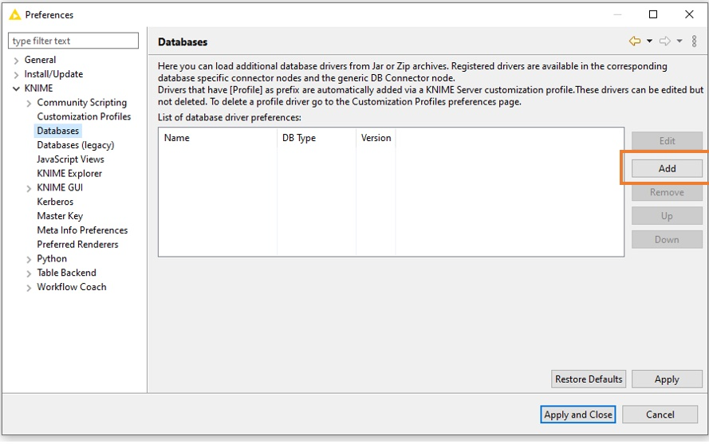
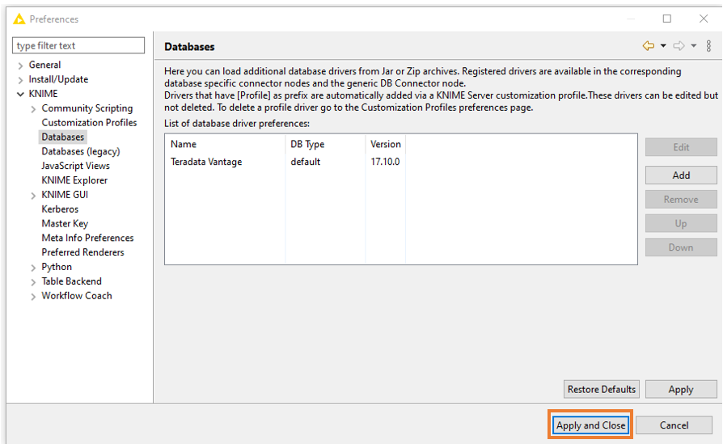
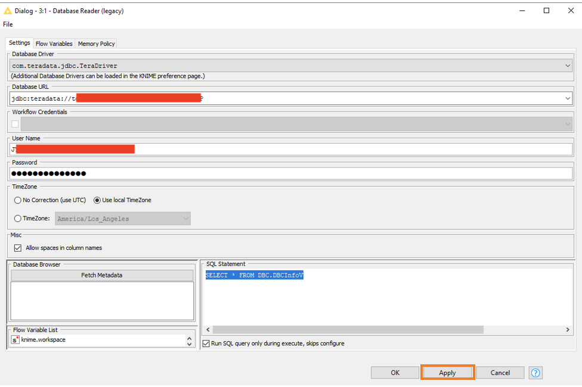

# Integrar Teradata Vantage con KNIME Analytics Platform

## Información general

Este tutorial describe cómo conectarse a Terdata Vantage desde KNIME Analytics Platform.

### Acerca de KNIME Analytics Platform

KNIME Analytics Platform es un banco de trabajo de ciencia de datos. Admite análisis de varias fuentes de datos, incluido Teradata Vantage.

## Prerrequisitos

import ClearscapeDocsNote from '../_partials/vantage_clearscape_analytics.mdx'

* Acceso a una instancia de Teradata Vantage, versión 17.10 o superior.
  <ClearscapeDocsNote />
* KNIME instalado localmente. Consulte [Instrucciones de instalación de KNIME](https://www.knime.com/installation) para obtener más detalles.

## Procedimiento de integración

1. Vaya a https://downloads.teradata.com/download/connectivity/jdbc-driver (los usuarios nuevos deberán registrarse) y descargue la última versión del controlador JDBC.
2. Descomprima el archivo descargado. Encontrará el archivo `terajdbc4.jar`.
3. En KNIME, haga clic en `File → Preference`. En `Databases`, haga clic en `Add`:

4. Registre un nuevo controlador de base de datos. Proporcione valores para `ID`, `Name` y `Description` como se muestra a continuación. Haga clic en `Add file` y seleccione el archivo .jar que descargó anteriormente. Haga clic en `Find driver classes` y `Driver class:` debería completarse con `jdbc.TeraDriver`:

5. Haga clic en `Apply and Close`:

6. Para probar la conexión, cree un nuevo flujo de trabajo KNIME y agregue un nodo `Database Reader (legacy)` arrastrándolo al espacio de trabajo de la derecha:

7. Haga clic derecho en `Database Reader (legacy)` para configurar los ajustes. Seleccione `com.teradata.jdbc.Teradriver` en el menú desplegable:

8. Introduzca el nombre del servidor Vantage y el mecanismo de inicio de sesión, por ejemplo:

9. Para probar la conexión, introduzca la declaración SQL en el cuadro en la parte inferior derecha. Por ejemplo, introduzca `SELECT * FROM DBC.DBCInfoV` y haga clic en `Apply` para cerrar el cuadro de diálogo:

10. Ejecute el nodo para probar la conexión:

11. El nodo mostrará una luz verde cuando se ejecute correctamente. Haga clic derecho y seleccione `Data from Database` para ver los resultados:

## Resumen

Este tutorial muestra cómo conectarse desde KNIME Analytics Platform a Teradata Vantage.

## Lectura adicional
* [Entrenar modelos de ML en Vantage usando solo SQL](./ml.md)

import CommunityLinkPartial from '../_partials/community_link.mdx';

<CommunityLinkPartial />