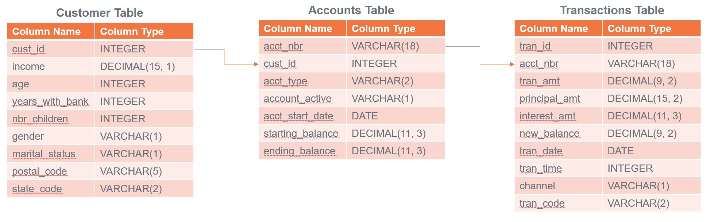

import ClearscapeDocsNote from '../_partials/vantage_clearscape_analytics.mdx'
import CommunityLink from '../_partials/community_link.mdx'

# Entrenar modelos de ML en Vantage usando funciones analíticas de bases de datos

## Información general

Hay situaciones en las que desea validar rápidamente una idea de modelo de aprendizaje automático. Tiene un tipo de modelo en mente. No desea poner en funcionamiento una canalización de ML todavía. Solo quiere probar si la relación que tenía en mente existe. Además, a veces incluso su implementación de producción no requiere un reaprendizaje constante con MLops. En tales casos, puede utilizar funciones analíticas de bases de datos para ingeniería de características, entrenar diferentes modelos de ML, calificar sus modelos y evaluar su modelo en diferentes funciones de evaluación de modelos.

## Prerrequisitos

Necesita acceso a una instancia de Teradata Vantage.
<ClearscapeDocsNote />

## Cargar datos de muestra

Aquí, en este ejemplo, utilizaremos los datos de muestra de la base de datos `val`. Usaremos las tablas `accounts`, `customer` y `transactions`. Crearemos algunas tablas en el proceso y es posible que surjan algunos problemas al crear tablas en la base de datos `val`, así que vamos a crear nuestra propia base de datos `td_analytics_functions_demo`.

```
CREATE DATABASE td_analytics_functions_demo
AS PERMANENT = 110e6;
```

:::note
Debe tener permisos CREATE TABLE en la base de datos donde desea utilizar las funciones de análisis de la base de datos.
:::

Ahora creemos tablas `accounts`, `customer` y `transactions` en nuestra base de datos `td_analytics_functions_demo` a partir de las tablas correspondientes en la base de datos `val`.

```
DATABASE td_analytics_functions_demo;

CREATE TABLE customer AS (
SELECT * FROM val.customer
) WITH DATA;

CREATE TABLE accounts AS (
SELECT * FROM val.accounts
) WITH DATA;

CREATE TABLE transactions AS (
SELECT * FROM val.transactions
) WITH DATA;
```

## Comprender los datos de muestra

Ahora que tenemos nuestras tablas de muestra cargadas en `td_analytics_functions_demo`, exploremos los datos. Es un conjunto de datos simplista y ficticio de clientes bancarios (700 filas), cuentas (1400 filas) y transacciones (77K filas). Están relacionados entre sí de las siguientes maneras:



En partes posteriores de este tutorial, exploraremos si podemos construir un modelo que prediga el saldo mensual promedio que un cliente bancario tiene en su tarjeta de crédito en función de todas las variables no relacionadas con la tarjeta de crédito en las tablas.

## Preparar el conjunto de datos

Tenemos datos en tres tablas diferentes que queremos unir y crear funciones. Comencemos creando una tabla unida. 

```
-- Create a consolidated joined_table from customer, accounts and transactions table
CREATE TABLE td_analytics_functions_demo.joined_table AS (
    SELECT
        T1.cust_id  AS cust_id
       ,MIN(T1.income) AS tot_income
       ,MIN(T1.age) AS tot_age
       ,MIN(T1.years_with_bank) AS tot_cust_years
       ,MIN(T1.nbr_children) AS tot_children
       ,MIN(T1.marital_status)AS marital_status
       ,MIN(T1.gender) AS gender
       ,MAX(T1.state_code) AS state_code
       ,AVG(CASE WHEN T2.acct_type = 'CK' THEN T2.starting_balance+T2.ending_balance ELSE 0 END) AS ck_avg_bal
       ,AVG(CASE WHEN T2.acct_type = 'SV' THEN T2.starting_balance+T2.ending_balance ELSE 0 END) AS sv_avg_bal
       ,AVG(CASE WHEN T2.acct_type = 'CC' THEN T2.starting_balance+T2.ending_balance ELSE 0 END) AS cc_avg_bal
       ,AVG(CASE WHEN T2.acct_type = 'CK' THEN T3.principal_amt+T3.interest_amt ELSE 0 END) AS ck_avg_tran_amt
       ,AVG(CASE WHEN T2.acct_type = 'SV' THEN T3.principal_amt+T3.interest_amt ELSE 0 END) AS sv_avg_tran_amt
       ,AVG(CASE WHEN T2.acct_type = 'CC' THEN T3.principal_amt+T3.interest_amt ELSE 0 END) AS cc_avg_tran_amt
       ,COUNT(CASE WHEN ((EXTRACT(MONTH FROM T3.tran_date) + 2) / 3) = 1 THEN T3.tran_id ELSE NULL END) AS q1_trans_cnt
       ,COUNT(CASE WHEN ((EXTRACT(MONTH FROM T3.tran_date) + 2) / 3) = 2 THEN T3.tran_id ELSE NULL END) AS q2_trans_cnt
       ,COUNT(CASE WHEN ((EXTRACT(MONTH FROM T3.tran_date) + 2) / 3) = 3 THEN T3.tran_id ELSE NULL END) AS q3_trans_cnt
       ,COUNT(CASE WHEN ((EXTRACT(MONTH FROM T3.tran_date) + 2) / 3) = 4 THEN T3.tran_id ELSE NULL END) AS q4_trans_cnt
    FROM Customer AS T1
        LEFT OUTER JOIN Accounts AS T2
            ON T1.cust_id = T2.cust_id
        LEFT OUTER JOIN Transactions AS T3
            ON T2.acct_nbr = T3.acct_nbr
GROUP BY T1.cust_id) WITH DATA UNIQUE PRIMARY INDEX (cust_id);
```

Veamos ahora cómo se ven nuestros datos. El conjunto de datos tiene características tanto categóricas como continuas o variables independientes. En nuestro caso, la variable dependiente es `cc_avg_bal`, que es el saldo promedio de la tarjeta de crédito del cliente.


## Ingeniería de características

Al observar los datos, vemos que hay varias características que podemos tener en cuenta para predecir el `cc_avg_bal`.

### TD_OneHotEncodingFit

Dado que tenemos algunas características categóricas en nuestro conjunto de datos, como `gender`, `marital status` y `state code`, aprovecharemos la función de analíticas de base de datos [TD_OneHotEncodingFit](https://docs.teradata.com/r/Enterprise_IntelliFlex_VMware/Database-Analytic-Functions/Feature-Engineering-Transform-Functions/TD_OneHotEncodingFit) para codificar categorías en vectores numéricos one-hot. 

```
CREATE VIEW td_analytics_functions_demo.one_hot_encoding_joined_table_input AS (
  SELECT * FROM TD_OneHotEncodingFit(
    ON td_analytics_functions_demo.joined_table AS InputTable
    USING
    IsInputDense ('true')
    TargetColumn ('gender','marital_status','state_code')
    CategoryCounts(2,4,33)
Approach('Auto')
) AS dt
);
```

### TD_ScaleFit

Si miramos los datos, algunas columnas como `tot_income`, `tot_age` y `ck_avg_bal` tienen valores en diferentes rangos. Para los algoritmos de optimización como el descenso de gradiente, es importante normalizar los valores a la misma escala para una convergencia más rápida, una coherencia de escala y un mejor rendimiento del modelo. Aprovecharemos la función [TD_ScaleFit](https://docs.teradata.com/r/Enterprise_IntelliFlex_VMware/Database-Analytic-Functions/Feature-Engineering-Transform-Functions/TD_ScaleFit) para normalizar valores en diferentes escalas.

```
 CREATE VIEW td_analytics_functions_demo.scale_fit_joined_table_input AS (
  SELECT * FROM TD_ScaleFit(
    ON td_analytics_functions_demo.joined_table AS InputTable
    USING
    TargetColumns('tot_income','q1_trans_cnt','q2_trans_cnt','q3_trans_cnt','q4_trans_cnt','ck_avg_bal','sv_avg_bal','ck_avg_tran_amt', 'sv_avg_tran_amt', 'cc_avg_tran_amt')
    ScaleMethod('RANGE')
) AS dt
);
```

### TD_ColumnTransformer

Las funciones analíticas de bases de datos de Teradata normalmente operan en pares para transformaciones de datos. El paso inicial está dedicado a "ajustar" los datos. Posteriormente, la segunda función utiliza los parámetros derivados del proceso de ajuste para ejecutar la transformación real de los datos. [TD_ColumnTransformer](https://docs.teradata.com/r/Enterprise_IntelliFlex_VMware/Database-Analytic-Functions/Feature-Engineering-Transform-Functions/TD_ColumnTransformer) lleva las tablas FIT a la función y transforma las columnas de la tabla de entrada en una sola operación.

```
-- Using a consolidated transform function
CREATE TABLE td_analytics_functions_demo.feature_enriched_accounts_consolidated AS (
SELECT * FROM TD_ColumnTransformer(
ON joined_table AS InputTable
ON one_hot_encoding_joined_table_input AS OneHotEncodingFitTable DIMENSION
ON scale_fit_joined_table_input AS ScaleFitTable DIMENSION
) as dt 
) WITH DATA;
```

Una vez que realizamos la transformación, podemos ver nuestras columnas categóricas con codificación one-hot y valores numéricos escalados como se puede ver en la imagen a continuación. Por ejemplo: `tot_income` está en el rango [0,1], `gender` tiene codificación one-hot en `gender_0`, `gender_1`, `gender_other`.


## División en entrenamiento y pruebas

Como tenemos nuestro conjunto de datos listo con funciones escaladas y codificadas, ahora dividamos nuestro conjunto de datos en partes de entrenamiento (75 %) y pruebas (25 %). Las funciones analíticas de bases de datos de Teradata proporcionan la función [TD_TrainTestSplit](https://docs.teradata.com/r/Enterprise_IntelliFlex_VMware/Database-Analytic-Functions/Model-Evaluation-Functions/TD_TrainTestSplit), que aprovecharemos para dividir nuestro conjunto de datos.

```
-- Train Test Split on Input table 
CREATE VIEW td_analytics_functions_demo.train_test_split AS (
SELECT * FROM TD_TrainTestSplit(
ON td_analytics_functions_demo.feature_enriched_accounts_consolidated AS InputTable
USING
IDColumn('cust_id')
trainSize(0.75)
testSize(0.25)
Seed (42)
) AS dt
);
```

Como se puede ver en la imagen a continuación, la función agrega una nueva columna `TD_IsTrainRow`. 


Usaremos `TD_IsTrainRow` para crear dos tablas, una para entrenamiento y otra para pruebas.

```
-- Creating Training Table
CREATE TABLE td_analytics_functions_demo.training_table AS (
  SELECT * FROM td_analytics_functions_demo.train_test_split
  WHERE TD_IsTrainRow = 1
) WITH DATA;

-- Creating Testing Table
CREATE TABLE td_analytics_functions_demo.testing_table AS (
  SELECT * FROM td_analytics_functions_demo.train_test_split
  WHERE TD_IsTrainRow = 0
) WITH DATA;
```

## Entrenamiento con modelo lineal generalizado 

Ahora usaremos la función analítica de base de datos [TD_GLM](https://docs.teradata.com/r/Enterprise_IntelliFlex_VMware/Database-Analytic-Functions/Model-Training-Functions/TD_GLM) para entrenar en nuestro conjunto de datos de entrenamiento. La función `TD_GLM` es un modelo lineal generalizado (generalized linear model, GLM) que realiza analíticas de regresión y clasificación en conjuntos de datos. Aquí hemos utilizado un montón de columnas de entrada como `tot_income`, `ck_avg_bal`,`cc_avg_tran_amt`, valores con codificación one-hot para estado civil, género y estados. `cc_avg_bal` es nuestra columna dependiente o de respuesta que es continua y, por tanto, es un problema de regresión. Usamos `Family` como `Gaussian` para regresión y `Binomial` para clasificación. 

El parámetro `Tolerance` significa la mejora mínima requerida en la precisión de la predicción para que el modelo detenga las iteraciones y `MaxIterNum` significa el número máximo de iteraciones permitidas. El modelo concluye el entrenamiento según la condición que se cumpla primero. Por ejemplo, en el siguiente ejemplo, el modelo es `CONVERGED` después de 58 iteraciones.

```
-- Training the GLM_Model with Training Dataset
CREATE TABLE td_analytics_functions_demo.GLM_model_training AS (
SELECT * FROM TD_GLM (
  ON td_analytics_functions_demo.training_table AS InputTable
  USING
  InputColumns('tot_income','ck_avg_bal','cc_avg_tran_amt','[19:26]')
  ResponseColumn('cc_avg_bal')
  Family ('Gaussian')
  MaxIterNum (300)
  Tolerance (0.001)
  Intercept ('true')
) AS dt
) WITH DATA;
```


## Puntuación en el conjunto de datos de prueba

Ahora usaremos nuestro modelo `GLM_model_training` para puntuar nuestro conjunto de datos de prueba `testing_table` usando la función analítica de base de datos (enlace: [TD_GLMPredict](https://docs.teradata.com/r/Enterprise_IntelliFlex_VMware/Database-Analytic-Functions/Model-Scoring-Functions/TD_GLMPredict)).

```sql
-- Scoring the GLM_Model with Testing Dataset
CREATE TABLE td_analytics_functions_demo.GLM_model_test_prediction AS (
SELECT * from TD_GLMPredict (
ON td_analytics_functions_demo.testing_table AS InputTable
ON td_analytics_functions_demo.GLM_model_training AS ModelTable DIMENSION
USING
IDColumn ('cust_id')
Accumulate('cc_avg_bal')
) AS dt
) WITH DATA;
```


## Evaluación del modelo

Finalmente, evaluamos nuestro modelo en función de los resultados puntuados. Aquí estamos usando la función [TD_RegressionEvaluator](https://docs.teradata.com/r/Enterprise_IntelliFlex_VMware/Database-Analytic-Functions/Model-Evaluation-Functions/TD_RegressionEvaluator). El modelo se puede evaluar en función de parámetros como `R2`, `RMSE`, `F_score`. 

```sql
-- Evaluating the model
SELECT * FROM TD_RegressionEvaluator(
ON td_analytics_functions_demo.GLM_model_test_prediction AS InputTable
USING
ObservationColumn('cc_avg_bal')
PredictionColumn('prediction')
Metrics('RMSE','MAE','R2')
) AS dt;
```


:::note
El propósito de este tutorial no es describir la ingeniería de funciones, sino demostrar cómo podemos aprovechar diferentes funciones analíticas de bases de datos en Vantage. Es posible que los resultados del modelo no sean óptimos y el proceso para crear el mejor modelo está fuera del alcance de este artículo.
:::

## Resumen

En este inicio rápido, hemos aprendido cómo crear modelos de ML utilizando funciones analíticas de base de datos Teradata. Construimos nuestra propia base de datos `td_analytics_functions_demo` con datos `customer`,`accounts`, `transactions`, `val` de la base de datos. Realizamos ingeniería de características transformando las columnas usando `TD_OneHotEncodingFit`, `TD_ScaleFit` y `TD_ColumnTransformer`. Luego usamos `TD_TrainTestSplit` para dividir entre entrenamiento y pruebas. Entrenamos nuestro conjunto de datos de entrenamiento con el modelo `TD_GLM` y calificamos nuestro conjunto de datos de prueba. Finalmente evaluamos nuestros resultados puntuados usando la función `TD_RegressionEvaluator`. 

## Lectura adicional
* [Guía del usuario de funciones analíticas de bases de datos Vantage](https://docs.teradata.com/r/Enterprise_IntelliFlex_VMware/Database-Analytic-Functions/Introduction-to-Analytics-Database-Analytic-Functions)

<CommunityLink />
