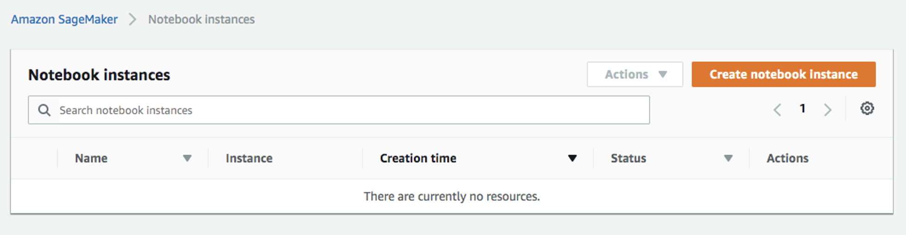
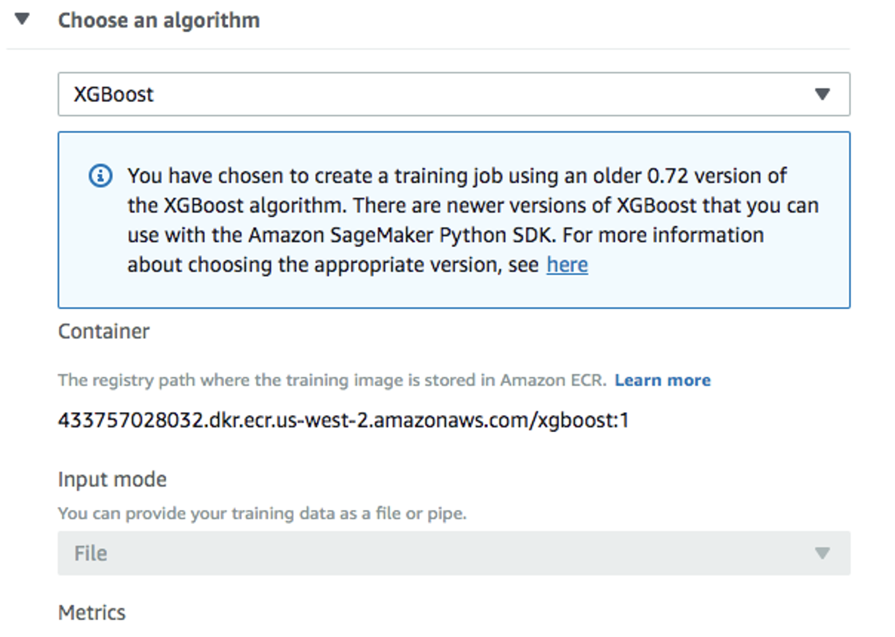
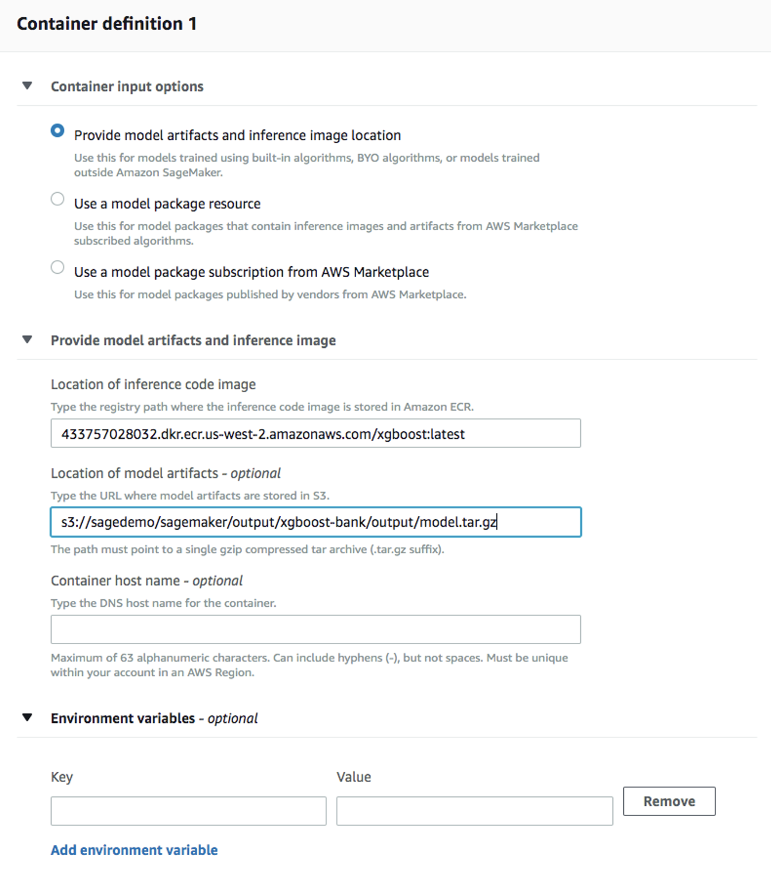

import CommunityLinkPartial from '../_partials/community_link.mdx';

# Utilizar AWS SageMaker con Teradata Vantage


### Información general

Este tutorial le ayudará a integrar Amazon SageMaker con Teradata Vantage. El enfoque que explica esta guía es uno de los muchos enfoques potenciales para integrarse con el servicio.

Amazon SageMaker proporciona una plataforma de aprendizaje automático totalmente administrada. Hay dos casos de uso para Amazon SageMaker y Teradata:

1.	Los datos que residen en Teradata Vantage y Amazon SageMaker se utilizarán tanto para la definición del modelo como para la puntuación posterior. En este caso de uso, Teradata proporcionará datos en el entorno de Amazon S3 para que Amazon SageMaker pueda consumir conjuntos de datos de entrenamiento y prueba con el fin de desarrollar modelos. Teradata además pondría los datos a disposición a través de Amazon S3 para su posterior puntuación por parte de Amazon SageMaker. Según este modelo, Teradata es únicamente un repositorio de datos.

2.	Los datos que residen en Teradata Vantage y Amazon SageMaker se utilizarán para la definición del modelo, y Teradata para la puntuación posterior. En este caso de uso, Teradata proporcionará datos en el entorno de Amazon S3 para que Amazon SageMaker pueda consumir conjuntos de datos de entrenamiento y prueba con el fin de desarrollar modelos. Teradata deberá importar el modelo de Amazon SageMaker a una tabla de Teradata para su posterior puntuación por parte de Teradata Vantage. Según este modelo, Teradata es un depósito de datos y un motor de puntuación.

El primer caso de uso se analiza en este documento.

Amazon SageMaker consume datos de prueba y entrenamiento de un depósito de Amazon S3. Este artículo describe cómo cargar conjuntos de datos de análisis de Teradata en un depósito de Amazon S3. Luego, los datos pueden estar disponibles para Amazon SageMaker para crear y entrenar modelos de aprendizaje automático e implementarlos en un entorno de producción.


### Prerrequisitos

import ClearscapeDocsNote from '../_partials/vantage_clearscape_analytics.mdx'

* Acceso a una instancia de Teradata Vantage.
  <ClearscapeDocsNote />
* Permiso de IAM para acceder al depósito de Amazon S3 y utilizar el servicio Amazon SageMaker.
* Un depósito de Amazon S3 para almacenar datos de entrenamiento.

### Cargar datos

Amazon SageMaker entrena datos desde un depósito de Amazon S3. Los siguientes son los pasos para cargar datos de entrenamiento desde Vantage a un depósito de Amazon S3:

1.	Vaya a la consola de Amazon SageMaker y cree una instancia de cuaderno. Consulte la [Guía para desarrolladores de Amazon SageMaker](https://docs.aws.amazon.com/sagemaker/latest/dg/gs-setup-working-env.html) para obtener instrucciones sobre cómo crear una instancia de cuaderno: 

2.	Abra la instancia de su cuaderno:


3. Inicie un nuevo archivo haciendo clic en `New -> conda_python3`:


4. Instale la biblioteca Teradata Python:
    ``` python
    !pip install teradataml
    ```

5. En una nueva celda, importe bibliotecas adicionales:
    ``` python
    import teradataml as tdml
    from teradataml import create_context, get_context, remove_context
    from teradataml.dataframe.dataframe import DataFrame
    import pandas as pd
    import boto3, os
    ```

6. En una celda nueva, conéctese a Teradata Vantage. Reemplace `<hostname>`, `<database user name>`, `<database password>` para que coincida con su entorno Vantage:
    ``` python
    create_context(host = '<hostname>', username = '<database user name>', password = '<database password>')
    ```

7. Recupere datos de la tabla donde reside el conjunto de datos de entrenamiento utilizando la API TeradataML DataFrame:
    ``` python
    train_data = tdml.DataFrame('table_with_training_data')
    trainDF = train_data.to_pandas()
    ```

8. Escriba datos en un archivo local:
    ``` python
    trainFileName = 'train.csv'
    trainDF.to_csv(trainFileName, header=None, index=False)
    ```

9. Cargue el archivo en Amazon S3:
    ``` python , id="sagemaker_first_usage", role="content-editable emits-gtm-events
    bucket = 'sagedemo'
    prefix = 'sagemaker/train'

    trainFile = open(trainFileName, 'rb')
    boto3.Session().resource('s3').Bucket(bucket).Object(os.path.join(prefix, localFile)).upload_fileobj(trainFile)
    ```

### Entrenar el modelo

1. Seleccione `Training jobs` en el menú de la izquierda debajo de `Training` y, posteriormente, haga clic en `Create training job`:


2. En la ventana `Create training job`, complete `Job name` (por ejemplo, `xgboost-bank`) y `Create a new role` para el rol de IAM. Elija `Any S3 bucket` para los depósitos de Amazon S3 y `Create role`:


3. De nuevo en la ventana `Create training job`, use `XGBoost` como algoritmo:


4. Utilice el tipo de instancia `ml.m4.xlarge` predeterminado y 30 GB de volumen de almacenamiento adicional por instancia. Este es un trabajo de entrenamiento corto, no debería llevar más de 10 minutos.


5. Complete los siguientes hiperparámetros y deje los valores predeterminados para todo lo demás:
    ```bash
    num_round=100
    silent=0
    eta=0.2
    gamma=4
    max_depth=5
    min_child_weight=6
    subsample=0.8
    objective='binary:logistic'
    ```

6. Para `Input data configuration`, introduzca el depósito de Amazon S3 donde almacenó sus datos de entrenamiento. El modo de entrada es `File`. El tipo de contenido es `csv`. `S3 location` es donde se subió el archivo a:


7. Para `Output data configuration`, introduzca la ruta donde se almacenarán los datos de salida:


8. Deje los valores predeterminados para todo lo demás y haga clic en "Crear trabajo de entrenamiento". Puede encontrar instrucciones detalladas sobre cómo configurar el trabajo de entrenamiento en la [Guía para desarrolladores de Amazon SageMaker] (https://docs.aws.amazon.com/sagemaker/latest/dg/sagemaker-mkt-algo-train.html#sagemaker-mkt-algo-train-console).

Una vez creado el trabajo de entrenamiento, Amazon SageMaker lanza las instancias de ML para entrenar el modelo y almacena los artefactos del modelo resultantes y otros resultados en `Output data configuration` (`path/<training job name>/output` de forma predeterminada).

### Implementar el modelo

Después de entrenar su modelo, impleméntelo usando un punto final persistente

### Crear un modelo

1. Seleccione `Models` en `Inference` en el panel izquierdo, luego `Create model`. Complete el nombre del modelo (por ejemplo, `xgboost-bank`), y elija el rol de IAM que creó en el paso anterior.
2.	Para `Container definition 1`, utilice `433757028032.dkr.ecr.us-west-2.amazonaws.com/xgboost:latest` como `Location of inference code image`. `Location of model artifacts` es la ruta de salida de su trabajo de entrenamiento

3. Deje los valores predeterminados para todo lo demás, luego `Create model`.

### Crear una configuración de punto final

1. Seleccione el modelo que acaba de crear y luego haga clic en `Create endpoint configuration`:


2. Complete el nombre (por ejemplo, `xgboost-bank`) y use los valores predeterminados para todo lo demás. El nombre del modelo y el trabajo de entrenamiento deberían completarse automáticamente. Haga clic en `Create endpoint configuration`.

### Create endpoint

1. Seleccione `Inference` -> `Models` en el panel izquierdo, seleccione el modelo nuevamente y haga clic en `Create endpoint` esta vez:


2. Complete el nombre (por ejemplo, `xgboost-bank`) y seleccione `Use an existing endpoint configuration`:


3. Seleccione la configuración del punto final creada en el último paso y haga clic en `Select endpoint configuration`:


4. Deje los valores predeterminados para todo lo demás y haga clic en `Create endpoint`.

Ahora el modelo se implementa en el punto final y las aplicaciones cliente pueden utilizarlo.

### Resumen

Este tutorial demostró cómo extraer datos de entrenamiento de Vantage y usarlos para entrenar un modelo en Amazon SageMaker. La solución utilizó un cuaderno Jupyter para extraer datos de Vantage y escribirlos en un depósito de S3. Un trabajo de entrenamiento de SageMaker leyó datos del depósito de S3 y creó un modelo. El modelo se implementó en AWS como punto final de servicio.

### Lectura adicional
* [Guía de integración de API para AWS SageMaker](https://docs.teradata.com/r/Enterprise_IntelliFlex_VMware/Teradata-VantageTM-API-Integration-Guide-for-Cloud-Machine-Learning/Amazon-Web-Services)
* [Integrar las extensiones de Teradata Jupyter con una instancia de cuaderno de SageMaker](../analyze-data/integrate-teradata-jupyter-extensions-with-sagemaker.md)


<CommunityLinkPartial />

