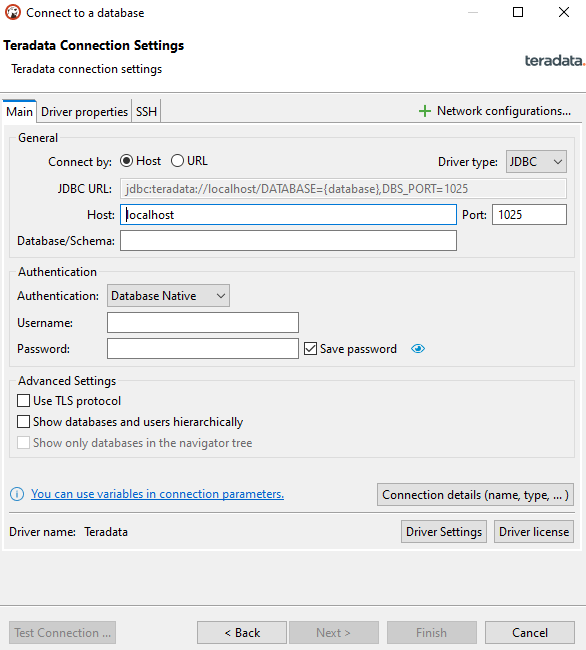
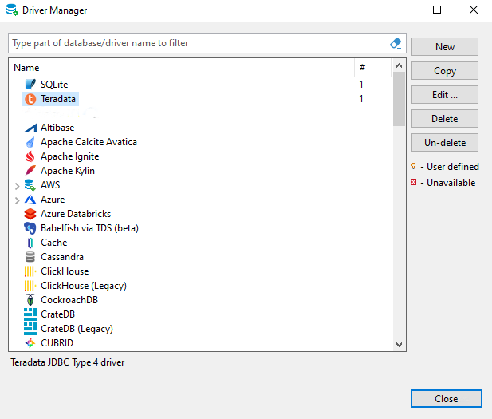

# Configurar una conexión a Teradata Vantage en DBeaver

## Información general

Este tutorial demuestra cómo crear una conexión a Teradata Vantage con DBeaver.

## Prerrequisitos

import ClearscapeDocsNote from '../_partials/vantage_clearscape_analytics.mdx'

* Acceso a una instancia de Teradata Vantage.
  <ClearscapeDocsNote />
* DBeaver instalado. Consulte la [Comunidad de DBeaver](https://dbeaver.io/download) o [DBeaver PRO](https://dbeaver.com/download) para ver las opciones de instalación.

## Agregue una conexión Teradata a DBeaver

1. Inicie el asistente de nueva conexión haciendo clic en el icono del enchufe () en la esquina superior izquierda de la ventana de la aplicación o vaya a `Database -> New Database Connection`.
2. En la pantalla `Select your database`, comience a escribir `teradata` y seleccione el icono de Teradata.

3. En la pestaña principal, debe configurar todas las configuraciones de conexión principal. Las requeridas incluyen `Host`, `Port`, `Database`, `Username`y `Password`.
    :::tip
    En Teradata Vantage, cuando se crea un usuario, también se crea una base de datos correspondiente con el mismo. DBeaver requiere que acceda a la base de datos. Si no sabe a qué base de datos desea conectarse, use su nombre de usuario en el campo `database`.
    :::

    :::tip
    Con DBeaver PRO, no solo puede utilizar el orden estándar de tablas, sino también vincular tablas jerárquicamente a una base de datos o usuario específico. Expandir y contraer las bases de datos o los usuarios le ayudará a navegar de un área a otra sin saturar la ventana del Navegador de bases de datos. Marque la casilla `Show databases and users hierarchically` para habilitar esta configuración.
    :::

    :::tip
    En muchos entornos, solo se puede acceder a Teradata Vantage mediante el protocolo TLS. Cuando esté en DBeaver PRO, marque la opción `Use TLS protocol` para habilitar TLS.
    :::

    

4. Haga clic en `Finish`.

## Opcional: mecanismos de inicio de sesión

El mecanismo de inicio de sesión predeterminado al crear una conexión DBeaver es TD2. Para agregar otros mecanismos de inicio de sesión, siga los pasos que se indican a continuación:

1. Vaya al menú de la base de datos y haga clic en Administrador de controladores.
2. De la lista de nombres de controladores, seleccione Teradata y haga clic en "Copiar".
  

3. En el campo "Plantilla de URL", defina el mecanismo de inicio de sesión seleccionado.
  `jdbc:teradata://\{host}/LOGMECH=LDAP,DATABASE=\{database},DBS_PORT=\{port}` 
  

4. Haga clic en OK.
5. El nuevo controlador ahora está disponible para crear conexiones con el mecanismo de inicio de sesión seleccionado.
  
6. El proceso para configurar una nueva conexión con el mecanismo alternativo es el mismo que el descrito anteriormente para agregar una nueva conexión.
  

## Opcional: túnel SSH

Si no se puede acceder a su base de datos directamente, puede utilizar un túnel SSH. Todas las configuraciones están disponibles en la pestaña `SSH`. DBeaver admite los siguientes métodos de autenticación: usuario/contraseña, clave pública, autenticación de agente SSH.

## Resumen

Este tutorial demuestra cómo crear una conexión a Teradata Vantage con DBeaver.

import CommunityLinkPartial from '../_partials/community_link.mdx';

<CommunityLinkPartial />
