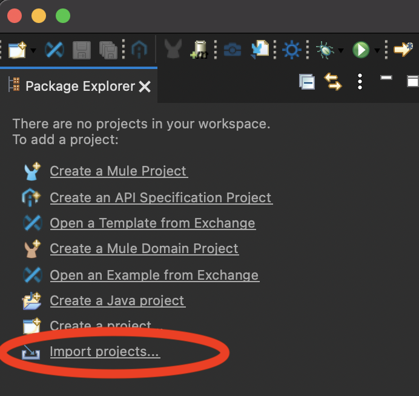
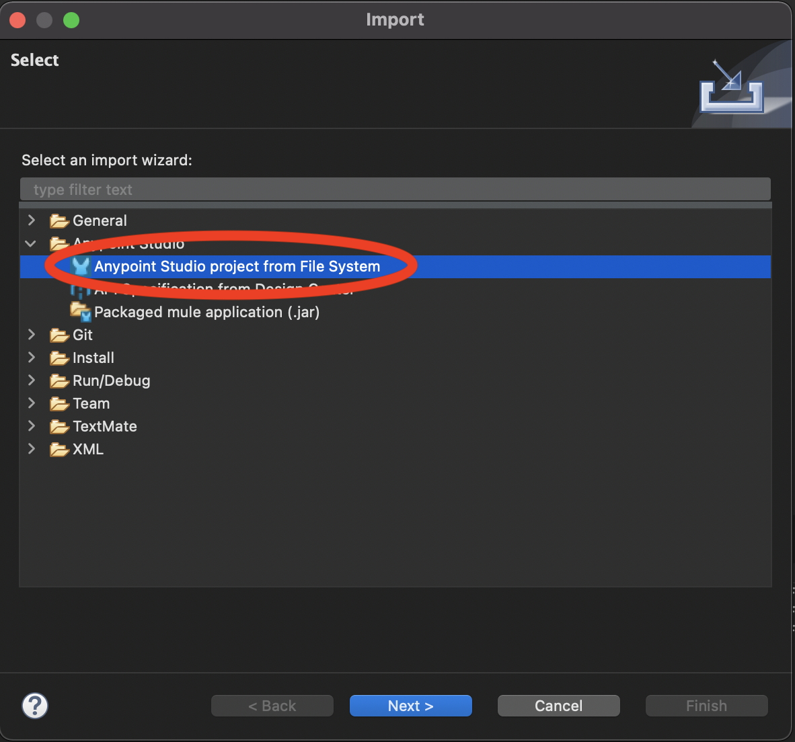

import ClearscapeDocsNote from '../_partials/vantage_clearscape_analytics.mdx'
import CommunityLink from '../_partials/community_link.mdx'

# Consulta Teradata Vantage desde un servicio Mule

## Información general

Este ejemplo es un clon del proyecto de muestra Mulesoft MySQL.
Demuestra cómo consultar una base de datos de Teradata y exponer los resultados a través de la REST API.

## Prerrequisitos

* Mulesoft Anypoint Studio. Puede descargar una prueba de 30 días desde https://www.mulesoft.com/platform/studio.
* Acceso a una instancia de Teradata Vantage.

<ClearscapeDocsNote />

## Servicio de ejemplo

Este ejemplo de servicio Mule toma una solicitud HTTP, consulta la base de datos de Teradata Vantage y devuelve resultados en formato JSON.


El conector HTTP de Mule escucha solicitudes HTTP GET con el formato: `http://<host>:8081/?lastname=<parameter>`.
El conector HTTP pasa el valor de `<parameter>` como una de las propiedades del mensaje a un conector de base de datos.
El conector de la base de datos está configurado para extraer este valor y usarlo en esta consulta SQL:

```sql
SELECT * FROM hr.employees WHERE LastName = :lastName
```

Como puede ver, estamos utilizando una consulta parametrizada con referencia al valor del parámetro pasado al conector HTTP.
Entonces, si el conector HTTP recibe http://localhost:8081/?lastname=Smith, la consulta SQL será:

```sql
SELECT * FROM employees WHERE last_name = Smith
```

El conector de la base de datos indica al servidor de la base de datos que ejecute la consulta SQL, recupera el resultado de la consulta y lo pasa al procesador de mensajes Transform, que convierte el resultado a JSON.
Dado que el conector HTTP está configurado como solicitud-respuesta, el resultado se devuelve al cliente HTTP de origen.

## Configuración

* Clonar el repositorio `Teradata/mule-jdbc-example`:
```bash
  git clone https://github.com/Teradata/mule-jdbc-example
```

* Edite `src/main/mule/querying-a-teradata-database.xml`, busque la cadena de conexión de Teradata `jdbc:teradata://<HOST>/user=<username>,password=<password>` y reemplace los parámetros de conexión de Teradata para que coincidan con su entorno.

:::note
Si se puede acceder a su instancia Vantage a través de ClearScape Analytics Experience, debe reemplazar `<HOST>` con la URL del host de su entorno de ClearScape Analytics Experience. Además, el 'usuario' y la 'contraseña' deben actualizarse para reflejar el nombre de usuario y la contraseña de su entorno de análisis ClearScape.
:::

* Cree una base de datos de muestra en su instancia de Vantage.
Rellénela con datos de muestra.

```sql
 -- create database
 CREATE DATABASE HR
   AS PERMANENT = 60e6, SPOOL = 120e6;

 -- create table
 CREATE SET TABLE HR.Employees (
   GlobalID INTEGER,
   FirstName VARCHAR(30),
   LastName VARCHAR(30),
   DateOfBirth DATE FORMAT 'YYYY-MM-DD',
   JoinedDate DATE FORMAT 'YYYY-MM-DD',
   DepartmentCode BYTEINT
 )
 UNIQUE PRIMARY INDEX ( GlobalID );

 -- insert a record
 INSERT INTO HR.Employees (
   GlobalID,
   FirstName,
   LastName,
   DateOfBirth,
   JoinedDate,
   DepartmentCode
 ) VALUES (
   101,
   'Test',
   'Testowsky',
   '1980-01-05',
   '2004-08-01',
   01
 );
```

* Abra el proyecto en Anypoint Studio.
    * Una vez en Anypoint Studio, haga clic en `Import projects..`:

    

    * Seleccione `Anypoint Studio project from File System`:

    

    * Utilice el directorio donde clonó el repositorio git como `Project Root`. Deje los valores predeterminados en todas las demás configuraciones.

## Ejecutar

* Ejecute la aplicación de ejemplo en Anypoint Studio usando el menú `Run`.
El proyecto ahora se construirá y ejecutará. Tardará un minuto.
* Vaya a su navegador web y envíe la siguiente solicitud: http://localhost:8081/?lastname=Testowsky.

Debería obtener la siguiente respuesta JSON:


```json
[
  {
    "JoinedDate": "2004-08-01T00:00:00",
    "DateOfBirth": "1980-01-05T00:00:00",
    "FirstName": "Test",
    "GlobalID": 101,
    "DepartmentCode": 1,
    "LastName": "Testowsky"
  }
]
```

## Lectura adicional

* Consulte este [documento](http://www.mulesoft.org/documentation/display/current/Database+Connector) para obtener más información sobre cómo configurar un conector de base de datos en su máquina.
* Acceda al [Material de referencia](http://www.mulesoft.org/documentation/display/current/Database+Connector+Reference) simple para Database Connector.
* Obtenga más información sobre [DataSense](http://www.mulesoft.org/documentation/display/current/DataSense).

<CommunityLink />