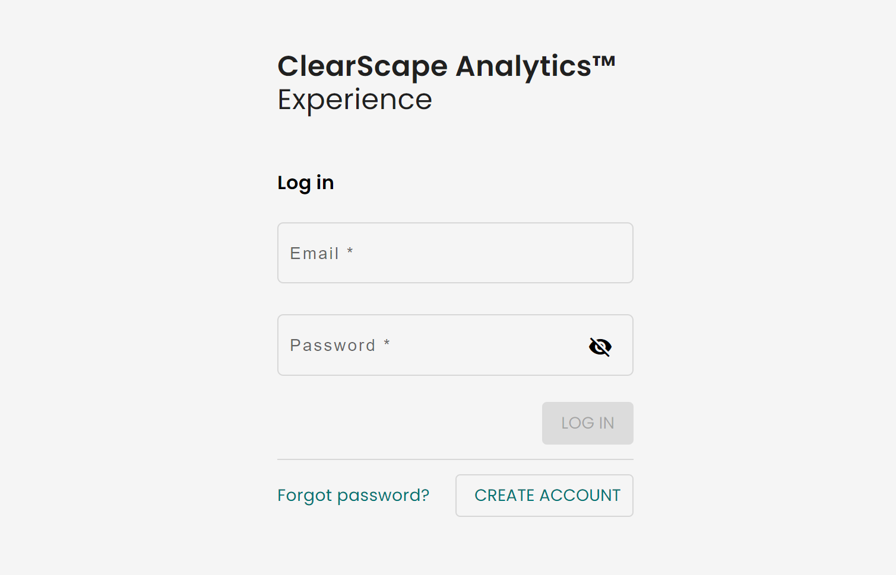
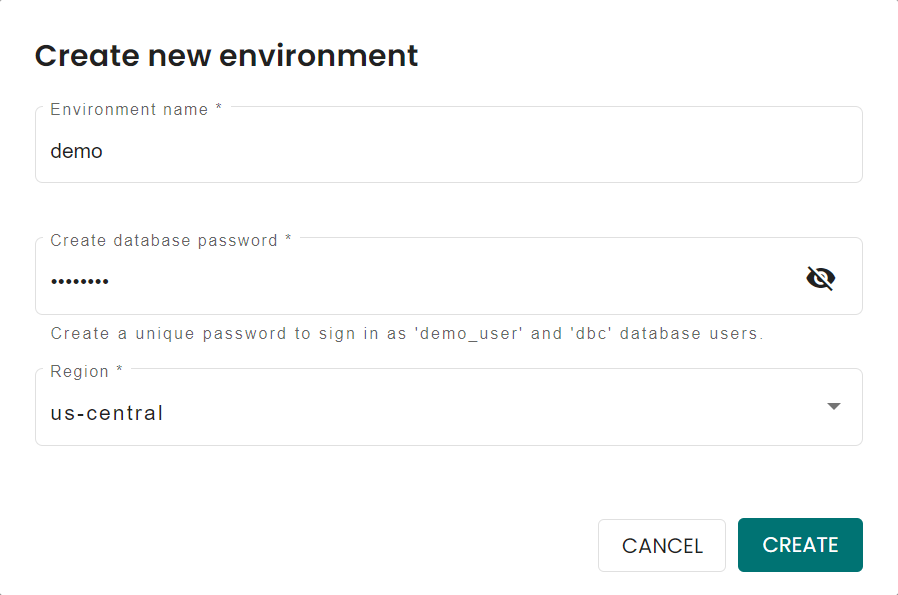

# Introducción a ClearScape Analytics Experience

## Información general

[ClearScape AnalyticsTM](https://www.teradata.com/platform/clearscape-analytics) es un potente motor de analíticas en [Teradata VantageCloud](https://www.teradata.com/platform/vantagecloud). Ofrece rendimiento, valor y crecimiento revolucionarios en toda la empresa con las capacidades de IA/ML más potentes, abiertas y conectadas del mercado. Puede experimentar ClearClearScape AnalyticsTM y Teradata Vantage, en un entorno que no sea de producción, a través de [ClearScape Analytics Experience](https://www.teradata.com/experience).

En este tutorial, seguiremos los pasos para crear un entorno en ClearScape Analytics Experience y accederemos a demostraciones.

  
## Crear una cuenta de ClearScape Analytics Experience

Diríjase a [ClearScape Analytics Experience](https://www.teradata.com/experience) y cree una cuenta gratuita.

Inicie sesión en su [cuenta de ClearScape Analytics](https://clearscape.teradata.com/sign-in) para crear un entorno y acceder a demostraciones.

## Crear un entorno

Una vez que haya iniciado sesión, haga clic en **CREATE ENVIRONMENT**

Deberá proporcionar:

| Variable             | Valor                                                                 |
|----------------------|-----------------------------------------------------------------------|
| **environment name** | Un nombre para su entorno, por ejemplo, "demo".                              |
| **database password**| Una contraseña de su elección, esta contraseña será asignada a los usuarios `dbc` y `demo_user` |
| **Region**           | Seleccione una región del menú desplegable                                     |

:::important
Anote la contraseña de la base de datos. La necesitará para conectarse a la base de datos.
:::

Haga clic en el botón *CREATE* para completar la creación de su entorno y ya podrá ver los detalles de su entorno.

## Acceder a demostraciones

El entorno ClearScape Analytics Experience incluye una variedad de demostraciones que muestran cómo utilizar los análisis para resolver problemas comerciales en muchas industrias. 

Para acceder a demostraciones, haga clic en el botón **RUN DEMOS USING JUPYTER**. Abrirá un entorno de Jupyter en una nueva pestaña de su navegador. 

:::note
Puede encontrar todos los detalles de las demostraciones en la página de índice de demostraciones.
:::

## Resumen

En este inicio rápido, aprendimos cómo crear un entorno en ClearScape Analytics Experience y acceder a demostraciones.

## Lectura adicional

* [Documentación de la API de ClearScape Analytics Experience](https://api.clearscape.teradata.com/api-docs/)
* [Documentación de Teradata](https://docs.teradata.com/)

