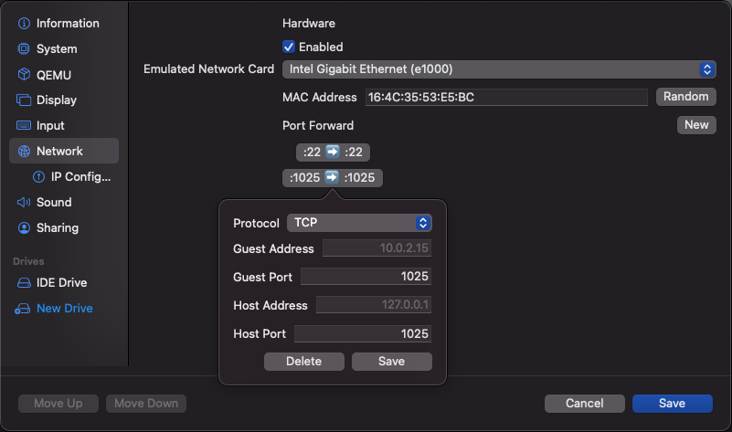
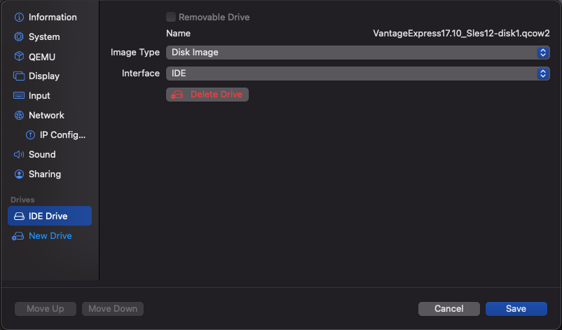
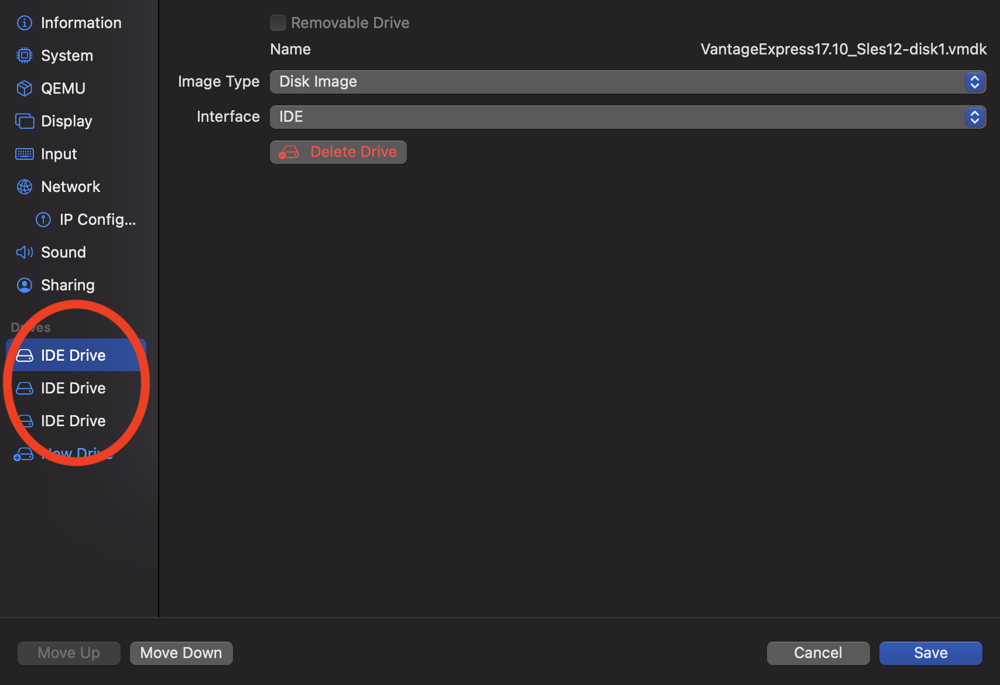

import GettingStartedIntro from '../../_partials/getting-started-intro.mdx';
import RunVantage from '../../_partials/run-vantage.mdx';
import RunSimpleQueries from '../../_partials/running-sample-queries.mdx';
import GettingStartedSummary from '../../_partials/getting-started-summary.mdx';
import CommunityLink from '../../_partials/community_link.mdx';

# Ejecutar Vantage Express en UTM

<GettingStartedIntro />

## Prerrequisitos

1. Un ordenador Mac. Se admiten chips Intel y M1/2.

:::note
Vantage Express se ejecuta en arquitectura x86. Cuando se ejecuta la máquina virtual en chips M1/2, UTM tiene que emular x86. Esto es significativamente más lento que la virtualización. Si determina que Vantage Express en M1/M2 es demasiado lento para sus necesidades, considere ejecutar Vantage Express en la nube: [AWS](../on-your-cloud-infrastructure/run-vantage-express-on-aws.md), [Azure](../on-your-cloud-infrastructure/run-vantage-express-on-microsoft-azure.md), [Google Cloud](../on-your-cloud-infrastructure/vantage-express-gcp.md).
:::

2. 30 GB de espacio en disco y suficiente CPU y RAM para poder dedicar al menos un núcleo y 4 GB de RAM a la máquina virtual.
3. Derechos de administrador para poder instalar y ejecutar el software.

:::note
¿No tiene derechos de administrador en su máquina local? Eche un vistazo a cómo ejecutar Vantage Express en [AWS](../on-your-cloud-infrastructure/run-vantage-express-on-aws.md), [Azure](../on-your-cloud-infrastructure/run-vantage-express-on-microsoft-azure.md), [Google Cloud](../on-your-cloud-infrastructure/vantage-express-gcp.md).
:::

## Instalación

### Descargar el software requerido

1. La última versión de [Vantage Express](https://downloads.teradata.com/download/database/teradata-express-for-vmware-player). Si no ha utilizado el sitio web de descargas de Teradata anteriormente, deberá registrarse.
2. La última versión de [UTM](https://mac.getutm.app).

### Ejecutar el instalador de UTM

1. Instale UTM ejecutando el instalador y aceptando los valores predeterminados.

### Ejecutar Vantage Express

1. Vaya al directorio donde descargó Vantage Express y descomprima el archivo descargado.
2. Inicie UTM, haga clic en el signo `+` y seleccione `Virtualize` (para Mac Intel) o `Emulate` (para Mac M1).
3. En la pantalla `Operating System` seleccione `Other`.
4. En la pantalla `Other` seleccione `Skip ISO Boot`.
5. En la pantalla `Hardware` asigne al menos 4 GB de memoria y al menos 1 núcleo de CPU. Recomendamos 10 GB de RAM y 2 CPU.

    

6. En la pantalla `Storage` acepte los valores predeterminados haciendo clic en `Next`.
7. En la pantalla `Shared Direct`, haga clic en `Next`.
8. En la pantalla `Summary` marque `Open VM Settings` y haga clic en `Save`.
9. Vaya al asistente de configuración. Solo necesita ajustar las siguientes pestañas:
    - **QEMU** - deshabilite la opción `UEFI Boot`
    - **Red** - exponga los puertos ssh (22) y Vantage (1025) en el ordenador host:

    

10. Unidades de asignación:
    * Elimine el valor predeterminado de `IDE Drive`.
    * Map the 3 Vantage Express drives by importing the disk files from the downloaded VM zip file. Make sure you map them in the right order, `-disk1`, `-disk2`, `-disk3` \. The first disk is bootable and contains the database itself. Disks 2 and 3 are so called `pdisks` and contain data. As you import the files UTM will automatically convert them fro `vmdk` into `qcow2` format. Make sure that each disk is configured using the `IDE` interface:

    

    * Una vez que haya terminado de asignar las 3 unidades, su configuración debería verse así:

    

11. Guarde la configuración e inicie la máquina virtual.

<RunVantage />

<RunSimpleQueries />

<GettingStartedSummary />

## Siguientes pasos
* [Consultar datos almacenados en el almacenamiento de objetos](../../manage-data/nos.md)

## Lectura adicional
* [Guía de instalación de Teradata® Studio™ y Studio™ Express](https://docs.teradata.com/r/Teradata-StudioTM-and-StudioTM-Express-Installation-Guide-17.20)

<CommunityLink />
