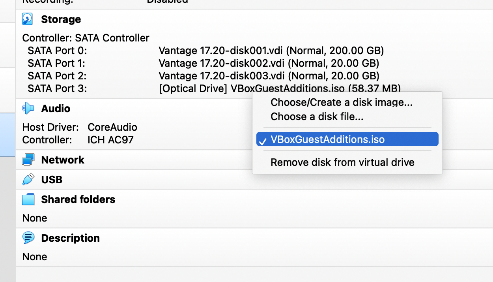

import GettingStartedIntro from '../../_partials/getting-started-intro.mdx';
import RunVantage from '../../_partials/run-vantage.mdx';
import RunSimpleQueries from '../../_partials/running-sample-queries.mdx';
import GettingStartedSummary from '../../_partials/getting-started-summary.mdx';
import CommunityLink from '../../_partials/community_link.mdx';

# Ejecutar Vantage Express en VirtualBox

<GettingStartedIntro />

## Prerrequisitos

1. Un ordenador que utilice uno de los siguientes sistemas operativos: Windows 10, Linux o MacOS basado en Intel.

    :::note
    Para sistemas MacOS M1/M2, consulte [Ejecutar Vantage Express en UTM](getting-started-utm.md).
    :::

2. 30 GB de espacio en disco y suficiente CPU y RAM para poder dedicar al menos un núcleo y 6 GB de RAM a la máquina virtual.
3. Derechos de administrador para poder instalar y ejecutar el software.


## Instalación

### Descargar el software requerido

1. La última versión de [Vantage Express VirtualBox Open Virtual Appliance (OVA)](https://downloads.teradata.com/download/database/teradata-express-for-vmware-player).

    :::note
    Si no ha utilizado el sitio web de Descargas de Teradata antes, primero deberá registrarse.
    :::

2. [VirtualBox](https://www.virtualbox.org/wiki/Downloads), versión 6.1.

    :::note
    También puede instalar VirtualBox usando `brew` y otros administradores de paquetes.
    :::

### Ejecutar instaladores

1. Instale VirtualBox ejecutando el instalador y aceptando los valores predeterminados.

    :::note
    VirtualBox incluye funciones que requieren privilegios elevados. Cuando inicie VirtualBox por primera vez, se le pedirá que confirme este acceso elevado. Es posible que también deba reiniciar su máquina para activar el complemento del kernel de VirtualBox.
    :::

### Ejecutar Vantage Express

- Inicie VirtualBox.
- Vaya al menú `File -> Import Appliance...`.
- En el campo `File`, seleccione el archivo OVA descargado.
- En la siguiente pantalla, acepte los valores predeterminados y haga clic en `Import`.
- De vuelta en el panel principal de VirtualBox, inicie el dispositivo Vantage Express haciendo doble clic en la máquina virtual `Vantage 17.20`.

    

<RunVantage />

<RunSimpleQueries />

## Actualización de las extensiones de invitado de VirtualBox

VirtualBox Guest Extensions es un software que se ejecuta en una máquina virtual. Hace que la máquina virtual se ejecute más rápido en VirtualBox. También mejora la resolución de la pantalla de la máquina virtual y su capacidad de respuesta al cambio de tamaño. Implementa un portapapeles bidireccional y arrastra y suelta entre el anfitrión y el invitado. VirtualBox Guest Extensions en la máquina virtual debe coincidir con la versión de su instalación de VirtualBox. Es probable que tenga que actualizar VirtualBox Guest Extensions para obtener un rendimiento óptimo.

Para actualizar VirtualBox Guest Extensions:

1. Inserte el DVD de VirtualBox Guest Extensions haciendo clic en `SATA Port 3: [Optical Drive]` en la sección `Storage`:



2. De vuelta en la ventana Máquina virtual, inicie la aplicación `Gnome Terminal`.
3. Ejecute el siguiente comando en la terminal:

```bash
mount /dev/cdrom /media/dvd; /media/dvd/VBoxLinuxAdditions.run
```

<GettingStartedSummary />

## Siguientes pasos
* [Consultar datos almacenados en el almacenamiento de objetos](../../manage-data/nos.md)

## Lectura adicional
* [Guía de instalación de Teradata® Studio™ y Studio™ Express](https://docs.teradata.com/r/Teradata-StudioTM-and-StudioTM-Express-Installation-Guide-17.20)

<CommunityLink />