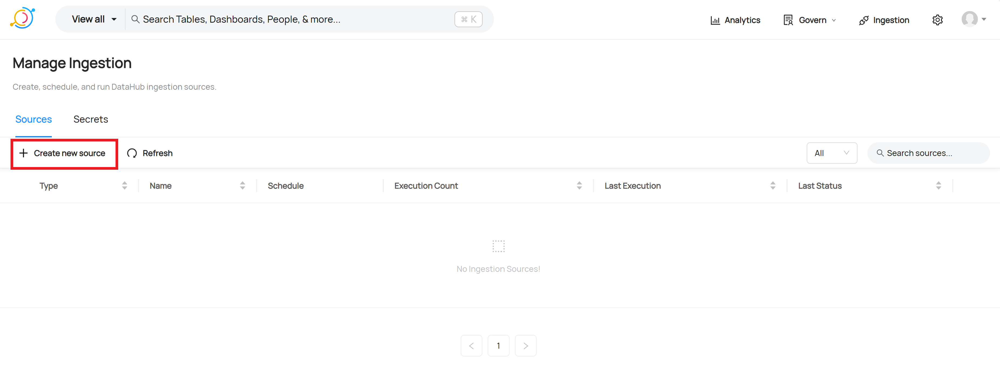
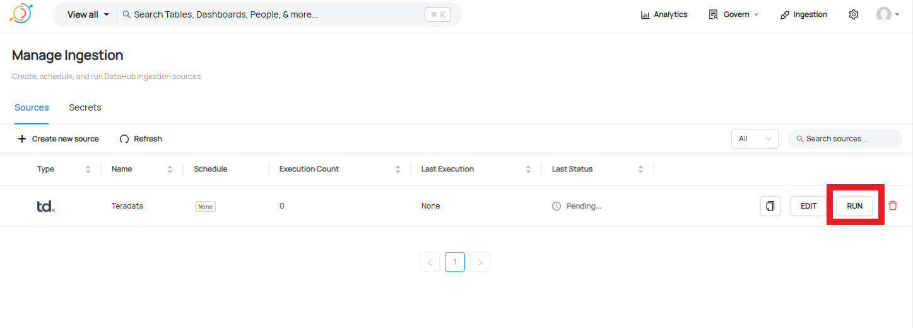
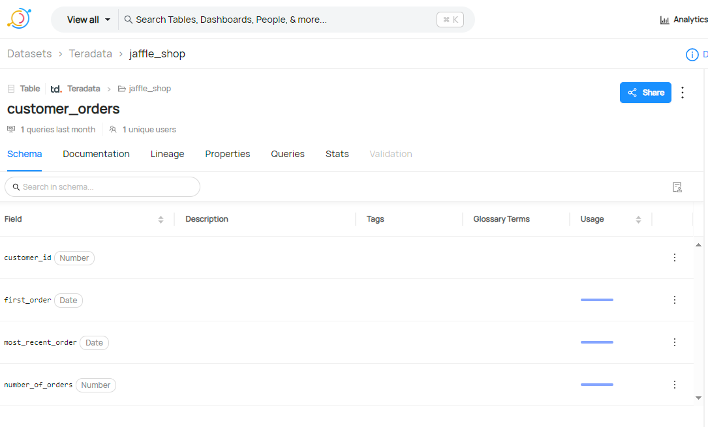

# Configurar una conexión a Teradata Vantage en DataHub

## Información general

Este tutorial demuestra cómo crear una conexión a Teradata Vantage con DataHub e ingerir metadatos sobre tablas y vistas, junto con información de uso y linaje.

## Prerrequisitos

import ClearscapeDocsNote from '../_partials/vantage_clearscape_analytics.mdx'

* Acceso a una instancia de Teradata Vantage.
  <ClearscapeDocsNote />
* DataHub instalado. Consulte [Guía de inicio rápido de DataHub](https://datahubproject.io/docs/quickstart)

## Configurar centro de datos

* Instale el complemento Teradata para DataHub en el entorno donde tiene instalado DataHub

``` bash
pip install 'acryl-datahub[teradata]'
```

* Configure un usuario de Teradata y establezca privilegios para permitir que ese usuario lea las tablas del diccionario

``` sql
CREATE USER datahub FROM <database> AS PASSWORD = <password> PERM = 20000000;

GRANT SELECT ON dbc.columns TO datahub;
GRANT SELECT ON dbc.databases TO datahub;
GRANT SELECT ON dbc.tables TO datahub;
GRANT SELECT ON DBC.All_RI_ChildrenV TO datahub;
GRANT SELECT ON DBC.ColumnsV TO datahub;
GRANT SELECT ON DBC.IndicesV TO datahub;
GRANT SELECT ON dbc.TableTextV TO datahub;
GRANT SELECT ON dbc.TablesV TO datahub;
GRANT SELECT ON dbc.dbqlogtbl TO datahub; -- if lineage or usage extraction is enabled
```
* Si desea ejecutar la creación de perfiles, debe otorgar permiso de selección en todas las tablas de las que desea crear perfiles.

* Si desea extraer metadatos de linaje o uso, el registro de consultas debe estar habilitado y configurado en un tamaño que se ajuste a sus consultas (el tamaño de texto de consulta predeterminado que captura Teradata es de 200 caracteres como máximo). Un ejemplo de cómo puede configurarlo para todos los usuarios:

``` sql
-- set up query logging on all

REPLACE QUERY LOGGING LIMIT SQLTEXT=2000 ON ALL;
```

## Agregar una conexión Teradata a DataHub
Con DataHub en ejecución, abra la GUI de DataHub e inicie sesión.  En este ejemplo, se ejecuta en localhost:9002 

* Inicie el asistente de nueva conexión haciendo clic en el icono del conector de ingesta 


  y luego seleccionando "Crear nueva fuente" 
  


* Desplácese por la lista de fuentes disponibles y seleccione Otro 


* Se necesita una receta para configurar la conexión a Teradata y definir las opciones requeridas, como por ejemplo si se debe capturar el linaje de tablas y columnas, perfilar los datos o recuperar estadísticas de uso.  A continuación se muestra una receta sencilla para empezar. El host, el nombre de usuario y la contraseña deben modificarse para que coincidan con su entorno.

``` yaml
pipeline_name: my-teradata-ingestion-pipeline
source:
  type: teradata
  config:
    host_port: "myteradatainstance.teradata.com:1025"
    username: myuser
    password: mypassword
    #database_pattern:
    #  allow:
    #    - "my_database"
    #  ignoreCase: true
    include_table_lineage: true
    include_usage_statistics: true
    stateful_ingestion:
      enabled: true
```

Pegar la receta en la ventana debería verse así: 


* Haga clic en Siguiente y luego configure el programa requerido. 


* Haga clic en Siguiente para finalizar y asigne un nombre a la conexión. Haga clic en Avanzado para poder configurar la versión de CLI correcta. La compatibilidad de DataHub con Teradata empezó a estar disponible en CLI 0.12.x.  Se recomienda seleccionar la versión más actual para garantizar la mejor compatibilidad.


* Una vez guardada la nueva fuente, se puede ejecutar manualmente haciendo clic en Ejecutar. 


Al hacer clic en "Exitoso" después de una ejecución exitosa, aparecerá un cuadro de diálogo similar a este donde podrá ver las bases de datos, tablas y vistas que se han incorporado a DataHub.  


* Los metadatos ahora se pueden explorar en la GUI navegando:
  * DataSets proporciona una lista de los conjuntos de datos (tablas y vistas) cargados

  * Entidades capturadas de la base de datos

  * Esquema de una entidad que muestra nombres de columnas/campos, tipos de datos y uso si se ha capturado

  * Linaje que proporciona una representación visual de cómo se vinculan los datos entre tablas y vistas


## Resumen

Este tutorial demostró cómo crear una conexión a Teradata Vantage con DataHub para capturar metadatos de tablas, vistas junto con estadísticas de linaje y uso.

## Lectura adicional
* [Integrar DataHub con Teradata Vantage](https://datahubproject.io/docs/generated/ingestion/sources/teradata)
* [Opciones de integración de DataHub para recetas](https://datahubproject.io/docs/metadata-ingestion/#recipes)

import CommunityLinkPartial from '../_partials/community_link.mdx';

<CommunityLinkPartial />
