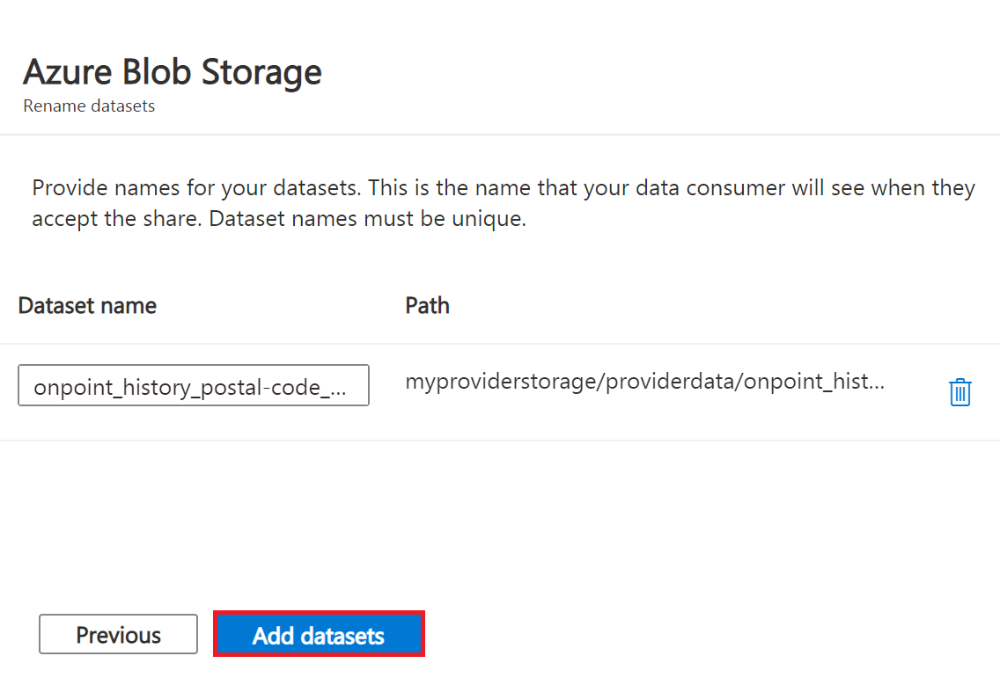
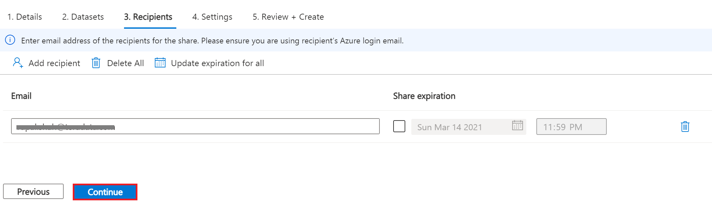
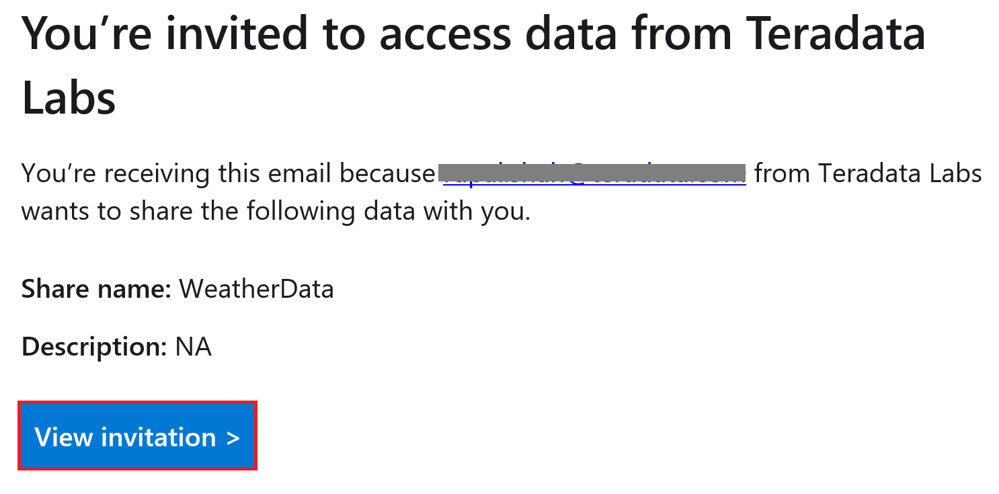
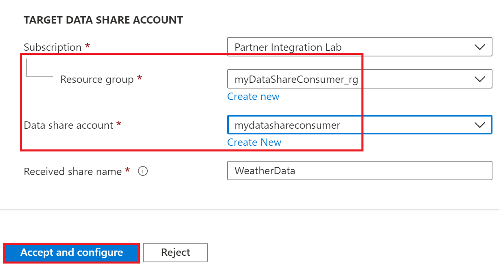
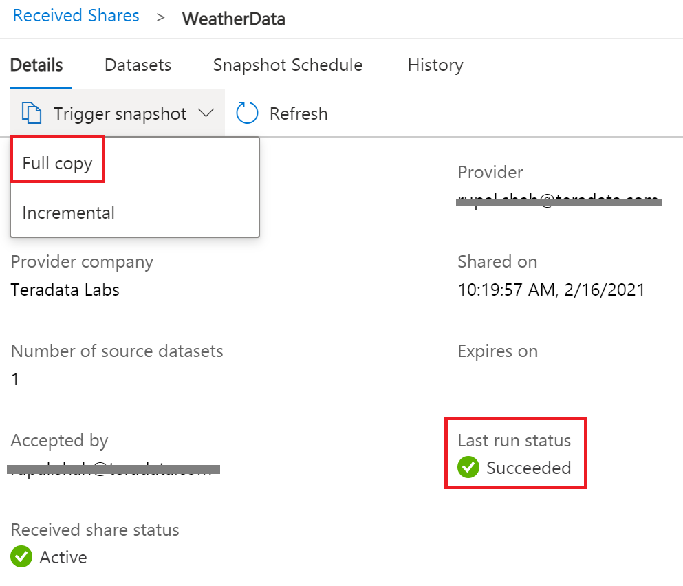
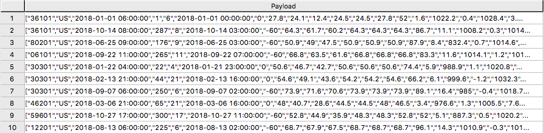
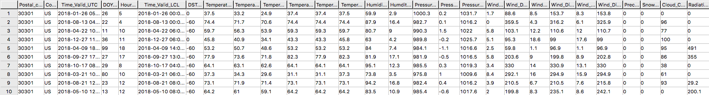
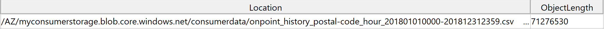

# Conectar Azure Data Share a Teradata Vantage

### Información general

Este artículo describe el proceso para compartir un conjunto de datos de Azure Blob Storage de un usuario a otro mediante el servicio Azure Data Share y luego consultarlo con Teradata Vantage aprovechando la capacidad Native Object Store (NOS). Crearemos y utilizaremos una cuenta de almacenamiento y una cuenta de intercambio de datos para ambos usuarios.

Este es un diagrama del flujo de trabajo.


### Acerca de Azure Data Share

[Azure Data Share](https://docs.microsoft.com/en-us/azure/data-share/overview) permite a las organizaciones compartir datos de forma sencilla y segura con varios clientes y socios. Tanto el proveedor como el consumidor de datos deben tener una suscripción de Azure para compartir y recibir datos. Actualmente, Azure Data Share ofrece uso compartido basado en instantáneas y uso compartido in situ. En la actualidad, entre los [almacenes de datos compatibles](https://docs.microsoft.com/en-us/azure/data-share/supported-data-stores) de Azure Data Share se incluyen Azure Blob Storage, Azure Data Lake Storage Gen1 y Gen2, Azure SQL Database, Azure Synapse Analytics y Azure Data Explorer. Una vez que se ha enviado un recurso compartido de conjunto de datos mediante Azure Data Share, el consumidor de datos puede recibir esos datos en un almacén de datos de su elección, como Azure Blob Storage, y posteriormente usar Teradata Vantage para explorar y analizar los datos.

Para más información, consulte la [documentación](https://docs.microsoft.com/en-us/azure/data-share).

### Acerca de Teradata Vantage

Vantage es la plataforma en la nube moderna que unifica almacenes de datos, lagos de datos y análisis en un único ecosistema conectado.

Vantage combina análisis descriptivos, predictivos y prescriptivos, toma de decisiones autónoma, funciones de aprendizaje automático y herramientas de visualización en una plataforma unificada e integrada que descubre inteligencia empresarial en tiempo real a escala, sin importar dónde residan los datos.

Vantage permite a las empresas iniciar computación o almacenamiento a pequeña escala y de manera elástica, pagando solo por lo que usan, aprovechando almacenes de objetos de bajo coste e integrando sus cargas de trabajo analíticas.

Vantage es compatible con R, Python, Teradata Studio y cualquier otra herramienta basada en SQL. Puede implementar Vantage en nubes públicas, en las instalaciones, en una infraestructura optimizada o básica, o como servicio.

Teradata Vantage Native Object Store (NOS) se puede utilizar para explorar datos en almacenes de objetos externos, como Azure Blob Storage, mediante SQL estándar. No se requiere ninguna infraestructura informática especial del lado del almacenamiento de objetos para utilizar NOS. Puede explorar los datos ubicados en un contenedor de Blob Storage simplemente creando una definición de tabla NOS que apunte a su contenedor. Con NOS, puede importar rápidamente datos desde Blob Storage o incluso unirlos a otras tablas de la base de datos.

Alternativamente, la utilidad Teradata Parallel Transporter (TPT) se puede utilizar para importar datos de Blob Storage a Teradata Vantage de forma masiva. Una vez cargados, los datos se pueden consultar de manera eficiente dentro de Vantage.

Para más información, consulte la [*documentación*](https://docs.teradata.com/home).

### Prerrequisitos

import ClearscapeDocsNote from '../_partials/vantage_clearscape_analytics.mdx'

* Acceso a una instancia de Teradata Vantage.
  <ClearscapeDocsNote />
* Una cuenta de Azure. Puede comenzar con una [cuenta gratuita](https://azure.microsoft.com/free).
* Una cuenta de [Azure Blob Storage](https://docs.microsoft.com/en-us/azure/storage/common/storage-quickstart-create-account?tabs=azure-portal) para almacenar el conjunto de datos

### Procedimiento

Una vez que haya cumplido los requisitos previos, siga estos pasos:

1. Crear una cuenta y un contenedor de Azure Blob Storage
2. Crear una cuenta de Data Share
3. Crear una acción
4. Acepte y reciba datos mediante Data Share
5. Configure el acceso NOS a Blob Storage
6. Consulte el conjunto de datos en Blob Storage
7. Cargue los datos de Blob Storage en Vantage (opcional)

### Crear una cuenta y un contenedor de Azure Blob Storage

* Abra [Azure Portal](https://portal.azure.com/) en un navegador (Chrome, Firefox y Safari funcionan bien) y siga los pasos para [crear una cuenta de almacenamiento](https://docs.microsoft.com/en-us/azure/storage/common/storage-account-create?tabs=azure-portal#create-a-storage-account-1) en un grupo de recursos llamado _myProviderStorage_rg_ en este artículo.

* Introduzca un nombre de almacenamiento y un método de conectividad. Utilizaremos _myproviderstorage_ y _endpoint público_ en este artículo.

:::note
Le sugerimos que utilice la misma ubicación para todos los servicios que cree.
:::

* Seleccione **Revisar + crear,** y posteriormente **Crear**.

* *Vaya al recurso* y haga clic en **Contenedores** para crear un contenedor.

* Haga clic en el botón **+ Contenedor**.

* Introduzca un nombre de contenedor. Usaremos _providerdata_ en este artículo.


* Haga clic en **Crear**.

### Crear una cuenta de Data Share

Crearemos una cuenta de Data Share para el proveedor que comparte el conjunto de datos.

Siga los pasos de [Crear una cuenta de Azure Data Share](https://docs.microsoft.com/en-us/azure/data-share/share-your-data?tabs=azure-portal#create-a-data-share-account) para crear un recurso en un grupo de recursos llamado _myDataShareProvider_rg_ en este artículo.

* En la pestaña **Conceptos básicos**, introduzca un nombre de cuenta de Data Share. Usaremos _mydatashareprovider_ en este artículo.

:::note
Le sugerimos que utilice la misma ubicación para todos los servicios que cree.
:::

* Seleccione **Revisar + crear,** y posteriormente **Crear**.

* Cuando se complete la implementación, seleccione *Vaya al recurso*.

### Crear un recuso compartido

* Navegue a la página Descripción general de Data Share y siga los pasos detallados en [Crear una acción](https://docs.microsoft.com/en-us/azure/data-share/share-your-data?tabs=azure-portal#create-a-share).

* Seleccione **Empezar a compartir sus datos**.

* Seleccionar + **Crear**.

* En la pestaña **Detalles**, introduzca un nombre compartido y un tipo de recurso compartido. Usaremos _WeatherData_ y _Instantánea_ en este artículo.


:::note Compartir instantánea
Elija compartir instantáneas para proporcionar una copia de los datos al destinatario.

Almacén de datos compatible: Azure Blob Storage, Azure Data Lake Storage Gen1, Azure Data Lake Storage Gen2, Azure SQL Database, Azure Synapse Analytics (anteriormente SQL DW)
:::

:::note Compartir en el lugar

Elija el uso compartido in situ para proporcionar acceso a los datos en su origen.

Almacén de datos compatible: Azure Data Explorer
:::

* Haga clic en **Continuar**.

* En la pestaña *Conjuntos de datos*, haga clic en *Agregar conjuntos de datos*

* Seleccione *Azure Blob Storage*


* Haga clic en *Siguiente*.

* Introduzca la cuenta de almacenamiento que proporciona el conjunto de datos. Usaremos _myproviderstorage_ en este artículo.


* Haga clic en \*\*Siguiente\*\*.

* Haga doble clic en el contenedor para elegir el conjunto de datos. Usaremos los archivos _providerdata_ y _onpoint_history_postal-code_hour.csv_ en este artículo.


Figura 6 Seleccione el contenedor de almacenamiento y el conjunto de datos

:::note
Azure Data Share puede compartir a nivel de carpeta y archivo. Utilice el recurso de Azure Blob Storage para cargar un archivo.
:::

* Haga clic en **Siguiente**.

* Introduzca un nombre de conjunto de datos que el consumidor verá para la carpeta y el conjunto de datos. Usaremos los nombres predeterminados, pero eliminaremos la carpeta de datos del proveedor en este artículo. Haga clic en *Agregar conjuntos de datos*.


* Haga clic en **Agregar conjuntos de datos**.


* Haga clic en **Continuar**.

* En la pestaña *Destinatarios*, haga clic en la dirección de correo electrónico *Agregar destinatario* para enviar una notificación para compartir.

* Introduzca la dirección de correo electrónico del consumidor.


:::tip
Establecer el vencimiento del recurso compartido para la cantidad de tiempo compartido es válido para que el consumidor lo acepte.
:::

* Haga clic en **Continuar**.

* En la pestaña *Configuración*, configure la programación de instantáneas. Usamos el valor predeterminado _no marcado_ en este artículo.


* Haga clic en *Continuar*.

* En la pestaña *Revisar + Crear*, haga clic en *Crear*.


* Su Azure Data Share ya se ha creado y el destinatario de su recurso compartido de datos ya está listo para aceptar su invitación.


### Aceptar y recibir datos mediante Azure Data Share

En este artículo, el destinatario/consumidor recibirá los datos en su cuenta de Azure Blob Storage.

De manera similar al _Proveedor,_ de Data Share, asegúrese de que todos los requisitos previos estén completos para _Consumidor_ antes de aceptar una invitación para compartir datos.

* Suscripción de Azure: si no tiene una, cree una [+++cuenta gratuita+++](https://azure.microsoft.com/free/) antes de empezar.
* Cuenta y contenedor de Azure Blob Storage: cree un grupo de recursos llamado _myConsumerStorage_rg_ y cree el nombre de la cuenta _myconsumerstorage_ y el contenedor _consumerdata_.
* Cuenta de Azure Data Share: cree un grupo de recursos llamado _myDataShareConsumer_rg_ y cree un nombre de cuenta de recurso compartido llamado _mydatashareconsumer_ para aceptar los datos.

Siga los pasos en [Aceptar y recibir datos mediante Azure Data Share](https://docs.microsoft.com/en-us/azure/data-share/subscribe-to-data-share?tabs=azure-portal).

#### Invitación abierta

* En su correo electrónico, una invitación de Microsoft Azure con un asunto titulado "Invitación a Azure Data Share de *[+++yourdataprovider@domain.com+++](mailto:yourdataprovider@domain.com).*. Haga clic en *Ver invitación* para ver su invitación en Azure.


* Esta acción abre su navegador a la lista de invitaciones para compartir datos.


* Seleccione el recurso compartido que quiere ver. Seleccionaremos _WeatherData_ en este artículo.

#### Aceptar la invitacion

* En _Cuenta de Data Share de destino_, seleccione la suscripción y el grupo de recursos en el que quiere implementar la instancia de Data Share o puede crear una nueva instancia de Data Share aquí.

:::note
Si el proveedor requiere la aceptación de los Términos de uso, aparecerá un cuadro de diálogo y se le pedirá que marque la casilla para indicar que acepta los términos de uso.
:::

* Escriba el grupo de recursos y la cuenta de Data Share. Usaremos las cuentas _myDataShareConsumer_rg_ y _mydatashareconsumer_ en este artículo.


* Seleccione *Aceptar y configurar* y se creará una suscripción compartida.

#### Configurar el recurso compartido recibido

* Seleccione la pestaña **Conjuntos de datos**. Marque la casilla junto al conjunto de datos al que quiere asignar un destino. Seleccione + *Asignar a destino* para elegir un almacén de datos de destino.


* Seleccione un tipo de almacén de datos de destino y la ruta a la que quiere que lleguen los datos. Usaremos la cuenta de Azure Blob Storage de los consumidores _myconsumerstorage_ y el contenedor _consumerdata_ para nuestro ejemplo de instantánea en este artículo.

:::note
Azure Data Share proporciona un intercambio de datos abierto y flexible, incluida la capacidad de compartir desde y hacia diferentes almacenes de datos. Verifique las fuentes de datos [compatibles](https://docs.microsoft.com/en-us/azure/data-share/supported-data-stores#supported-data-stores) que pueden aceptar instantáneas y compartir en el lugar.
:::


* Haga clic en **Asignar a destino**.

* Una vez que se complete la asignación, para compartir instantáneas, haga clic en la pestaña *Detalles* y haga clic en *Activar instantánea* para _Completa_ o _Incremental_. Seleccionaremos la copia completa, ya que es la primera vez que recibe datos de su proveedor.


* Cuando el estado de la última ejecución sea _exitoso_, vaya al almacén de datos de destino para ver los datos recibidos. Seleccione *Conjuntos de datos* y haga clic en el enlace en la ruta de destino.


### Configure el acceso NOS a Azure Blob Storage

Native Object Store (NOS) puede leer datos directamente en Azure Blob Storage, lo que le permite explorar y analizar datos en Blob Storage sin cargarlos explícitamente.

#### Crear una definición de tabla externa

Una definición de tabla externa permite hacer referencia fácilmente a los datos de Blob Storage dentro del motor SQL avanzado y hace que los datos estén disponibles en un formato relacional estructurado.

:::note
NOS admite datos en formatos CSV, JSON y Parquet.
:::

* Inicie sesión en su sistema Vantage con Teradata Studio.

* Cree un objeto AUTHORIZATION para acceder a su contenedor de Blob Storage con el siguiente comando SQL.

``` sql
CREATE AUTHORIZATION DefAuth_AZ
AS DEFINER TRUSTED
USER 'myconsumerstorage' /* Storage Account Name */
PASSWORD '*****************' /* Storage Account Access Key or SAS Token */
```

** Reemplace la cadena _USER_ con el nombre de su cuenta de almacenamiento.
** Reemplace la cadena _PASSWORD_ con su clave de acceso a la cuenta de almacenamiento o token SAS

* Cree una definición de tabla externa para el archivo CSV en Blob Storage con el siguiente comando SQL.

``` sql
CREATE MULTISET FOREIGN TABLE WeatherData,
EXTERNAL SECURITY DEFINER TRUSTED DefAuth_AZ (
  Location VARCHAR(2048) CHARACTER SET UNICODE CASESPECIFIC,
  Payload DATASET INLINE LENGTH 64000 STORAGE FORMAT CSV
)
USING (
  LOCATION ('/AZ/myconsumerstorage.blob.core.windows.net/consumerdata/')
)
```

:::note
Como mínimo, la definición de la tabla externa debe incluir un nombre de tabla (WeatherData) y una cláusula de ubicación, que apunte a los datos del almacén de objetos.
:::

_LOCATION_ requiere un nombre de cuenta de almacenamiento y un nombre de contenedor. Deberá reemplazar esto con su propia cuenta de almacenamiento y nombre de contenedor.

Si el objeto no tiene una extensión estándar (por ejemplo, “.json”, “.csv”, “.parquet”), también se necesita la frase de definición de la columna _Location…Payload_ y la fase LOCATION debe incluir el nombre del archivo. Por ejemplo: LOCATION (`AZ/<storage account name>.blob.core.windows.net/<container>/<filename>`).

Las tablas externas siempre se definen como tablas sin índice primario (No Primary Index, NoPI).

### Consulte el conjunto de datos en Azure Blob Storage

Ejecute el siguiente comando SQL para consultar el conjunto de datos.

``` sql
SELECT * FROM WeatherData SAMPLE 10;
```

La tabla externa solo contiene dos columnas: Location y Payload. Location es la dirección en el sistema de almacenamiento de objetos. Los datos en sí se representan en la columna Payload, y el valor de la carga útil dentro de cada registro en la tabla externa representa una única fila CSV.


Ejecute el siguiente comando SQL para centrarse en los datos del objeto.

``` sql
SELECT payload..* FROM WeatherData SAMPLE 10;
```



#### Crear una vista

Las vistas pueden simplificar los nombres asociados con los atributos de carga útil, pueden facilitar la codificación de SQL con los datos del objeto y pueden ocultar las referencias de ubicación en la tabla externa.


:::note
Las tablas externas de Vantage utilizan el operador `..` (doble punto) para separar el nombre del objeto del nombre de la columna.
:::

* Ejecute el siguiente comando SQL para crear una vista.

``` sql
REPLACE VIEW WeatherData_view AS (
  SELECT
    CAST(payload..postal_code AS VARCHAR(10)) Postal_code,
    CAST(payload..country AS CHAR(2)) Country,
    CAST(payload..time_valid_utc AS TIMESTAMP(0) FORMAT 'YYYY-MM-DDBHH:MI:SS') Time_Valid_UTC,
    CAST(payload..doy_utc AS INTEGER) DOY_UTC,
    CAST(payload..hour_utc AS INTEGER) Hour_UTC,
    CAST(payload..time_valid_lcl AS TIMESTAMP(0) FORMAT 'YYYY-MM-DDBHH:MI:SS') Time_Valid_LCL,
    CAST(payload..dst_offset_minutes AS INTEGER) DST_Offset_Minutes,
    CAST(payload..temperature_air_2m_f AS DECIMAL(4,1)) Temperature_Air_2M_F,
    CAST(payload..temperature_wetbulb_2m_f AS DECIMAL(3,1)) Temperature_Wetbulb_2M_F,
    CAST(payload..temperature_dewpoint_2m_f AS DECIMAL(3,1)) Temperature_Dewpoint_2M_F,
    CAST(payload..temperature_feelslike_2m_f AS DECIMAL(4,1)) Temperature_Feelslike_2M_F,
    CAST(payload..temperature_windchill_2m_f AS DECIMAL(4,1)) Temperature_Windchill_2M_F,
    CAST(payload..temperature_heatindex_2m_f AS DECIMAL(4,1)) Temperature_Heatindex_2M_F,
    CAST(payload..humidity_relative_2m_pct AS DECIMAL(3,1)) Humidity_Relative_2M_Pct,
    CAST(payload..humidity_specific_2m_gpkg AS DECIMAL(3,1)) Humdity_Specific_2M_GPKG,
    CAST(payload..pressure_2m_mb AS DECIMAL(5,1)) Pressure_2M_Mb,
    CAST(payload..pressure_tendency_2m_mb AS DECIMAL(2,1)) Pressure_Tendency_2M_Mb,
    CAST(payload..pressure_mean_sea_level_mb AS DECIMAL(5,1)) Pressure_Mean_Sea_Level_Mb,
    CAST(payload..wind_speed_10m_mph AS DECIMAL(3,1)) Wind_Speed_10M_MPH,
    CAST(payload..wind_direction_10m_deg AS DECIMAL(4,1)) Wind_Direction_10M_Deg,
    CAST(payload..wind_speed_80m_mph AS DECIMAL(3,1)) Wind_Speed_80M_MPH,
    CAST(payload..wind_direction_80m_deg AS DECIMAL(4,1)) Wind_Direction_80M_Deg,
    CAST(payload..wind_speed_100m_mph AS DECIMAL(3,1)) Wind_Speed_100M_MPH,
    CAST(payload..wind_direction_100m_deg AS DECIMAL(4,1)) Wind_Direction_100M_Deg,
    CAST(payload..precipitation_in AS DECIMAL(3,2)) Precipitation_in,
    CAST(payload..snowfall_in AS DECIMAL(3,2)) Snowfall_in,
    CAST(payload..cloud_cover_pct AS INTEGER) Cloud_Cover_Pct,
    CAST(payload..radiation_solar_total_wpm2 AS DECIMAL(5,1)) Radiation_Solar_Total_WPM2
  FROM WeatherData
)
```

* Ejecute el siguiente comando SQL para validar la vista.

``` sql
SELECT * FROM WeatherData_view SAMPLE 10;
```


Ahora que ha creado una vista, puede hacer referencia fácilmente a los datos del almacén de objetos en una consulta y combinarlos con otras tablas, tanto tablas relacionales en Vantage como tablas externas en un almacén de objetos. Esto le permite aprovechar todas las capacidades analíticas de Vantage en el 100 % de los datos, sin importar dónde se encuentren.

### Cargue los datos de Blob Storage en Vantage (opcional)

Tener una copia persistente de los datos de Blob Storage puede resultar útil cuando se espera un acceso repetitivo a los mismos datos. NOS no realiza automáticamente una copia persistente de los datos de Blob Storage. Cada vez que haga referencia a una tabla externa, Vantage recuperará los datos de Blob Storage. (Es posible que algunos datos se almacenen en caché, pero esto depende del tamaño de los datos en Blob Storage y otras cargas de trabajo activas en Vantage).

Además, es posible que se le cobren tarifas de red por los datos transferidos desde Blob Storage. Si va a hacer referencia a los datos en Blob Storage varias veces, puede reducir el coste cargándolos en Vantage, incluso temporalmente.

Puede seleccionar entre los siguientes métodos para cargar los datos en Vantage.

#### Crear la tabla y cargar los datos en una sola declaración

Puede utilizar una sola declaración para crear la tabla y cargar los datos. Puede elegir los atributos deseados de la carga útil de la tabla externa y cómo se llamarán en la tabla relacional.

Se puede utilizar una declaración **CREATE TABLE AS … WITH DATA** con la definición de tabla externa como tabla de origen.

* Ejecute el siguiente comando SQL para crear la tabla relacional y cargar los datos.

``` sql
CREATE MULTISET TABLE WeatherData_temp AS (
  SELECT
    CAST(payload..postal_code AS VARCHAR(10)) Postal_code,
    CAST(payload..country AS CHAR(2)) Country,
    CAST(payload..time_valid_utc AS TIMESTAMP(0) FORMAT 'YYYY-MM-DDBHH:MI:SS') Time_Valid_UTC,
    CAST(payload..doy_utc AS INTEGER) DOY_UTC,
    CAST(payload..hour_utc AS INTEGER) Hour_UTC,
    CAST(payload..time_valid_lcl AS TIMESTAMP(0) FORMAT 'YYYY-MM-DDBHH:MI:SS') Time_Valid_LCL,
    CAST(payload..dst_offset_minutes AS INTEGER) DST_Offset_Minutes,
    CAST(payload..temperature_air_2m_f AS DECIMAL(4,1)) Temperature_Air_2M_F,
    CAST(payload..temperature_wetbulb_2m_f AS DECIMAL(3,1)) Temperature_Wetbulb_2M_F,
    CAST(payload..temperature_dewpoint_2m_f AS DECIMAL(3,1)) Temperature_Dewpoint_2M_F,
    CAST(payload..temperature_feelslike_2m_f AS DECIMAL(4,1)) Temperature_Feelslike_2M_F,
    CAST(payload..temperature_windchill_2m_f AS DECIMAL(4,1)) Temperature_Windchill_2M_F,
    CAST(payload..temperature_heatindex_2m_f AS DECIMAL(4,1)) Temperature_Heatindex_2M_F,
    CAST(payload..humidity_relative_2m_pct AS DECIMAL(3,1)) Humidity_Relative_2M_Pct,
    CAST(payload..humidity_specific_2m_gpkg AS DECIMAL(3,1)) Humdity_Specific_2M_GPKG,
    CAST(payload..pressure_2m_mb AS DECIMAL(5,1)) Pressure_2M_Mb,
    CAST(payload..pressure_tendency_2m_mb AS DECIMAL(2,1)) Pressure_Tendency_2M_Mb,
    CAST(payload..pressure_mean_sea_level_mb AS DECIMAL(5,1)) Pressure_Mean_Sea_Level_Mb,
    CAST(payload..wind_speed_10m_mph AS DECIMAL(3,1)) Wind_Speed_10M_MPH,
    CAST(payload..wind_direction_10m_deg AS DECIMAL(4,1)) Wind_Direction_10M_Deg,
    CAST(payload..wind_speed_80m_mph AS DECIMAL(3,1)) Wind_Speed_80M_MPH,
    CAST(payload..wind_direction_80m_deg AS DECIMAL(4,1)) Wind_Direction_80M_Deg,
    CAST(payload..wind_speed_100m_mph AS DECIMAL(3,1)) Wind_Speed_100M_MPH,
    CAST(payload..wind_direction_100m_deg AS DECIMAL(4,1)) Wind_Direction_100M_Deg,
    CAST(payload..precipitation_in AS DECIMAL(3,2)) Precipitation_in,
    CAST(payload..snowfall_in AS DECIMAL(3,2)) Snowfall_in,
    CAST(payload..cloud_cover_pct AS INTEGER) Cloud_Cover_Pct,
    CAST(payload..radiation_solar_total_wpm2 AS DECIMAL(5,1)) Radiation_Solar_Total_WPM2
  FROM
    WeatherData
  WHERE
    Postal_Code = '36101'
)
WITH DATA
NO PRIMARY INDEX
```

* Ejecute el siguiente comando SQL para validar el contenido de la tabla.

``` sql
SELECT * FROM WeatherData_temp SAMPLE 10;
```
[Weather data,width=624,height=87]

#### Crear la tabla y cargar los datos en múltiples declaraciones

También puede utilizar varias declaraciones para crear primero la tabla relacional y luego cargar los datos. Una ventaja de esta elección es que puede realizar múltiples cargas, posiblemente seleccionando diferentes datos o cargando en incrementos más pequeños si el objeto es muy grande.

* Ejecute el siguiente comando SQL para crear la tabla relacional.

``` sql
CREATE MULTISET TABLE WeatherData_temp (
  Postal_code VARCHAR(10),
  Country CHAR(2),
  Time_Valid_UTC TIMESTAMP(0) FORMAT 'YYYY-MM-DDBHH:MI:SS',
  DOY_UTC INTEGER,
  Hour_UTC INTEGER,
  Time_Valid_LCL TIMESTAMP(0) FORMAT 'YYYY-MM-DDBHH:MI:SS',
  DST_Offset_Minutes INTEGER,
  Temperature_Air_2M_F DECIMAL(4,1),
  Temperature_Wetbulb_2M_F DECIMAL(3,1),
  Temperature_Dewpoint_2M_F DECIMAL(3,1),
  Temperature_Feelslike_2M_F DECIMAL(4,1),
  Temperature_Windchill_2M_F DECIMAL(4,1),
  Temperature_Heatindex_2M_F DECIMAL(4,1),
  Humidity_Relative_2M_Pct DECIMAL(3,1),
  Humdity_Specific_2M_GPKG DECIMAL(3,1),
  Pressure_2M_Mb DECIMAL(5,1),
  Pressure_Tendency_2M_Mb DECIMAL(2,1),
  Pressure_Mean_Sea_Level_Mb DECIMAL(5,1),
  Wind_Speed_10M_MPH DECIMAL(3,1),
  Wind_Direction_10M_Deg DECIMAL(4,1),
  Wind_Speed_80M_MPH DECIMAL(3,1),
  Wind_Direction_80M_Deg DECIMAL(4,1),
  Wind_Speed_100M_MPH DECIMAL(3,1),
  Wind_Direction_100M_Deg DECIMAL(4,1),
  Precipitation_in DECIMAL(3,2),
  Snowfall_in DECIMAL(3,2),
  Cloud_Cover_Pct INTEGER,
  Radiation_Solar_Total_WPM2 DECIMAL(5,1)
)
UNIQUE PRIMARY INDEX ( Postal_Code, Time_Valid_UTC )
```

* Ejecute el siguiente SQL para cargar los datos en la tabla.

``` sql
INSERT INTO WeatherData_temp
  SELECT
    CAST(payload..postal_code AS VARCHAR(10)) Postal_code,
    CAST(payload..country AS CHAR(2)) Country,
    CAST(payload..time_valid_utc AS TIMESTAMP(0) FORMAT 'YYYY-MM-DDBHH:MI:SS') Time_Valid_UTC,
    CAST(payload..doy_utc AS INTEGER) DOY_UTC,
    CAST(payload..hour_utc AS INTEGER) Hour_UTC,
    CAST(payload..time_valid_lcl AS TIMESTAMP(0) FORMAT 'YYYY-MM-DDBHH:MI:SS') Time_Valid_LCL,
    CAST(payload..dst_offset_minutes AS INTEGER) DST_Offset_Minutes,
    CAST(payload..temperature_air_2m_f AS DECIMAL (4,1)) Temperature_Air_2M_F,
    CAST(payload..temperature_wetbulb_2m_f AS DECIMAL(3,1)) Temperature_Wetbulb_2M_F,
    CAST(payload..temperature_dewpoint_2m_f AS DECIMAL(3,1)) Temperature_Dewpoint_2M_F,
    CAST(payload..temperature_feelslike_2m_f AS DECIMAL(4,1)) Temperature_Feelslike_2M_F,
    CAST(payload..temperature_windchill_2m_f AS DECIMAL(4,1)) Temperature_Windchill_2M_F,
    CAST(payload..temperature_heatindex_2m_f AS DECIMAL(4,1)) Temperature_Heatindex_2M_F,
    CAST(payload..humidity_relative_2m_pct AS DECIMAL(3,1)) Humidity_Relative_2M_Pct,
    CAST(payload..humidity_specific_2m_gpkg AS DECIMAL(3,1)) Humdity_Specific_2M_GPKG,
    CAST(payload..pressure_2m_mb AS DECIMAL(5,1)) Pressure_2M_Mb,
    CAST(payload..pressure_tendency_2m_mb AS DECIMAL(2,1)) Pressure_Tendency_2M_Mb,
    CAST(payload..pressure_mean_sea_level_mb AS DECIMAL(5,1)) Pressure_Mean_Sea_Level_Mb,
    CAST(payload..wind_speed_10m_mph AS DECIMAL(3,1)) Wind_Speed_10M_MPH,
    CAST(payload..wind_direction_10m_deg AS DECIMAL(4,1)) Wind_Direction_10M_Deg,
    CAST(payload..wind_speed_80m_mph AS DECIMAL(3,1)) Wind_Speed_80M_MPH,
    CAST(payload..wind_direction_80m_deg AS DECIMAL(4,1)) Wind_Direction_80M_Deg,
    CAST(payload..wind_speed_100m_mph AS DECIMAL(3,1)) Wind_Speed_100M_MPH,
    CAST(payload..wind_direction_100m_deg AS DECIMAL(4,1)) Wind_Direction_100M_Deg,
    CAST(payload..precipitation_in AS DECIMAL(3,2)) Precipitation_in,
    CAST(payload..snowfall_in AS DECIMAL(3,2)) Snowfall_in,
    CAST(payload..cloud_cover_pct AS INTEGER) Cloud_Cover_Pct,
    CAST(payload..radiation_solar_total_wpm2 AS DECIMAL(5,1)) Radiation_Solar_Total_WPM2
  FROM
    WeatherData
  WHERE
    Postal_Code = '30301'
```

* Ejecute el siguiente comando SQL para validar el contenido de la tabla.

``` sql
SELECT * FROM WeatherData_temp SAMPLE 10;
```
[WeatherData_temp,width=624,height=84]

#### READ_NOS: un método alternativo a las tablas externas

Una alternativa a definir una tabla externa es utilizar el operador de tabla `READ_NOS`. Este operador de tabla le permite acceder a datos directamente desde un almacén de objetos sin crear primero una tabla externa, o ver una lista de las claves asociadas con todos los objetos especificados por una cláusula de Location.

Puede utilizar el operador de tabla `READ_NOS` para explorar los datos de un objeto.

* Ejecute el siguiente comando para explorar los datos de un objeto.

``` sql , id="azure_data_share_first_run", role="content-editable emits-gtm-events"
SELECT
  TOP 5 payload..*
FROM
  READ_NOS (
    ON (SELECT CAST( NULL AS DATASET STORAGE FORMAT CSV))
    USING
      LOCATION ('/AZ/myconsumerstorage.blob.core.windows.net/consumerdata')
      ACCESS_ID('myconsumerstorage')
      ACCESS_KEY('*****')
  ) AS THE_TABLE
  ORDER BY 1
```

  * El _LOCATION_ requiere un nombre de cuenta de almacenamiento y un nombre de contenedor. Esto se resalta arriba en amarillo. Deberá reemplazarlo con su propia cuenta de almacenamiento y nombre de contenedor.
  * Reemplace la cadena _ACCESS_ID_ con el nombre de su cuenta de almacenamiento.
  * Reemplace la cadena _ACCES_KEY_ con su clave de acceso a la cuenta de almacenamiento o token SAS

[READ_NOS,width=624,height=86]

También puede aprovechar el operador de tabla READ_NOS para obtener la longitud (tamaño) del objeto.

* Ejecute el siguiente comando SQL para ver el tamaño del objeto.

``` sql
SELECT
  location(CHAR(120)), ObjectLength
FROM
  READ_NOS (
    ON (SELECT CAST( NULL AS DATASET STORAGE FORMAT CSV))
    USING
      LOCATION ('/AZ/myconsumerstorage.blob.core.windows.net/consumerdata')
      ACCESS_ID('myconsumerstorage')
      ACCESS_KEY('*****')
      RETURNTYPE('NOSREAD_KEYS')
  ) AS THE_TABLE
ORDER BY 1
```
  * Reemplace los valores de _LOCATION_, _ACCESS_ID_ y _ACCESS_KEY_.



Puede sustituir el operador de tabla NOS_READ por una definición de tabla externa en la sección anterior para cargar los datos en una tabla relacional.

``` sql
CREATE MULTISET TABLE WeatherData_temp AS (
  SELECT
    CAST(payload..postal_code AS VARCHAR(10)) Postal_code,
    CAST(payload..country AS CHAR(2)) Country,
    CAST(payload..time_valid_utc AS TIMESTAMP(0) FORMAT 'YYYY-MM-DDBHH:MI:SS') Time_Valid_UTC,
    CAST(payload..doy_utc AS INTEGER) DOY_UTC,
    CAST(payload..hour_utc AS INTEGER) Hour_UTC,
    CAST(payload..time_valid_lcl AS TIMESTAMP(0) FORMAT 'YYYY-MM-DDBHH:MI:SS') Time_Valid_LCL,
    CAST(payload..dst_offset_minutes AS INTEGER) DST_Offset_Minutes,
    CAST(payload..temperature_air_2m_f AS DECIMAL (4,1)) Temperature_Air_2M_F,
    CAST(payload..temperature_wetbulb_2m_f AS DECIMAL(3,1)) Temperature_Wetbulb_2M_F,
    CAST(payload..temperature_dewpoint_2m_f AS DECIMAL(3,1)) Temperature_Dewpoint_2M_F,
    CAST(payload..temperature_feelslike_2m_f AS DECIMAL(4,1)) Temperature_Feelslike_2M_F,
    CAST(payload..temperature_windchill_2m_f AS DECIMAL(4,1)) Temperature_Windchill_2M_F,
    CAST(payload..temperature_heatindex_2m_f AS DECIMAL(4,1)) Temperature_Heatindex_2M_F,
    CAST(payload..humidity_relative_2m_pct AS DECIMAL(3,1)) Humidity_Relative_2M_Pct,
    CAST(payload..humidity_specific_2m_gpkg AS DECIMAL(3,1)) Humdity_Specific_2M_GPKG,
    CAST(payload..pressure_2m_mb AS DECIMAL(5,1)) Pressure_2M_Mb,
    CAST(payload..pressure_tendency_2m_mb AS DECIMAL(2,1)) Pressure_Tendency_2M_Mb,
    CAST(payload..pressure_mean_sea_level_mb AS DECIMAL(5,1)) Pressure_Mean_Sea_Level_Mb,
    CAST(payload..wind_speed_10m_mph AS DECIMAL(3,1)) Wind_Speed_10M_MPH,
    CAST(payload..wind_direction_10m_deg AS DECIMAL(4,1)) Wind_Direction_10M_Deg,
    CAST(payload..wind_speed_80m_mph AS DECIMAL(3,1)) Wind_Speed_80M_MPH,
    CAST(payload..wind_direction_80m_deg AS DECIMAL(4,1)) Wind_Direction_80M_Deg,
    CAST(payload..wind_speed_100m_mph AS DECIMAL(3,1)) Wind_Speed_100M_MPH,
    CAST(payload..wind_direction_100m_deg AS DECIMAL(4,1)) Wind_Direction_100M_Deg,
    CAST(payload..precipitation_in AS DECIMAL(3,2)) Precipitation_in,
    CAST(payload..snowfall_in AS DECIMAL(3,2)) Snowfall_in,
    CAST(payload..cloud_cover_pct AS INTEGER) Cloud_Cover_Pct,
    CAST(payload..radiation_solar_total_wpm2 AS DECIMAL(5,1)) Radiation_Solar_Total_WPM2
  FROM
    READ_NOS (
      ON (SELECT CAST( NULL AS DATASET STORAGE FORMAT CSV))
      USING
        LOCATION ('/AZ/myconsumerstorage.blob.core.windows.net/consumerdata')
        ACCESS_ID('myconsumerstorage')
        ACCESS_KEY('*****')
    ) AS THE_TABLE
  WHERE
    Postal_Code = '36101'
)
WITH DATA
```

import CommunityLinkPartial from '../_partials/community_link.mdx';

<CommunityLinkPartial />
