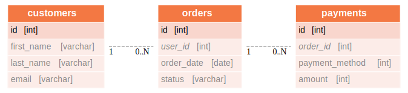

import ClearscapeDocsNote from '../_partials/vantage_clearscape_analytics.mdx'
import CommunityLink from '../_partials/community_link.mdx'
import Tabs from '@theme/Tabs';
import TabItem from '@theme/TabItem';

# dbt con Teradata Vantage

## Información general

En este tutorial se realiza una demostración de cómo utilizar dbt (Data Build Tool) con Teradata Vantage. Está basado en el [tutorial de Jaffle Shop sobre dbt](https://github.com/dbt-labs/jaffle_shop-dev). Se han ajustado un par de modelos al dialecto SQL admitido por Vantage.

## Prerrequisitos

* Acceso a una instancia de Teradata Vantage.

    <ClearscapeDocsNote />

* Python **3.7**, **3.8**, **3.9**, **3.10** o **3.11** instalado.

## Instalar dbt

1. Clone el repositorio del tutorial y use cd para ir al directorio del proyecto:
    ``` bash
    git clone https://github.com/Teradata/jaffle_shop-dev.git jaffle_shop
    cd jaffle_shop
    ```

2. Cree un nuevo entorno Python para administrar dbt y sus dependencias. 
    
    Active el entorno:
    
```mdx-code-block
<Tabs>
  <TabItem value="Windows" label="Windows" default>
    Run in Powershell:
    ```bash
    gcloud compute instances create teradata-vantage-express `
    --zone=us-central1-a `
    --machine-type=n2-custom-4-8192 `
    --create-disk=boot=yes,device-name=ve-disk,image-project=ubuntu-os-cloud,image-family=ubuntu-2004-lts,size=70,type=pd-balanced `
    --enable-nested-virtualization `
    --tags=ve
    ```
  </TabItem>
  <TabItem value="MacOS" label="MacOS">
    ```bash
    gcloud compute instances create teradata-vantage-express \
  --zone=us-central1-a \
  --machine-type=n2-custom-4-8192 \
  --create-disk=boot=yes,device-name=ve-disk,image-project=ubuntu-os-cloud,image-family=ubuntu-2004-lts,size=70,type=pd-balanced \
  --enable-nested-virtualization \
  --tags=ve
    ```
  </TabItem>
  <TabItem value="Linux" label="Linux">
    ```bash
    gcloud compute instances create teradata-vantage-express \
  --zone=us-central1-a \
  --machine-type=n2-custom-4-8192 \
  --create-disk=boot=yes,device-name=ve-disk,image-project=ubuntu-os-cloud,image-family=ubuntu-2004-lts,size=70,type=pd-balanced \
  --enable-nested-virtualization \
  --tags=ve
    ```
  </TabItem>
</Tabs>
```

3. Instale el módulo `dbt-teradata` y sus dependencias. El módulo dbt principal se incluye como dependencia, por lo que no es necesario instalarlo por separado:
    :::note
    **Dependencias de dbt**

    El módulo `dbt-core` se incluyó como dependencia solo hasta la versión 1.7.x de dbt-teradata. A partir de `dbt-teradata` 1.8.0 y versiones posteriores, `dbt-core` no se instalará como dependencia. Por lo tanto, debe instalar explícitamente `dbt-core` además de instalar `dbt-teradata`. Puede encontrar más información sobre cómo desacoplar los adaptadores dbt de `dbt-core` aquí: https://github.com/dbt-labs/dbt-core/discussions/9171
    :::

    ```bash
    pip install dbt-teradata
    ```

## Configurar dbt
Configure dbt para conectarse a su base de datos Vantage. Cree el archivo `profiles.yml` en la ubicación que se muestra a continuación.
```mdx-code-block
<Tabs>
  <TabItem value="Windows" label="Windows" default>
    Run in Powershell:
    ```bash
    c:\Users<user name>.dbt\profiles.yml
    ```
  </TabItem>
  <TabItem value="MacOS" label="MacOS">
    ```bash
    ~/.dbt/profiles.yml
    ```
  </TabItem>
  <TabItem value="Linux" label="Linux">
    ```bash
    ~/.dbt/profiles.yml
    ```
  </TabItem>
</Tabs>
```

Agregue la siguiente configuración al archivo `profile.yml`. Ajuste `<host>`, `<user>`, `<password>` para que coincida con su instancia de Teradata Vantage.


:::note
**Configuración de la base de datos**

El siguiente perfil de dbt apunta a una base de datos denominada `jaffle_shop`. 
Si la base de datos no existe en su instancia de Teradata Vantage, se creará. También puede cambiar el valor `schema` para que apunte a una base de datos existente en su instancia.
:::

```bash
jaffle_shop:
  outputs:
    dev:
      type: teradata
      host: <host>
      user: <user>
      password: <password>
      logmech: TD2
      schema: jaffle_shop
      tmode: ANSI
      threads: 1
      timeout_seconds: 300
      priority: interactive
      retries: 1
  target: dev
```

Ahora que tenemos el archivo de perfil en su lugar, podemos validar la configuración:

```bash
dbt debug
```

Si el comando de depuración devolvió errores, es probable que tenga un problema con el contenido de `profiles.yml`.

## Acerca del almacén de Jaffle Shop

`jaffle_shop` es una tienda de comercio electrónico ficticia. Este proyecto dbt transforma datos sin procesar de la base de datos de una aplicación en un modelo dimensional con datos de clientes y pedidos listos para análisis.

Los datos sin procesar de la aplicación consisten en clientes, pedidos y pagos, con el siguiente diagrama entidad-relación:



dbt toma esta tabla de datos sin procesar y construye el siguiente modelo dimensional, que es más adecuado para herramientas de análisis:


## Ejecutar dbt

### Crear tablas de datos sin procesar

En la vida real, obtendremos datos sin procesar de plataformas como Segment, Stitch, Fivetran u otra herramienta ETL. En nuestro caso, usaremos la funcionalidad `seed` de dbt para crear tablas a partir de archivos csv. Los archivos csv se encuentran en el directorio `./data`. Cada archivo csv producirá una tabla. dbt, inspeccionará los archivos y realizará inferencias de tipos para decidir qué tipos de datos utilizar para las columnas.

```bash
dbt seed
```

Ahora debería ver 3 tablas en su base de `jaffle_shop` datos: `raw_customers`, `raw_orders`, `raw_payments`. Las tablas deben completarse con datos de los archivos csv.

### Crear el modelo dimensional

Ahora que tenemos las tablas sin formato, podemos indicarle a dbt que cree el modelo dimensional:
```bash
dbt run
```

Entonces, ¿qué pasó exactamente aquí? dbt creó tablas adicionales usando `CREATE TABLE/VIEW FROM SELECT` SQL. En la primera transformación, dbt tomó tablas sin procesar y creó tablas de unión desnormalizadas llamadas `customer_orders`, `order_payments`, `customer_payments`. Encontrará las definiciones de estas tablas en `./marts/core/intermediate`.
En el segundo paso, dbt creó las tablas `dim_customers` y `fct_orders`. Estas son las tablas del modelo dimensional que queremos exponer a nuestra herramienta de BI.

### Probar los datos

dbt aplicó múltiples transformaciones a nuestros datos. ¿Cómo podemos asegurarnos de que los datos del modelo dimensional sean correctos? dbt nos permite definir y ejecutar pruebas con los datos. Las pruebas están definidas en `./marts/core/schema.yml`. El archivo describe cada columna en todas las relaciones. Cada columna puede tener varias pruebas configuradas en la llave `tests`. Por ejemplo, esperamos que la columna `fct_orders.order_id` contenga valores únicos y no nulos. Para validar que los datos en las tablas creadas satisfacen las condiciones de prueba, ejecute:

```bash
dbt test
```

### Generar documentación

Nuestro modelo consta de unas pocas tablas. Imagine un escenario en el que tengamos muchas más fuentes de datos y un modelo dimensional mucho más complejo. También podríamos tener una zona intermedia entre los datos brutos y el modelo dimensional que sigue los principios de Data Vault 2.0. ¿No sería útil si tuviéramos las entradas, transformaciones y salidas documentadas de alguna manera? dbt nos permite generar documentación a partir de sus archivos de configuración:

```bash
dbt docs generate
```

Esto generará archivos html en el directorio `./target`.

Puede iniciar su propio servidor para explorar la documentación. El siguiente comando iniciará un servidor y abrirá una pestaña del navegador con la página de inicio de los documentos:

```bash
dbt docs serve
```

## Resumen

Este tutorial demostró cómo usar dbt con Teradata Vantage. El proyecto de muestra toma datos sin procesar y genera un data mart dimensional. Usamos múltiples comandos dbt para completar tablas a partir de archivos csv (`dbt seed`), crear modelos (`dbt run`), probar los datos (`dbt test`) y generar y entregar documentación del modelo (`dbt docs generate`, `dbt docs serve`).

## Lectura adicional
* [Documentación de dbt](https://docs.getdbt.com/docs/)
* [Documentación del complemento dbt-teradata](https://github.com/Teradata/dbt-teradata)

<CommunityLink />
