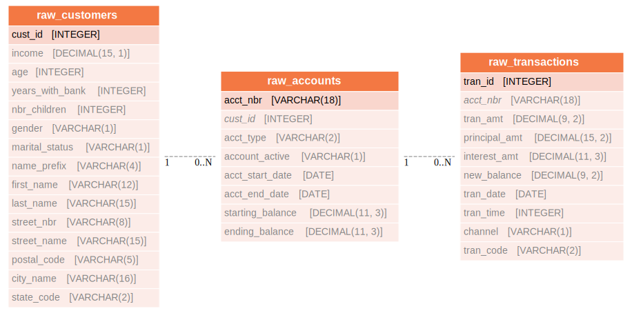

import ClearscapeDocsNote from '../_partials/vantage_clearscape_analytics.mdx'

# Utilizar dbt y FEAST para crear un almacén de funciones en Teradata Vantage

## Información general

Este tutorial muestra un enfoque para crear una canalización dbt que toma datos sin procesar y los convierte en funciones FEAST. La canalización aprovecha las "[funciones de ClearScape Analytics](https://docs.teradata.com/r/Enterprise_IntelliFlex_VMware/Teradata-VantageTM-Analytics-Database-Analytic-Functions-17.20)" para transformaciones de datos. El resultado de las transformaciones se carga en FEAST para materializar características que se pueden usar en modelos de ML.

## Introducción
### dbt
[dbt](https://www.getdbt.com/product/what-is-dbt) (Data Build Tool) es una herramienta de transformación de datos que es la piedra angular de las pilas de datos modernas. Se encarga de la T en ELT (Extract Load Transform). Se supone que algún otro proceso trae datos sin procesar a su almacén o lago de datos. Luego, estos datos deben transformarse.

### Feast
[Feast](https://docs.feast.dev) (Feature Store) es un sistema de datos flexible que utiliza tecnología existente para administrar y proporcionar funciones de aprendizaje automático a modelos en tiempo real. Permite la personalización para satisfacer necesidades específicas. También nos permite hacer que las funciones estén disponibles de manera coherente para entrenamiento y servicio, evitar la fuga de datos y desacoplar el aprendizaje automático de la infraestructura de datos.


## Prerrequisitos

* Acceso a una instancia de base de datos de Teradata Vantage.

        <ClearscapeDocsNote />

* Feast-Teradata instalado localmente. Consulte las [Instrucciones de instalación de Feast-Teradata](using-feast-feature-store-with-teradata-vantage.md)

* dbt instalado localmente. Consulte las [Instrucciones de instalación de dbt](dbt.md)

## Objetivo
El objetivo es crear una canalización de datos con Teradata Vantage como fuente y realizar la transformación de datos en algunas variables en dbt. La principal transformación de datos que hacemos en dbt es la codificación one-hot de varias columnas como género, estado civil, código de estado, etc. Además de eso, los datos de la columna del tipo de cuenta se transformarán realizando operaciones de agregación en un par de columnas. Todo esto en conjunto genera el conjunto de datos deseado con datos transformados. El conjunto de datos transformado se utiliza como entrada en FEAST para almacenar características. Luego, las funciones se utilizan para generar un conjunto de datos de entrenamiento para modelos.


## Primeros pasos
1. Cree un nuevo entorno Python para administrar dbt, feast y sus dependencias. Active el entorno:

        ``` bash
        python3 -m venv env
        source env/bin/activate
        ```

2. Clone el repositorio del tutorial y cambie el directorio al directorio del proyecto:

        ``` bash
        git clone https://github.com/Teradata/tdata-pipeline.git
        ```

    La estructura de directorios del proyecto clonado se ve así:

        ```
        tdata-pipeline/
            feature_repo/
                feature_views.py
                feature_store.yml
            dbt_transformation/
                ...
                macros
                models
                ...
            generate_training_data.py
            CreateDB.sql
            dbt_project.yml
        ```


## Sobre el almacén bancario
teddy_bank es un conjunto de datos ficticio de clientes bancarios, que consta principalmente de 3 tablas de clientes, cuentas y
transacciones, con el siguiente diagrama entidad-relación:




dbt toma estos datos sin procesar y construye el siguiente modelo, que es más adecuado para herramientas de análisis y modelado de ML:


## Configurar dbt
Cree el archivo `$HOME/.dbt/profiles.yml` con el siguiente contenido. Ajuste los archivos `<host>`, `<user>` y `<password>` para que coincidan con su instancia de Teradata.

:::note **Configuración de la base de datos**
El siguiente perfil dbt apunta a una base de datos llamada `teddy_bank`. Puede cambiar el valor `schema` para que apunte a una base de datos existente en su instancia de Teradata Vantage:
:::

``` yaml , id="dbt_first_config", role="emits-gtm-events"
dbt_transformation:
  target: dev
  outputs:
    dev:
      type: teradata
      host: <host>
      user: <user>
      password: <password>
      schema: teddy_bank
      tmode: ANSI
```
Validar la configuración:

``` bash
dbt debug
```

Si el comando de depuración devolvió errores, es probable que tenga un problema con el contenido de `profiles.yml`.

## Configurar FEAST
La configuración de Feast aborda la conexión a su base de datos Vantage. El archivo yaml creado al inicializar el proyecto de feast
, `$HOME/.feast/feature_repo/feature_store.yml` puede contener los detalles de almacenamiento fuera de línea, almacenamiento en línea, proveedor
y registro. Ajuste `<host>`, `<user>`, `<password>` para que coincida con su instancia de Teradata.

:::note **Configuración de la base de datos**
El siguiente perfil dbt apunta a una base de datos llamada `teddy_bank`. Puede cambiar el valor `schema` para que apunte a una
base de datos existente en su instancia de Teradata Vantage
:::

### Configuración de tienda sin conexión

``` yaml , id="feast_first_config", role="emits-gtm-events"
project: td_pipeline
registry:
    registry_type: sql
    path: teradatasql://<user>:<password>@<hostIP>/?database=teddy_bank&LOGMECH=TDNEGO
provider: local
offline_store:
    type: feast_teradata.offline.teradata.TeradataOfflineStore
    host: <host>
    database: teddy_bank
    user: <user>
    password: <password>
    log_mech: TDNEGO
entity_key_serialization_version: 2
```

### Sintaxis para el Registro SQL de Teradata
``` python
path = 'teradatasql://'+ teradata_user +':' + teradata_password + '@'+host + '/?database=' +
        teradata_database + '&LOGMECH=' + teradata_log_mech
```
## Ejecutar dbt
En este paso, completaremos las siguientes tablas de datos: `customers`, `accounts`, y `transactions`.

``` bash
dbt seed
```

### Crear el modelo dimensional
Ahora que tenemos las tablas de datos sin procesar, podemos instruir a dbt para que cree el modelo dimensional:

``` bash
dbt run --select Analytic_Dataset
```

## Ejecutar FEAST
### Definición del repositorio de funciones
* `TeradataSource:` Fuente de datos para funciones almacenadas en Teradata (Enterprise o Lake) o accesibles a través de una tabla externa desde Teradata (NOS, QueryGrid)

* `Entity:` Una colección de características relacionadas semánticamente.

* `Feature View:` Una vista de características es un grupo de datos de características de una fuente de datos específica. Las vistas de características le permiten definir de forma coherente características y sus fuentes de datos, lo que permite la reutilización de grupos de características en un proyecto.


``` python
DBT_source = TeradataSource( database=dbload, table=f"Analytic_Dataset", timestamp_field="event_timestamp")

customer = Entity(name = "customer", join_keys = ['cust_id'])

ads_fv = FeatureView(name="ads_fv",entities=[customer],source=DBT_source, schema=[
        Field(name="age", dtype=Float32),
        Field(name="income", dtype=Float32),
        Field(name="q1_trans_cnt", dtype=Int64),
        Field(name="q2_trans_cnt", dtype=Int64),
        Field(name="q3_trans_cnt", dtype=Int64),
        Field(name="q4_trans_cnt", dtype=Int64),
    ],)
```
### Generar datos de entrenamiento
El enfoque para generar datos de entrenamiento puede variar. Dependiendo de los requisitos, 'entitydf' se puede unir a las tablas de datos de origen mediante la asignación de vistas de características. A continuación se muestra una función de ejemplo que genera un conjunto de datos de entrenamiento.
``` python
def get_Training_Data():
    # Initialize a FeatureStore with our current repository's configurations
    store = FeatureStore(repo_path="feature_repo")
    con = create_context(host = os.environ["latest_vm"], username = os.environ["dbc_pwd"],
            password = os.environ["dbc_pwd"], database = "EFS")
    entitydf = DataFrame('Analytic_Dataset').to_pandas()
    entitydf.reset_index(inplace=True)
    print(entitydf)
    entitydf = entitydf[['cust_id','event_timestamp']]
    training_data = store.get_historical_features(
        entity_df=entitydf,
        features=[
        "ads_fv:age"
        ,"ads_fv:income"
        ,"ads_fv:q1_trans_cnt"
        ,"ads_fv:q2_trans_cnt"
        ,"ads_fv:q3_trans_cnt"
        ,"ads_fv:q4_trans_cnt"
        ],
        full_feature_names=True
    ).to_df()

    return training_data


```

## Resumen
Este tutorial demostró cómo usar dbt y FEAST con Teradata Vantage. El proyecto de muestra toma datos sin procesar de Teradata Vantage y produce funciones con dbt. Luego se crearon metadatos de características que forman la base para generar un conjunto de datos de entrenamiento para un modelo con FEAST; todas sus tablas correspondientes que crean el almacén de características también se generan en tiempo de ejecución dentro de la misma base de datos.

## Lectura adicional
* [Documentación de dbt](https://docs.getdbt.com/docs)
* [Documentación del complemento dbt-teradata](https://github.com/Teradata/dbt-teradata)
* [Registro escalable de Feast](https://docs.feast.dev/tutorials/using-scalable-registry)
* [Habilitar un almacén de funciones altamente escalable con Teradata Vantage y FEAST](https://medium.com/teradata/enabling-highly-scalable-feature-store-with-teradata-vantage-and-feast-e01008fa8fdb)
* [Repositorio de git](https://github.com/Teradata/tdata-pipeline) para este proyecto.
