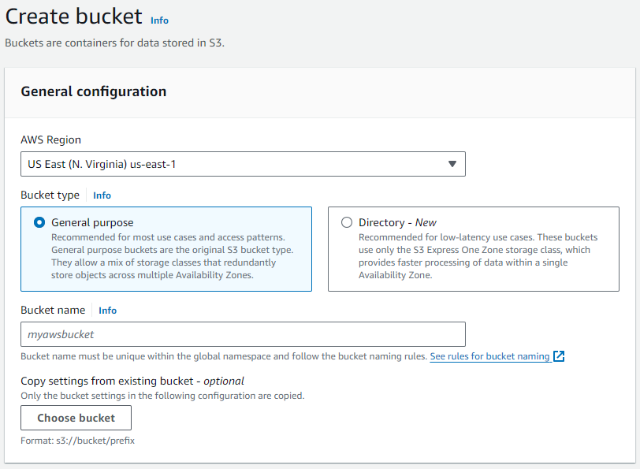
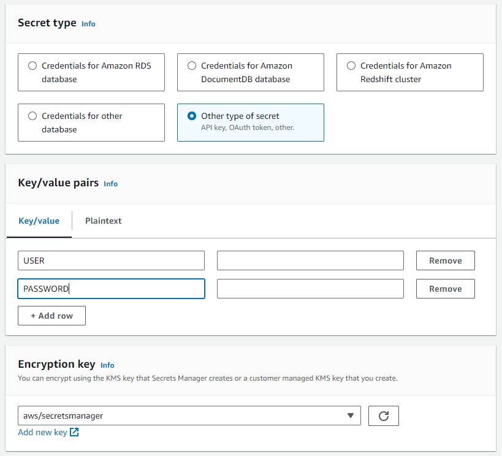
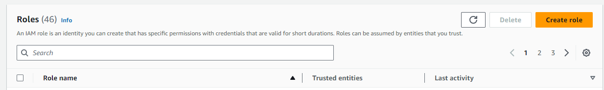
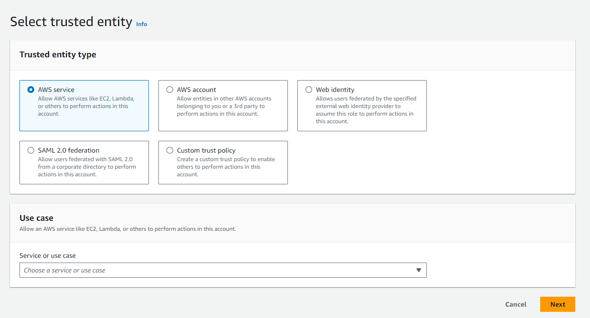
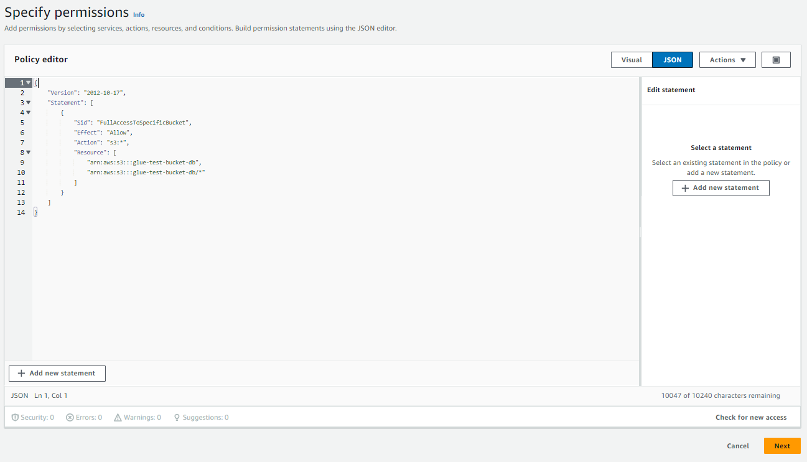
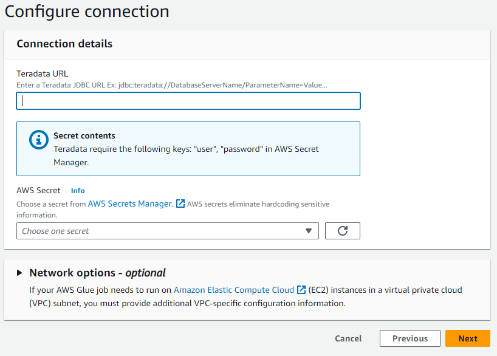
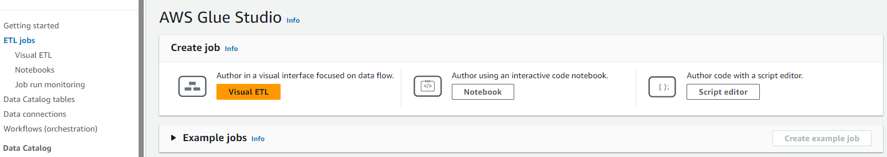
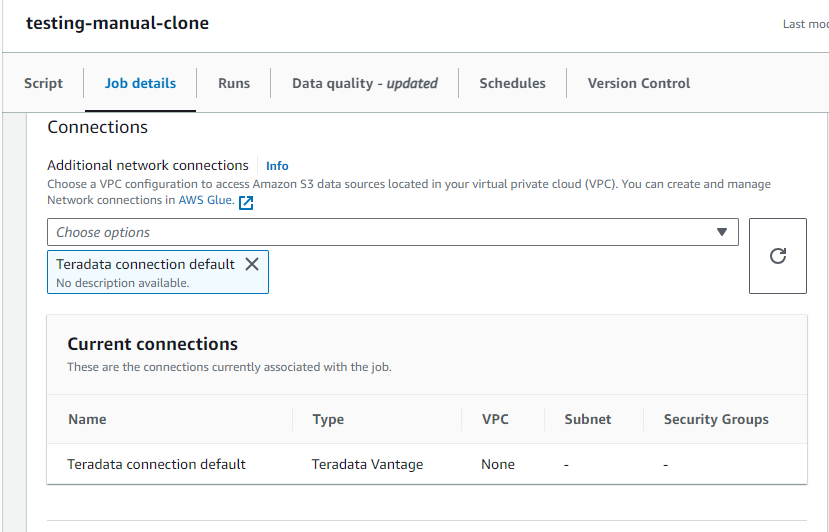
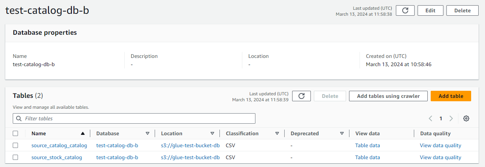

# Incorporación y catalogación de datos desde Teradata Vantage a Amazon S3 con scripts de AWS Glue

### Información general
En este inicio rápido se detalla el proceso de incorporación y catalogación de datos de Teradata Vantage a Amazon S3 con AWS Glue. 

:::tip
Para incorporar datos en Amazon S3 cuando la catalogación no es un requisito, tenga en cuenta las [capacidades Write NOS de Teradata](https://docs.teradata.com/r/Enterprise_IntelliFlex_VMware/SQL-Data-Manipulation-Language/Working-with-External-Data/WRITE_NOS).
:::


### Prerrequisitos

import ClearscapeDocsNote from '../_partials/vantage_clearscape_analytics.mdx'

* Acceso a una [cuenta de Amazon AWS](https://aws.amazon.com)
* Acceso a una instancia de Teradata Vantage
  <ClearscapeDocsNote />
* Una base de datos [cliente](../connect-to-vantage/configure-a-teradata-vantage-connection-in-dbeaver.md) para enviar consultas para cargar los datos de prueba

### Carga de datos de prueba
* En su cliente de base de datos favorito, ejecute las siguientes consultas

``` sql
CREATE DATABASE teddy_retailers_inventory
AS PERMANENT = 110e6;

CREATE TABLE teddy_retailers_inventory.source_catalog AS
(
  SELECT product_id, product_name, product_category, price_cents
    FROM (
		LOCATION='/s3/dev-rel-demos.s3.amazonaws.com/demo-datamesh/source_products.csv') as products
) WITH DATA;

CREATE TABLE teddy_retailers_inventory.source_stock AS
(
  SELECT entry_id, product_id, product_quantity, purchase_price_cents, entry_date
    FROM (
		LOCATION='/s3/dev-rel-demos.s3.amazonaws.com/demo-datamesh/source_stock.csv') as stock
) WITH DATA;
```

### Configuración de Amazon AWS
En esta sección cubriremos en detalle cada uno de los pasos a continuación:

* Creación de un depósito de Amazon S3 para incorporar datos
* Creación de una base de datos de catálogo de AWS Glue para almacenar metadatos
* Almacenar credenciales de Teradata Vantage en AWS Secrets Manager
* Creación de un rol de servicio de AWS Glue para asignarlo a trabajos de ETL
* Crear una conexión a una instancia de Teradata Vantage en AWS Glue
* Crear un trabajo de AWS Glue
* Redactar un script para la incorporación y catalogación automatizadas de datos de Teradata Vantage en Amazon S3

### Creación de un depósito de Amazon S3 para incorporar datos
* En Amazon S3, seleccione `Create bucket`.

* Asigne un nombre al depósito y anótelo.

* Deje todos los ajustes en sus valores predeterminados.
* Haga clic en `Create bucket`.


### Creación de una base de datos de catálogo de AWS Glue para almacenar metadatos

* En AWS Glue, seleccione Catálogo de datos, Bases de datos.
* Haga clic en `Add database`.

* Defina un nombre para la base de datos y haga clic en `Create database`.


### Almacenar credenciales de Teradata Vantage en AWS Secrets Manager

* En AWS Secrets Manager, seleccione `Create new secret`.

* El secreto debe ser `Other type of secret` con las siguientes claves y valores según su instancia de Teradata Vantage:
    * USER
    * PASSWORD
:::tip
En el caso de ClearScape Analytics Experience, el usuario siempre es "demo_user" y la contraseña es la que definió al crear su entorno de ClearScape Analytics Experience.
:::

* Asigne un nombre al secreto.
* El resto de los pasos se pueden dejar con los valores predeterminados.
* Cree el secreto.

### Creación de un rol de servicio de AWS Glue para asignarlo a trabajos de ETL
El rol que cree debe tener acceso a los permisos típicos de un rol de servicio de Glue, pero también acceso para leer el secreto y el depósito S3 que haya creado.

* En AWS, vaya al servicio IAM.
* En Gestión de acceso, seleccione `Roles`.
* En los roles, haga clic en `Create role`.

* En la selección de una entidad de confianza, seleccione `AWS service` y elija `Glue` en el menú desplegable.

* En la adición de permisos:
    * Busque `AWSGlueServiceRole`.
    * Haga clic en la casilla de verificación correspondiente.
    * Busque `SecretsManagerReadWrite`.
    * Haga clic en la casilla de verificación correspondiente.
* En la opción para asignar nombre, revisar y crear:
    * Defina un nombre para el rol.

* Haga clic en `Create role`.
* Regrese a Administración de acceso, Roles y busque el rol que acaba de crear.
* Seleccione su rol.
* Haga clic en `Add permissions` y posteriormente en `Create inline policy`.
* Haga clic en `JSON`.
* En el editor de políticas, pegue el objeto JSON a continuación, sustituyendo el nombre del depósito que ha creado.
``` json
{
    "Version": "2012-10-17",
    "Statement": [
        {
            "Sid": "FullAccessToSpecificBucket",
            "Effect": "Allow",
            "Action": "s3:*",
            "Resource": [1
                "arn:aws:s3:::<bucket-name>",
                "arn:aws:s3:::<bucket-name>/*"
            ]
        }
    ]
}
```
* Haga clic en `Next`.

* Asigne un nombre a su política.
* Haga clic en `Create policy`.

### Crear una conexión a una instancia de Teradata Vantage en AWS Glue

* En AWS Glue, seleccione `Data connections`.

* En Conectores, seleccione `Create connection`.
* Busque y seleccione la fuente de datos Teradata Vantage.

* En el cuadro de diálogo, escriba la URL de su instancia de Teradata Vantage en formato JDBC.
:::tip
En el caso de ClearScape Analytics Experience, la URL sigue la siguiente estructura: 
`jdbc:teradata://<URL Host>/DATABASE=demo_user,DBS_PORT=1025`
:::
* Seleccione el secreto de AWS creado en el paso anterior.
* Asigne un nombre a su conexión y finalice el proceso de creación.


### Crear un trabajo de AWS Glue
* En AWS Glue, seleccione `ETL Jobs` y haga clic en `Script editor`.

* Seleccione `Spark` como motor y elija comenzar desde el principio.


### Redactar un script para la incorporación y catalogación automatizadas de datos de Teradata Vantage en Amazon S3

* Copie el siguiente script en el editor.
    * El script requiere las siguientes modificaciones:
        * Sustituya el nombre del depósito S3.
        * Sustituya el nombre del base de datos del catálogo de Glue.
        * Si no está siguiendo el ejemplo de la guía, modifique el nombre de la base de datos y las tablas que se van a incorporar y catalogar.
        * Para fines de catalogación, en el ejemplo solo se incorpora la primera fila de cada tabla. Esta consulta se puede modificar para incorporar toda la tabla o para filtrar filas seleccionadas.

``` python , id="glue-script-first-run" role="emits-gtm-events"
# Import section
import sys
from awsglue.transforms import *
from awsglue.utils import getResolvedOptions
from pyspark.context import SparkContext
from awsglue.context import GlueContext
from awsglue.job import Job
from pyspark.sql import SQLContext

# PySpark Config Section
args = getResolvedOptions(sys.argv, ["JOB_NAME"])
sc = SparkContext()
glueContext = GlueContext(sc)
spark = glueContext.spark_session
job = Job(glueContext)
job.init(args["JOB_NAME"], args)

#ETL Job Parameters Section
# Source database
database_name = "teddy_retailers_inventory"

# Source tables
table_names = ["source_catalog","source_stock"]

# Target S3 Bucket
target_s3_bucket = "s3://<your-bucket-name>"

#Target catalog database 
catalog_database_name = "<your-catalog-database-name>" 


# Job function abstraction
def process_table(table_name, transformation_ctx_prefix, catalog_database, catalog_table_name):
    dynamic_frame = glueContext.create_dynamic_frame.from_options(
        connection_type="teradata",
        connection_options={
            "dbtable": table_name,
            "connectionName": "Teradata connection default",
            "query": f"SELECT TOP 1 * FROM {table_name}", # This line can be modified to ingest the full table or rows that fulfill an specific condition
        },
        transformation_ctx=transformation_ctx_prefix + "_read",
    )

    s3_sink = glueContext.getSink(
        path=target_s3_bucket,
        connection_type="s3",
        updateBehavior="UPDATE_IN_DATABASE",
        partitionKeys=[],
        compression="snappy",
        enableUpdateCatalog=True,
        transformation_ctx=transformation_ctx_prefix + "_s3",
    )
    # Dynamically set catalog table name based on function parameter
    s3_sink.setCatalogInfo(
        catalogDatabase=catalog_database, catalogTableName=catalog_table_name
    )
    s3_sink.setFormat("csv")
    s3_sink.writeFrame(dynamic_frame)


# Job execution section
for table_name in table_names:
    full_table_name = f"{database_name}.{table_name}"  
    transformation_ctx_prefix = f"{database_name}_{table_name}"  
    catalog_table_name = f"{table_name}_catalog"  
    # Call your process_table function for each table
    process_table(full_table_name, transformation_ctx_prefix, catalog_database_name, catalog_table_name)

job.commit()
```

* Asignar un nombre al script


* En Detalles del trabajo, Propiedades básicas:
    * Seleccione el rol de IAM que creó para el trabajo de ETL.
    * Para realizar pruebas, seleccione "2" como número solicitado de trabajadores, es el mínimo permitido.

    \* En `Advanced properties`, `Connections` seleccione su conexión a Teradata Vantage. 
:::tip
Debe hacerse referencia dos veces a la conexión creada: una en la configuración del trabajo y otra en el propio script.
:::

* Haga clic en `Save`.
* Haga clic en `Run`.
    * El trabajo de ETL tarda un par de minutos en completarse, la mayor parte de este tiempo está relacionado con el inicio del clúster Spark.

### Comprobación de los resultados

* Una vez finalizado el trabajo:
    * Vaya a Catálogo de datos, Bases de datos.
    * Haga clic en la base de datos del catálogo que ha creado.
    * En esta ubicación, verá las tablas extraídas y catalogadas a través de su trabajo de ETL de Glue.


* Todas las tablas incorporadas también están presentes como archivos comprimidos en S3. En raras ocasiones, estos archivos se consultarán directamente. Se pueden utilizar servicios como AWS Athena para consultar los archivos basándose en los metadatos del catálogo.

### Resumen

En este inicio rápido se detalla el proceso de incorporación y catalogación de datos de Teradata Vantage a Amazon S3 con scripts de AWS Glue.

### Lectura adicional
* [Integrar Teradata Vantage con Google Cloud Data Catalog](./integrate-teradata-vantage-with-google-cloud-data-catalog.md)

import CommunityLinkPartial from '../_partials/community_link.mdx';

<CommunityLinkPartial />