# Conectar Teradata Vantage a Salesforce mediante Amazon Appflow

### Información general

Este tutorial describe el proceso para migrar datos entre Salesforce y Teradata Vantage. Contiene dos casos de uso:

1. Recuperar información del cliente de Salesforce y combinarla con información de pedidos y envíos de Vantage para obtener información analítica.
2. Actualizar la tabla `newleads` en Vantage con los datos de Salesforce y luego agregar los nuevos clientes potenciales nuevamente a Salesforce usando AppFlow.

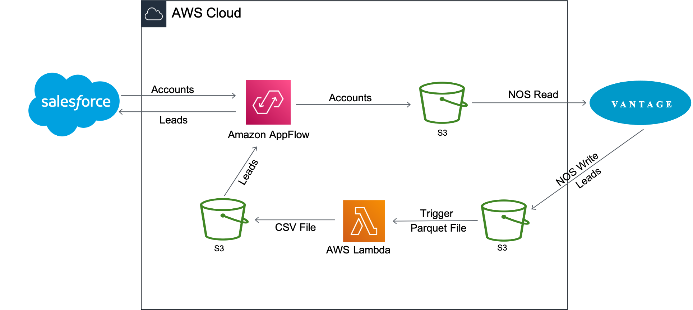

Amazon AppFlow transfiere los datos de la cuenta del cliente de Salesforce a Amazon S3. Luego, Vantage utiliza la funcionalidad de lectura Native Object Store (NOS) para unir los datos de Amazon S3 con los datos de Vantage con una única consulta.

La información de la cuenta se utiliza para actualizar la tabla `newleads` en Vantage. Una vez actualizada la tabla, Vantage la vuelve a escribir en el depósito de Amazon S3 con NOS Write. Se activa una función Lambda al llegar el nuevo archivo de datos de clientes potenciales para convertir el archivo de datos del formato Parquet al formato CSV, y AppFlow luego inserta los nuevos clientes potenciales nuevamente en Salesforce.

### Acerca de Amazon AppFlow

Amazon AppFlow es un servicio de integración totalmente administrado que permite a los usuarios transferir datos de forma segura entre aplicaciones de software como servicio (SaaS) como Salesforce, Marketo, Slack y ServiceNow, y servicios de AWS como Amazon S3 y Amazon Redshift. AppFlow cifra automáticamente los datos en movimiento y permite a los usuarios restringir el flujo de datos a través de la Internet pública para aplicaciones SaaS que están integradas con AWS PrivateLink, lo que reduce la exposición a amenazas de seguridad.

A día de hoy, Amazon AppFlow tiene 16 fuentes para elegir y puede enviar los datos a cuatro destinos.

### Acerca de Teradata Vantage

Teradata Vantage es la plataforma de datos multinube conectada para análisis empresarial, que resuelve los desafíos de datos desde el principio hasta la escala.

Vantage permite a las empresas iniciar computación o almacenamiento a pequeña escala y de manera elástica, pagando solo por lo que usan, aprovechando almacenes de objetos de bajo coste e integrando sus cargas de trabajo analíticas. Vantage es compatible con R, Python, Teradata Studio y cualquier otra herramienta basada en SQL.

Vantage combina análisis descriptivos, predictivos y prescriptivos, toma de decisiones autónoma, funciones de aprendizaje automático y herramientas de visualización en una plataforma unificada e integrada que descubre inteligencia empresarial en tiempo real a escala, sin importar dónde residan los datos.

Teradata Vantage Native Object Store (NOS) can be used to explore data in external object stores, like Amazon S3, using standard SQL. No special object storage-side compute infrastructure is required to use NOS. Users can explore data located in an Amazon S3 bucket by simply creating a NOS table definition that points to your bucket. With NOS, you can quickly import data from Amazon S3 or even join it with other tables in the Vantage database.

### Prerrequisitos

Se espera que esté familiarizado con el servicio Amazon AppFlow y Teradata Vantage.

Necesitará las siguientes cuentas y sistemas:

import ClearscapeDocsNote from '../_partials/vantage_clearscape_analytics.mdx'

* Acceso a una instancia de Teradata Vantage.
  <ClearscapeDocsNote />
* Una cuenta de AWS con el rol que puede crear y ejecutar flujos.
* Un depósito de Amazon S3 para almacenar datos de Salesforce (es decir, ptctsoutput)
* Un depósito de Amazon S3 para almacenar datos de Vantage sin procesar (archivo Parquet) (es decir, vantageparquet). Este depósito debe tener una política que permita el acceso a Amazon AppFlow
* Un depósito de Amazon S3 para almacenar datos de Vantage convertidos (archivo CSV) (es decir, vantagecsv)
* Una cuenta de Salesforce que cumpla con los siguientes requisitos:
  * Su cuenta de Salesforce debe estar habilitada para acceder a la API. El acceso a la API está habilitado de forma predeterminada para las ediciones Enterprise, Unlimited, Developer y Performance.
  * Su cuenta de Salesforce debe permitirle instalar aplicaciones conectadas. Si esto está deshabilitado, comuníquese con su administrador de Salesforce. Después de crear una conexión de Salesforce en Amazon AppFlow, verifique que la aplicación conectada denominada "Aplicación de inicio de sesión integrada de Amazon AppFlow" esté instalada en su cuenta de Salesforce.
  * La política de token de actualización para la "Aplicación de inicio de sesión integrada de Amazon AppFlow" debe establecerse en "El token de actualización es válido hasta que se revoque". De lo contrario, sus flujos fallarán cuando caduque su token de actualización.
  * Debe habilitar la captura de datos modificados en Salesforce para utilizar desencadenadores de flujo controlados por eventos. Desde Configuración, introduzca "Cambiar captura de datos" en Búsqueda rápida.
  * Si su aplicación Salesforce aplica restricciones de direcciones IP, debe incluir en la lista blanca las direcciones que utiliza Amazon AppFlow. Para obtener más información, consulte [Rangos de direcciones IP de AWS](https://docs.aws.amazon.com/general/latest/gr/aws-ip-ranges.html) en _Referencia general de Amazon Web Services_.
  * Si va a transferir más de un millón de registros de Salesforce, no puede elegir ningún campo compuesto de Salesforce. Amazon AppFlow utiliza las API Bulk de Salesforce para la transferencia, lo que no permite la transferencia de campos compuestos.
  * Para crear conexiones privadas utilizando AWS PrivateLink, debe habilitar los permisos de usuario "Administrador de metadatos" y "Administrar conexiones externas" en su cuenta de Salesforce. Actualmente, las conexiones privadas están disponibles en las regiones de AWS us-east-1 y us-west-2.
  * Algunos objetos de Salesforce no se pueden actualizar, como los objetos de historial. Para estos objetos, Amazon AppFlow no admite la exportación incremental (la opción "Transferir solo datos nuevos") para flujos activados por programación. En su lugar, puede elegir la opción "Transferir todos los datos" y luego seleccionar el filtro apropiado para limitar los registros que transfiere.

### Procedimiento

Una vez que haya cumplido los requisitos previos, siga estos pasos:


1. Creación de un flujo de Salesforce a Amazon S3
2. Exploración de datos mediante NOS
3. Exporte los datos de Vantage a Amazon S3 usando NOS
4. Crear un flujo de Amazon S3 a Salesforce

### Creación de un flujo de Salesforce a Amazon S3

Este paso crea un flujo utilizando Amazon AppFlow. Para este ejemplo, utilizamos una [cuenta de desarrollador de Salesforce](https://developer.salesforce.com/signup) para conectarnos a Salesforce.

Vaya a la [consola de AppFlow](https://console.aws.amazon.com/appflow), inicie sesión con sus credenciales de inicio de sesión de AWS y haga clic en *Crear flujo*. Asegúrese de estar en la región correcta y de que se cree el depósito para almacenar datos de Salesforce.


#### Paso 1: Especificar los detalles del flujo

Este paso proporciona información básica para su flujo.

Complete **Nombre del flujo** (es decir, _salesforce_) y **Descripción del flujo (opcional)**, deje **Personalizar la configuración de cifrado (avanzado)** sin marcar. Haga clic en **Siguiente**.

#### Paso 2: Configurar el flujo

Este paso proporciona información sobre el origen y el destino de su flujo. En este ejemplo, utilizaremos **_Salesforce_** como origen y **_Amazon S3_** como destino.

* Para *Nombre de la fuente*, elija _Salesforce_, posteriormente *_Crear una nueva conexión_* para *Elegir la conexión de Salesforce*.


* Utilice los valores predeterminados para **Entorno de Salesforce** y **Cifrado de datos**. Asigne un nombre a su conexión (por ejemplo, _salesforce_) y haga clic en **Continuar**.


* En la ventana de inicio de sesión de Salesforce, introduzca su **Nombre de usuario** y **Password**. Haga clic en **Iniciar sesión**
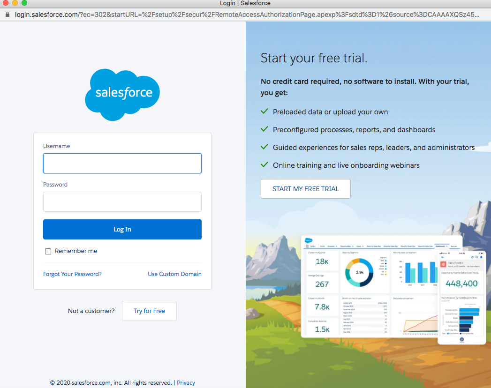

* Haga clic en **Permitir** para permitir que AppFlow acceda a sus datos e información de Salesforce.


* De vuelta en la ventana AppFlow **Configurar flujo**, use **Objetos de Salesforce** y elija _Cuenta_ para que sea el objeto de Salesforce.
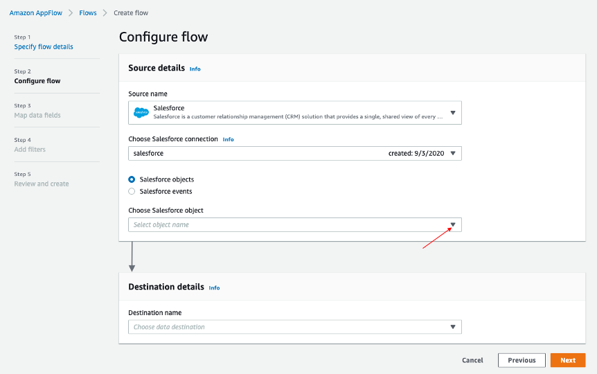
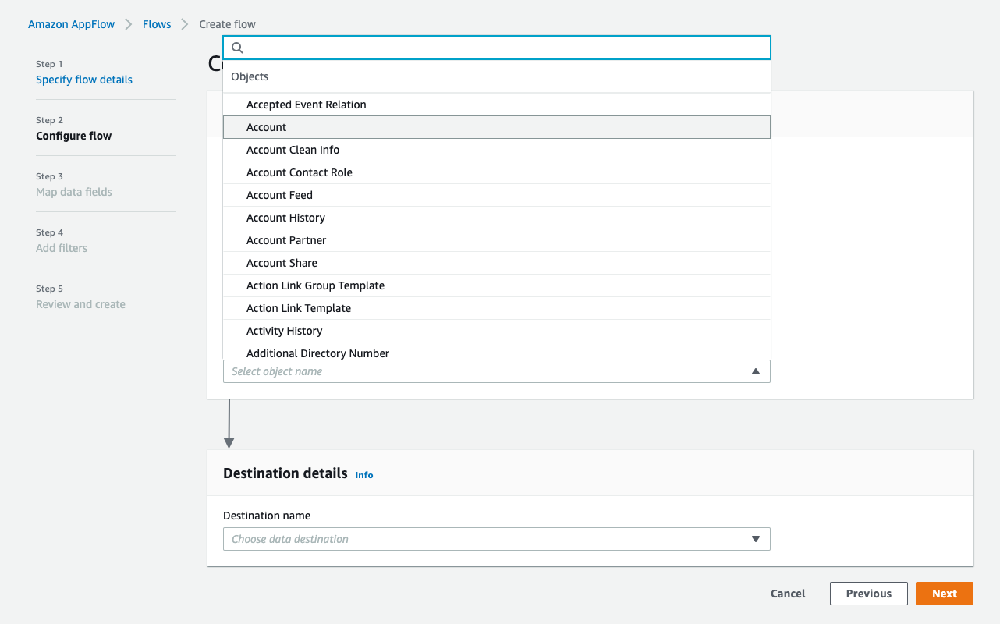

* Utilice _Amazon S3_ como **Nombre de destino**. Seleccione el depósito que creó [anteriormente](#prerequisites) en el cual quiere que se almacenen los datos (es decir, _ptctsoutput_).


* **Disparador de flujos** es _Ejecutar bajo demanda_. Haga clic en **Siguiente**.


#### Paso 3: Asignar campos de datos

Este paso determina cómo se transfieren los datos desde el origen al destino.

* Utilice _Asignar campos manualmente_ como **Método de asignación**
* Para simplificar, elija _Asignar todos los campos directamente_ para **Asignación de archivado de origen a destino**.


Una vez que haga clic en "_Asignar todos los campos directamente_", todos los campos se mostrarán bajo **Campos asignados**. Haga clic en la casilla de verificación de los campos que quiera para **Agregar fórmula (concatenados)**, **Modificar valores (enmascarar o truncar valores de campo)** o **Eliminar asignaciones seleccionadas**.

Para este ejemplo, no se marcará ninguna casilla de verificación.

* Para **_Validaciones_**, agregue una condición para omitir el registro que no contiene "_Dirección de envío_" (opcional). Haga clic en **Siguiente**.


#### Paso 4: Agregar filtros

Puede especificar un filtro para determinar qué registros transferir. Para este ejemplo, agregue una condición para filtrar los registros que se eliminan (opcional). Haga clic en **Siguiente**.


#### Paso 5. Revisar y crear

Revise toda la información que acaba de introducir. Modifíquela si es necesario. Haga clic en **Crear flujo**.

Se mostrará un mensaje de creación exitosa del flujo con la información del flujo una vez que se cree el flujo.


#### Flujo de ejecución

Haga clic en **Flujo de ejecución** en la esquina superior derecha.

Al finalizar la ejecución del flujo, se mostrará un mensaje para indicar una ejecución exitosa.

Ejemplo de mensaje:

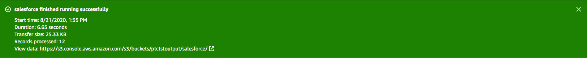

Haga clic en el enlace al depósito para ver los datos. Los datos de Salesforce estarán en formato JSON.

#### Cambiar propiedades del archivo de datos

De forma predeterminada, los datos de Salesforce están cifrados. Necesitamos eliminar el cifrado para que NOS pueda acceder a él.

Haga clic en el archivo de datos en su depósito de Amazon S3 y, posteriormente, haga clic en la pestaña **Propiedades**.


Haga clic en _AWS-KMS_ desde **Cifrado** y cambie el cifrado de _AWS-KMS_ a _None_. Haga clic en **Save**.


### Explorar datos mediante NOS

Native Object Store tiene funcionalidades integradas para explorar y analizar datos en Amazon S3. Esta sección enumera algunas funciones de uso común de NOS.

#### Crear tabla externa

La tabla externa permite hacer referencia fácilmente a los datos externos dentro del Vantage Advanced SQL Engine y hace que los datos estén disponibles en un formato relacional estructurado.

Para crear una tabla externa, primero inicie sesión en el sistema Teradata Vantage con sus credenciales. Cree un objeto AUTHORIZATION con claves de acceso para acceder al depósito de Amazon S3. El objeto de autorización mejora la seguridad al establecer control sobre quién puede usar una tabla externa para acceder a los datos de Amazon S3.

``` sql
CREATE AUTHORIZATION DefAuth_S3
AS DEFINER TRUSTED
USER 'A*****************' /* AccessKeyId */
PASSWORD '********'; /* SecretAccessKey */
```

"USER" es el AccessKeyId de su cuenta de AWS y "PASSWORD" es la SecretAccessKey.

Cree una tabla externa con el archivo JSON en Amazon S3 usando el siguiente comando.

``` sql
CREATE MULTISET FOREIGN TABLE salesforce,
EXTERNAL SECURITY DEFINER TRUSTED DefAuth_S3
(
  Location VARCHAR(2048) CHARACTER SET UNICODE CASESPECIFIC,
  Payload JSON(8388096) INLINE LENGTH 32000 CHARACTER SET UNICODE
)
USING
(
  LOCATION ('/S3/s3.amazonaws.com/ptctstoutput/salesforce/1ce190bc-25a9-4493-99ad-7497b497a0d0/903790813-2020-08-21T21:02:25')
);
```

Como mínimo, la definición de la tabla externa debe incluir un nombre de tabla y una cláusula de ubicación (resaltada en amarillo) que apunte a los datos del almacén de objetos. La ubicación requiere un nombre único de nivel superior, denominado "depósito" en Amazon.

Si el nombre del archivo no tiene una extensión estándar (.json, .csv, .parquet) al final, también se requiere la definición de las columnas Location y Payload (resaltadas en turquesa) para indicar el tipo de archivo de datos.

Las tablas externas siempre se definen como tablas sin índice primario (No Primary Index, NoPI).

Una vez creada la tabla externa, puede consultar el contenido del conjunto de datos de Amazon S3 haciendo clic en "Seleccionar" en la tabla externa.

``` sql
SELECT * FROM salesforce;
SELECT payload.* FROM salesforce;
```

La tabla externa solo contiene dos columnas: Ubicación y Carga útil. La ubicación es la dirección en el sistema de almacenamiento de objetos. Los propios datos se representan en la columna de carga útil, con el valor de carga útil dentro de cada registro de la tabla externa que representa un único objeto JSON y todos sus pares nombre-valor.

Salida de muestra de "SELECT * FROM salesforce;".


Formulario de salida de muestra "SELECT payload.* FROM salesforce;".


#### Operador de tabla JSON_KEYS

Los datos JSON pueden contener diferentes atributos en diferentes registros. Para determinar la lista completa de posibles atributos en un almacén de datos, utilice JSON_KEYS:

``` sql
|SELECT DISTINCT * FROM JSON_KEYS (ON (SELECT payload FROM salesforce)) AS j;
```

Salida parcial:


#### Crear vista

Las vistas pueden simplificar los nombres asociados con los atributos de carga útil, facilitar la codificación de SQL ejecutable con datos del almacén de objetos y ocultar las referencias de ubicación en la tabla externa para que parezcan columnas normales.

A continuación se muestra un ejemplo de declaración de creación de vista con los atributos descubiertos en el operador de tabla JSON_KEYS anterior.

``` sql
REPLACE VIEW salesforceView AS (
  SELECT
    CAST(payload.Id AS VARCHAR(20)) Customer_ID,
    CAST(payload."Name" AS VARCHAR(100)) Customer_Name,
    CAST(payload.AccountNumber AS VARCHAR(10)) Acct_Number,
    CAST(payload.BillingStreet AS VARCHAR(20)) Billing_Street,
    CAST(payload.BillingCity AS VARCHAR(20)) Billing_City,
    CAST(payload.BillingState AS VARCHAR(10)) Billing_State,
    CAST(payload.BillingPostalCode AS VARCHAR(5)) Billing_Post_Code,
    CAST(payload.BillingCountry AS VARCHAR(20)) Billing_Country,
    CAST(payload.Phone AS VARCHAR(15)) Phone,
    CAST(payload.Fax AS VARCHAR(15)) Fax,
    CAST(payload.ShippingStreet AS VARCHAR(20)) Shipping_Street,
    CAST(payload.ShippingCity AS VARCHAR(20)) Shipping_City,
    CAST(payload.ShippingState AS VARCHAR(10)) Shipping_State,
    CAST(payload.ShippingPostalCode AS VARCHAR(5)) Shipping_Post_Code,
    CAST(payload.ShippingCountry AS VARCHAR(20)) Shipping_Country,
    CAST(payload.Industry AS VARCHAR(50)) Industry,
    CAST(payload.Description AS VARCHAR(200)) Description,
    CAST(payload.NumberOfEmployees AS VARCHAR(10)) Num_Of_Employee,
    CAST(payload.CustomerPriority__c AS VARCHAR(10)) Priority,
    CAST(payload.Rating AS VARCHAR(10)) Rating,
    CAST(payload.SLA__c AS VARCHAR(10)) SLA,
    CAST(payload.AnnualRevenue AS VARCHAR(10)) Annual_Revenue,
    CAST(payload."Type" AS VARCHAR(20)) Customer_Type,
    CAST(payload.Website AS VARCHAR(100)) Customer_Website,
    CAST(payload.LastActivityDate AS VARCHAR(50)) Last_Activity_Date
  FROM salesforce
);
```

``` sql
SELECT * FROM salesforceView;
```

Salida parcial:

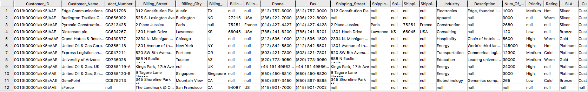

#### Operador de tabla READ_NOS

El operador de tabla READ_NOS se puede utilizar para muestrear y explorar un porcentaje de los datos sin haber definido primero una tabla externa, o para ver una lista de las claves asociadas con todos los objetos especificados por una cláusula de Location.

``` sql
SELECT top 5 payload.*
FROM READ_NOS (
 ON (SELECT CAST(NULL AS JSON CHARACTER SET Unicode))
USING
LOCATION ('/S3/s3.amazonaws.com/ptctstoutput/salesforce/1ce190bc-25a9-4493-99ad-7497b497a0d0/903790813-2020-08-21T21:02:25')
 ACCESS_ID ('A**********') /* AccessKeyId */
 ACCESS_KEY ('***********') /* SecretAccessKey */
 ) AS D
GROUP BY 1;
```

Salida:


#### Unir datos de Amazon S3 a tablas en la base de datos

La tabla externa se puede unir a una tabla en Vantage para su posterior análisis. Por ejemplo, la información de pedidos y envíos se encuentra en Vantage en estas tres tablas: Orders, Order_Items y Shipping_Address.

DDL para Orders:

``` sql
CREATE TABLE Orders (
  Order_ID INT NOT NULL,
  Customer_ID VARCHAR(20) CHARACTER SET LATIN CASESPECIFIC,
  Order_Status INT,
  -- Order status: 1 = Pending; 2 = Processing; 3 = Rejected; 4 = Completed
  Order_Date DATE NOT NULL,
  Required_Date DATE NOT NULL,
  Shipped_Date DATE,
  Store_ID INT NOT NULL,
  Staff_ID INT NOT NULL
) Primary Index (Order_ID);
```

DDL para Order_Items:

``` sql
CREATE TABLE Order_Items(
  Order_ID INT NOT NULL,
  Item_ID INT,
  Product_ID INT NOT NULL,
  Quantity INT NOT NULL,
  List_Price DECIMAL (10, 2) NOT NULL,
  Discount DECIMAL (4, 2) NOT NULL DEFAULT 0
) Primary Index (Order_ID, Item_ID);
```

DDL para Shipping_Address:

``` sql
CREATE TABLE Shipping_Address (
  Customer_ID VARCHAR(20) CHARACTER SET LATIN CASESPECIFIC NOT NULL,
  Street VARCHAR(100) CHARACTER SET LATIN CASESPECIFIC,
  City VARCHAR(20) CHARACTER SET LATIN CASESPECIFIC,
  State VARCHAR(15) CHARACTER SET LATIN CASESPECIFIC,
  Postal_Code VARCHAR(10) CHARACTER SET LATIN CASESPECIFIC,
  Country VARCHAR(20) CHARACTER SET LATIN CASESPECIFIC
) Primary Index (Customer_ID);
```

Y las tablas tienen los siguientes datos:

Orders:


Order_Items:

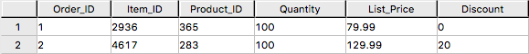

Shipping_Address:


Al unir la tabla externa de Salesforce a la tabla de base de datos establecida Orders, Order_Items y Shipping_Address, podemos recuperar la información del pedido del cliente con la información de envío del cliente.

``` sql
SELECT
  s.payload.Id as Customer_ID,
  s.payload."Name" as Customer_Name,
  s.payload.AccountNumber as Acct_Number,
  o.Order_ID as Order_ID,
  o.Order_Status as Order_Status,
  o.Order_Date as Order_Date,
  oi.Item_ID as Item_ID,
  oi.Product_ID as Product_ID,
  sa.Street as Shipping_Street,
  sa.City as Shipping_City,
  sa.State as Shipping_State,
  sa.Postal_Code as Shipping_Postal_Code,
  sa.Country as Shipping_Country
FROM
  salesforce s, Orders o, Order_Items oi, Shipping_Address sa
WHERE
  s.payload.Id = o.Customer_ID
  AND o.Customer_ID = sa.Customer_ID
  AND o.Order_ID = oi.Order_ID
ORDER BY 1;
```

Resultados:


#### Importar datos de Amazon S3 a Vantage

Tener una copia persistente de los datos de Amazon S3 puede resultar útil cuando se espera un acceso repetitivo a los mismos datos. La tabla externa NOS no realiza automáticamente una copia persistente de los datos de Amazon S3. A continuación se describen algunos enfoques para capturar los datos en la base de datos:

Se puede utilizar una instrucción "CREATE TABLE AS … WITH DATA" con la definición de tabla externa actuando como tabla de origen. Utilice este enfoque para elegir selectivamente qué atributos dentro de la carga útil de la tabla externa desea incluir en la tabla de destino y cómo se nombrarán las columnas de la tabla relacional.

``` sql
CREATE TABLE salesforceVantage AS (
  SELECT
    CAST(payload.Id AS VARCHAR(20)) Customer_ID,
    CAST(payload."Name" AS VARCHAR(100)) Customer_Name,
    CAST(payload.AccountNumber AS VARCHAR(10)) Acct_Number,
    CAST(payload.BillingStreet AS VARCHAR(20)) Billing_Street,
    CAST(payload.BillingCity AS VARCHAR(20)) Billing_City,
    CAST(payload.BillingState AS VARCHAR(10)) Billing_State,
    CAST(payload.BillingPostalCode AS VARCHAR(5)) Billing_Post_Code,
    CAST(payload.BillingCountry AS VARCHAR(20)) Billing_Country,
    CAST(payload.Phone AS VARCHAR(15)) Phone,
    CAST(payload.Fax AS VARCHAR(15)) Fax,
    CAST(payload.ShippingStreet AS VARCHAR(20)) Shipping_Street,
    CAST(payload.ShippingCity AS VARCHAR(20)) Shipping_City,
    CAST(payload.ShippingState AS VARCHAR(10)) Shipping_State,
    CAST(payload.ShippingPostalCode AS VARCHAR(5)) Shipping_Post_Code,
    CAST(payload.ShippingCountry AS VARCHAR(20)) Shipping_Country,
    CAST(payload.Industry AS VARCHAR(50)) Industry,
    CAST(payload.Description AS VARCHAR(200)) Description,
    CAST(payload.NumberOfEmployees AS INT) Num_Of_Employee,
    CAST(payload.CustomerPriority__c AS VARCHAR(10)) Priority,
    CAST(payload.Rating AS VARCHAR(10)) Rating,
    CAST(payload.SLA__c AS VARCHAR(10)) SLA,
    CAST(payload."Type" AS VARCHAR(20)) Customer_Type,
    CAST(payload.Website AS VARCHAR(100)) Customer_Website,
    CAST(payload.AnnualRevenue AS VARCHAR(10)) Annual_Revenue,
    CAST(payload.LastActivityDate AS DATE) Last_Activity_Date
  FROM salesforce)
WITH DATA
NO PRIMARY INDEX;
```

* `SELECT* * *FROM* salesforceVantage;` resultados parciales:


Una alternativa al uso de una tabla externa es utilizar el operador de tabla READ_NOS. Este operador de tabla le permite acceder a datos directamente desde un almacén de objetos sin crear primero una tabla externa. Combinando READ_NOS con una cláusula CREATE TABLE AS para crear una versión persistente de los datos en la base de datos.

``` sql
CREATE TABLE salesforceReadNOS AS (
 SELECT
    CAST(payload.Id AS VARCHAR(20)) Customer_ID,
    CAST(payload."Name" AS VARCHAR(100)) Customer_Name,
    CAST(payload.AccountNumber AS VARCHAR(10)) Acct_Number,
    CAST(payload.BillingStreet AS VARCHAR(20)) Billing_Street,
    CAST(payload.BillingCity AS VARCHAR(20)) Billing_City,
    CAST(payload.BillingState AS VARCHAR(10)) Billing_State,
    CAST(payload.BillingPostalCode AS VARCHAR(5)) Billing_Post_Code,
    CAST(payload.BillingCountry AS VARCHAR(20)) Billing_Country,
    CAST(payload.Phone AS VARCHAR(15)) Phone,
    CAST(payload.Fax AS VARCHAR(15)) Fax,
    CAST(payload.ShippingStreet AS VARCHAR(20)) Shipping_Street,
    CAST(payload.ShippingCity AS VARCHAR(20)) Shipping_City,
    CAST(payload.ShippingState AS VARCHAR(10)) Shipping_State,
    CAST(payload.ShippingPostalCode AS VARCHAR(5)) Shipping_Post_Code,
    CAST(payload.ShippingCountry AS VARCHAR(20)) Shipping_Country,
    CAST(payload.Industry AS VARCHAR(50)) Industry,
    CAST(payload.Description AS VARCHAR(200)) Description,
    CAST(payload.NumberOfEmployees AS INT) Num_Of_Employee,
    CAST(payload.CustomerPriority__c AS VARCHAR(10)) Priority,
    CAST(payload.Rating AS VARCHAR(10)) Rating,
    CAST(payload.SLA__c AS VARCHAR(10)) SLA,
    CAST(payload."Type" AS VARCHAR(20)) Customer_Type,
    CAST(payload.Website AS VARCHAR(100)) Customer_Website,
    CAST(payload.AnnualRevenue AS VARCHAR(10)) Annual_Revenue,
    CAST(payload.LastActivityDate AS DATE) Last_Activity_Date
  FROM READ_NOS (
    ON (SELECT CAST(NULL AS JSON CHARACTER SET Unicode))
    USING
      LOCATION ('/S3/s3.amazonaws.com/ptctstoutput/salesforce/1ce190bc-25a9-4493-99ad-7497b497a0d0/903790813-2020-08-21T21:02:25')
      ACCESS_ID ('A**********') /* AccessKeyId */
      ACCESS_KEY ('***********') /* SecretAccessKey */
  ) AS D
) WITH DATA;
```

Resultados de la tabla `salesforceReadNOS`:

``` sql
SELECT * FROM salesforceReadNOS;
```

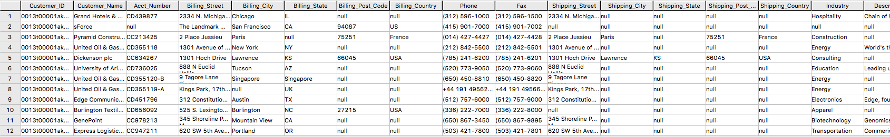

Otra forma de colocar datos de Amazon S3 en una tabla relacional es mediante "INSERT SELECT". Con este enfoque, la tabla externa es la tabla de origen, mientras que una tabla permanente recién creada es la tabla en la que se insertará. Al contrario del ejemplo READ_NOS anterior, este enfoque requiere que la tabla permanente se cree de antemano.

Una ventaja del método INSERT SELECT es que puede cambiar los atributos de la tabla de destino. Por ejemplo, puede especificar que la tabla de destino sea `MULTISET` o no, o puede elegir un índice principal diferente.

``` sql
CREATE TABLE salesforcePerm, FALLBACK ,
NO BEFORE JOURNAL,
NO AFTER JOURNAL,
CHECKSUM = DEFAULT,
DEFAULT MERGEBLOCKRATIO,
MAP = TD_MAP1
(
  Customer_Id VARCHAR(20) CHARACTER SET LATIN NOT CASESPECIFIC,
  Customer_Name VARCHAR(100) CHARACTER SET LATIN NOT CASESPECIFIC,
  Acct_Number VARCHAR(10) CHARACTER SET LATIN NOT CASESPECIFIC,
  Billing_Street VARCHAR(20) CHARACTER SET LATIN NOT CASESPECIFIC,
  Billing_City VARCHAR(20) CHARACTER SET LATIN NOT CASESPECIFIC,
  Billing_State VARCHAR(10) CHARACTER SET LATIN NOT CASESPECIFIC,
  Billing_Post_Code VARCHAR(5) CHARACTER SET LATIN NOT CASESPECIFIC,
  Billing_Country VARCHAR(20) CHARACTER SET LATIN NOT CASESPECIFIC,
  Phone VARCHAR(15) CHARACTER SET LATIN NOT CASESPECIFIC,
  Fax VARCHAR(15) CHARACTER SET LATIN NOT CASESPECIFIC,
  Shipping_Street VARCHAR(20) CHARACTER SET LATIN NOT CASESPECIFIC,
  Shipping_City VARCHAR(20) CHARACTER SET LATIN NOT CASESPECIFIC,
  Shipping_State VARCHAR(10) CHARACTER SET LATIN NOT CASESPECIFIC,
  Shipping_Post_Code VARCHAR(5) CHARACTER SET LATIN NOT CASESPECIFIC,
  Shipping_Country VARCHAR(20) CHARACTER SET LATIN NOT CASESPECIFIC,
  Industry VARCHAR(50) CHARACTER SET LATIN NOT CASESPECIFIC,
  Description VARCHAR(200) CHARACTER SET LATIN NOT CASESPECIFIC,
  Num_Of_Employee INT,
  Priority VARCHAR(10) CHARACTER SET LATIN NOT CASESPECIFIC,
  Rating VARCHAR(10) CHARACTER SET LATIN NOT CASESPECIFIC,
  SLA VARCHAR(10) CHARACTER SET LATIN NOT CASESPECIFIC,
  Customer_Type VARCHAR(20) CHARACTER SET LATIN NOT CASESPECIFIC,
  Customer_Website VARCHAR(100) CHARACTER SET LATIN NOT CASESPECIFIC,
  Annual_Revenue VARCHAR(10) CHARACTER SET LATIN NOT CASESPECIFIC,
  Last_Activity_Date DATE
) PRIMARY INDEX (Customer_ID);
```

``` sql
INSERT INTO salesforcePerm
  SELECT
    CAST(payload.Id AS VARCHAR(20)) Customer_ID,
    CAST(payload."Name" AS VARCHAR(100)) Customer_Name,
    CAST(payload.AccountNumber AS VARCHAR(10)) Acct_Number,
    CAST(payload.BillingStreet AS VARCHAR(20)) Billing_Street,
    CAST(payload.BillingCity AS VARCHAR(20)) Billing_City,
    CAST(payload.BillingState AS VARCHAR(10)) Billing_State,
    CAST(payload.BillingPostalCode AS VARCHAR(5)) Billing_Post_Code,
    CAST(payload.BillingCountry AS VARCHAR(20)) Billing_Country,
    CAST(payload.Phone AS VARCHAR(15)) Phone,
    CAST(payload.Fax AS VARCHAR(15)) Fax,
    CAST(payload.ShippingStreet AS VARCHAR(20)) Shipping_Street,
    CAST(payload.ShippingCity AS VARCHAR(20)) Shipping_City,
    CAST(payload.ShippingState AS VARCHAR(10)) Shipping_State,
    CAST(payload.ShippingPostalCode AS VARCHAR(5)) Shipping_Post_Code,
    CAST(payload.ShippingCountry AS VARCHAR(20)) Shipping_Country,
    CAST(payload.Industry AS VARCHAR(50)) Industry,
    CAST(payload.Description AS VARCHAR(200)) Description,
    CAST(payload.NumberOfEmployees AS INT) Num_Of_Employee,
    CAST(payload.CustomerPriority__c AS VARCHAR(10)) Priority,
    CAST(payload.Rating AS VARCHAR(10)) Rating,
    CAST(payload.SLA__c AS VARCHAR(10)) SLA,
    CAST(payload."Type" AS VARCHAR(20)) Customer_Type,
    CAST(payload.Website AS VARCHAR(100)) Customer_Website,
    CAST(payload.AnnualRevenue AS VARCHAR(10)) Annual_Revenue,
    CAST(payload.LastActivityDate AS DATE) Last_Activity_Date
  FROM salesforce;
```

``` sql
SELECT * FROM salesforcePerm;
```

Resultados de muestra:

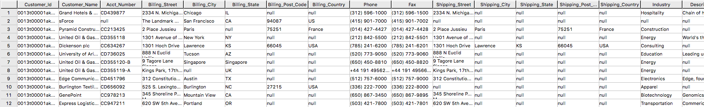

### Exporte los datos de Vantage a Amazon S3 usando NOS

Tengo una tabla `newleads` con 1 fila en el sistema Vantage.

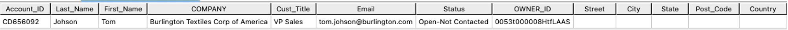

Tenga en cuenta que no hay información de dirección para este cliente potencial. Usemos la información de la cuenta recuperada de Salesforce para actualizar la `newleads` tabla

``` sql
UPDATE nl
FROM
  newleads AS nl,
  salesforceReadNOS AS srn
SET
  Street = srn.Billing_Street,
  City = srn.Billing_City,
  State = srn.Billing_State,
  Post_Code = srn.Billing_Post_Code,
  Country = srn.Billing_Country
  WHERE Account_ID = srn.Acct_Number;
```

Ahora el nuevo cliente potencial tiene información de dirección.

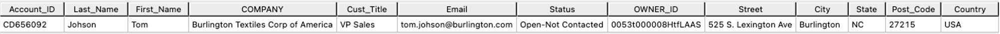

Escriba la nueva información del cliente potencial en el depósito S3 usando WRITE_NOS.

``` sql , id="salesforce_first_run", role="content-editable emits-gtm-events"
SELECT * FROM WRITE_NOS (
ON (
  SELECT
    Account_ID,
    Last_Name,
    First_Name,
    Company,
    Cust_Title,
    Email,
    Status,
    Owner_ID,
    Street,
    City,
    State,
    Post_Code,
    Country
  FROM newleads
)
USING
  LOCATION ('/s3/vantageparquet.s3.amazonaws.com/')
  AUTHORIZATION ('{"Access_ID":"A*****","Access_Key":"*****"}')
  COMPRESSION ('SNAPPY')
  NAMING ('DISCRETE')
  INCLUDE_ORDERING ('FALSE')
  STOREDAS ('CSV')
) AS d;
```

Donde Access_ID es AccessKeyID y Access_Key es SecretAccessKey del depósito.

### Crear un flujo de Amazon S3 a Salesforce

Repita el paso 1 para crear un flujo utilizando Amazon S3 como origen y Salesforce como destino.

#### Paso 1. Especificar los detalles del flujo

Este paso proporciona información básica para su flujo.

Complete *Nombre del flujo* (es decir, _vantage2sf_) y *Descripción del flujo (opcional)*, deje *Personalizar la configuración de cifrado (avanzado)* sin marcar. Haga clic en *Siguiente*.

#### Paso 2. Configurar el flujo

Este paso proporciona información sobre el origen y el destino de su flujo. En este ejemplo, utilizaremos *_Amazon S3_* como origen y *_Salesforce_* como destino.

* Para *Detalles de origen*, elija _Amazon S3_, posteriormente elija el depósito donde escribió su archivo CSV (es decir, vantagecsv)
* Para *Detalles de destino*, elija _Salesforce_, use la conexión que creó en el Paso 1 de la lista desplegable para *Elegir la conexión de Salesforce* y _Lead_ como *Elegir objeto de Salesforce*.
* Para *Manejo de errores*, utilice el valor predeterminado _Detener la ejecución del flujo actual_.
* *Disparador de flujos* es _Ejecutar bajo demanda_. Haga clic en *Siguiente*.

#### Paso 3. Asignar los campos de datos

Este paso determina cómo se transfieren los datos desde el origen al destino.

* Utilice _Asignar campos manualmente_ como *Método de asignación*
* Utilice _Insertar nuevos registros (predeterminado)_ como *Preferencia de registro de destino*
* Para *Asignación de archivado de origen a destino*, utilice la siguiente asignación
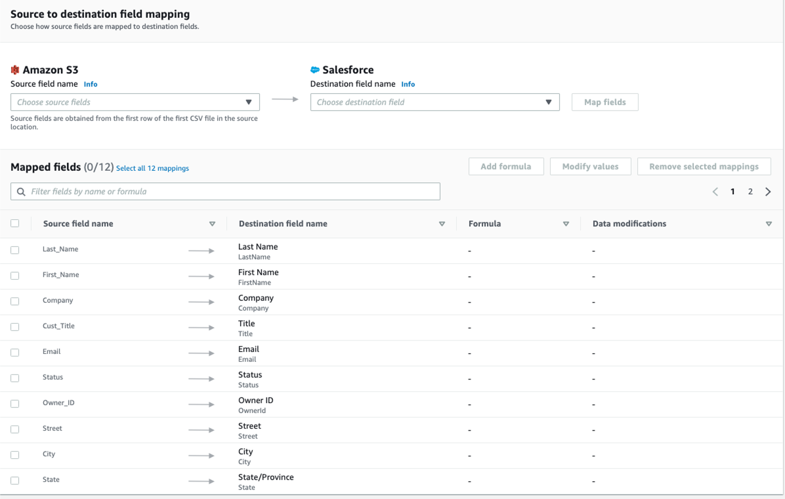


* Haga clic en *Siguiente*.

#### Paso 4. Agregar filtros

Puede especificar un filtro para determinar qué registros transferir. Para este ejemplo, no se agrega ningún filtro. Haga clic en *Siguiente*.

#### Paso 5. Revisar y crear

Revise toda la información que acaba de introducir. Modifíquela si es necesario. Haga clic en *Crear flujo*.

Se mostrará un mensaje de creación exitosa del flujo con la información del flujo una vez que se cree el flujo.

#### Flujo de ejecución

Haga clic en *Flujo de ejecución* en la esquina superior derecha.

Al finalizar la ejecución del flujo, se mostrará un mensaje para indicar una ejecución exitosa.

Ejemplo de mensaje:

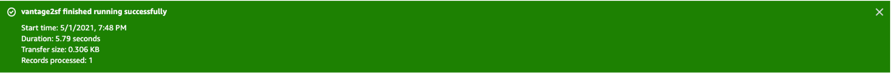

Vaya a la página de Salesforce; se agregó el nuevo cliente potencial Tom Johnson.

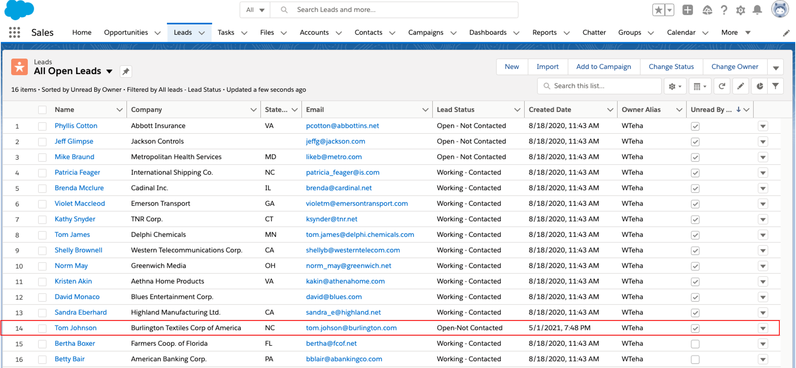

### Limpieza (opcional)

Una vez que haya terminado con los datos de Salesforce, para evitar incurrir en cargos en su cuenta de AWS (es decir, [AppFlow](https://aws.amazon.com/appflow/pricing/), Amazon [S3](https://aws.amazon.com/s3/pricing), [Vantage](https://www.teradata.com/Cloud/AWS/Do-it-Yourself/Pricing) y [VM](https://aws.amazon.com/ec2/pricing/)) por los recursos utilizados, siga estos pasos:

1. AppFlow:
    * Elimine las "Conexiones" que creó para el flujo
    * Elimine los flujos

2. Depósito y archivo de Amazon S3:
    * Vaya a los depósitos de Amazon S3 donde está almacenado el archivo de datos de Vantage y elimine los archivos
    * Si no es necesario conservar los depósitos, elimínelos

3. Instancia de Teradata Vantage
    * Detenga/termine la instancia si ya no es necesaria

import CommunityLinkPartial from '../_partials/community_link.mdx';

<CommunityLinkPartial />
