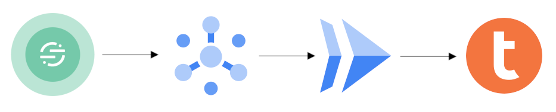

import ClearscapeDocsNote from '../_partials/vantage_clearscape_analytics.mdx'
import CommunityLink from '../_partials/community_link.mdx'
import tabsDBT from '../_partials/tabsDBT.mdx'

# Almacenar eventos de Twilio Segment

## Información general
Esta solución escucha eventos de Twilio Segment y escribe datos en una instancia de Teradata Vantage. El ejemplo utiliza Google Cloud, pero se puede traducir a cualquier plataforma en la nube.

## Arquitectura

En esta solución, Twilio Segment escribe datos de eventos sin procesar en Google Cloud Pub/Sub. Pub/Sub reenvía eventos a una aplicación Cloud Run. La aplicación Cloud Run escribe datos en una base de datos Teradata Vantage. Es una solución sin servidor que no requiere asignación ni administración de ninguna máquina virtual.



## Despliegue

### Prerrequisitos
1. Una cuenta de Google Cloud. Si no tiene una cuenta, puede crear una en https://console.cloud.google.com/.
2. `gcloud` instalado. Consulte https://cloud.google.com/sdk/docs/install.
3. Una instancia de Teradata Vantage con la que Google Cloud Run pueda comunicarse.

<ClearscapeDocsNote />

### Construir e implementar

1. Clone el repositorio de muestra:
```
git clone git@github.com:Teradata/segment-integration-tutorial.git
```

2. El repositorio contiene el archivo `segment.sql` que configura la base de datos, el script en su base de datos Vantage usando su IDE SQL favorito, [Estudio Teradata](https://downloads.teradata.com/download/tools/teradata-studio) o una herramienta de línea de comandos llamada `bteq` (descarga para [Windows](https://downloads.teradata.com/node/7314), [Linux](https://downloads.teradata.com/node/200442), [macOS](https://downloads.teradata.com/node/201214).
El script SQL creará una nueva base de datos llamada `Segment` y un conjunto de tablas para almacenar eventos de segmento.

3. Establezca el proyecto y la región predeterminados:
```
gcloud config set project <PROJECT_ID>
gcloud config set compute/region <REGION>
```

4. Recupere la identificación del proyecto y el número. Lo necesitaremos en pasos posteriores:
```
export PROJECT_ID=$(gcloud config get-value project)

export PROJECT_NUMBER=$(gcloud projects list \
  --filter="$(gcloud config get-value project)" \
  --format="value(PROJECT_NUMBER)")
```

5. Habilite los servicios requeridos de Google Cloud:
```
gcloud services enable cloudbuild.googleapis.com containerregistry.googleapis.com run.googleapis.com secretmanager.googleapis.com pubsub.googleapis.com
```

6. Cree la aplicación:
```
gcloud builds submit --tag gcr.io/$PROJECT_ID/segment-listener
```

7. Defina una clave API que compartirá con Segment. Guarde la clave API en Google Cloud Secret Manager:
```
gcloud secrets create VANTAGE_USER_SECRET
echo -n 'dbc' > /tmp/vantage_user.txt
gcloud secrets versions add VANTAGE_USER_SECRET --data-file=/tmp/vantage_user.txt

gcloud secrets create VANTAGE_PASSWORD_SECRET
echo -n 'dbc' > /tmp/vantage_password.txt
gcloud secrets versions add VANTAGE_PASSWORD_SECRET --data-file=/tmp/vantage_password.txt
```

8. La aplicación que escribe datos de segmento en Vantage utilizará Cloud Run. Primero debemos permitir que Cloud Run acceda a los secretos:
```
gcloud projects add-iam-policy-binding $PROJECT_ID \
     --member=serviceAccount:$PROJECT_NUMBER-compute@developer.gserviceaccount.com \
     --role=roles/secretmanager.secretAccessor
```

9. Implemente la aplicación en Cloud Run (reemplace `<VANTAGE_HOST>` con el nombre de host o IP de su base de datos Teradata Vantage). La segunda declaración de exportación guarda la URL del servicio tal como la necesitamos para comandos posteriores:
```
gcloud run deploy --image gcr.io/$PROJECT_ID/segment-listener segment-listener \
  --region $(gcloud config get-value compute/region) \
  --update-env-vars VANTAGE_HOST=35.239.251.1 \
  --update-secrets 'VANTAGE_USER=VANTAGE_USER_SECRET:1, VANTAGE_PASSWORD=VANTAGE_PASSWORD_SECRET:1' \
  --no-allow-unauthenticated

export SERVICE_URL=$(gcloud run services describe segment-listener --platform managed --region $(gcloud config get-value compute/region) --format 'value(status.url)')
```

10. Crea un tema de Pub/Sub que recibirá eventos del segmento:
```
gcloud pubsub topics create segment-events
```

11. Crea una cuenta de servicio que Pub/Sub utilizará para invocar la aplicación Cloud Run:
```
gcloud iam service-accounts create cloud-run-pubsub-invoker \
     --display-name "Cloud Run Pub/Sub Invoker"
```

12. Otorgue permiso a la cuenta de servicio para invocar Cloud Run:
```
gcloud run services add-iam-policy-binding segment-listener \
  --region $(gcloud config get-value compute/region) \
  --member=serviceAccount:cloud-run-pubsub-invoker@$PROJECT_ID.iam.gserviceaccount.com \
  --role=roles/run.invoker
```

13. Permita que Pub/Sub cree tokens de autenticación en su proyecto:
```
gcloud projects add-iam-policy-binding $PROJECT_ID \
  --member=serviceAccount:service-$PROJECT_NUMBER@gcp-sa-pubsub.iam.gserviceaccount.com \
  --role=roles/iam.serviceAccountTokenCreator
```

14. Crea una suscripción Pub/Sub con la cuenta de servicio:
```
gcloud pubsub subscriptions create segment-events-cloudrun-subscription --topic projects/$PROJECT_ID/topics/segment-events \
   --push-endpoint=$SERVICE_URL \
   --push-auth-service-account=cloud-run-pubsub-invoker@$PROJECT_ID.iam.gserviceaccount.com \
   --max-retry-delay 600 \
   --min-retry-delay 30
```

15. Permita que Segment publique en su tema. Para hacerlo, asigne el rol `pubsub@segment-integrations.iam.gserviceaccount.com` `Pub/Sub Publisher` en su proyecto en https://console.cloud.google.com/cloudpubsub/topic/list. Consulte el [Manual de segmentos](https://segment.com/docs/connections/destinations/catalog/google-cloud-pubsub/#authentication) para obtener más detalles.

16. Configure su Google Cloud Pub/Sub como destino en Segment. Utilice el tema completo `projects/<PROJECT_ID>/topics/segment-events` y asigne todos los tipos de eventos de segmento (usando el carácter `*`) al tema.

## Pruébalo

1. Utilice la funcionalidad Probador de eventos de Segment para enviar una carga útil de muestra al tema. Verifique que los datos de muestra se hayan almacenado en Vantage.

## Limitaciones

* El ejemplo muestra cómo implementar la aplicación en una sola región. En muchos casos, esta configuración no garantiza suficiente tiempo de actividad. La aplicación Cloud Run debe implementarse en más de una región detrás de un Global Load Balancer.

## Resumen

Este tutorial demuestra cómo enviar eventos de Segment a Teradata Vantage. La configuración reenvía eventos de Segment a Google Cloud Pub/Sub y luego a una aplicación Cloud Run. La aplicación escribe datos en Teradata Vantage.

## Lectura adicional
* [Documentación de destino de Pub/Sub de Segment](https://segment.com/docs/connections/destinations/catalog/google-cloud-pubsub/)

<CommunityLink />