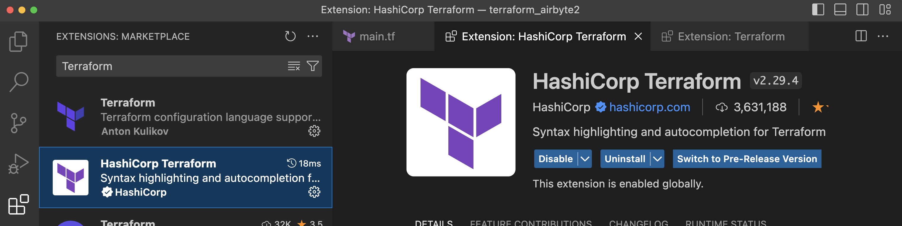
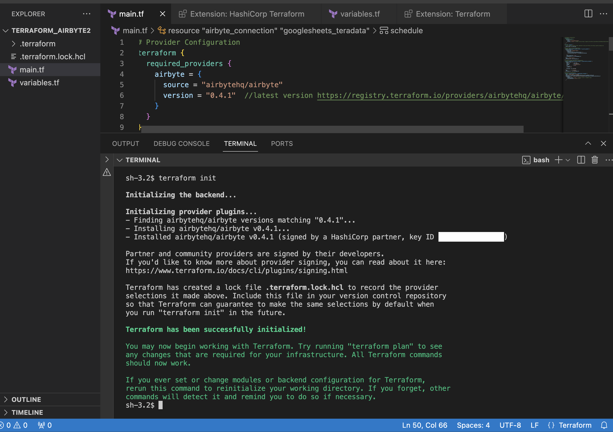
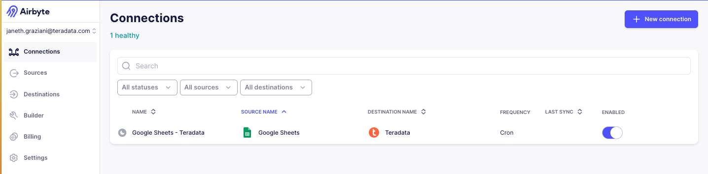

import YouTubeVideo from '../_partials/terraform-video.mdx';
import Tabs from '@theme/Tabs';
import TabItem from '@theme/TabItem';

# Administre las canalizaciones de ELT como código con Terraform y Airbyte en Teradata Vantage 


### Información general 

En este inicio rápido se explica cómo usar Terraform para administrar las canalizaciones de Airbyte como código. En lugar de realizar configuraciones manuales a través de la interfaz de usuario web, usaremos código para crear y administrar los recursos de Airbyte. El ejemplo proporcionado ilustra un flujo de datos de ELT básico desde Google Sheets a Teradata Vantage mediante el proveedor Terraform de Airbyte.

El proveedor Terraform de Airbyte está disponible para usuarios de Airbyte Cloud, OSS y Self-Managed Enterprise. 

Vea esta explicación concisa sobre cómo funciona esta integración:

<YouTubeVideo />

### Introducción
[Terraformar](https://www.terraform.io) es una herramienta de código abierto líder en el espacio de la infraestructura como código (IaC). Permite el aprovisionamiento y la gestión automatizados de infraestructura, plataformas en la nube y servicios a través de archivos de configuración, en lugar de una configuración manual. Terraform utiliza complementos, conocidos como proveedores de Terraform, para comunicarse con hosts de infraestructura, proveedores de nube, API y plataformas SaaS. 

Airbyte, la plataforma de integración de datos, tiene un proveedor de Terraform que se comunica directamente con [API de Airbyte](https://reference.airbyte.com/reference/start). Esto permite a los ingenieros de datos administrar las configuraciones de Airbyte y aplicar control de versiones y buenas prácticas de ingeniería de datos dentro de sus procesos de ELT.

### Prerrequisitos
* [Cuenta de Airbyte Cloud](https://airbyte.com/connectors/teradata-vantage). Comience con una prueba gratuita de 14 días que se inicia después de la primera sincronización exitosa.
- Genere una clave de API de Airbyte iniciando sesión en el [portal para desarrolladores](https://portal.airbyte.com).
* Instancia de Teradata Vantage. Necesitará una base de datos `Host`, `Username` y `Password` para la configuración de Terraform de Airbyte. 
- [Crear una instancia gratuita de Teradata en ClearScape Analytics Experience](../get-access-to-vantage/clearscape-analytics-experience/getting-started-with-csae.md)

* Datos de origen. Para fines de demostración, utilizaremos una [muestra de Google Sheets](https://docs.google.com/spreadsheets/d/1XNBYUw3p7xG6ptfwjChqZ-dNXbTuVwPi7ToQfYKgJIE/edit#gid=0). Haga una copia de este en un espacio de trabajo personal de Google. 

* [API de Google Cloud Platform habilitada para su cuenta personal o de organización](https://support.google.com/googleapi/answer/6158841?hl=en]=). Deberá autenticar su cuenta de Google a través de OAuth o mediante el Autenticador de claves de cuenta de servicio. En este ejemplo, usamos [Autenticador de claves de cuenta de servicio](https://cloud.google.com/iam/docs/keys-create-delete).

### Instalar Terraform 
* Aplique los comandos correspondientes para instalar Terraform en su sistema operativo. Encontrará opciones adicionales en el [sitio de Terraform](https://developer.hashicorp.com/terraform/tutorials/aws-get-started/install-cli).


```mdx-code-block
<Tabs>
  <TabItem value="MacOS" label="MacOS" default>
    Primero, instale el "tap" de HashiCorp, un repositorio de todos los paquetes [Homebrew] (https://brew.sh).
    ```bash
      brew tap hashicorp/tap
    ```
    A continuación, instale Terraform con hashicorp/tap/terraform.
    ```bash
      brew install hashicorp/tap/terraform
    ```
  </TabItem>
  <TabItem value="Windows" label="Windows">
    [Chocolatey](https://chocolatey.org) es un sistema de gestión de paquetes gratuito y de código abierto para Windows. Instale el paquete Terraform desde la línea de comandos.
    ```bash
      choco install terraform
    ```
  </TabItem>
  <TabItem value="Linux" label="Linux">
    ```bash
    wget -O- https://apt.releases.hashicorp.com/gpg | sudo gpg --dearmor -o /usr/share/keyrings/hashicorp-archive-keyring.gpg
    echo "deb [signed-by=/usr/share/keyrings/hashicorp-archive-keyring.gpg] https://apt.releases.hashicorp.com $(lsb_release -cs) main" | sudo tee /etc/apt/sources.list.d/hashicorp.list
    sudo apt update && sudo apt install terraform 
    ```
  </TabItem>
</Tabs>
```

### Preparación del entorno

Prepare el entorno creando un directorio para la configuración de Terraform e inicialice dos archivos: `main.tf` y `variables.tf`.

``` bash
mkdir terraform_airbyte
cd terraform_airbyte
touch main.tf variables.tf
```

### Definir una canalización de datos
Defina la fuente de datos, el destino y la conexión dentro del archivo `main.tf`. Abra el archivo `main.tf` recién creado en Visual Studio Code o en cualquier otro editor de código que elija.

- Si utiliza Visual Studio Code, instale [Extensiones de Terraform de HashiCorp](https://marketplace.visualstudio.com/items?itemName=HashiCorp.terraform) para agregar funciones de autocompletado y resaltado de sintaxis. También puede agregar [Terraform de Anton Kuliko](https://marketplace.visualstudio.com/items?itemName=4ops.terraform) para obtener compatibilidad con el lenguaje de configuración. 



Complete el archivo main.tf con la plantilla proporcionada.
``` bash
# Provider Configuration
terraform {
  required_providers {
    airbyte = {
      source = "airbytehq/airbyte"
      version = "0.4.1"  // Latest Version https://registry.terraform.io/providers/airbytehq/airbyte/latest
    }
  }
}
provider "airbyte" {
  // If running on Airbyte Cloud, generate & save the API key from https://portal.airbyte.com
  bearer_auth = var.api_key
}
# Google Sheets Source Configuration
resource "airbyte_source_google_sheets" "my_source_gsheets" {
  configuration = {
    source_type = "google-sheets"
     credentials = {
      service_account_key_authentication = {
        service_account_info = var.google_private_key
      }
    }
    names_conversion = true,
    spreadsheet_id = var.spreadsheet_id
  }
  name = "Google Sheets"
  workspace_id = var.workspace_id
}
# Teradata Vantage Destination Configuration
# For optional parameters visit https://registry.terraform.io/providers/airbytehq/airbyte/latest/docs/resources/destination_teradata 
resource "airbyte_destination_teradata" "my_destination_teradata" {
  configuration = {
    host            = var.host
    password        = var.password
    schema          = "airbyte_td_two"
    ssl             = false
    ssl_mode = {
      allow = {}
    }
    username = var.username
  }
  name          = "Teradata"
  workspace_id  = var.workspace_id
}
# Connection Configuration 
resource "airbyte_connection" "googlesheets_teradata" {
  name = "Google Sheets - Teradata"
  source_id = airbyte_source_google_sheets.my_source_gsheets.source_id
  destination_id = airbyte_destination_teradata.my_destination_teradata.destination_id
    schedule = {
      schedule_type = "cron" // "manual"
      cron_expression = "0 15 * * * ?" # This sets the data sync to run every 15 minutes of the hour
    }
  }
```

Tenga en cuenta que este ejemplo utiliza una expresión cron para programar la transferencia de datos para que se ejecute cada 15 minutos después de la hora. 

En nuestro archivo `main.tf` hacemos referencia a las variables que se encuentran en el archivo `variables.tf`, incluidas la clave API, el ID del espacio de trabajo, el ID de Google Sheets, la clave privada de Google y las credenciales de Teradata Vantage. Copie la siguiente plantilla en el archivo `variables.tf` y complétela con los valores de configuración adecuados en el atributo `default`.

### Configuración del archivo variables.tf

``` bash
#log in to https://portal.airbyte.com generate, save and populate the variable with an API key
variable "api_key" {
    type = string
    default = ""
}
#workspace_id is found in the url to the Airbyte Cloud account https://cloud.airbyte.com/workspaces/<workspace_id>/settings/dbt-cloud 
variable "workspace_id" {
    type = string
    default = ""
} 

#Google spreadsheet id and Google private key
variable "spreadsheet_id" {
    type = string
    default = ""
}
variable "google_private_key" {
  type = string
  default =  ""
}
# Teradata Vantage connection credentials
variable "host" {
  type = string
  default = ""
  }
variable "username" {
  type = string
  default = "demo_user"
  }
  variable "password" {
  type = string
  default = ""
  }
```

### Comandos de ejecución

Ejecute el complemento del proveedor desplegable `terraform init` desde la página del proveedor de Terraform e inicialice un directorio de Terraform que funcione.

Este comando solo debe ejecutarse después de escribir una nueva configuración de Terraform o clonar una existente desde el control de versiones.



Ejecute `terraform plan` para mostrar el plan de ejecución que Terraform utilizará para crear recursos y realizar modificaciones en la infraestructura. 

Para este ejemplo se crea un plan para 3 nuevos recursos:

Conexión: # Se creará airbyte_connection.googlesheets_teradata

Destino: # Se creará airbyte_connection.googlesheets_teradata

Fuente: # Se creará airbyte_source_google_sheets.my_source_gsheets
  


Ejecute `terraform apply` y `yes` para generar un plan y llevarlo a cabo.


El archivo `terraform.tfstate` se crea después de ejecutar `terraform apply` por primera vez. Este archivo rastrea el estado de todas las fuentes, destinos y conexiones administradas por Terraform. Para ejecuciones posteriores de `Terraform apply`, Terraform compara el código del archivo `main.tf` con el código almacenado en el archivo `tfstate`. Si se agregan o eliminan recursos en `main.tf`, Terraform actualiza automáticamente tanto la implementación como el archivo `.tfstate` según el momento específico de la implementación. No modifique este archivo manualmente.

Ahora dispone de una fuente, un destino y una conexión en Airbyte Cloud creados y administrados a través de Terraform. 



### Recursos adicionales 

- [Utilizar Airbyte para cargar datos de fuentes externas en Teradata Vantage](./use-airbyte-to-load-data-from-external-sources-to-teradata-vantage.md)
- [Transformar datos cargados con Airbyte mediante dbt](./transforming-external-data-loaded-via-airbyte-in-teradata-vantage-using-dbt.md)
- [documentación de referencia de la API de Airbyte](https://reference.airbyte.com/reference/createsource).
- [Documentación del proveedor de Airbyte de Terraform](https://registry.terraform.io/providers/airbytehq/airbyte/latest/docs/resources/destination_teradata#example-usage)