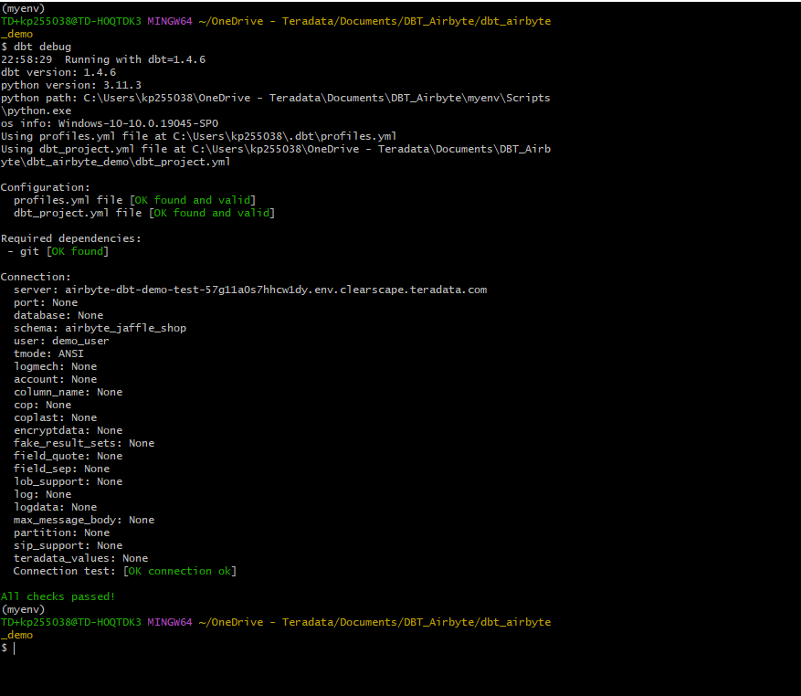
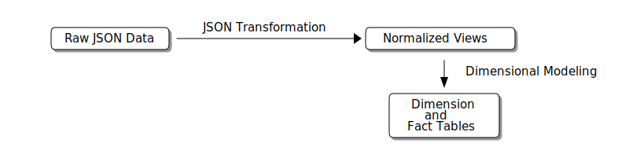
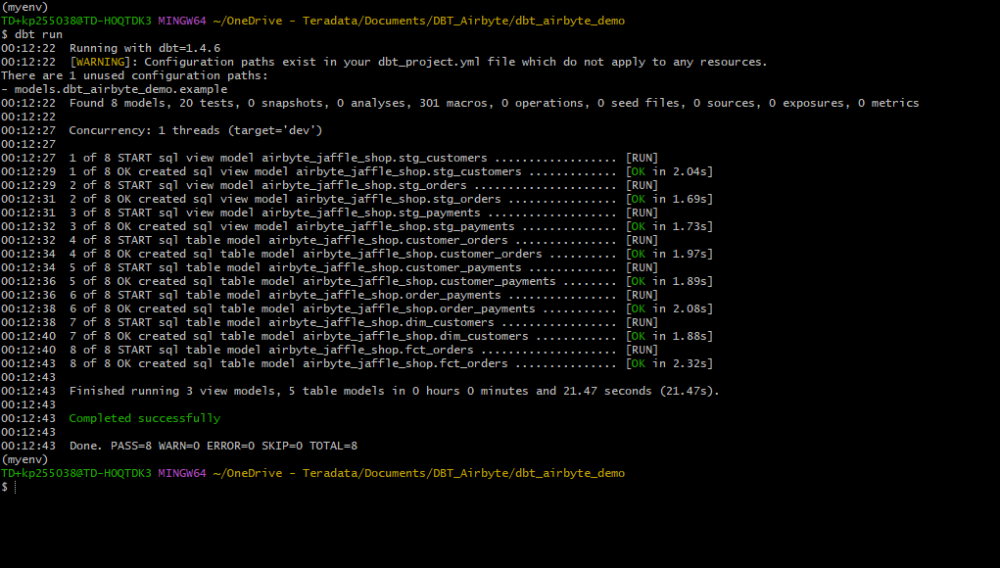
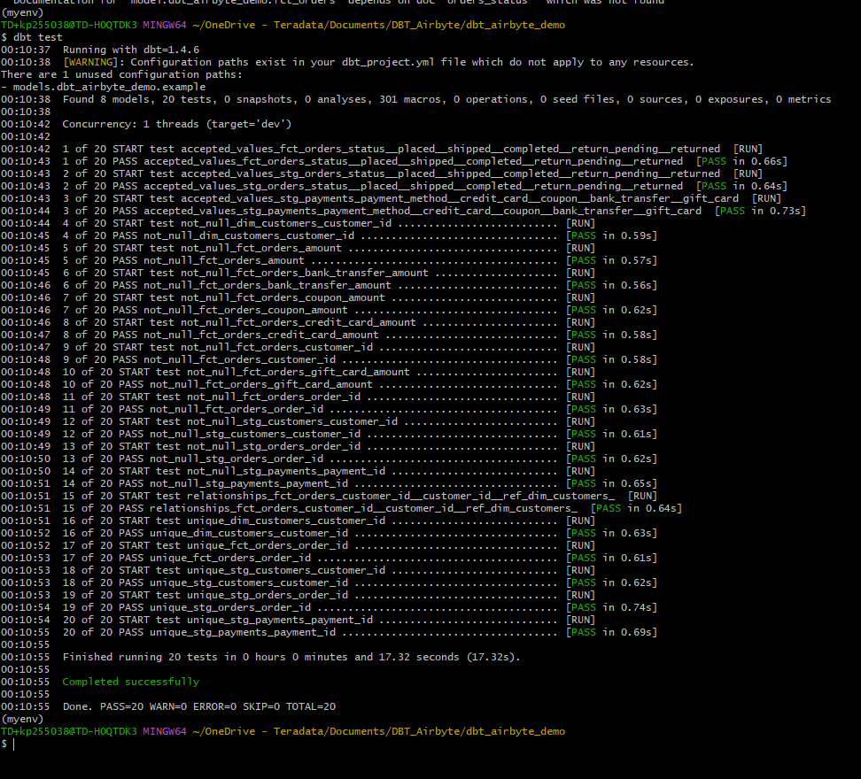
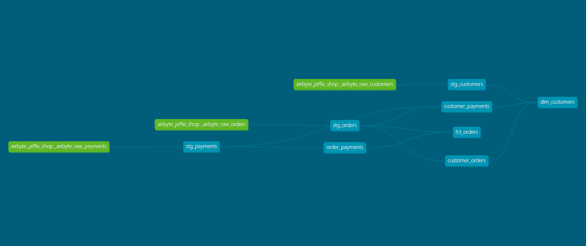

# Transformar datos cargados con Airbyte mediante dbt

## Información general

Este tutorial demuestra cómo utilizar [dbt (Data Build Tool)](https://docs.getdbt.com/docs/introduction) para transformar la carga de datos externos a través de [Airbyte](https://github.com/airbytehq/airbyte) (una herramienta de extracción de carga de código abierto) en Teradata Vantage. 

Este tutorial se basa en el [tutorial de Jaffle Shop sobre dbt](https://github.com/dbt-labs/jaffle_shop-dev) original con un pequeño cambio; en lugar de usar el comando `dbt seed`, el conjunto de datos de Jaffle Shop se carga desde Google Sheets en Teradata Vantage usando Airbyte. Los datos cargados a través de airbyte están contenidos en columnas JSON como se puede ver en la siguiente imagen:


## Prerrequisitos

import ClearscapeDocsNote from '../_partials/vantage_clearscape_analytics.mdx'

* Acceso a una instancia de Teradata Vantage.
  <ClearscapeDocsNote />
* Datos de muestra: los datos de muestra del [conjunto de datos de Jaffle Shop](https://docs.google.com/spreadsheets/d/1-R4F3q8J9KDnFRWpiT3Ysp1RlOoUu3PeQR7xDeLxFts/edit#gid=42273685) se pueden encontrar en Google Sheets.
* Referencia del repositorio del proyecto dbt: [Proyecto Jaffle con Airbyte.](https://github.com/Teradata/airbyte-dbt-jaffle)
* Python 3.7, 3.8, 3.9, 3.10 o 3.11 instalado.

## Carga de datos de muestra
* Siga los pasos del [tutorial de Airbyte](./use-airbyte-to-load-data-from-external-sources-to-teradata-vantage.md). Asegúrese de cargar datos de la [hoja de cálculo de Jaffle Shop](https://docs.google.com/spreadsheets/d/1-R4F3q8J9KDnFRWpiT3Ysp1RlOoUu3PeQR7xDeLxFts/edit#gid=42273685) y no del conjunto de datos predeterminado al que se hace referencia en el tutorial de Airbyte. Además, establezca `Default Schema` en el destino de Teradata en `airbyte_jaffle_shop`.

:::note
Cuando configura un destino de Teradata en Airbyte, le pedirá un `Default Schema`. Establezca `Default Schema` en `airbyte_jaffle_shop`. 
:::

## Clonar el proyecto
Clone el repositorio del tutorial y cambie el directorio al directorio del proyecto:

```bash
git clone https://github.com/Teradata/airbyte-dbt-jaffle
cd airbyte-dbt-jaffle
```

## Instalar dbt
* Cree un nuevo entorno de python para administrar dbt y sus dependencias. Activar el entorno:

    ```bash
    python3 -m venv env
    source env/bin/activate
    ```


    :::note
    You can activate the virtual environment in Windows by executing the corresponding batch file `./myenv/Scripts/activate`.
    :::

* Instale el módulo `dbt-teradata` y sus dependencias. El módulo dbt principal se incluye como dependencia, por lo que no es necesario instalarlo por separado:

    ```bash
    pip install dbt-teradata
    ```

## Configurar dbt
* Inicialice un proyecto dbt.

    ```bash
    dbt init
    ```


    The dbt project wizard will ask you for a project name and database management system to use in the project. In this demo, we define the project name as `dbt_airbyte_demo`. Since we are using the dbt-teradata connector, the only database management system available is Teradata.

    
    
    

* Configure el archivo `profiles.yml` ubicado en el directorio `$HOME/.dbt`. Si el archivo `profiles.yml` no está presente, puede crear uno nuevo. 
* Ajuste `server`, `username`, `password` para que coincida con `HOST`, `Username`, `Password` de su instancia de Teradata respectivamente. 
* En esta configuración, `schema` representa la base de datos que contiene los datos de muestra; en nuestro caso, ese es el esquema predeterminado que definimos en Airbyte `airbyte_jaffle_shop`.

    ``` yaml , id="dbt_first_config", role="emits-gtm-events"
    dbt_airbyte_demo:
      target: dev
      outputs:
        dev:
          type: teradata
          server: <host>
          schema: airbyte_jaffle_shop
          username: <user>
          password: <password>
          tmode: ANSI
    ```

* Una vez que el archivo `profiles.yml` esté listo, podemos validar la configuración. Vaya a la carpeta del proyecto dbt y ejecute el comando:

    ``` bash
    dbt debug
    ```

    Si el comando de depuración devolvió errores, es probable que tenga un problema con el contenido de `profiles.yml`. Si la configuración es correcta, recibirá un mensaje `All checks passed!`

    

## El proyecto dbt de Jaffle Shop

`jaffle_shop` es un restaurante ficticio que toma pedidos en línea. Los datos de este negocio constan de tablas para `customers`, `orders` y `payments` que siguen el diagrama de relaciones entre entidades a continuación:


Los datos en el sistema de origen están normalizados. A continuación se presenta un modelo dimensional basado en los mismos datos, más adecuado para herramientas de análisis:


### Transformaciones de dbt

:::note
El proyecto dbt completo que abarca las transformaciones detalladas a continuación se encuentra en [Proyecto Jaffle con Airbyte](https://github.com/Teradata/airbyte-dbt-jaffle).
:::

El proyecto dbt de referencia realiza dos tipos de transformaciones.

* Primero, transforma los datos sin procesar (en formato JSON), cargados desde Google Sheets a través de Airbyte, en vistas provisionales. En esta etapa los datos están normalizados. 
* A continuación, transforma las vistas normalizadas en un modelo dimensional listo para análisis.

El siguiente diagrama muestra los pasos de transformación en Teradata Vantage usando dbt:




Como en todos los proyectos dbt, la carpeta `models` contiene los modelos de datos que el proyecto materializa como tablas, o vistas, según las configuraciones correspondientes en el nivel de proyecto o modelo individual. 

Los modelos se pueden organizar en diferentes carpetas según su propósito en la organización del almacén/lago de datos. Los diseños de carpetas comunes incluyen una carpeta para `staging`, una carpeta para `core` y una carpeta para `marts`. Esta estructura se puede simplificar sin afectar el funcionamiento de dbt.

### Modelos provisionales
En el [tutorial de Jaffle Shop sobre dbt](https://github.com/dbt-labs/jaffle_shop-dev) original, los datos del proyecto se cargan desde archivos csv ubicados en la carpeta `./data` mediante el comando `seed` de dbt. El comando `seed` se usa habitualmente para cargar datos de tablas; sin embargo, este comando no está diseñado para realizar la carga de datos. 

En esta demostración, asumimos una configuración más típica en la que se utilizó una herramienta diseñada para la carga de datos, Airbyte, para cargar datos en el almacén/lago de datos.
Sin embargo, los datos cargados a través de Airbyte se representan como cadenas JSON sin formato. A partir de estos datos sin procesar, vamos a crear vistas de preparación normalizadas. Realizamos esta tarea a través de los siguientes modelos provisionales. 

* El modelo `stg_customers` crea la vista de almacenamiento provisional normalizada para `customers` a partir de la tabla `_airbyte_raw_customers`. 
* El modelo `stg_orders` crea la vista normalizada para `orders` a partir de la tabla `_airbyte_raw_orders`  
* El modelo `stg_payments` crea la vista normalizada para `payments` a partir de la tabla `_airbyte_raw_payments`. 

:::note
Como el método de extracción de cadenas JSON sigue siendo coherente en todos los modelos de preparación, proporcionaremos una explicación detallada de las transformaciones utilizando solo uno de estos modelos como ejemplo.  
:::

A continuación se muestra un ejemplo de transformación de datos JSON sin procesar en una vista a través del modelo `stg_orders.sql`: 
```sql
WITH source AS (
    SELECT * FROM {{ source('airbyte_jaffle_shop', '_airbyte_raw_orders')}}
),

flattened_json_data AS (
  SELECT
    _airbyte_data.JSONExtractValue('$.id') AS order_id,
    _airbyte_data.JSONExtractValue('$.user_id') AS customer_id,
    _airbyte_data.JSONExtractValue('$.order_date') AS order_date,
    _airbyte_data.JSONExtractValue('$.status') AS status
  FROM source
)


SELECT * FROM flattened_json_data
```

* En este modelo, la fuente se define como la tabla sin formato `_airbyte_raw_orders`. 
* Las columnas de esta tabla sin procesar contienen metadatos y los datos ingeridos reales. La columna de datos se llama `_airbyte_data`. 
* Esta columna es de tipo Teradata JSON. Este tipo admite el método JSONExtractValue para recuperar valores escalares del objeto JSON.
* En este modelo recuperamos cada uno de los atributos de interés y agregamos alias significativos para materializar una vista.

### Modelos dimensionales (marts)
La construcción de un modelo dimensional es un proceso de dos pasos: 

* Primero, tomamos las vistas normalizadas en `stg_orders`, `stg_customers`, `stg_payments` y construimos tablas de unión intermedias desnormalizadas `customer_orders`, `order_payments`, `customer_payments`. Encontrará las definiciones de estas tablas en `./models/marts/core/intermediate`.  
* En el segundo paso, creamos los modelos `dim_customers` y `fct_orders`. Estas constituyen las tablas del modelo dimensional que queremos exponer a nuestra herramienta de BI. Encontrará las definiciones de estas tablas en `./models/marts/core`.

### Ejecutar las transformaciones
Para ejecutar las transformaciones definidas en el proyecto dbt, ejecutamos:

```bash
dbt run
```

Obtendrá el estado de cada modelo como se indica a continuación:



### Datos de prueba
Para garantizar que los datos en el modelo dimensional sean correctos, dbt nos permite definir y ejecutar pruebas con los datos. 

Las pruebas se definen en `./models/marts/core/schema.yml` y `./models/staging/schema.yml`.  Cada columna puede tener varias pruebas configuradas en la clave `tests`. 

* Por ejemplo, esperamos que la columna `fct_orders.order_id` contenga valores únicos y no nulos. 

Para validar que los datos en las tablas creadas satisfacen las condiciones de prueba, ejecute:

``` bash
dbt test
```

Si los datos de los modelos satisfacen todos los casos de prueba, el resultado de este comando será el siguiente:



### Generar documentación

Nuestro modelo consta de unas pocas tablas. En un escenario con más fuentes de datos y un modelo dimensional más complejo, es muy importante documentar el linaje de datos y cuál es el propósito de cada uno de los modelos intermedios. 

Generar este tipo de documentación con dbt es muy sencillo.

``` bash
dbt docs generate
```

Esto generará archivos html en el directorio `./target`.

Puede iniciar su propio servidor para explorar la documentación. El siguiente comando iniciará un servidor y abrirá una pestaña del navegador con la página de inicio de los documentos:

``` bash
dbt docs serve
```

#### Gráfico de linaje



## Resumen

Este tutorial demostró cómo usar dbt para transformar datos JSON sin procesar cargados a través de Airbyte en un modelo dimensional en Teradata Vantage. El proyecto de muestra toma datos JSON sin procesar cargados en Teradata Vantage, crea vistas normalizadas y finalmente genera un data mart dimensional. Usamos dbt para transformar JSON en vistas normalizadas y múltiples comandos dbt para crear modelos (`dbt run`), probar los datos (`dbt test`) y generar y entregar documentación del modelo (`dbt docs generate`, `dbt docs serve`).


## Lectura adicional
* [Documentación de dbt](https://docs.getdbt.com/docs)
* [Documentación del complemento dbt-teradata](https://github.com/Teradata/dbt-teradata)

import CommunityLinkPartial from '../_partials/community_link.mdx';

<CommunityLinkPartial />
