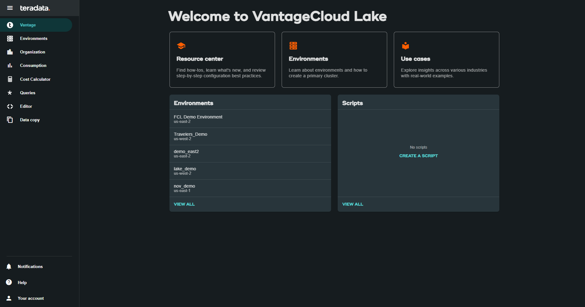
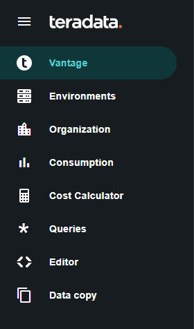
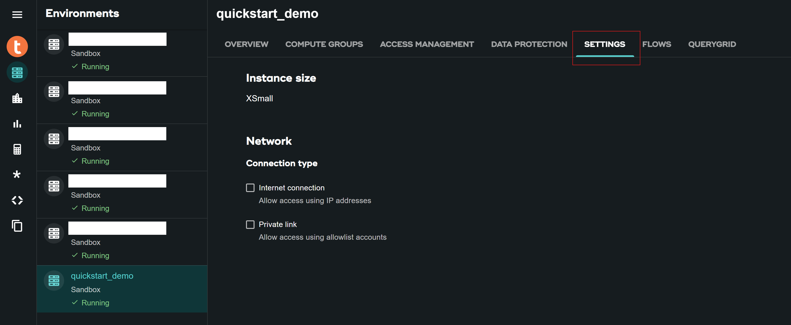

# Primeros pasos con VantageCloud Lake 

## Información general

Teradata VantageCloud Lake es la plataforma de datos y análisis nativa de la nube de próxima generación de Teradata. Proporciona patrones de implementación de Lakehouse junto con la capacidad de ejecutar cargas de trabajo elásticas independientes utilizando un diseño centrado en el almacenamiento de objetos. 

Permite a las organizaciones desbloquear sus datos, activar análisis y acelerar el valor. Los clientes pueden optimizar su entorno de análisis utilizando recursos de clúster de computación especialmente configurados que se adapten mejor a sus requisitos de carga de trabajo. 


VantageCloud Lake proporciona todos los beneficios que esperaría de una solución en la nube, además de la tecnología diferenciada de Teradata, incluida la base de datos de análisis líder en la industria, ClearScape Analytics, y el tejido de datos QueryGrid.

## Iniciar sesión en VantageCloud Lake

:::important
Para obtener un enlace de inicio de sesión y credenciales de VantageCloud Lake, complete el [formulario de contacto](https://www.teradata.com/about-us/contact) para ponerse en contacto con el equipo de Teradata.   
:::

Vaya a la URL proporcionada por Teradata, por ejemplo, **_ourcompany.innovationlabs.teradata.com_** e inicie sesión:

* Los clientes existentes pueden utilizar el nombre de usuario (dirección de correo electrónico) y la contraseña del administrador de su organización para iniciar sesión.
* El nuevo cliente puede iniciar sesión con el nombre de usuario de administrador de su organización (de la carta de bienvenida: dirección de correo electrónico) y la contraseña que usted creó. 

:::note
Haga clic [aquí](https://login.customer.teradata.com/ext/pwdreset/Identify?AdapterId=CDSCustomer) para restablecer la contraseña de administrador de la organización.
:::


Al iniciar sesión, accederá a la página de bienvenida de VantageCloud Lake.



La página de Bienvenida tiene un menú de navegación que no solo le brinda un control completo de sus entornos, sino que también le proporciona varias herramientas necesarias:



* Vantage: página de inicio del portal VantageCloud Lake
* [Entornos](https://docs.teradata.com/r/Teradata-VantageCloud-Lake/Getting-Started-First-Sign-On-by-Organization-Admin/Step-1-Signing-On-and-Creating-Your-First-Environment) - Cree sus entornos y vea todos los entornos creados
* [Organización](https://docs.teradata.com/r/Teradata-VantageCloud-Lake/Introduction-to-VantageCloud-Lake/VantageCloud-Lake-Organizations-and-Environments) - Vea la configuración de las organizaciones, administre los administradores de la organización y vea la configuración y el estado de su cuenta
* [Consumo](https://docs.teradata.com/r/Teradata-VantageCloud-Lake/Managing-Compute-Resources/Review-Consumption-Usage) - Supervise cómo su organización consume recursos informáticos y de almacenamiento
* [Calculadora de costes](https://docs.teradata.com/r/Teradata-VantageCloud-Lake/Managing-Consumption/Using-the-Consumption-Estimates) - Calcule el coste y el consumo de su entorno y de toda la organización. 
* [Consultas](https://docs.teradata.com/r/Teradata-VantageCloud-Lake/Running-and-Monitoring-Queries/Monitoring-and-Managing-Queries) - Inspeccione las consultas de un entorno para comprender su eficiencia.
* [Editor](https://docs.teradata.com/r/Teradata-VantageCloud-Lake/Running-and-Monitoring-Queries) - Cree y ejecute consultas en un editor.  
* [Copia de datos](https://docs.teradata.com/r/Teradata-VantageCloud-Lake/Data-Copy) - Aprovisione, configure y ejecute trabajos de copia de datos (también conocidos como Data Mover) desde la consola de VantageCloud Lake.


## Crear un entorno
Para crear un entorno de clúster primario, haga clic en "Entornos" en el menú de navegación. En una nueva vista abierta, haga clic en el botón "Crear" situado en la parte superior derecha de la página.


### Configuración del entorno

Complete los campos de configuración del entorno:


| **Artículo**           | **Descripción**                                                                 |
|--------------------|---------------------------------------------------------------------------------|
| *Environment name* | Un nombre contextual para el nuevo entorno                                           |
| *Region*           | La lista de regiones disponibles fue predeterminada durante el proceso de venta.            |
| *Package*          | Hay dos paquetes de servicios disponibles para seleccionar:                         |
|                    | - Lake: Soporte de nube Premier 24x7                                               |
|                    | - Lake: Soporte Premier prioritario en la nube 24x7 + modelos de datos de la industria               |


:::important
Las **Estimaciones de consumo**, a su derecha, proporcionan orientación para configurar el entorno. Consulte [Uso de las estimaciones de consumo](https://docs.teradata.com/r/Teradata-VantageCloud-Lake/Managing-Consumption/Using-the-Consumption-Estimates) para obtener más detalles.   
:::

### Configuración del clúster primario

Complete los campos de configuración del clúster primario:


```mdx-code-block

<table>
  <thead>
    <tr>
      <th>Artículo</th>
      <th>Descripción</th>
    </tr>
  </thead>
  <tbody>
    <tr>
      <td><em>Instance size</em></td>
      <td>
        Seleccione un tamaño de instancia adecuado para su caso de uso:<br />
        <strong>Lake</strong>
        <table>
          <thead>
            <tr>
              <th>Tamaño</th>
              <th>Valor (en unidades)</th>
            </tr>
          </thead>
          <tbody>
            <tr>
              <td>XSmall</td>
              <td>2</td>
            </tr>
            <tr>
              <td>Small</td>
              <td>4</td>
            </tr>
            <tr>
              <td>Medium</td>
              <td>7</td>
            </tr>
            <tr>
              <td>Large</td>
              <td>10</td>
            </tr>
            <tr>
              <td>XLarge</td>
              <td>13</td>
            </tr>
            <tr>
              <td>2XLarge</td>
              <td>20</td>
            </tr>
            <tr>
              <td>3XLarge</td>
              <td>27</td>
            </tr>
          </tbody>
        </table>
        <strong>Lake+</strong>
        <table>
          <thead>
            <tr>
              <th>Tamaño</th>
              <th>Valor (en unidades)</th>
            </tr>
          </thead>
          <tbody>
            <tr>
              <td>XSmall</td>
              <td>2.4</td>
            </tr>
            <tr>
              <td>Small</td>
              <td>4.8</td>
            </tr>
            <tr>
              <td>Medium</td>
              <td>8.4</td>
            </tr>
            <tr>
              <td>Large</td>
              <td>12</td>
            </tr>
            <tr>
              <td>XLarge</td>
              <td>15.6</td>
            </tr>
            <tr>
              <td>2XLarge</td>
              <td>24</td>
            </tr>
            <tr>
              <td>3XLarge</td>
              <td>32.4</td>
            </tr>
          </tbody>
        </table>
      </td>
    </tr>
    <tr>
      <td><em>Instance count</em></td>
      <td>2-64<br />Número de nodos en los clústeres primarios</td>
    </tr>
    <tr>
      <td><em>Instance storage</em></td>
      <td>De 1 a 72 TB por instancia</td>
    </tr>
  </tbody>
</table>


```


### Credenciales de base de datos

Complete los campos de credenciales de la base de datos:

| **Artículo**           | **Descripción**                                                                 |
|--------------------|---------------------------------------------------------------------------------|
| DBC password | La cuenta administrativa principal en un entorno Teradata Vantage se conoce como "dbc". Al igual que el usuario root en Linux, la cuenta dbc tiene privilegios administrativos completos. Se recomienda establecer usuarios administrativos adicionales para tareas rutinarias, después de crear el entorno, y abstenerse de compartir o utilizar las credenciales de dbc. |

Establezca la contraseña para dbc: 
* Entre 8 y 64 caracteres 
* Permite caracteres alfanuméricos y especiales 
* Sin palabras del diccionario 


### Opciones avanzadas

Para comenzar rápidamente, puede seleccionar **Usar valores predeterminados** o definir la configuración de opciones adicionales.


```mdx-code-block
| *Artículo*           |Descripción*                                                                                   |
|-------------|---------------------------------------------------------------------------------------------------|
| AMPs per instance       | Gestión de la carga de trabajo + Seleccione la cantidad de AMP por instancia para el tamaño de instancia que seleccionó. |
| AWS: Storage encryption | Configure el cifrado de los datos del cliente. Consulte [Cómo encontrar el ID de la clave y el ARN de la clave] (https://docs.aws.amazon.com/kms/latest/developerguide/find-cmk-id-arn.html) <br/> <ul><li>Gestionado por Teradata</li><li>Gestionado por el cliente</li><li>ARN de alias clave</li></ul>  |

```


Revise toda la información y haga clic en el botón **CREATE ENVIRONMENT**.


La implementación tarda unos minutos. Una vez completado, el entorno creado se puede encontrar en la sección **Entornos** como una vista de tarjeta (el nombre del entorno es quickstart_demo). 


## Entorno de acceso desde Internet público

Solo se puede acceder al entorno creado a través de la consola. Para cambiarlo, haga clic en el entorno creado y vaya a la pestaña *SETTINGS*.



En **SETTINGS**, seleccione la casilla de verificación **Conexión a Internet** y proporcione las direcciones IP en formato CIDR (por ejemplo, 192.168.2.0/24 especifica todas las direcciones IP en el rango: 192.168.2.0 a 192.168.2.255) con las que quiere acceder su entorno. 

:::note
Encuentre más información sobre cómo configurar una conexión a Internet [aquí](https://docs.teradata.com/r/Teradata-VantageCloud-Lake/Getting-Started-First-Sign-On-by-Organization-Admin/Step-2-Setting-the-Environment-Connection-Type/Setting-Up-an-Internet-Connection).
:::


Haga clic en el botón **SAVE** situado en la parte superior derecha de la página para confirmar los cambios. 

Vuelva a la sección **Entornos** y consulte su tarjeta de entorno. Ahora tiene acceso a **Internet publica**.


## Resumen

En este inicio rápido, aprendimos cómo crear un entorno en VantageCloud Lake y permitir el acceso a él desde la Internet pública.

## Lectura adicional

* [Documentación de Teradata VantageCloud Lake](https://docs.teradata.com/r/Teradata-VantageCloud-Lake/Getting-Started-First-Sign-On-by-Organization-Admin)