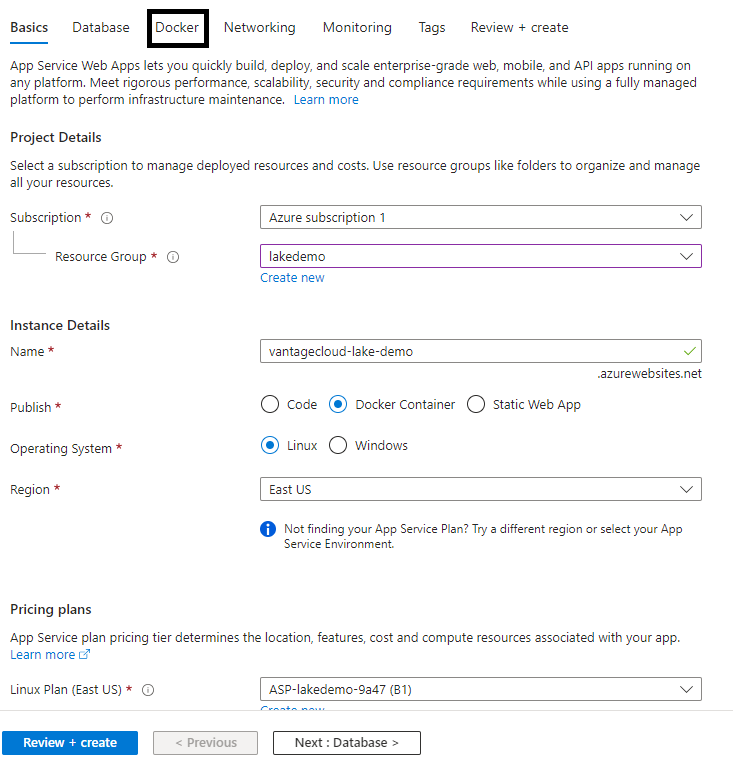
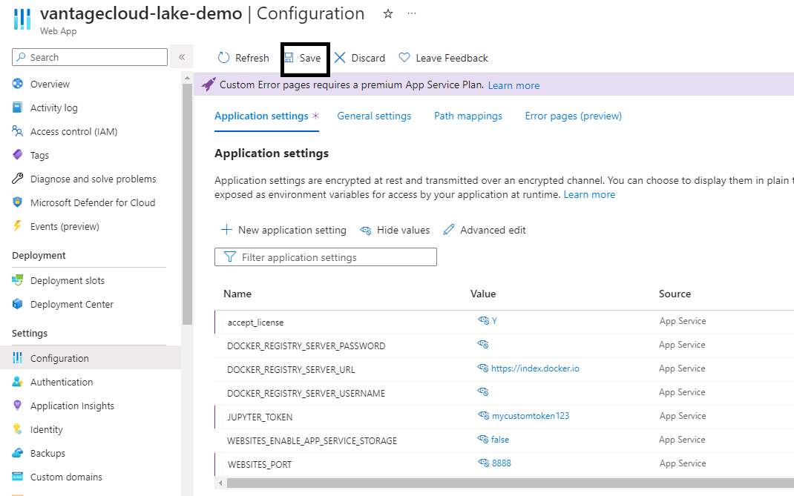
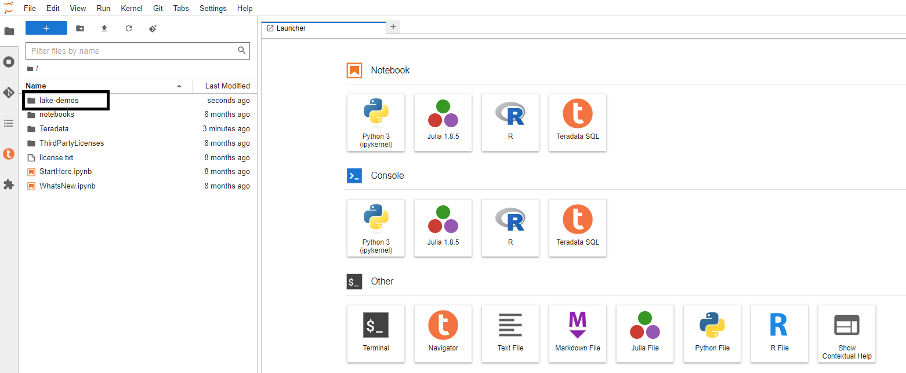
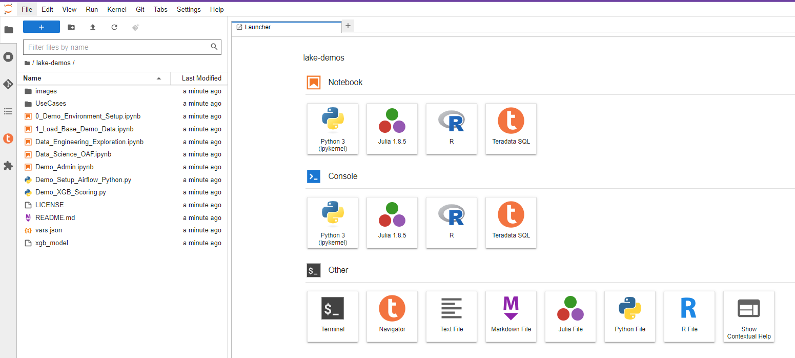
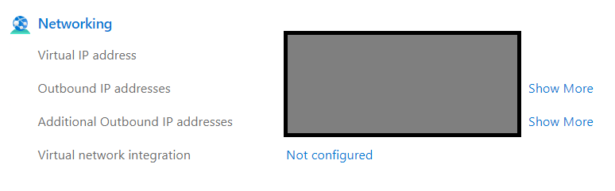

import VantageCloudLakeRequest from './_partials/vantagecloud-lake-request.md';

# Ejecutar demostraciones de Teradata Jupyter Notebook para VantageCloud Lake en Microsoft Azure


## Información general
En este inicio rápido se detalla el proceso para ejecutar [Demostraciones de Jupyter Notebook de Teradata para VantageCloud Lake](https://github.com/Teradata/lake-demos) en Microsoft Azure.

## Prerrequisitos
* Acceso a una cuenta de Microsoft Azure
* Acceso a un entorno VantageCloud Lake
        <VantageCloudLakeRequest />

## Configuración de Microsoft Azure
En esta sección cubriremos en detalle cada uno de los pasos a continuación:

* Crear una aplicación web de Microsoft Azure basada en la imagen de Docker de las extensiones de Teradata Jupyter Lab
* Configurar las extensiones de Jupyter Lab en la aplicación web de Azure
* Cargar demostraciones de Vantagecloud Lake en la aplicación web de Azure de las extensiones de Jupyter Lab
* Encontrar la IP de la aplicación web de Azure de las extensiones de Jupyter Lab

### Crear una aplicación web de Microsoft Azure basada en la imagen de Docker de las extensiones de Teradata Jupyter Lab
* Inicie sesión en Microsoft Azure y haga clic en "Servicios de aplicación"
        

* En "Servicios de aplicaciones", haga clic en Aplicación web
        

* En la pestaña "Conceptos básicos":
    * Seleccione el grupo de recursos apropiado en el menú desplegable o cree uno nuevo.
    * Introduzca un nombre para su aplicación web.
    * Seleccione "Contenedor Docker" en las opciones del botón de opción "Publicar"
    * Seleccione "Linux" como sistema operativo
    * Seleccione la región apropiada del menú desplegable
    * Seleccione el plan de App Service adecuado. Si no tiene uno, se creará uno nuevo con las configuraciones predeterminadas.

    :::tip
    Para fines de la demostración de VantageCloud Lake, no se necesita redundancia
    :::
    
    * Después de completar esta pestaña, haga clic en la pestaña "Docker" para continuar
    

* En la pestaña "Docker":
    * Seleccione "Contenedor único" en el menú desplegable
    * En el menú desplegable "Fuente de imagen", seleccione "Docker Hub"
    * En el menú desplegable "Tipo de acceso", seleccione "Público"
    * En "Imagen y etiqueta" escriba `teradata/jupyterlab-extensions:latest`
    :::tip
    No se necesita un comando de inicio para este servicio de aplicaciones
    :::
    * Seleccione la pestaña "Revisar + Crear" para continuar
    
    * En la pestaña "Revisar + Crear", haga clic en el botón "Crear"
    
    * Cuando se complete la implementación, haga clic en el botón "Ir al recurso"
    

### Configurar las extensiones de Jupyter Lab en la aplicación web de Azure
* Seleccione Configuración en el panel derecho
        

* Agregue las siguientes configuraciones de aplicación
        | **Configuración de la aplicación** | **Valor** |
        |--------------|-----------|
        | **"accept_license"**     | Y |
        | **"WEBSITES_PORT"**  | 8888 |
        | **"JUPYTER_TOKEN"**      | Defina el token de acceso de Jupyter Lab que le gustaría usar. |

        :::important
        If you don't include the "JUPYTER_TOKEN" configuration, the container will generate a new token and log it to the console. You will need to retrieve it from the application logs. If you include the "JUPYTER_TOKEN" configuration key but leave the value blank, the system will set the token as an empty string, resulting in an unprotected Jupyter Lab environment without any token security.
        :::

* Haga clic en Guardar, su aplicación se reiniciará
        

* Regrese a la pestaña Descripción general en el panel derecho

### Cargar demostraciones de Vantagecloud Lake en la aplicación web de Azure de las extensiones de Jupyter Lab
* Haga clic en Dominio predeterminado
        

* En el diálogo de inicio de Jupyter Lab, introduzca el token de Jupyter definido y haga clic en Iniciar sesión
        

* En la consola de Jupyter Lab, haga clic en el icono de git
        

* Copie el siguiente URI en el campo correspondiente
    * `https://github.com/Teradata/lake-demos.git`
* Haga clic en Clonar
    

* En la consola de Jupyter Lab, haga clic en la carpeta `lake-demos`
    

    

### Encontrar la IP de la aplicación web de Azure de las extensiones de Jupyter Lab
* En JupyterLab, abra un cuaderno con el kernel Teradata Python y ejecute el siguiente comando para encontrar la dirección IP de su instancia del cuaderno.
    ``` python , id="lakedemos_azure_first_config", role="emits-gtm-events, content-editable"
    import requests
    def get_public_ip():
        try:
            response = requests.get('https://api.ipify.org')
            return response.text
        except requests.RequestException as e:
            return "Error: " + str(e)
    my_public_ip = get_public_ip()
    print("My Public IP is:", my_public_ip)
    ```

* El siguiente paso es incluir esta IP en la lista blanca en su entorno VantageCloud Lake para permitir la conexión
* Esto es para los fines de esta guía y las demostraciones de cuadernos. Para entornos de producción, es posible que se necesite una configuración de red más sólida
* Azure App Service ofrece también una lista de todas las posibles direcciones IP que el servicio podría exponer. Esto está debajo de la pestaña de descripción general
    

## Configuración de VantageCloud Lake
* En el entorno VantageCloud Lake, en configuración, agregue la IP de su instancia de notebook
    :::tip
    Un entorno de lago admite listas blancas de múltiples direcciones
    :::

    

## Demostraciones de Jupyter Notebook para VantageCloud Lake

### Configuraciones
* [vars.json](https://github.com/Teradata/lake-demos/blob/main/vars.json) debe editarse para que coincida con la configuración de su entorno VantageCloud Lake 
    

* Específicamente se deben agregar los siguientes valores 
    | **Variable** | **Valor** |
    |--------------|-----------|
    | **"host"**     | Valor de IP pública de su entorno VantageCloud Lake |
    | **"UES_URI"**  | Análisis abierto desde su entorno VantageCloud Lake |
    | **"dbc"**      | La contraseña maestra de su entorno VantageCloud Lake. |

* Verá que en el archivo vars.json de muestra, las contraseñas de todos los usuarios están predeterminadas en "password", esto es solo para fines ilustrativos, debe cambiar todos estos campos de contraseña a contraseñas seguras, protegerlas según sea necesario y seguir otras prácticas recomendadas de gestión de contraseñas.
    :::important
    Recuerde cambiar todas las contraseñas en el archivo vars.json.
    :::

## Ejecutar demostraciones
Abra y ejecute todas las celdas de *0_Configuración del entorno de demostración.ipynb* para configurar su entorno. Seguido de *1_Configuración de demostración de datos base.ipynb* para cargar los datos base necesarios para las demostracion.

Para obtener más información sobre los cuadernos de demostración, vaya a la página [Demostraciones de Teradata Lake](https://github.com/Teradata/lake-demos) en GitHub.

## Resumen

En este inicio rápido, aprendimos cómo ejecutar demostraciones de Jupyter notebooks para VantageCloud Lake en Microsoft Azure.

## Lectura adicional

* [Documentación de Teradata VantageCloud Lake](https://docs.teradata.com/r/Teradata-VantageCloud-Lake/Getting-Started-First-Sign-On-by-Organization-Admin)
* [Utilizar Vantage desde un Jupyter Notebook](../analyze-data/jupyter.md)