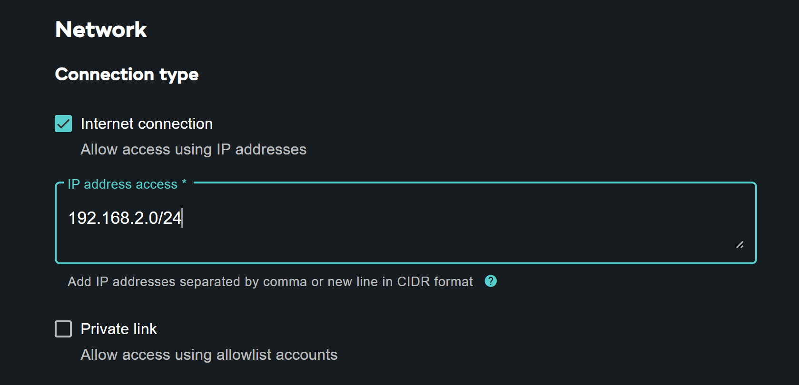

import Tabs from '../_partials/tabsJupyterNotebook.mdx';

# Ejecutar demostraciones de Teradata Jupyter Notebook para VantageCloud Lake en Docker

## Información general
En este tutorial, seguiremos los pasos para conectarnos a Teradata VantageCloud Lake y ejecutaremos demostraciones desde un Jupyter notebook en Docker. 

## Prerrequisitos
* [Docker Desktop](https://www.docker.com/products/docker-desktop) Instalado
* [Git](https://git-scm.com/book/en/v2/Getting-Started-Installing-Git) Instalado
    * Requerido para descargar el repositorio de git desde https://github.com/Teradata/lake-demos.git
* Un inicio de sesión de cuenta de Teradata VantageCloud Lake
    * URL de la organización y detalles de inicio de sesión de la carta de bienvenida de Teradata
* IDE de su elección

## Crear un entorno VantageCloud Lake
Siga las instrucciones de [primeros pasos con VantageCloud Lake](./getting-started-with-vantagecloud-lake.md) para crear su propio entorno. 

Una vez creado, vaya a la pestaña **SETTINGS** y proporcione su dirección IP pública para [acceder al entorno](./getting-started-with-vantagecloud-lake.md#access-environment-from-public-internet).

:::note
Puede encontrar su dirección IP en el sitio web [WhatIsMyIp.com](https://www.whatismyip.com). Tome nota de la dirección IPv4.
:::



Su tarjeta de entorno debería mostrar acceso a **Internet publica** ahora.


Desde la pestaña **OVERVIEW**, copie:

* IP pública y
* Abrir punto final de análisis

Estos valores son necesarios para acceder a VantageCloud Lake desde Docker.


## Clonar el repositorio de demostración de VantageCloud Lake
Clone el repositorio de demostración de VantageCloud Lake en su máquina local:

``` bash
git clone https://github.com/Teradata/lake-demos.git
cd lake-demos
```

El repositorio contiene diferentes archivos y carpetas, los importantes son:

* Jupyter Notebooks
    * [0_Demo_Environment_Setup.ipynb](https://github.com/Teradata/lake-demos/blob/main/0_Demo_Environment_Setup.ipynb)
    * [1_Load_Base_Demo_Data.ipynb](https://github.com/Teradata/lake-demos/blob/main/1_Load_Base_Demo_Data.ipynb)
    * [Data_Engineering_Exploration.ipynb](https://github.com/Teradata/lake-demos/blob/main/Data_Engineering_Exploration.ipynb)
    * [Data_Science_OAF.ipynb](https://github.com/Teradata/lake-demos/blob/main/Data_Science_OAF.ipynb)
    * [Demo_Admin.ipynb](https://github.com/Teradata/lake-demos/blob/main/Demo_Admin.ipynb)
* [archivo vars.json](https://github.com/Teradata/lake-demos/blob/main/vars.json)

## Editar el archivo vars.json
Para conectar Jupyter notebooks con VantageCloud Lake, debe editar el [archivo vars.json](https://github.com/Teradata/lake-demos/blob/main/vars.json) y proporcionar:


| **Variable** | **Valor** |
|--------------|-----------|
| *"host"*     | Valor de IP pública de la sección *OVERVIEW* (ver arriba) |
| *"UES_URI"*  | Abra el valor del endpoint de Analytics de la sección *OVERVIEW* (ver arriba) |
| *"dbc"*      | La contraseña maestra de su entorno VantageCloud Lake |


:::info
En el vars.json de ejemplo, las contraseñas de todos los usuarios se establecen de forma predeterminada en "contraseña", esto es solo con fines ilustrativos. Debe cambiar todos estos campos de contraseña por contraseñas seguras, protegerlas según sea necesario y seguir otras prácticas recomendadas de administración de contraseñas.
:::

## Montar archivos dentro de Docker
Para ejecutar demostraciones de VantageCloud Lake, necesitamos el [Extensiones de Teradata Jupyter para Docker](https://hub.docker.com/r/teradata/jupyterlab-extensions). Las extensiones proporcionan el kernel SQL ipython, utilidades para administrar conexiones a Teradata y el explorador de objetos de base de datos para que sea productivo mientras interactúa con la base de datos de Teradata.  

:::info
Asegúrese de ejecutar todos los comandos en la misma carpeta donde clonó el repositorio de demostración.   
:::

Inicie un contenedor y vincúlelo al directorio lake-demos existente. Elija el comando apropiado según su sistema operativo:

:::note
Para Windows, ejecute el comando docker en PowerShell.
:::

<Tabs/>


Haga clic en la URL en los registros de Docker para abrir el Jupyter Notebook en su navegador.


## Ejecutar demostraciones
Abra y ejecute todas las celdas de **0_Demo_Environment_Setup.ipynb** para configurar su entorno, seguido de **1_Demo_Setup_Base_Data.ipynb** para cargar los datos base necesarios para las demostraciones. +


Para obtener más información sobre los cuadernos de demostración, vaya a la página [Demostraciones de Teradata Lake](https://github.com/Teradata/lake-demos) en GitHub.

## Resumen

En este inicio rápido, aprendimos cómo ejecutar demostraciones de Teradata VantageCloud Lake desde Jupyter Notebook en Docker.

## Lectura adicional

* [Documentación de Teradata VantageCloud Lake](https://docs.teradata.com/r/Teradata-VantageCloud-Lake/Getting-Started-First-Sign-On-by-Organization-Admin)
* [Utilizar Vantage desde un Jupyter Notebook](../analyze-data/jupyter.md)
