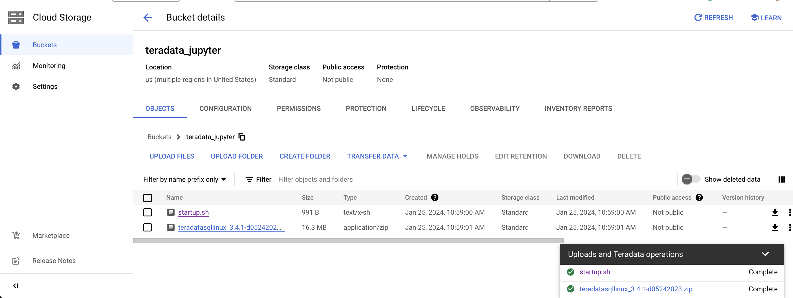
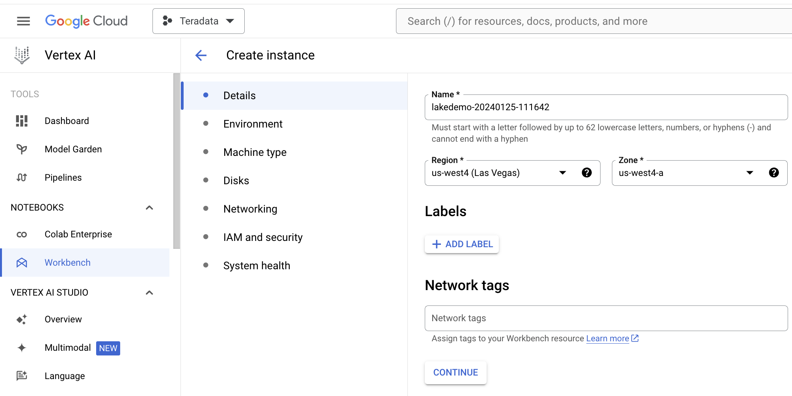
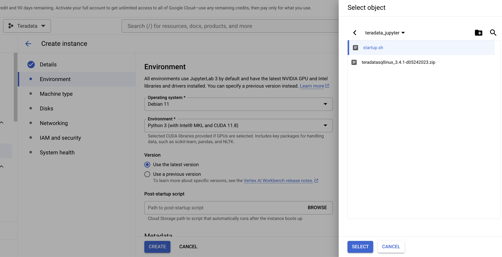
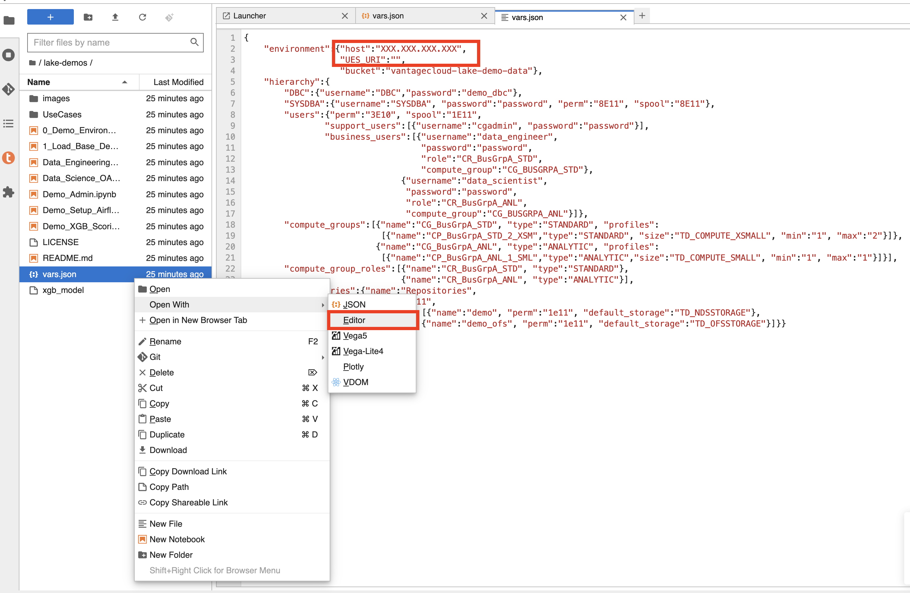

# Ejecutar demostraciones de Teradata Jupyter Notebook para VantageCloud Lake en Google Cloud Vertex AI  

## Información general
En este inicio rápido se explica cómo ejecutar [Demostraciones de Jupyter Notebook de Teradata para VantageCloud Lake](https://github.com/Teradata/lake-demos) en Vertex AI, la plataforma IA/ML para Google Cloud. 

## Prerrequisitos
* Módulos de Teradata para Jupyter **versión de escritorio para Linux** (descarga de la [aquí](https://downloads.teradata.com/download/tools/vantage-modules-for-jupyter), es necesario registrarse)
* Cuenta de Google Cloud con [API de Notebooks y Vertex AI](https://console.cloud.google.com/flows/enableapi?apiid=notebooks.googleapis.com,aiplatform.googleapis.com&redirect=https://console.cloud.google.com&_ga=2.180323111.284679914.1706204112-1996764819.1705688373) habilitada
* Almacenamiento en Google Cloud para almacenar scripts de inicio y el paquete de extensiones de Teradata Jupyter
* [Acceso a un entorno VantageCloud Lake](./getting-started-with-vantagecloud-lake.md)

## Configuración del entorno Vertex AI Google Cloud

Cuando crea una nueva instancia de cuaderno, puede especificar un script de inicio. Este script, que se ejecuta solo una vez después de la creación de la instancia, instalará el paquete de extensiones de Teradata Jupyter y clonará un repositorio de GitHub en la nueva instancia de notebooks administrada por el usuario.

* Descargar el paquete de extensiones Jupyter de Teradata
    * Visite [página de módulos Vantage para Jupyter](https://downloads.teradata.com/download/tools/vantage-modules-for-jupyter)
    * Inicie sesión y descargue la versión Teradata Linux del paquete.

* Crear depósito de almacenamiento en Google Cloud 
     - Cree un depósito con un nombre relevante para el proyecto (por ejemplo, teradata_jupyter). 
     - Asegúrese de que el nombre del depósito sea globalmente único. Por ejemplo, si el nombre teradata_jupyter ya se ha utilizado, no estará disponible para usuarios posteriores. 
        

* Cargue el paquete de extensiones de Jupyter descomprimido en su depósito de Google Cloud Storage como un archivo.

* Escriba el siguiente script de inicio y guárdelo como `startup.sh` en su máquina local. 

A continuación se muestra un script de ejemplo que recupera el paquete de extensiones de Teradata Jupyter del depósito de Google Cloud Storage e instala el kernel de Teradata SQL, las extensiones y clona el repositorio lake-demos. 

:::info
Recuerde reemplazar teradata_jupyter en el comando gsutil cp.
:::

``` bash , id="vertex_ex_script", role="content-editable, emits-gtm-events"
#! /bin/bash

cd /home/jupyter
mkdir teradata
cd teradata
gsutil cp gs://teradata_jupyter/* .
unzip teradatasql*.zip

# Install Teradata kernel
cp teradatakernel /usr/local/bin

jupyter kernelspec install ./teradatasql --prefix=/opt/conda

# Install Teradata extensions
pip install --find-links . teradata_preferences_prebuilt
pip install --find-links . teradata_connection_manager_prebuilt
pip install --find-links . teradata_sqlhighlighter_prebuilt
pip install --find-links . teradata_resultset_renderer_prebuilt
pip install --find-links . teradata_database_explorer_prebuilt

# PIP install the Teradata Python library
pip install teradataml==17.20.00.04

# Install Teradata R library (optional, uncomment this line only if you use an environment that supports R)
#Rscript -e "install.packages('tdplyr',repos=c('https://r-repo.teradata.com','https://cloud.r-project.org'))"

# Clone the Teradata lake-demos repository
su - jupyter -c "git clone https://github.com/Teradata/lake-demos.git"
```
* Suba este script a su depósito de almacenamiento de Google Cloud como un archivo
        

### Iniciar una instancia de cuaderno administrada por el usuario

* Acceda a Vertex AI Workbench
    - Regrese a Vertex AI Workbench en la consola de Google Cloud.
    - Cree una nueva libreta administrada por el usuario a través de Opciones avanzadas o directamente en https://notebook.new/.

* En Detalles, asigne un nombre a su cuaderno, seleccione su región y seleccione continuar.
        

* En Entorno, seleccione **Examinar** para seleccionar su script startup.sh de su depósito de Google Cloud.
        

* Seleccione Crear para iniciar el cuaderno. Es posible que el proceso de creación del cuaderno tarde unos minutos en completarse. Cuando termine, haga clic en OPEN JUPYTERLAB. 
        

:::important
Tendrá que incluir esta IP en la lista blanca en su entorno VantageCloud Lake para permitir la conexión. Esta solución es apropiada en un entorno de prueba. Para entornos de producción, es posible que sea necesario configurar e incluir en la lista blanca una configuración de VPC, subredes y grupos de seguridad.
:::

* En JupyterLab, abra un cuaderno con un kernel de Python y ejecute el siguiente comando para encontrar la dirección IP de la instancia del cuaderno.
        

``` python , role="content-editable"
import requests
def get_public_ip():
    try:
        response = requests.get('https://api.ipify.org')
        return response.text
    except requests.RequestException as e:
        return "Error: " + str(e)
my_public_ip = get_public_ip()
print("My Public IP is:", my_public_ip)
```

## Configuración de VantageCloud Lake
* En el entorno VantageCloud Lake, en configuración, agregue la IP de su instancia de notebook
        

## Editar vars.json
Navegue hasta el directorio `lake-demos` en su cuaderno. 
        

Haga clic derecho en vars.json para abrir el archivo con el editor. 
        

Edite el archivo *[archivo vars.json](https://github.com/Teradata/lake-demos/blob/main/vars.json)* para incluir las credenciales necesarias para ejecutar las demostraciones 

|**Variable** | **Valor**|
|---------|----------|
|**"host"** | Valor de IP pública de su entorno VantageCloud Lake |
|**"UES_URI"**| Análisis abierto desde su entorno VantageCloud Lake |
|**"dbc"**| La contraseña maestra de su entorno VantageCloud Lake. |

Para recuperar una dirección IP pública y un punto de conexión de Open Analytics, siga estos [instrucciones](vantagecloud-lake-demo-jupyter-docker.md#create-vantagecloud-lake-environment).


:::important
Cambie las contraseñas en el archivo vars.json. Verá que en el archivo vars.json de muestra, las contraseñas de todos los usuarios están predeterminadas en "password", esto es solo para cuestiones del archivo de muestra, debe cambiar todas estas contraseñas. campos a contraseñas seguras, protéjalas según sea necesario y siga otras mejores prácticas de administración de contraseñas
:::

## Ejecutar demostraciones
Ejecute todas las celdas de *0_Demo_Environment_Setup.ipynb* para configurar su entorno. Seguido de **1_Demo_Setup_Base_Data.ipynb** para cargar los datos base necesarios para la demostración.

Para obtener más información sobre los cuadernos de demostración, vaya a la página [Demostraciones de Teradata Lake](https://github.com/Teradata/lake-demos) en GitHub.

## Resumen 
En este inicio rápido hemos configurado Google Cloud Vertex AI Workbench Notebooks para ejecutar [Demostraciones de Jupyter Notebook de Teradata para VantageCloud Lake](https://github.com/Teradata/lake-demos).