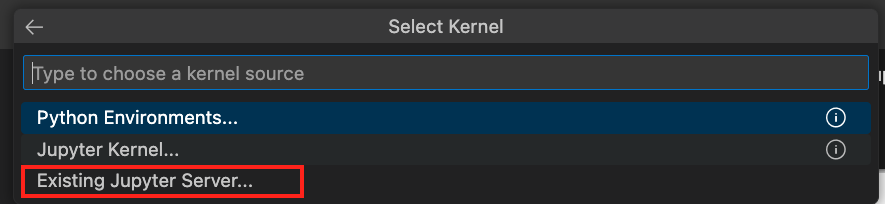
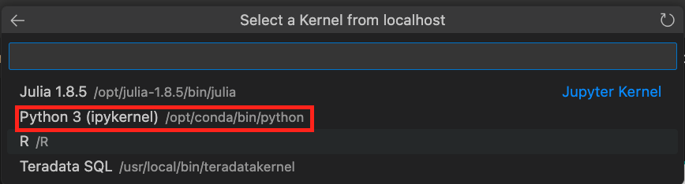

import Tabs from '@theme/Tabs';
import TabItem from '@theme/TabItem';
import TabsMDX from '../_partials/tabs.mdx';

# Ejecutar demostraciones de Teradata Jupyter Notebook para VantageCloud Lake en Visual Studio Code

## Información general
Visual Studio Code es un popular editor de código abierto compatible con Windows, MacOs y Linux. Los desarrolladores utilizan este entorno de desarrollo integrado (Integrated Development Environment, IDE) para codificar, depurar, crear e implementar aplicaciones. En esta guía de inicio rápido, lanzamos demostraciones de Jupyter notebooks de VantageCloud Lake dentro de Visual Studio Code. 


## Prerrequisitos
Antes de comenzar, asegúrese de cumplir con los siguientes requisitos previos:

* [Docker Desktop](https://www.docker.com/products/docker-desktop) Instalado
* [Git](https://git-scm.com/book/en/v2/Getting-Started-Installing-Git) Instalado
  * Requerido para descargar el repositorio de git desde https://github.com/Teradata/lake-demos.git
* [Visual Studio Code](https://code.visualstudio.com/download) Instalado
* Una cuenta de Teradata VantageCloud Lake con la URL de la organización y los detalles de inicio de sesión de la carta de bienvenida de Teradata.
  * Una vez que haya iniciado sesión, siga estas [instrucciones](getting-started-with-vantagecloud-lake.md#create-an-environment) para crear un entorno VantageCloud Lake

## Clonar el repositorio de demostración de VantageCloud Lake 
Comience clonando el repositorio de GitHub y navegando al directorio del proyecto:

``` bash
git clone https://github.com/Teradata/lake-demos.git
cd lake-demos
```

## Inicie un contenedor Docker de Jupyterlab con Teradata Jupyter Extensions
Para lanzar demos de Teradata VantageCloud Lake, necesitamos la [Extensiones de Teradata Jupyter para Docker](https://hub.docker.com/r/teradata/jupyterlab-extensions). Estas extensiones proporcionan el kernel de SQL ipython, utilidades para administrar conexiones a Teradata y el explorador de objetos de base de datos para que sea productivo mientras interactúa con la base de datos de Teradata.   

A continuación, inicie un contenedor y vincúlelo al directorio lake-demos existente. Elija el comando adecuado en función de su sistema operativo: 

:::note
Para Windows, ejecute el comando docker en PowerShell.
:::


<TabsMDX />


Tome nota de la URL y el token resultantes; los necesitará para establecer la conexión desde Visual Studio Code.


## Configuración de Visual Studio Code
Abra el directorio del proyecto `lake-demos` en Visual Studio Code. El repositorio contiene el siguiente árbol de proyectos: 

LAKE_DEMOS

* [UseCases](https://github.com/Teradata/lake-demos/tree/main/UseCases)
  * [0_Demo_Environment_Setup.ipynb](https://github.com/Teradata/lake-demos/blob/main/0_Demo_Environment_Setup.ipynb)
  * [1_Load_Base_Demo_Data.ipynb](https://github.com/Teradata/lake-demos/blob/main/1_Load_Base_Demo_Data.ipynb)
  * [Data_Engineering_Exploration.ipynb](https://github.com/Teradata/lake-demos/blob/main/Data_Engineering_Exploration.ipynb)
  * [Data_Science_OAF.ipynb](https://github.com/Teradata/lake-demos/blob/main/Data_Science_OAF.ipynb)
  * [Demo_Admin.ipynb](https://github.com/Teradata/lake-demos/blob/main/Demo_Admin.ipynb)
* [archivo vars.json](https://github.com/Teradata/lake-demos/blob/main/vars.json)


### Editar el archivo vars.json 
Edite el archivo [**vars.json**](https://github.com/Teradata/lake-demos/blob/main/vars.json) para incluir las credenciales necesarias para ejecutar las demostraciones 


| **Variable** | **Valor** |
|--------------|-----------|
| **"host"**     | Valor de IP pública de su entorno VantageCloud Lake |
| **"UES_URI"**  | Análisis abierto desde su entorno VantageCloud Lake |
| **"dbc"**      | La contraseña maestra de su entorno VantageCloud Lake. |


Para recuperar una dirección IP pública y un punto de conexión de Open Analytics, siga estos [instrucciones](getting-started-with-vantagecloud-lake.md#create-an-environment)

:::important
Cambie las contraseñas en el archivo vars.json. Verá que en el archivo vars.json de muestra, las contraseñas de todos los usuarios están predeterminadas en "password", esto es solo para cuestiones del archivo de muestra, debe cambiar todas estas contraseñas. campos a contraseñas seguras, protéjalas según sea necesario y siga otras mejores prácticas de administración de contraseñas
:::

### Modifique la ruta a vars.json en el directorio UseCases

En el directorio UseCases, todos los archivos .ipynb usan la ruta ../../vars.json para cargar las variables del archivo JSON cuando se trabaja desde Jupyterlab. Para trabajar directamente desde Visual Studio Code, actualice el código en cada .ipynb para que apunte a vars.json.

La forma más rápida de realizar estos cambios es mediante la función de búsqueda en el menú vertical  de la izquierda. Busque 

```bash
'../../vars.json'
```

y reemplácelo con:

```bash
'vars.json'
```


### Configuración de kernels de Jupyter
Abra **0_Demo_Environment_Setup.ipynb** y haga clic en Seleccionar kernel en la esquina superior derecha de Visual Studio Code. 

Si no ha instalado las extensiones de Jupyter y Python, Visual Studio Code le pedirá que las instale. Estas extensiones son necesarias para que Visual Studio Code detecte kernels. Para instalarlas, seleccione 'Instalar/Habilitar extensiones sugeridas para Python y Jupyter'.


Una vez que haya instalado las extensiones necesarias, encontrará opciones en el menú desplegable. Elija **Kernel de Jupyter existente**.



Introduzca la URL del servidor Jupyter en ejecución y presione Entrar.
```bash
http://localhost:8888
```


Introduzca el token que se encuentra en su terminal al montar archivos en el contenedor Docker y presione Entrar.


Cambiar el nombre para mostrar del servidor (dejar en blanco para usar la URL)


Ahora tiene acceso a todos los kernels de extensión de Teradata Vantage. Seleccione Python 3 (ipykernel) desde el servidor Jupyter en ejecución.



### Ejecutar demostraciones
Ejecute todas las celdas de *0_Demo_Environment_Setup.ipynb* para configurar su entorno. Seguido de *1_Demo_Setup_Base_Data.ipynb* para cargar los datos base necesarios para la demostración.
Para obtener más información sobre los cuadernos de demostración, vaya a la página [Demostraciones de Teradata Lake](https://github.com/Teradata/lake-demos) en GitHub.


## Resumen 
En esta guía de inicio rápido, configuramos Visual Studio Code para acceder a demostraciones de VantageCloud Lake mediante Jupyter notebooks. 
