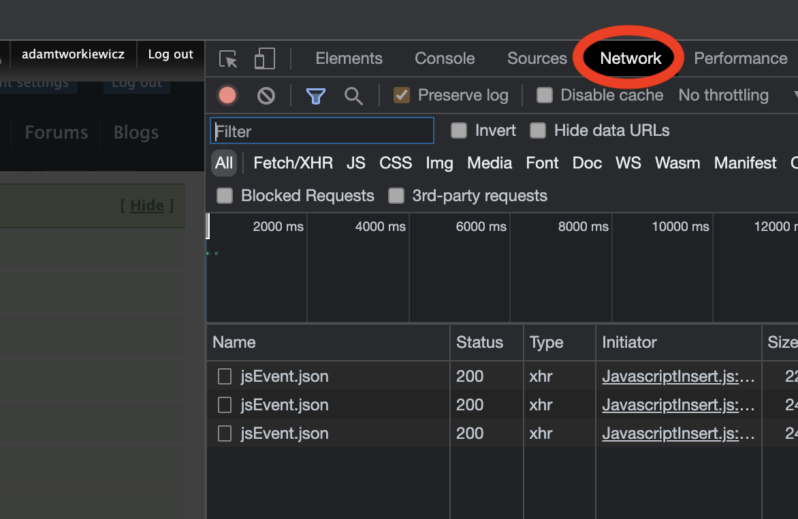
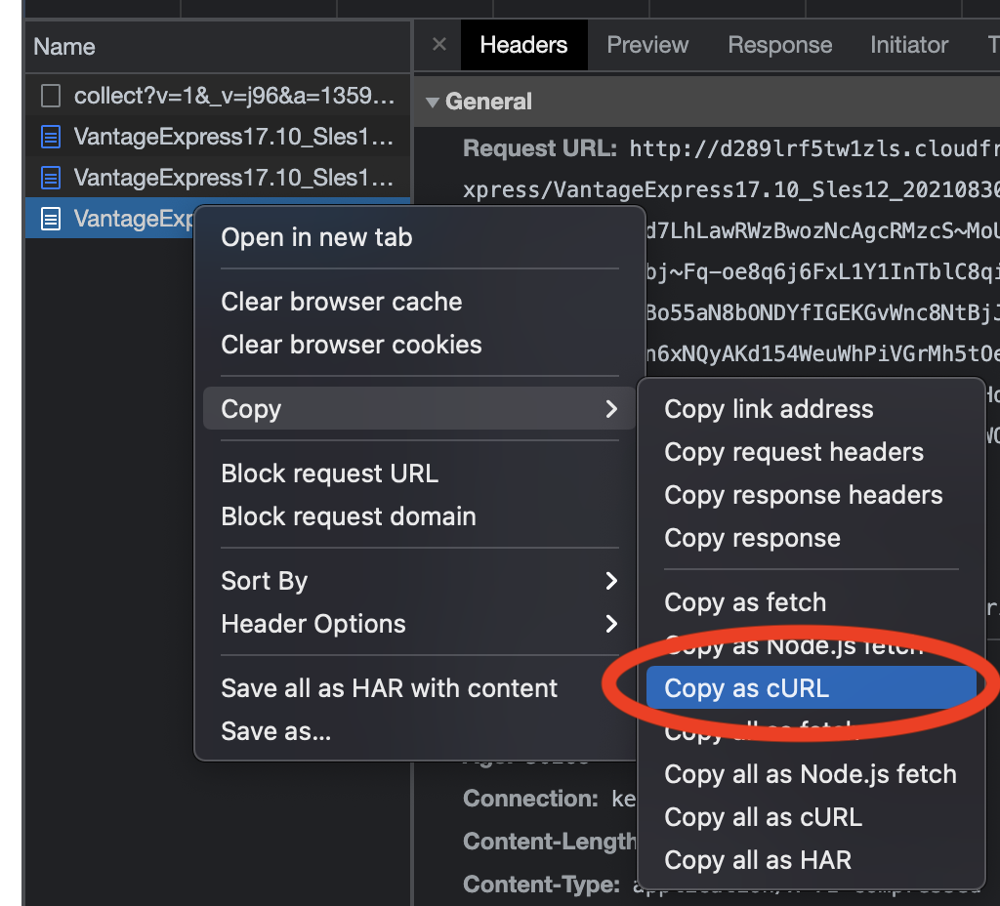

import GettingStartedQueries from './getting-started-queries.mdx';

* VirtualBoxと7 zipをインストールします。
```bash
apt update && apt-get install p7zip-full p7zip-rar virtualbox -y
```
* Vantage Express をダウンロードするための curl コマンドを取得します。
    *  [Vantage Express ダウンロード ページ](https://downloads.teradata.com/download/database/teradata-express-for-vmware-player) へアクセスしてください（登録が必要です）。
    * 最新のダウンロード リンク (例: **「Vantage Express 17.20」)**をクリックします。使用許諾契約のポップアップが表示されます。まだライセンスを受け入れません。
    * ブラウザでネットワーク ビューを開きます。たとえば、Chrome では <kbd>F12 キー</kbd> を押して `Network` タブに移動します。

    

    * `I Agree (同意する)` ボタンをクリックしてライセンスを受け入れ、ダウンロードをキャンセルします。
    * ネットワーク ビューで、 `VantageExpress` で始まる最後のリクエストを見つけます。それを右クリックして `Copy -> Copy as cURL` を選択します。

    
* ssh セッションに戻り、curl コマンドを貼り付けて Vantage Express をダウンロードします。ダウンロードを `ve.7z` という名前のファイルに保存するには、コマンドに `-o ve.7z` を追加します。すべての HTTP ヘッダーを削除できます。例:

```bash
curl -o ve.7z 'http://d289lrf5tw1zls.cloudfront.net/database/teradata-express/VantageExpress17.20_Sles12_202108300444.7z?Expires=1638719978&Signature=GKBkNvery_long_signature__&Key-Pair-Id=********************'
```

* ダウンロードしたファイルを解凍します。数分かかります。

```bash
7z x ve.7z
```
* VirtualBox で VM を起動しますコマンドはすぐに返されますが、VM の初期化プロセスには数分かかります。

```bash
export VM_IMAGE_DIR="/opt/downloads/VantageExpress17.20_Sles12"
DEFAULT_VM_NAME="vantage-express"
VM_NAME="${VM_NAME:-$DEFAULT_VM_NAME}"
vboxmanage createvm --name "$VM_NAME" --register --ostype openSUSE_64
vboxmanage modifyvm "$VM_NAME" --ioapic on --memory 6000 --vram 128 --nic1 nat --cpus 4
vboxmanage storagectl "$VM_NAME" --name "SATA Controller" --add sata --controller IntelAhci
vboxmanage storageattach "$VM_NAME" --storagectl "SATA Controller" --port 0 --device 0 --type hdd --medium  "$(find $VM_IMAGE_DIR -name '*disk1*')"
vboxmanage storageattach "$VM_NAME" --storagectl "SATA Controller" --port 1 --device 0 --type hdd --medium  "$(find $VM_IMAGE_DIR -name '*disk2*')"
vboxmanage storageattach "$VM_NAME" --storagectl "SATA Controller" --port 2 --device 0 --type hdd --medium  "$(find $VM_IMAGE_DIR -name '*disk3*')"
vboxmanage modifyvm "$VM_NAME" --natpf1 "tdssh,tcp,,4422,,22"
vboxmanage modifyvm "$VM_NAME" --natpf1 "tddb,tcp,,1025,,1025"
vboxmanage startvm "$VM_NAME" --type headless
vboxmanage controlvm "$VM_NAME" keyboardputscancode 1c 1c
```
* Vantage Express VM に ssh で接続します。 `root` をパスワードとして使用します。

```bash
ssh -p 4422 root@localhost
```
* DB が起動していることを確認します。
```bash
pdestate -a
```

 コマンドが`PDE state is RUN/STARTED. DBS state is 5: Logons are enabled - The system is quiescent`を返す場合は、Vantage Expressが起動したことを意味します。状態が異なる場合は、正しいステータスが得られるまで `pdestate -a` を繰り返します。

* Vantage Expressが起動して実行されたら、`bteq` クライアントのコマンドラインクライアントを起動します。BTEQ (「ビーテック」と発音) は、Teradata Database に SQL クエリーを送信するために使用される、汎用のコマンド ベースのクライアント ツールです。

```bash
bteq
```
* bteq に入ったら、Vantage Express インスタンスに接続します。パスワードを求められたら、 `dbc` を入力します。

```bash
.logon localhost/dbc
```

## サンプル クエリーを実行する

* `dbc` ユーザーを使用して、`HR` という新しいデータベースを作成します。このクエリーをコピー/貼り付けして実行し、 <kbd>Enter</kbd>キーを押します。

<GettingStartedQueries />

## オプションを設定する

* VM を停止して起動する場合は、Vantage Express を自動起動に追加することをお勧めします。 VM に ssh で接続し、以下のコマンドを実行します。

```bash
sudo -i

cat <<EOF >> /etc/default/virtualbox
VBOXAUTOSTART_DB=/etc/vbox
VBOXAUTOSTART_CONFIG=/etc/vbox/autostart.cfg
EOF

cat <<EOF > /etc/systemd/system/vantage-express.service
[Unit]
Description=vm1
After=network.target virtualbox.service
Before=runlevel2.target shutdown.target
[Service]
User=root
Group=root
Type=forking
Restart=no
TimeoutSec=5min
IgnoreSIGPIPE=no
KillMode=process
GuessMainPID=no
RemainAfterExit=yes
ExecStart=/usr/bin/VBoxManage startvm vantage-express --type headless
ExecStop=/usr/bin/VBoxManage controlvm vantage-express savestate
[Install]
WantedBy=multi-user.target
EOF

systemctl daemon-reload
systemctl enable vantage-express
systemctl start vantage-express
```
