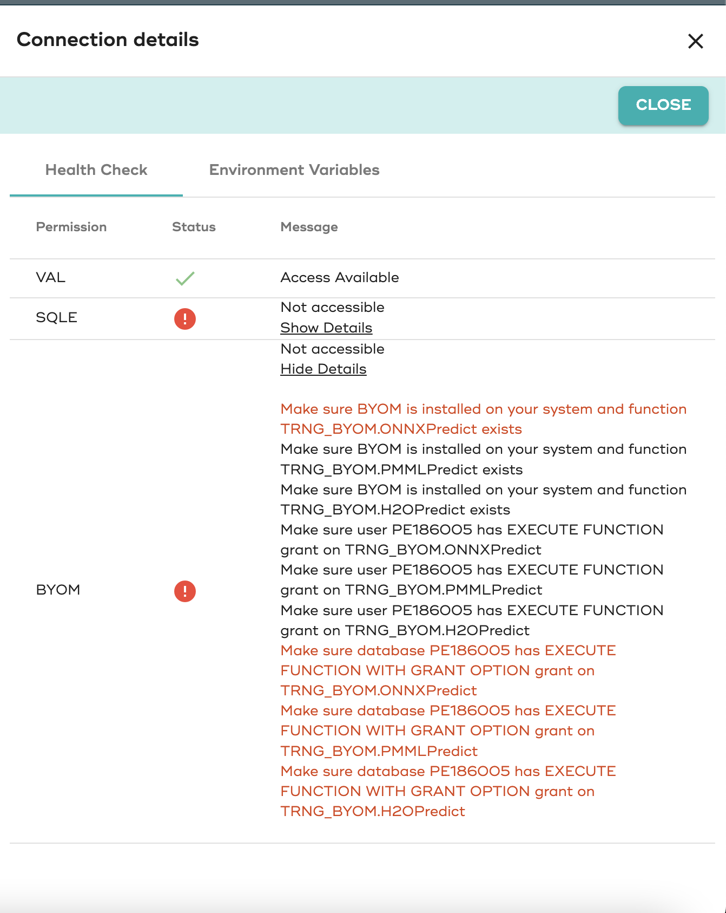

## 新しいプロジェクトを作成するか、既存のプロジェクトを使用する

新しいプロジェクトを追加する

* プロジェクトを作成する

* 詳細

* 名前: Demo: your-name

* 説明: ModelOps Demo

* グループ: your-name

* パス: https://github.com/Teradata/modelops-demo-models

* 信頼証明: 信頼証明なし

* ブランチ: master

ここで git 接続をテストできます。緑色の場合は、保存して続行します。ここではサービス接続設定をスキップします。

新しいプロジェクトを作成するとき、ModelOpsは新しい接続をリクエストします。 

## パーソナル接続を作成する

パーソナル接続

* 名前: Vantage personal your-name

* 説明: Vantage デモ環境

* ホスト: tdprd.td.teradata.com (teradata transcendの内部のみ)

* データベース: your-db

* VAL データベース: TRNG_XSP (teradata transcendの内部のみ)

* BYOM データベース: TRNG_BYOM (teradata transcendの内部のみ)

* ログインメカニズム: TDNEGO

* ユーザー名/パスワード

## SQL データベースの VAL および BYOM のアクセス権を検証する

接続パネルの新しいヘルスチェックパネルでアクセス権を確認できます。



## BYOM の評価とスコアリングのために Vantage テーブルを識別するためのデータセットを追加する

新しいデータセット テンプレートを作成してから、トレーニング用に 1 つのデータセット、評価用に 2 つのデータセットを作成して、2 つの異なるデータセットでモデルの品質メトリクスを監視できるようにしましょう。

データセットを追加する

* データセットテンプレートを作成する

* カタログ

* 名前: PIMA

* 説明: PIMA Diabetes

* フィーチャカタログ: Vantage

* データベース: your-db

* テーブル: aoa_feature_metadata

機能クエリー:
``` sql
SELECT * FROM {your-db}.pima_patient_features
```
エンティティ キー: PatientId 機能: NumTimesPrg、PlGlcConc、BloodP、SkinThick、TwoHourSerIns、BMI、DiPedFunc、Age

エンティティとターゲットクエリー: 
``` sql
SELECT * FROM {your-db}.pima_patient_diagnoses
```
エンティティキー: PatientId ターゲット: HasDiabetes

予測

* データベース: your-db

* テーブル: pima_patient_predictions

エンティティの選択: 

クエリー: 
``` sql
SELECT * FROM pima_patient_features WHERE patientid MOD 5 = 0
```
v6 のみ (v7 では BYOM のコードなし画面でこれを定義します): BYOM ターゲット列: CAST(CAST(json_report AS JSON).JSONExtractValue('$.predicted_HasDiabetes') AS INT)

## トレーニングデータセットを作成する

ベーシック

* 名前: Train

* 説明: Trainingデータセット

* スコープ: Training

* エンティティとターゲット

クエリー: 
``` sql
SELECT * FROM {your-db}.pima_patient_diagnoses WHERE patientid MOD 5 = 1
```

## 評価データセット1を作成する

ベーシック

* 名前: Evaluate

* 説明: Evaluate データセット

* スコープ: Evaluation

* エンティティとターゲット

クエリー: 
``` sql
SELECT * FROM {your-db}.pima_patient_diagnoses WHERE patientid MOD 5 = 2
```


## 評価データセット2を作成する

ベーシック

* 名前: Evaluate

* 説明: Evaluate データセット

* スコープ: Evaluation

* エンティティとターゲット

クエリー: 
``` sql
SELECT * FROM {your-db}.pima_patient_diagnoses WHERE patientid MOD 5 = 3
```