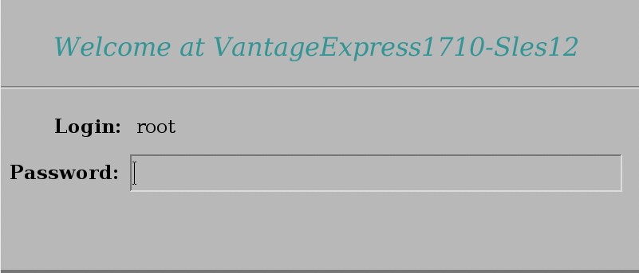

-  <kbd>[ENTER]</kbd> を押して、強調表示された `LINUX` ブート パーティションを選択します。


- 次の画面でもう一度 <kbd>ENTER キー</kbd> を押して、デフォルトの SUSE Linux カーネルを選択します。


- 起動シーケンスが完了すると、以下のスクリーンショットに示すような端末ログイン プロンプトが表示されます。ターミナルには何も入力しないでください。システムが GUI を開始するまで待ちます。


- しばらくすると、以下のプロンプトが表示されます。上記のコマンド ログイン プロンプトの後に何も入力しなかったと仮定します。下の画面で `okay` ボタンを押します。


- VM が起動すると、そのデスクトップ環境が表示されます。username/password  の入力を求められたら、両方に `root` と入力します。



- データベースは VM とともに自動起動するように構成されています。データベースが開始されたことを確認するには、仮想デスクトップに移動し、`Gnome Terminal` を起動します。


- ターミナルで `pdestate` コマンドを実行すると、Vantage がすでに起動しているかどうかが通知されます。

:::note
Gnome ターミナルに貼り付けるには 、<kbd>SHIFT+CTRL+V</kbd>を押します。
:::

```bash
watch pdestate -a
```

以下のメッセージが表示されるまで待ちます。

```bash
PDE state is RUN/STARTED.
DBS state is 5: Logons are enabled - The system is quiescent
```

<details>

<summary>データベースがまだ初期化中の場合に <code>pdestate</code> が返すメッセージの例を参照してください。</summary>

<pre>
PDE state is DOWN/HARDSTOP.

PDE state is START/NETCONFIG.

PDE state is START/GDOSYNC.

PDE state is START/TVSASTART.

PDE state is START/READY.
PDE state is RUN/STARTED.

DBS state is 1/1: DBS Startup - Initializing DBS Vprocs
PDE state is RUN/STARTED.

DBS state is 1/5: DBS Startup - Voting for Transaction Recovery
PDE state is RUN/STARTED.

DBS state is 1/4: DBS Startup - Starting PE Partitions
PDE state is RUN/STARTED.
</pre>

</details>

- データベースが起動したら、仮想デスクトップに戻って起動します。 `Teradata Studio Express`


- 初めて開始すると、ツアーが提供されます。ツアーを終了すると、新しい接続を追加するためのウィザードウィンドウが表示さます。 `Teradata` を選択します。


- 以下の画面で、ユーザー名とパスワードに `dbc` を使用してローカルホスト上のデータベースに接続します。


