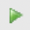

import GettingStartedQueries from './getting-started-queries.mdx';

### サンプル クエリーを実行する
1. 次に、VM でいくつかのクエリーを実行します。ホストと VM 間のコピー/ペーストの問題を回避するために、VM でこのクイック スタートを開きます。仮想デスクトップに移動し、Firefox を起動して、このクイック スタートを指定します。
2. Teradata Studio Expressで、`クエリー開発` パースペクティブに移動します(トップメニューに移動して、`ウィンドウ` -> `クエリー開発` を選択する)。
3. `データベース接続` -> `新規Teradata` をダブルクリックして、以前に作成した接続プロファイルを使用して接続します。
4. `dbc` ユーザーを使用して、`HR` という新しいデータベースを作成します。このクエリーをコピー/貼り付けし、クエリー実行ボタン () を押すか、 <kbd>[F5]</kbd> キーを押して実行します。

<GettingStartedQueries />