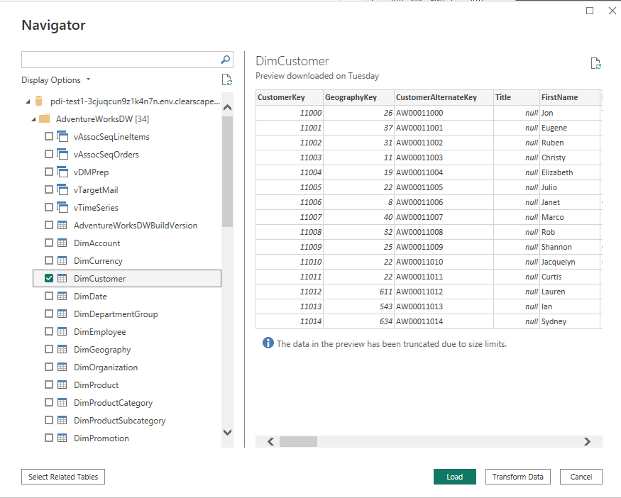

import ClearscapeDocsNote from '../_partials/vantage_clearscape_analytics.mdx'

# Vantage を使用して Power BI で視覚化を作成する

## 概要

:::note
このガイドには、Microsoft と Teradata の両方の製品ドキュメントの内容が含まれています。
:::

今回は、Power BI Desktop を Teradata Vantage に接続して、レポートやデータの劇的な視覚化を作成するプロセスについて説明します。Power BI は Teradata Vantage をデータ ソースとしてサポートしており、Power BI Desktop の他のデータ ソースと同様に基になるデータを使用できます。

[Power BI](https://docs.microsoft.com/en-us/power-bi/power-bi-overview) は、ソフトウェア サービス、アプリケーション、コネクタで構成され、これらが連携して、関連性のないデータ ソースを、一貫性があり、視覚的に没入型の対話型の分析情報に変換します。

**Power BI は以下で構成されます。**
* [Power BI Desktop](https://docs.microsoft.com/en-us/power-bi/fundamentals/desktop-what-is-desktop)と呼ばれる Windows デスクトップ アプリケーション
* [Power BI サービス](https://docs.microsoft.com/en-us/power-bi/fundamentals/power-bi-service-overview)と呼ばれるオンライン SaaS サービス
* Windows、iOS、Androidデバイス向け[Power BI モバイル](https://docs.microsoft.com/en-us/power-bi/consumer/mobile/mobile-apps-for-mobile-devices)アプリ

これら 3 つの要素 (Power BI Desktop、Power BI サービス、モバイル アプリ) は、人々が自分や自分の役割に最も効果的に応える方法でビジネスの分析情報を作成、共有、利用できるように設計されています。

4 番目の要素である  [Power BI Report Server](https://docs.microsoft.com/en-us/power-bi/report-server/get-started) を使用すると、Power BI Desktop で Power BI レポートを作成した後、オンプレミスのレポート サーバーに発行できます。

Power BI Desktop は、Vantage を「ネイティブ」データ ソースとしてではなく、サード パーティ データ ソースとしてサポートします。代わりに、Power BI サービスで公開されたレポートは、 構成要素の [オンプレミス データ ゲートウェイ](https://docs.microsoft.com/en-us/power-bi/connect-data/service-gateway-onprem) を使用して Vantage にアクセスする必要があります。

この入門ガイドでは、Teradata Vantage に接続する方法を説明します。Power BI Desktop Teradata コネクタは [.NET Data Provider for Teradata](https://downloads.teradata.com/download/connectivity/net-data-provider-for-teradata)を使用します。Power BI Desktop を使用するコンピューターにドライバをインストールする必要があります。Teradata 用 .NET データ プロバイダの単一インストールでは、32 ビットと 64 ビットの両方の Power BI Desktop アプリケーションがサポートされます。

## 前提条件
Azure サービス、Teradata Vantage、Power BI Desktop に精通していることが求められます。

以下のアカウントとシステムが必要です。

* Power BI Desktop は、Windows 用の無料アプリケーションです。(Power BI Desktop は Mac では使用できません。 [Parallels](https://www.parallels.com) や [VMware Fusion](https://www.vmware.com/products/fusion.html)などの仮想マシン、または Apple の [Boot Camp](https://support.apple.com/en-vn/boot-camp)で実行することはできますが、この記事では説明しません。)

* ユーザー名とパスワードを持つ Teradata Vantage インスタンス。ユーザーには、Power BI Desktop で使用できるデータへのアクセス許可が必要です。Vantage は Power BI Desktop からアクセスできる必要があります。

        <ClearscapeDocsNote />

*  [.NET Data Provider for Teradata](https://downloads.teradata.com/download/connectivity/net-data-provider-for-teradata)。

## はじめに
### Power BI Desktopをインストールする
 [Microsoft Store](https://aka.ms/pbidesktopstore) または [インストーラをダウンロードする](https://aka.ms/pbiSingleInstaller) から Power BI Desktop をインストールして直接実行できます。

### .NET Data Provider for Teradata をインストールする
 [.NET Data Provider for Teradata](https://downloads.teradata.com/download/connectivity/net-data-provider-for-teradata)の最新バージョンをダウンロードしてインストールします。

ダウンロード可能なファイルは複数あることに注意してください。必要なのは「tdnetdp」で始まるファイルです。

### Teradata Vantage に接続する
* 黄色のアイコンが付いている Power BI Desktopを実行します。 

* 開始 (スプラッシュ) 画面が表示されている場合は、「データの取得」をクリックします。
        

それ以外の場合、Power BI のメイン フォームを使用している場合は、_Home_ リボン上にいることを確認し、 _Get data_ をクリックします。_More…_ をクリックします。
    

* 左側の _データベース_ をクリックします。
* 右側のリストをスクロールして _Teradata database_を見つけます。 _Teradata database_をクリックしてから _Connect_ ボタンをクリックします。

(今回は、「Teradata database」と「Teradata Vantage」は同義です。)

* 表示されるウィンドウで、テキスト ボックスに Vantage システムの名前または IP アドレスを入力します。 _Import_ データを Power BI データ モデルに直接入力するか、 [DirectQuery](https://docs.microsoft.com/en-us/power-bi/desktop-use-directquery) を使用してデータ ソースに直接接続し、 _OK_をクリックするかを選択できます。

(_Advanced_ オプションをクリックして、手作りした SQL文を送信します。)

資格情報には、Vantage で定義されている _Windows_ ログインまたは _データベース_ ユーザー名 (こちらの方が一般的です) を使用して接続するオプションがあります。適切な認証方法を選択し、ユーザー名とパスワードを入力します。 _Connect_をクリックします。

LDAP サーバーで認証するオプションもあります。このオプションはデフォルトでは非表示になっています。

環境変数 _PBI_EnableTeradataLdap_ を _true_ に設定すると、LDAP 認証方式が使用可能になります。

Power BI サービスに公開されるレポートに使用されるオンプレミス データ ゲートウェイでは、LDAP はサポートされていないことに注意してください。LDAP 認証が必要で、オンプレミス データ ゲートウェイを使用している場合は、Microsoft にインシデントを送信してサポートを依頼する必要があります。

あるいは、Teradata のように [Power BI サービスからオンプレミスのデータ ソースへの Kerberos ベースの SSO を構成する](https://docs.microsoft.com/en-us/power-bi/connect-data/service-gateway-sso-kerberos) することもできます。

Vantage システムに接続すると、Power BI Desktop はシステムへの今後の接続のために資格情報を記憶します。これらの資格情報は _File > Optionsおよびsettings > Data source setting_に移動して変更できます。

接続が成功すると、ナビゲーター ウィンドウが表示されます。Vantage システムで使用可能なデータが表示されます。Power BI Desktop で使用する 1 つ以上の要素を選択できます。

テーブルをプレビューするには、テーブル名をクリックします。Power BI Desktop に読み込む場合は、テーブル名の横にあるチェックボックスをクリックしてください。

選択したテーブルを _Load_ すると、そのテーブルが Power BI Desktop に取り込まれます。また、クエリーを _編集_ するとクエリー エディターが開き、読み込むデータ セットをフィルタ処理して絞り込むことができます。

_編集_ は、使用している Power BI Desktop のバージョンに応じて _データの変換_と呼ばれる場合があります。

テーブルの結合の詳細については、 [Power BI Desktop でリレーションシップを作成および管理する](https://docs.microsoft.com/en-us/power-bi/desktop-create-and-manage-relationships) 機能を参照してください。

レポートを公開するには、Power BI Desktopの _Home_ リボンの [_Publish_] をクリックします。

Power BI Desktop でレポートを保存するように求められます。 _My workspace_ を選択し、 _Select_をクリックします。 

レポートが公開されたら、 _Got it_ をクリックして閉じます。レポート名がリンクに含まれているリンクをクリックすることもできます。

これは、Power BI Desktop で作成されたレポートの例です。

## 次のステップ
Power BI Desktop を使用すると、さまざまなソースからのデータを組み合わせることができます。詳細については、次のリンクをご覧ください。

* [ Power BI Desktopとは何ですか?](https://docs.microsoft.com/en-us/power-bi/desktop-what-is-desktop)
* [ Power BI Desktop のデータ ソース](https://docs.microsoft.com/en-us/power-bi/desktop-data-sources)
* [ Power BI Desktop を使用してデータを整形および結合する](https://docs.microsoft.com/en-us/power-bi/desktop-shape-and-combine-data)
* [ Power BI Desktop で Excel ブックに接続する](https://docs.microsoft.com/en-us/power-bi/desktop-connect-excel)
* [ Power BI Desktop にデータを直接入力する](https://docs.microsoft.com/en-us/power-bi/desktop-enter-data-directly-into-desktop)

import CommunityLinkPartial from '../_partials/community_link.mdx';

<CommunityLinkPartial />
