import ClearscapeDocsNote from '../_partials/vantage_clearscape_analytics.mdx'

# ModelOps - 初めてのBYOMモデルのインポートとデプロイ

## 概要

このチュートリアルは、ClearScape Analytics ModelOps をすぐに使い始めるのに役立ちます。主要な概念を簡単に説明するので、最初の Bring-your-own-model (BYOM) モデルを ModelOps にインポートする作業にすぐに取り掛かることができます。このクイックスタート サイトの他のチュートリアルでは、ClearSCape Analytics ModelOps を使用した他のデプロイメントおよび自動化パターンについてさらに詳しく学ぶことができます。

このチュートリアルでは、次のことを学習します。

* BYOM 機能と ModelOps BYOM の違いは何ですか?

* グラフィカル ユーザー インターフェイスを使用して、モデル レジストリに最初の BYOM モデルをインポートする

* 自動スケジュール機能と監視機能を備えたVantageにモデルをデプロイする

## 前提条件

クイックスタートに含まれるすべてのコード例にアクセスして実行するために、Clearscape 環境にインポートできる関連ノートブックとサンプル データを提供します。 [ModelOps サンプルノートブックとデータをダウンロードする](../modelops/attachments/ModelOps_Quickstart_BYOM.zip)

* Teradata VantageインスタンスとClearScape Analytics（ModelOpsを含む）へのアクセス。

* Jupyter ノートブック環境にアクセスするか、ClearScape Analytics Experience で利用可能な環境を使用します。


<ClearscapeDocsNote />


## 最初に知っておくべき重要な概念

### Teradata Vantage で独自のモデルを使用する (BYOM)

Vantage Bring Your Own Model (BYOM) パッケージにより、データ サイエンティストやアナリストは Vantage で予測モデルを運用できるようになります。外部ツールでトレーニングされた予測モデルは、BYOM Predict 関数を使用して、Vantage に保存されているデータのスコア付けに使用できます。 

サポートされているモデル交換形式 (現在、PMML、MOJO、ONNX、Dataiku、DataRobot が利用可能) を使用して予測モデルを作成または変換し、それを Vantage テーブルにインポートし、BYOM PMMLPredict、H2OPredict、ONNXPredict、DataikuPredict、または DataRobotPredict を使用してモデルでデータをスコア付けします。

### ModelOps を使用して Teradata Vantage にBring your own model (BYOM)

ModelOps の BYOM パッケージには、データ サイエンティストや機械学習エンジニア向けの追加のガバナンス、自動化、監視機能が強化されており、これらすべてをコーディングなしで適用できます。BYOM パッケージの互換性のある形式に加えて、ModelOps は、Vantage 内のモデルを Python スクリプト、R スクリプト、SAS スコアリング アクセラレータ モデルにインポートしてスコアリングする可能性を拡張します。サポートされている形式 (PMML、MOJO、ONNX、Dataiku、DataRobot、Python スクリプト、R スクリプト、SAS スコアリング アクセラレータ モデル) を使用して互換性のあるモデルを作成または変換したら、ModelOps グラフィカル ユーザー インターフェイスまたは ModelOps コード SDK を使用してモデル レジストリにインポートできます。 

### ModelOps方法論で重点を置くべき点を理解する
このチュートリアルでは、関連するノートブックと ModelOps グラフィカル ユーザー インターフェイスを使用して、このプロセスをエンドツーエンドで説明します。 


## このガイドの手順

1. プロジェクトと接続を作成する (ModelOps)
2. 環境設定(Notebook)
3. データセットの作成 (ModelOps)
4. モデルをトレーニングして PMML  (Notebook) にエクスポートする
5. BYOM 関数を使用して PMML を Vantage にインポートする  (Notebook)
6. ModelOps グラフィカル ユーザー インターフェイス (ModelOps) を使用して PMML を Vantage にインポートします。
7. 自動化されたライフサイクル - 評価、承認、デプロイ (ModelOps) する
8. モニタリング (ModelOps) のデフォルトおよびカスタム アラート ルール
9. カスタム評価メトリックとグラフ  (Notebook)

## 1\. プロジェクトを作成する

ModelOps にログインし、プロジェクト画面に移動します。

画面の右上にある [プロジェクトの作成] ボタンをクリックします。ModelOps で、このパスのクローンされたデモ コードを使用します: /app/built-in/demo-models を Git リポジトリとして使用します。ここでは、デモ モデルのパブリック Git: https://github.com/Teradata/modelops-demo-models.git のブランチ "tmo" を Git リポジトリ インスタンスにクローンすることをお勧めします。


プロジェクト作成シート パネル内に、次の値を含めます。

* 名前: 「BYOM クイックスタート」

* 説明: 「BYOM クイックスタート」

* グループ: DEMO

* パス: /app/built-in/demo-models

* 信頼証明: 信頼証明なし

* ブランチ: tmo

「GIT 接続のテスト」ボタンをクリックします。テストが成功したら、「保存して続行」をクリックします。


## パーソナル接続を作成する

このガイドでは、サービス接続の作成をスキップします。[保存して続行] をクリックし、[次へ] をクリックして個人接続を作成します。 


プロジェクト作成シート パネルの個人接続内に、次の値を含めます。

* 名前: クイックスタート パーソナル

* 説明: クイックスタート パーソナル接続

* ホスト: ClearScape-url

* データベース: "demo_user"

* VAL データベース名: "VAL"

* BYOM データベース名: 「MLDB」

* ログインメカニズム: 「TDNEGO」

* ユーザー名: demo_user

* パスワード: あなたのパスワード

[テスト接続] ボタンをクリックして、Vantage 接続をテストします。

「保存」をクリックします。


新しいプロジェクトが作成されると、プロジェクト パネルは次のように表示されます。

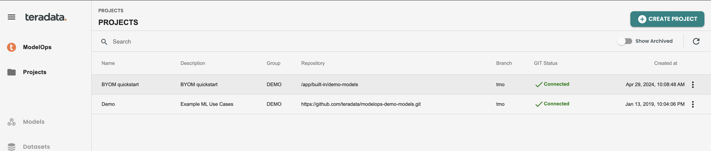

## 接続ヘルスチェックパネル

プロジェクトをクリックしてプロジェクトに入り、左側のメニューの設定に入ります。接続から詳細を表示を使用します。


次に、ヘルスチェック パネルが表示され、この接続ユーザーに対して SQLE、BYOM、および VAL 関連権限が有効になっているかどうかが表示されます。ここでエラーが発生した場合は、DBA に連絡して特定の権限を適用してください。必要な特定の GRANT コマンドについては、クイックスタートの添付ファイルに含まれるオンボーディング bteq スクリプトを確認してください。

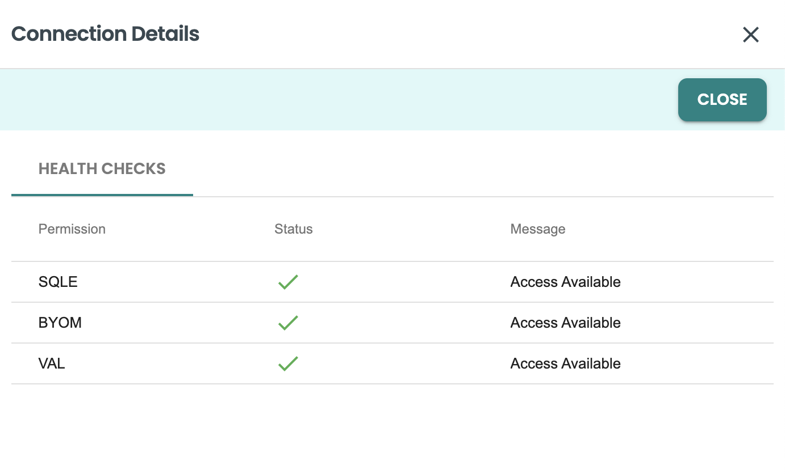

## 2\. 環境のセットアップ (Notebook)

このクイックスタートに添付されているノートブックに従って、環境のセットアップとデータベース レベルでのチェックを実行します。

## 3\. データセットの作成 (ModelOps)

新しく作成したプロジェクトをクリックし、左側のメニューにある「データセット」ボタンをクリックします。「データセット テンプレートの作成」をクリックします。


次の値を入力します。

* 名前: データセット

* 説明: データセット

* フィーチャカタログ: Vantage

* データベース: your-db

* テーブル: aoa_statistics_metadata


[次へ] をクリックして、機能クエリーを入力します。このクエリーは機能テーブルを識別するために使用されます。統計を検証し、データをプレビューすることもできます。

``` sql
SELECT * FROM pima_patient_features
```


エンティティとターゲットに進み、クエリーを含めます。このクエリーは、同じエンティティに基づく機能と結合し、トレーニング、評価、スコアリング データセットの行をフィルタ処理するために使用されます。

このクエリーからターゲット変数としてHasDiabetesを選択し、統計を検証する必要があります。

``` sql
SELECT * FROM pima_patient_diagnoses
```

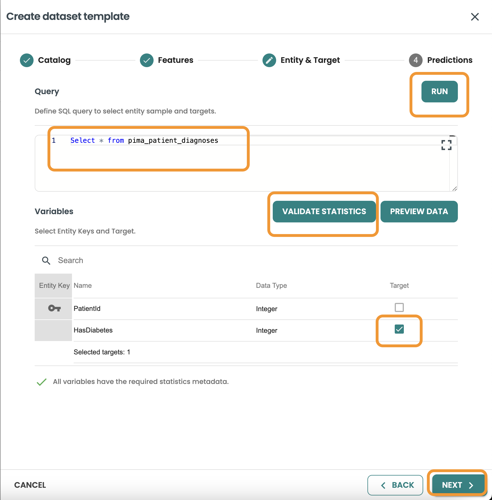


予測に進み、データベース、テーブル、クエリーの詳細を追加します。このクエリーは、このモデルがバッチとしてデプロイされるときに、本番環境でモデルを実行するための入力として使用されます (注: BYOM モデルは、ModelOps バージョン 7 でのみバッチとしてデプロイできます)。

* データベース: your-db

* テーブル: pima_patient_predictions

* クエリー:

``` sql
SELECT * FROM pima_patient_features WHERE patientid MOD 5 = 0
```


### トレーニングデータセットを作成する

データセットの作成をクリックし、名前と説明を入力してトレーニングを選択し、次へをクリックします。

このクエリーでは、データセットの行の 80% をフィルタリングして取得したいので、 `MOD 5 <> 0` を使用してこれを取得します。

``` sql
SELECT * FROM pima_patient_diagnoses WHERE patientid MOD 5 <> 0
```


クエリーを確認し、「作成」をクリックします。

### 評価データセットを作成する

データセットの作成をクリックし、名前と説明を入力して評価を選択し、次へをクリックします。

このクエリーでは、データセットの行の 20% をフィルタリングして取得したいので、  MOD 5 = 0を使用してこれを取得します。

``` sql
SELECT * FROM pima_patient_diagnoses WHERE patientid MOD 5 = 0
```


クエリーを確認し、「作成」をクリックします。

トレーニングと評価の両方のデータセットはこのように表示されます


## 4\. モデルをトレーニングして PMML  (Notebook) にエクスポートする

このクイックスタートに添付されているノートブックに従って、モデルのトレーニング、変換を実行し、次の手順でモデル pmml ファイルをダウンロードします。

## 5\. BYOM 関数を使用して PMML を Vantage にインポートする (Notebook)

BYOM パッケージの機能を理解して使用するには、このクイックスタートに添付されているノートブックに従ってください。この方法では、モデルは Vantage に公開されますが、ModelOps レジストリには公開されず、ガバナンス、自動化、監視機能は利用できません。

## 6\. ModelOpsグラフィカルユーザーインターフェイス（ModelOps）を使用してPMMLをVantageにインポートする

### ModelOpsへのインポート 

左側のメニューのモデルに移動し、BYOMモデルの定義をクリックします。


例として次の値をフィールドに入力します。

* 名前: byom

* 説明: byom

* フォーマット: PMML

モデルを保存してバージョンをインポートするをクリックします


トレーニング ツールから追跡するための外部 ID のフィールドに入力し、model.pmml ファイルをアップロードします - 注: 名前は必ず model.pmml にする必要があります。

* 外部ID: 001

* モデルファイル: model.pmml


### デフォルトの自動評価と監視を有効にする 

この画面では、監視機能を有効にするオプションをマークしたままにします。 

このモデルpmmlのトレーニングに使用したトレーニングデータセットを選択する必要があります。このデータセットは以前に作成したので、

次に、[検証] を押します。 

BYOM 予測関数は JSON に基づいて出力を生成しますが、これは BYOM モデルごとに異なります。予測のターゲット/出力である特定のフィールドを知る必要があります。これを評価ロジックで使用し、モデル メトリック (精度、精密度など) を生成するには、JSON 出力ファイルに CAST 式が必要です。

このCAST式の検証と実装を支援するために、生成リンクを追加しました。生成ボタンをクリックしてヘルパー画面に移動し、式を取得します。


次に、予測のターゲット/出力変数を選択します。このデモの場合は、predicted_HasDiabetes です。

「保存」をクリックすると、ヘルパーが式をコピーします。 


これは CAST 式です。ダイアログで [保存] をクリックします。
CAST(CAST(json_report AS JSON).JSONExtractValue('$.predicted_HasDiabetes') AS INT)

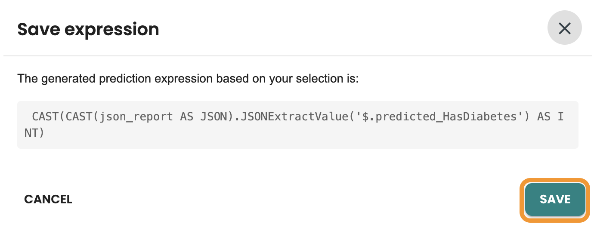

これで、キャスト式を検証し、「保存」をクリックできます。


MODEL IMPORT の新しいジョブと COMPUTE STATISTICS の別のジョブが数分間実行されます。 


## 7\. 自動化されたライフサイクル - 評価、承認、デプロイ (ModelOps) する

### ModelOpsでモデルバージョンを評価する

ジョブが完了すると、次の画像のように、この byom モデルのモデル バージョン カタログで新しいモデル バージョンが利用可能になります。モデル バージョンをクリックして、ライフサイクル内に入ります。

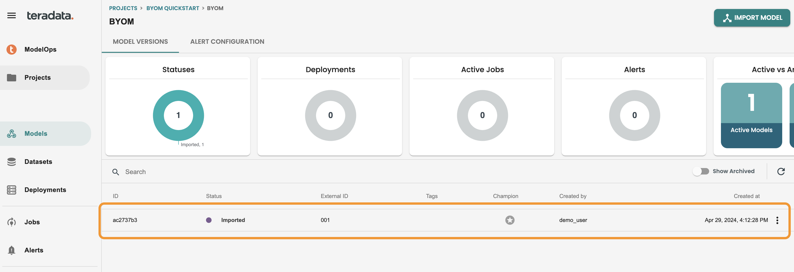

モデルはインポート段階にあります。これでモデルを評価できます。EVALUATE をクリックして、自動化されたデフォルトの評価ジョブを実行します。


評価データセットを選択し、「モデルの評価」をクリックします。 


これにより、評価用の新しいジョブが作成され、ログが表示されます。これらの画面は、右上の X ボタンで閉じることができます。


左側のメニューのジョブ画面からいつでもアクセスできます。ログに再度アクセスするには、ジョブの 3 つのドットをクリックして詳細を表示してください。次のようになります。


ジョブが完了すると、モデルはライフサイクル画面の評価ステージになります。モデル バージョンに移動して確認してください。

評価レポートを含む評価ステップのすべての詳細を確認できます。評価レポートには、デフォルトの評価ロジックによって生成されたメトリックとグラフが表示されます。注: これらのメトリックは分類モデルと回帰モデルのデフォルトであり、クイックスタートで後ほど共有するコード化されたテンプレートを使用してカスタマイズできます。


### モデルバージョンを承認する

モデル バージョンが評価されると、承認または拒否する準備が整います。この承認は、モデル ライフサイクル画面、モデル レポート画面から実行できます。また、Jira/BPM ケース管理システムなどの外部ツールを統合する REST API を通じて実行することもできます。

承認ダイアログに入り、例として次の説明を追加してみましょう。 

* 承認コメント: 制作へ進む


### モデルバージョンをデプロイし、スコアリングをスケジュールする

モデルをデプロイするには、モデルライフサイクル画面の「デプロイ」ボタンを使用する必要があります。

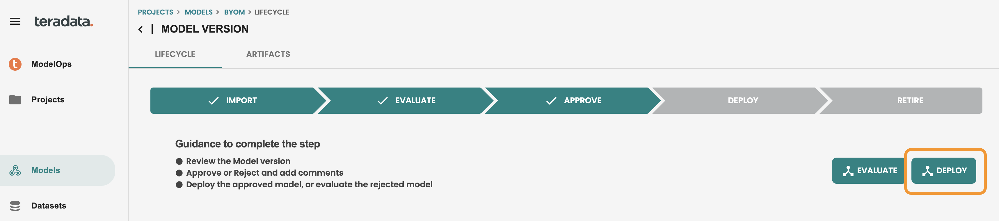

BYOM モデルの場合、Vantage の BYOM 予測機能を活用するため、使用可能なデプロイメント ターゲットは In-Vantage です。

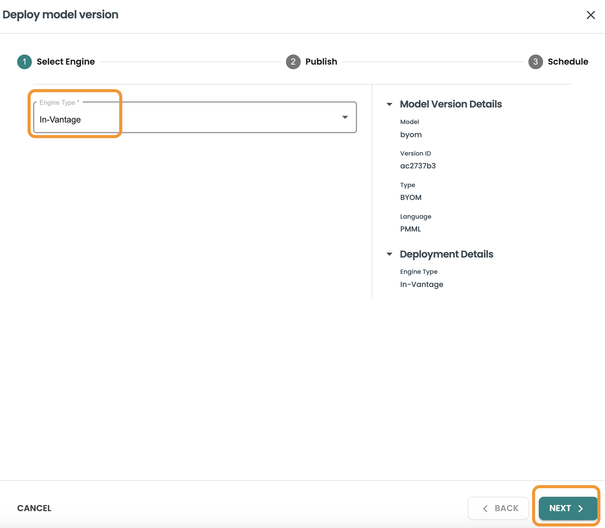

モデルを公開する: モデル、データベース、テーブルを公開するために使用する Vantage への接続を選択します。ここでは、作成した接続と、BYOM モデルを保存するために作成したテーブル aoa_byom_models を使用します。これらの詳細を入力したら、[次へ] をクリックします。

* 接続: パーソナル

* データベース: demo_user

* テーブル: aoa_byom_models


スケジュール設定のステップでは、スケジュール設定を有効にして、このスコアリングの頻度/リズムを選択できます。このデモでは、スケジュール設定を有効にするチェックボックスをオンにしたまま、「手動」を選択します。clearscape.teradata.com 内では、リソースを節約するために、スケジュール設定オプションは無効になっています。CRON 式を含めることができるため、任意のスケジュール設定オプションを使用できます。

この画面では、本番環境でモデルをスコアリングするときに使用するデータセット テンプレートも選択します。データセットの予測の詳細 (入力クエリー、データセット ステップで定義した出力予測テーブルなど) が使用されます。

このステップを完了するには、「デプロイ」をクリックします


ModelOps エージェントによって新しいデプロイメント ジョブが実行されます。これが完了すると、左側のメニューの [デプロイメント] セクションで新しいデプロイメントが利用できるようになります。


### ジョブの履歴、機能/予測のドリフト、パフォーマンスの監視などのデプロイメントの詳細

左側のメニュー「デプロイメント」に移動し、BYOM モデルからの新しいデプロイメントが利用可能であることを確認します。それをクリックして詳細を確認し、「ジョブ」タブに移動します。


ジョブタブでは、デプロイされたこのモデルの実行履歴が表示されます。今すぐ実行ボタンを使用して、新しいスコアリングを実行してみましょう。このボタンは、REST APIを介して外部でスケジュールすることもできます。

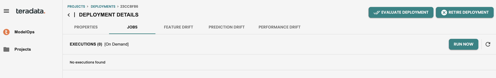

スコアリングジョブを実行すると、次のようになります。


右側の3つの点をクリックすると、このジョブの出力の詳細が表示され、予測が表示されます。

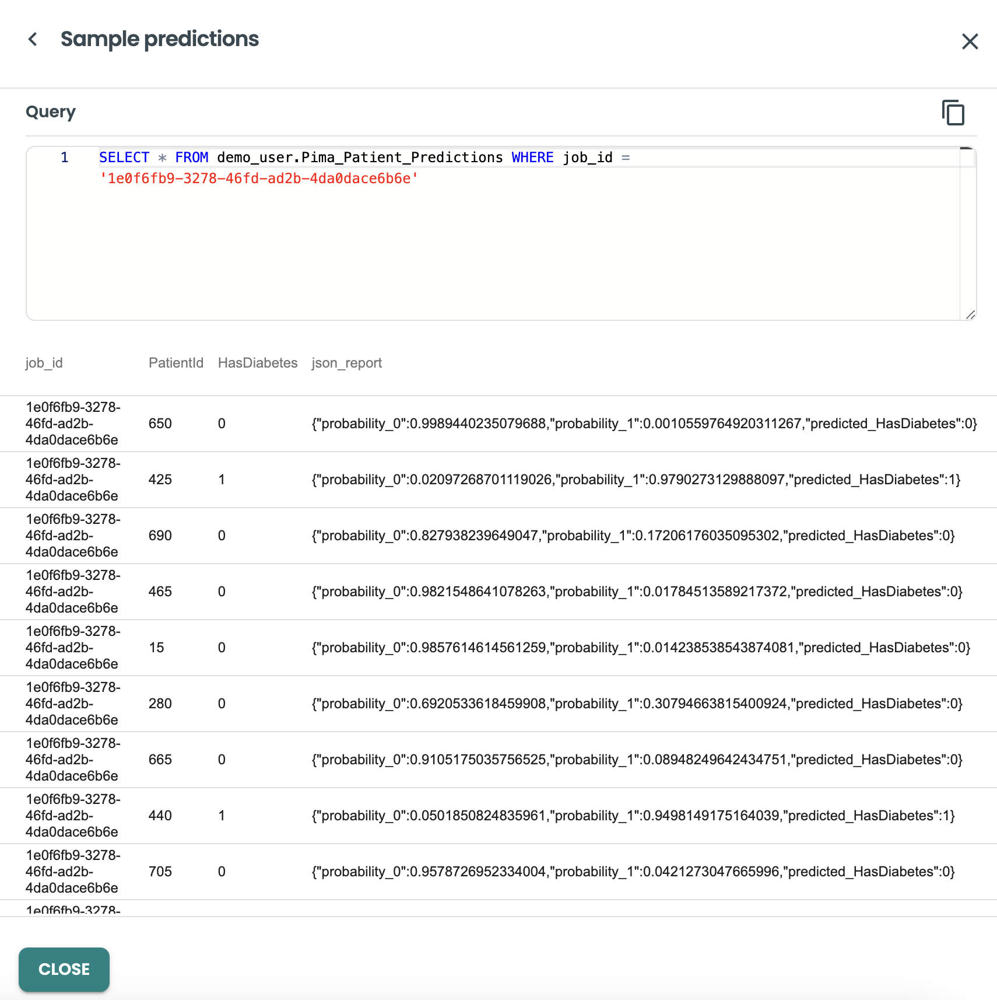

ジョブを本番環境で実行したので、デフォルトのモニタリング機能が有効になり、特徴と予測ドリフトの両方をチェックして、特徴ごとにヒストグラム計算とドリフトモニタリングの人口安定指数（PSI）KPIを個別に確認できます。


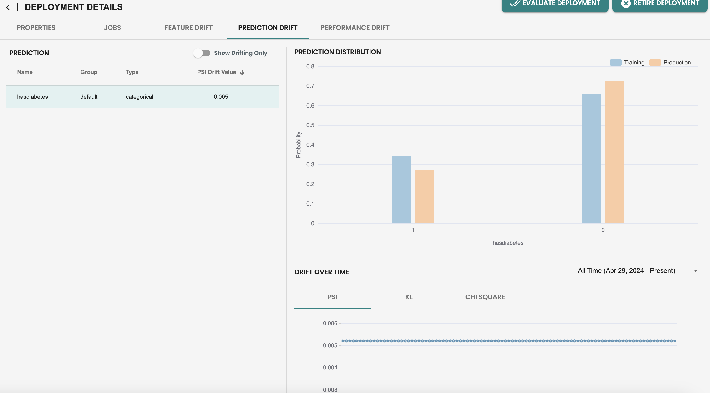

[パフォーマンス メトリック] タブには、メトリック データ ポイントが 1 つだけあることがわかります。これは、パフォーマンス モニタリングが評価ジョブに依存しているためです。新しいデータセットを作成し、このデプロイメントで新しい評価を実行して、新しい新鮮なデータがあることをシミュレートし、メトリックを以前の評価と比較してモデルのパフォーマンスを確認しましょう。

### 新しいデータセットによるパフォーマンス監視

左側のメニューの「データセット」で新しい評価データセットを作成しましょう。

作成した同じデータセットテンプレートを使用して、次の詳細を含む新しいデータセットを作成します。

* 名前: evaluation2

* 説明: evaluation2

* スコープ: evaluation


そして、新しいデータセットクエリーで新しい評価をシミュレートしてみましょう

``` sql
SELECT * FROM pima_patient_features WHERE patientid MOD 10 = 0
```

作成をクリックして評価用の新しいデータセットを生成します


これで、デプロイメントに戻って、デプロイされたモデル バージョンを評価できます。


評価ジョブ パネルで作成された新しいデータセットを使用します。

* データセットテンプレート: データセット

* データセット:evaluate2

モデルの評価をクリックします


評価ジョブが完了すると、パフォーマンス メトリックには、使用された新しいデータセットを含む新しいメトリック セットが表示されます。


## 8\. モニタリング (ModelOps) のデフォルトおよびカスタム アラート ルール

### アラートを有効にする

ModelOpsのデフォルトアラートはモデル画面で有効化されます。このテーブルにはアラートの有効化列があり、これを有効にするとデフォルトのアラートが開始されます。


このアラートを有効にすると、モデル内で ALERT タブに移動して、デフォルトのアラートの定義を確認できます。


### アラートルールの更新

パフォーマンス監視用の新しいルールなどの新しいアラートを作成したり、デフォルトのアラート ルールを更新したりできます。 

機能ドリフトモニタリングのアラート編集をしてみましょう。アラート編集をクリックします


ここでフィールドを更新できます。値のしきい値を0.2から0.18に更新し、「更新」をクリックします。


ルールを編集すると、アラート画面は次のようになります。


### アラートの確認

アラートを編集したので、ModelOps ツールに新しいアラートが届くまで 1 分間待つ必要があります。このアラートは、一連の電子メール アドレスに電子メールを送信するように構成することもできます。

アラートを受信すると、左側のメニューのアラートに赤い丸が表示されます。

この画面からモデルIDをクリックすると、モデルバージョンに直接アクセスできます。


モデルライフサイクル画面に入ると、モデルドリフトへの直接アクセスが表示されます。


次に、デプロイしたモデルの機能ドリフト タブで、個々の機能が赤で表示されます。このアラートは、最新のスコアリング データが、その人口安定性指数 (PSI) の値を持つトレーニング データからドリフトしていることを示しています。チームは、モデルのドリフトを評価し、必要に応じて本番環境でモデルを置き換えるための積極的なアクションを実行できます。

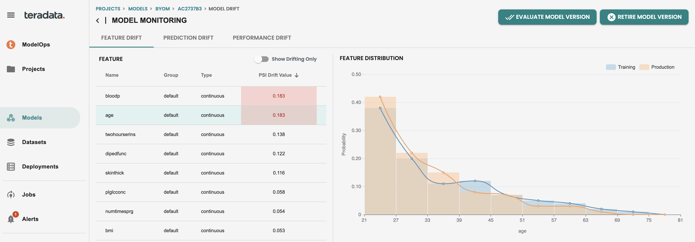

## 9\. カスタム評価メトリックとグラフ  (Notebook)

このクイックスタートに添付されているノートブックに従って、カスタム評価ロジック、メトリック、チャートを作成する方法論を理解してください。

## まとめ

このクイックスタートでは、BYOM 関数と ModelOps BYOM パターンの違い、ModelOps グラフィカル ユーザー インターフェイスを使用してモデルをインポートする方法、およびデータ ドリフトとモデル品質メトリックのアラートを取得してモデルのスコアリングと監視を自動化する方法を学びました。

## さらに詳しく

[ClearScape Analytics ModelOps ユーザーガイド](https://docs.teradata.com/search/documents?query=ModelOps&sort=last_update&virtual-field=title_only&content-lang=)

import CommunityLinkPartial from '../_partials/community_link.mdx';

<CommunityLinkPartial />
