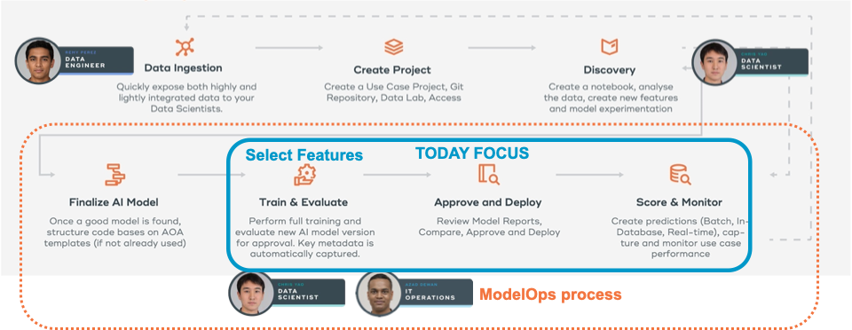

import ClearscapeDocsNote from '../_partials/vantage_clearscape_analytics.mdx'
import ModelOpsBasic from '../_partials/modelops-basic.mdx'

# ModelOps - 初めてのGITモデルのインポートとデプロイ

## 概要

これは、ClearScape Analytics ModelOps を初めて使用する人向けのハウツーです。このチュートリアルでは、ModelOpsで新しいプロジェクトを作成し、必要なデータをVantageにアップロードし、コードテンプレートを使用してModelOpsのGITモデルの方法論に従ってデモモデルのライフサイクルを完全に追跡することができるようになります。

## 前提条件

* Teradata VantageインスタンスとClearScape Analytics（ModelOpsを含む）へのアクセス。

* Jupyter Notebookを実行する機能

<ClearscapeDocsNote />

必要なファイル

まず、このチュートリアルに必要なファイルをダウンロードしましょう。次の 4 つの添付ファイルをダウンロードし、ノートブックのファイルシステムにアップロードします。ModelOps のバージョンに応じてファイルを選択します。

ModelOpsバージョン6 (2022 年 10 月):

[ModelOps トレーニング Notebookをダウンロード](../modelops/attachments/ModelOps_Training_v6.ipynb)

[デモユースケース用の BYOM Notebook ファイルをダウンロード](../modelops/attachments/BYOM_v6.ipynb)

[デモユースケース用のデータ ファイルをダウンロード](../modelops/attachments/ModelOps_Data_files_v6.zip)

[デモユースケース用の BYOM コード ファイルをダウンロード](../modelops/attachments/ModelOps_BYOM_files_v6.zip)

または、以下のレポをgit cloneしてください。
``` bash
git clone https://github.com/willfleury/modelops-getting-started
git clone https://github.com/Teradata/modelops-demo-models/
```

ModelOpsバージョン7 (2023 年 4 月):

[ModelOps トレーニング Notebookをダウンロード](../modelops/attachments/ModelOps_Training_v7.ipynb)

[デモユースケース用の BYOM Notebook ファイルをダウンロード](../modelops/attachments/BYOM_v7.ipynb)

[デモユースケース用のデータ ファイルをダウンロード](../modelops/attachments/ModelOps_Data_files_v7.zip)

[デモのユースケース用の BYOM コード ファイルをダウンロード](../modelops/attachments/ModelOps_BYOM_files_v7.zip)

``` bash
git clone -b v7 https://github.com/willfleury/modelops-getting-started.git
git clone https://github.com/Teradata/modelops-demo-models/
```

データベースとJupyter環境のセットアップ 

ModelOps_Training Jupyter Notebook に従って、デモに必要なデータベース、テーブル、ライブラリのセットアップを行います。

## メソドロジーにおける当社の位置づけを理解する




<ModelOpsBasic />

## コードテンプレートを準備する

Gitモデルでは、新しいモデルを追加するときに使用可能なコードテンプレートを入力する必要があります。 

これらのコードスクリプトは、gitリポジトリのmodel_definitions/your-model/model_modules/に保存されます。

* __init__py: これはPythonモジュールに必要な空のファイルです

* training.py: このスクリプトには train 関数が含まれています

``` python
def train(context: ModelContext, **kwargs):
    aoa_create_context()

    # your training code

    # save your model
    joblib.dump(model, f"{context.artifact_output_path}/model.joblib")

    record_training_stats(...)
```

Operationalize Notebookを参照して、ModelOps UI の代替として CLI またはNotebookからこれを実行する方法を確認してください。	

* evaluation.py: このスクリプトにはevaluate関数が含まれています

``` python
def evaluate(context: ModelContext, **kwargs):
    aoa_create_context()

    # read your model
    model = joblib.load(f"{context.artifact_input_path}/model.joblib")

    # your evaluation logic

    record_evaluation_stats(...)
```

Operationalize Notebookを参照して、ModelOps UI の代わりに CLI またはNotebookからこれを実行する方法を確認してください。	

* scoring.py: このスクリプトにはスコア関数が含まれています

``` python
def score(context: ModelContext, **kwargs):
    aoa_create_context()

    # read your model
    model = joblib.load(f"{context.artifact_input_path}/model.joblib")

    # your evaluation logic

    record_scoring_stats(...)
```

Operationalize Notebookを参照して、ModelOps UI の代替として CLI またはNotebookからこれを実行する方法を確認してください。	

* requirements.txt:このファイルには、コードスクリプトに必要なライブラリ名とバージョンが含まれています。例:

``` python
%%writefile ../model_modules/requirements.txt
xgboost==0.90
scikit-learn==0.24.2
shap==0.36.0
matplotlib==3.3.1
teradataml==17.0.0.4
nyoka==4.3.0
aoa==6.0.0
```

* config.json: 親フォルダ (モデルフォルダ) にあるこのファイルには、デフォルトのハイパーパラメータが含まれています

``` python
%%writefile ../config.json
{
   "hyperParameters": {
      "eta": 0.2,
      "max_depth": 6
   }
}
```

リポジトリ内のデモ モデルのコード スクリプトを確認してください: https://github.com/Teradata/modelops-demo-models/

model_definitions->python-diabetes->model_modulesに移動します。

## 新しい GIT のモデル ライフサイクル

* プロジェクトを開いて、GIT から利用可能なモデルを確認する

* 新しいモデルのバージョンをトレーニングする

* コードリポジトリからのCommitIDがどのように追跡されるかを確認する

* 評価する

* データセットの統計情報やモデルのメトリクスを含む評価レポートを確認する

* 他のモデルバージョンと比較する

* 承認する

* Vantageにデプロイ - エンジン、公開、スケジュール。スコアリングデータセットが必要です
接続を使用してデータベースを選択します。例: "aoa_byom_models"

* Docker Batch でデプロイする - エンジン、パブリッシュ、スケジュール データセットが必要です
接続を使用してデータベースを選択します。例: "aoa_byom_models"

* Restful Batch でデプロイする - エンジン、パブリッシュ、スケジュール データセットが必要です
接続を使用してデータベースを選択します。例: "aoa_byom_models"

* デプロイメント/実行する

* dataset2 を使用して再度評価する - モデル メトリクスの動作を監視します

* Model Driftを監視する - データとメトリクス

* Vantage にデプロイされている場合、BYOM Notebookを開いて、SQL コードから PMML 予測を実行します。

* ModelOps UI または curl コマンドから Restful をテストする

* デプロイメントをリタイアする

## まとめ

このクイック スタートでは、GIT モデルのライフサイクル全体を ModelOps で追跡し、それを Vantage または Edge デプロイメント用の Docker コンテナにデプロイする方法を学びました。次に、バッチ スコアリングをスケジュールしたり、RESTful またはオンデマンド スコアリングをテストしたり、データ ドリフトとモデル品質メトリックの監視を開始したりする方法を学びました。

## さらに詳しく
* [ModelOps ドキュメント](https://docs.teradata.com/search/documents?query=ModelOps&sort=last_update&virtual-field=title_only&content-lang=).

import CommunityLinkPartial from '../_partials/community_link.mdx';

<CommunityLinkPartial />