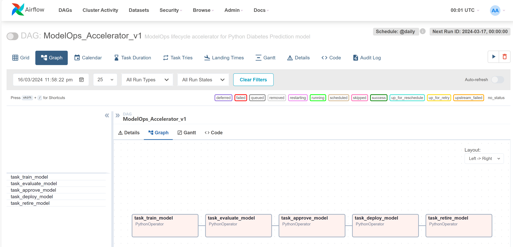

import ClearscapeDocsNote from '../_partials/vantage_clearscape_analytics.mdx'

# ModelOps で Airflow ワークフローを実行する - Model Factory ソリューション アクセラレータ

## 概要

[ **ClearScape Analytics** の **モデルファクトリーソリューションアクセラレータ** の目的は **1回の作業でビジネスドメインの何百ものモデルを作成**、を運用化することで、 **水平スケール** の組織内で機械学習モデルの開発、デプロイ、管理のエンドツーエンドのプロセスを合理化し、加速することです。これは、データベース内分析のスケーラビリティと、H2O や Dataiku などのパートナー モデル形式をサポートするオープン性を活用します。この独自の組み合わせにより、エンタープライズ環境における機械学習ライフサイクルのさまざまな段階で効率、スケーラビリティ、一貫性が向上します。 
    
モデル ファクトリー ソリューション アクセラレータは、ベスト プラクティス、自動化、標準化されたワークフローを組み込むことで、チームが使用するデータを迅速に選択し、必要なモデルを構成し、再現性を確保し、 **無制限** 個のモデルをシームレスに本番環境にデプロイできるようにします。最終的には、機械学習イニシアチブの価値実現までの時間を短縮し、大規模なモデルの構築とデプロイに対するより構造化された効率的なアプローチを促進することを目指しています。自動化されたワークフローの図を以下に示します。


Airflow と ClearScape Analytics ModelOps を使用して Model Factory Solution Accelerator を実装する手順は次のとおりです。Apache Airflow は、データ パイプラインまたはワークフローのスケジュールとオーケストレーションに使用されます。このチュートリアルでは、ModelOps のライフサイクルを自動化するために実行される Airflow DAG (有向非巡回グラフ) を作成します。

## 前提条件

* このチュートリアルでは、 **Visual Studio code** IDE を使用してローカル マシンに実装します。 

シェル コマンドを実行するには、次のリンクを使用して VS コード拡張機能 **「リモート開発」** をインストールできます。この拡張機能パックには、リモート - SSH 拡張機能と Dev Containers 拡張機能に加えて WSL 拡張機能が含まれており、コンテナ内、リモート マシン上、または WSL 内の任意のフォルダを開くことができます。
[VSコードマーケットプレイス](https://marketplace.visualstudio.com/items?itemName=ms-vscode-remote.vscode-remote-extensionpack).

* Teradata VantageインスタンスとClearScape Analytics（ModelOpsを含む）へのアクセス。


<ClearscapeDocsNote />


## Visual Studio Code の設定と docker-compose での Airflow のインストール

* Visual Studioコードを開き、リモートウィンドウを開くオプションを選択します。次に、WSL-Ubuntuに接続を選択します。

* ファイル > フォルダを開くを選択します。次に、目的のフォルダを選択するか、次のコマンドを使用して新しいフォルダを作成します: mkdir [folder_name]

* AIRFLOW_HOME 環境変数を設定します。Airflow にはホーム ディレクトリが必要で、デフォルトでは ~/airflow を使用しますが、必要に応じて別の場所を設定することもできます。AIRFLOW_HOME 環境変数は、Airflow に必要な場所を通知するために使用されます。

``` bash 
AIRFLOW_HOME=./[folder_name]
```

* PyPI リポジトリから apache-airflow 安定バージョン 2.8.2 をインストールします。

``` bash  
    AIRFLOW_VERSION=2.8.2

    PYTHON_VERSION="$(python3 --version | cut -d " " -f 2 | cut -d "." -f 1-2)"

    CONSTRAINT_URL="https://raw.githubusercontent.com/apache/airflow/constraints-${AIRFLOW_VERSION}/constraints-${PYTHON_VERSION}.txt"

    pip install "apache-airflow==${AIRFLOW_VERSION}" --constraint "${CONSTRAINT_URL}" --default-timeout=100
```

* Airflow Teradataプロバイダの安定バージョンをPyPIリポジトリからインストールします。

``` bash  
pip install "apache-airflow-providers-teradata" --default-timeout=100
```

* Docker コンテナを使用して Airflow を実行できるように、Docker Desktop をインストールします。Docker デスクトップが実行されていることを確認します。

* 次のコマンドを使用して docker のバージョンを確認します。

``` bash  
docker --version
```

docker composeのバージョンを確認してください。Docker Composeは、マルチコンテナアプリケーションを定義および実行するためのツールです。

``` bash  
docker-compose --version
```

Docker Compose に Airflow をデプロイするには、この curl コマンドを使用して docker-compose.yaml を取得する必要があります。

``` bash , id="Fetch docker-compose yaml", role="content-editable emits-gtm-events"
    curl -LfO 'https://airflow.apache.org/docs/apache-airflow/2.8.2/docker-compose.yaml'
```

次のコマンドを使用して、後で使用するためにこれらのフォルダを作成します。 

``` bash , id="Create Airflow folders", role="content-editable emits-gtm-events"
mkdir -p ./dags ./logs ./plugins ./config
```


## モデルファクトリーソリューションアクセラレータの構成

config フォルダ内に config ファイルを作成し、トレーニングするモデルに応じてパラメーターを対応する値に設定します。

<details>

<summary>クリックするとPythonコードが表示されます</summary>

<pre>
```python  
from configparser import ConfigParser
import os

config = ConfigParser()

config['MAIN'] = {
    "projectId": "23e1df4b-b630-47a1-ab80-7ad5385fcd8d",
    "bearerToken": os.environ['BEARER_TOKEN'],
    "trainDatasetId": "ba39e766-2fdf-426f-ba5c-4ca3e90955fc",
    "evaluateDatasetId": "74489d62-2af5-4402-b264-715e151a420a",
    "datasetConnectionId" : "151abf05-1914-4d38-a90d-272d850f212c",
    "datasetTemplateId": "d8a35d98-21ce-47d0-b9f2-00d355777de1"
}

config['HYPERPARAMETERS'] = {
    "eta": 0.2,
    "max_depth": 6
}

config['RESOURCES'] = {
    "memory": "500m",
    "cpu": "0.5"
}

config['MODEL'] = {
    "modelId": "f937b5d8-02c6-5150-80c7-1e4ff07fea31",
    "approvalComments": "Approving this model!",
    "cron": "@once",
    "engineType": "DOCKER_BATCH",
    "engine": "python-batch",
    "dockerImage": "artifacts.td.teradata.com/tdproduct-docker-snapshot/avmo/aoa-python-base:3.9.13-1"
}


with open('./config/modelOpsConfig.ini', 'w') as f:
    config.write(f)
```
</pre>
</details>
次に、ModelOps ユーザー インターフェイス (左側のメニュー -> アカウント -> セッションの詳細) から Bearer トークンをコピーし、次のコマンドを使用してここで環境変数として設定します。

``` bash , id="Bearer token", role="content-editable emits-gtm-events"
export BEARER_TOKEN='your_token_here'
```

これで、以前に作成した構成ファイルを実行することができます。これにより、DAG 作成手順で使用されるすべての必要なパラメータを含む新しい ini ファイルが config フォルダ内に作成されます。

``` python , id="Create config ini", role="content-editable emits-gtm-events"
python3 createConfig.py
```

## 完全な ModelOps ライフサイクルを含む Airflow DAG を作成する

これで、次の Python コードを使用して DAG を作成できます。この Python コード ファイルを dags フォルダ内に追加します。この DAG には、ModelOps ライフサイクルの 5 つのタスク (トレーニング、評価、承認、デプロイ、および廃止) が含まれています。


<details>

<summary>クリックするとPythonコードが表示されます</summary>

<pre>
```python  
import base64
from datetime import datetime, timedelta, date
import json
import os
import time

from airflow import DAG
from airflow.operators.python import PythonOperator

import requests

from configparser import ConfigParser

# Read from Config file
config = ConfigParser()
config.read('config/modelOpsConfig.ini')

config_main = config["MAIN"]
config_hyper_params = config["HYPERPARAMETERS"]
config_resources = config["RESOURCES"]
config_model = config["MODEL"]

# Default args for DAG
default_args = {
    'owner': 'Tayyaba',
    'retries': 5,
    'retry_delay': timedelta(minutes=2)
}

def get_job_status(job_id):

    # Use the fetched Job ID to check Job Status
    headers_for_status = {
    'AOA-PROJECT-ID': config_main['projectid'],
    'Authorization': 'Bearer ' + config_main['bearertoken'],
    }

    status_response = requests.get('https://airflow-u9usja4twtauvt3s.env.clearscape.teradata.com:8443/modelops/core/api/jobs/' + job_id + '?projection=expandJob', headers=headers_for_status)
    status_json = status_response.json()
    job_status = status_json.get('status')
    return job_status


def train_model(ti):

    headers = {
    'AOA-Project-ID': config_main['projectid'],
    'Accept': 'application/json, text/plain, */*',
    'Accept-Language': 'en-US,en;q=0.9',
    'Authorization': 'Bearer ' + config_main['bearertoken'],
    'Content-Type': 'application/json',
    }

    json_data = {
        'datasetId': config_main['trainDatasetId'],
        'datasetConnectionId': config_main['datasetConnectionId'],
        'modelConfigurationOverrides': {
            'hyperParameters': {
                'eta': config_hyper_params['eta'],
                'max_depth': config_hyper_params['max_depth'],
            },
        },
        'automationOverrides': {
            'resources': {
                'memory': config_resources['memory'],
                'cpu': config_resources['cpu'],
            },
            'dockerImage':  config_model['dockerImage'],
        },
    }

    
    response = requests.post('https://airflow-u9usja4twtauvt3s.env.clearscape.teradata.com:8443/modelops/core/api/models/' + config_model['modelid'] + '/train', headers=headers, json=json_data)
    
    json_data = response.json()

    # Get the Training Job ID
    job_id = json_data.get('id')
    ti.xcom_push(key='train_job_id', value=job_id)

    job_status = get_job_status(job_id)
    print("Started - Training Job - Status: ", job_status)

    while job_status != "COMPLETED":
        if job_status=="ERROR":
            print("The training job is terminated due to an Error")
            ti.xcom_push(key='trained_model_id', value='NONE') # Setting the Trained Model Id to None here and check in next step (Evaluate)
            break
        elif job_status=="CANCELLED":
            ti.xcom_push(key='trained_model_id', value='NONE') 
            print("The training job is Cancelled !!")
            break
        print("Job is not completed yet. Current status", job_status)
        time.sleep(5) #wait 5s
        job_status = get_job_status(job_id)

    # Checking Job status at the end to push the correct trained_model_id
    if(job_status == "COMPLETED"):
        train_model_id = json_data['metadata']['trainedModel']['id']
        ti.xcom_push(key='trained_model_id', value=train_model_id)
        print('Model Trained Successfully! Job ID is : ', job_id, 'Trained Model Id : ', train_model_id, ' Status : ', job_status)
    else:
        ti.xcom_push(key='trained_model_id', value='NONE')
        print("Training Job is terminated !!")


def evaluate_model(ti):

    trained_model_id = ti.xcom_pull(task_ids = 'task_train_model', key = 'trained_model_id')

    headers = {
    'AOA-Project-ID': config_main['projectid'],
    'Accept': 'application/json, text/plain, */*',
    'Accept-Language': 'en-US,en;q=0.9',
    'Authorization': 'Bearer ' + config_main['bearertoken'],
    'Content-Type': 'application/json',
    }

    json_data = {
        'datasetId': config_main['evaluatedatasetid'],
        'datasetConnectionId': config_main['datasetConnectionId'],
        'modelConfigurationOverrides': {
            'hyperParameters': {
                'eta': config_hyper_params['eta'],
                'max_depth': config_hyper_params['max_depth'],
            },
        },
        'automationOverrides': {
            'resources': {
                'memory': config_resources['memory'],
                'cpu': config_resources['cpu'],
            },
            'dockerImage':  config_model['dockerImage'],
        },
    }

    if trained_model_id == 'NONE':
        ti.xcom_push(key='evaluated_model_status', value='FALIED')
        print("Evaluation cannot be done as the Training Job was terminated !!") 
    else:
        response = requests.post('https://airflow-u9usja4twtauvt3s.env.clearscape.teradata.com:8443/modelops/core/api/trainedModels/' + trained_model_id + '/evaluate', headers=headers, json=json_data)
        json_data = response.json()

        # Get the Evaluation Job ID
        eval_job_id = json_data.get('id')
        ti.xcom_push(key='evaluate_job_id', value=eval_job_id)

        job_status = get_job_status(eval_job_id)
        print("Started - Job - Status: ", job_status)

        while job_status != "COMPLETED":
            if job_status=="ERROR":
                print("The evaluation job is terminated due to an Error")
                # Set the Trained Model Id to None here and check in next step (Evaluate)
                break
            elif job_status=="CANCELLED":
                print("The evaluation job is Cancelled !!")
                break
            print("Job is not completed yet. Current status", job_status)
            time.sleep(5) # wait 5s
            job_status = get_job_status(eval_job_id)

        # Checking Job status at the end to push the correct evaluate_job_id
        if(job_status == "COMPLETED"):
            ti.xcom_push(key='evaluated_model_status', value='EVALUATED')
            print('Model Evaluated Successfully! Job ID is : ', eval_job_id, ' Status : ', job_status)
        else:
            ti.xcom_push(key='evaluated_model_status', value='FAILED')
            print("Evaluation Job is terminated !!")


def approve_model(ti):

    evaluated_model_status = ti.xcom_pull(task_ids = 'task_evaluate_model', key = 'evaluated_model_status')

    if evaluated_model_status == 'FAILED':
        ti.xcom_push(key='approve_model_status', value='FALIED')
        print("Approval cannot be done as the Evaluation was failed !!") 
    else:
        trained_model_id = ti.xcom_pull(task_ids = 'task_train_model', key = 'trained_model_id') 

        headers = {
        'AOA-Project-ID': config_main['projectid'],
        'Accept': 'application/json, text/plain, */*',
        'Accept-Language': 'en-US,en;q=0.9',
        'Authorization': 'Bearer ' + config_main['bearertoken'],
        'Content-Type': 'application/json',
        }

        json_data = {
            "comments": (base64.b64encode(config_model['approvalComments'].encode()).decode())
        }

        response = requests.post('https://airflow-u9usja4twtauvt3s.env.clearscape.teradata.com:8443/modelops/core/api/trainedModels/' + trained_model_id + '/approve' , headers=headers, json=json_data)
        response_json = response.json()
        approval_status = response_json['status']
        if(approval_status == 'APPROVED'):
            ti.xcom_push(key='approve_model_status', value='EVALUATED')
            print('Model Approved Successfully! Status: ', approval_status)
        else:
            ti.xcom_push(key='approve_model_status', value='FAILED')
            print('Model not approved! Status: ', approval_status)


def deploy_model(ti):

    approve_model_status = ti.xcom_pull(task_ids = 'task_approve_model', key = 'approve_model_status')

    headers = {
        'AOA-Project-ID': config_main['projectid'],
        'Accept': 'application/json, text/plain, */*',
        'Accept-Language': 'en-US,en;q=0.9',
        'Authorization': 'Bearer ' + config_main['bearertoken'],
        'Content-Type': 'application/json',
    }


    json_data = {
        'engineType': config_model['engineType'],
        'engineTypeConfig': {
            'dockerImage':  config_model['dockerImage'],
            'engine': "python-batch",
            'resources': {
                'memory': config_resources['memory'],
                'cpu': config_resources['cpu'],
            }
        },
        'language':"python",
        'datasetConnectionId': config_main['datasetConnectionId'],
        'datasetTemplateId': config_main['datasetTemplateId'],
        'cron': config_model['cron'],
        'publishOnly': "false",
        'args':{}
    }

    if approve_model_status == 'FAILED':
        ti.xcom_push(key='deploy_model_status', value='FALIED')
        print("Deployment cannot be done as the model is not approved !!") 
    else:
        trained_model_id = ti.xcom_pull(task_ids = 'task_train_model', key = 'trained_model_id') 

        response = requests.post('https://airflow-u9usja4twtauvt3s.env.clearscape.teradata.com:8443/modelops/core/api/trainedModels/' + trained_model_id + '/deploy', headers=headers, json=json_data)
        json_data = response.json()

        # Get the Deployment Job ID
        deploy_job_id = json_data.get('id')
        ti.xcom_push(key='deploy_job_id', value=deploy_job_id)

        # deployed_model_id = json_data['metadata']['deployedModel']['id']

        job_status = get_job_status(deploy_job_id)
        print("Started - Deployment Job - Status: ", job_status)

        while job_status != "COMPLETED":
            if job_status=="ERROR":
                ti.xcom_push(key='deploy_model_status', value='FAILED')
                print("The deployment job is terminated due to an Error")
                break
            elif job_status=="CANCELLED":
                ti.xcom_push(key='deploy_model_status', value='FAILED')
                print("The deployment job is Cancelled !!")
                break
            print("Job is not completed yet. Current status", job_status)
            time.sleep(5) # wait 5s
    job_status = get_job_status(deploy_job_id)

    # Checking Job status at the end to push the correct deploy_model_status
    if(job_status == "COMPLETED"):
        ti.xcom_push(key='deploy_model_status', value='DEPLOYED')
        print('Model Deployed Successfully! Job ID is : ', deploy_job_id, ' Status : ', job_status)
    else:
        ti.xcom_push(key='deploy_model_status', value='FAILED')
        print("Deployment Job is terminated !!")


def retire_model(ti):

    deployed_model_status = ti.xcom_pull(task_ids = 'task_deploy_model', key = 'deploy_model_status')

    if deployed_model_status == 'FAILED':
        ti.xcom_push(key='retire_model_status', value='FALIED')
        print("Retirement cannot be done as the model is not deployed !!") 
    else:
        trained_model_id = ti.xcom_pull(task_ids = 'task_train_model', key = 'trained_model_id') 

        headers = {
        'AOA-Project-ID': config_main['projectid'],
        'Accept': 'application/json, text/plain, */*',
        'Accept-Language': 'en-US,en;q=0.9',
        'Authorization': 'Bearer ' + config_main['bearertoken'],
        'Content-Type': 'application/json',
        }

        # Identifying the deployment ID
        get_deployment_id_response = requests.get('https://airflow-u9usja4twtauvt3s.env.clearscape.teradata.com:8443/modelops/core/api/deployments/search/findByStatusAndTrainedModelId?projection=expandDeployment&status=DEPLOYED&trainedModelId=' + trained_model_id , headers=headers)
  
        get_deployment_id_json = get_deployment_id_response.json()
        deployment_id = get_deployment_id_json['_embedded']['deployments'][0]['id']

        json_data = {
            "deploymentId": deployment_id
        }

        # Retire the specific deployment
        retire_model_response = requests.post('https://airflow-u9usja4twtauvt3s.env.clearscape.teradata.com:8443/modelops/core/api/trainedModels/' + trained_model_id + '/retire', headers=headers, json=json_data)
        retire_model_response_json = retire_model_response.json()

                # Get the Evaluation Job ID
        retire_job_id = retire_model_response_json.get('id')
        ti.xcom_push(key='retire_job_id', value=retire_job_id)

        job_status = get_job_status(retire_job_id)
        print("Started - Job - Status: ", job_status)

        while job_status != "COMPLETED":
            if job_status=="ERROR":
                print("The Retire job is terminated due to an Error")
                # Set the Trained Model Id to None here and check in next step (Evaluate)
                break
            elif job_status=="CANCELLED":
                print("The Retire job is Cancelled !!")
                break
            print("Job is not completed yet. Current status", job_status)
            time.sleep(5) # wait 5s
            job_status = get_job_status(retire_job_id)

        # Checking Job status at the end to push the correct evaluate_job_id
        if(job_status == "COMPLETED"):
            ti.xcom_push(key='retire_model_status', value='RETIRED')
            print('Model Retired Successfully! Job ID is : ', retire_job_id, ' Status : ', job_status)
        else:
            ti.xcom_push(key='retire_model_status', value='FAILED')
            print("Retire Job is terminated !!")


with DAG(
    dag_id = 'ModelOps_Accelerator_v1',
    default_args=default_args,
    description = 'ModelOps lifecycle accelerator for Python Diabetes Prediction model',
    start_date=datetime.now(), # Set the start_date as per requirement
    schedule_interval='@daily'
) as dag:
    task1 = PythonOperator(
        task_id='task_train_model',
        python_callable=train_model
    )
    task2 = PythonOperator(
        task_id='task_evaluate_model',
        python_callable=evaluate_model
    )
    task3 = PythonOperator(
        task_id='task_approve_model',
        python_callable=approve_model
    )
    task4 = PythonOperator(
        task_id='task_deploy_model',
        python_callable=deploy_model
    )
    task5 = PythonOperator(
        task_id='task_retire_model',
        python_callable=retire_model
    )
    

task1.set_downstream(task2)
task2.set_downstream(task3)
task3.set_downstream(task4)
task4.set_downstream(task5)
```
</pre>
</details>

## Docker Compose で Airflow を初期化する

Linux 以外のオペレーティング システムでは、内部 Airflow データベースなどの Airflow サービスを初期化する際に、AIRFLOW_UID が設定されていないという警告が表示されることがあります。ただし、次のコマンドを使用して環境変数を設定することで、この警告を無視しても問題ありません。

``` bash , id="UID Airflow variable", role="content-editable emits-gtm-events"
echo -e "AIRFLOW_UID=5000" > .env
```

内部データベースの移行を実行し、最初のユーザー アカウントを作成するには、次のコマンドを使用してデータベースを初期化します。

``` bash , id="", role="content-editable emits-gtm-events"
docker compose up airflow-init
```

初期化が完了すると、次のようなメッセージが表示されます。

``` bash , id="Check Airflow init", role="content-editable emits-gtm-events"
 airflow-init_1       | Upgrades done
 airflow-init_1       | Admin user airflow created
 airflow-init_1       | 2.8.2
 start_airflow-init_1 exited with code 0
```

## Airflowデモ環境をクリーンアップする

次のコマンドを使用して、事前にロードされたサンプル DAG を削除して環境をクリーンアップできます。

``` bash , id="Docker compose down", role="content-editable emits-gtm-events"
docker-compose down -v
```

次に、docker-compose.yaml ファイルでこのパラメータを以下のように更新します。

``` bash , id="Docker compose yaml", role="content-editable emits-gtm-events"
AIRFLOW__CORE__LOAD_EXAMPLES: 'false'
```

## モデルファクトリーソリューションアクセラレータでAirflowを起動する

次のコマンドを使用して Airflow を起動します。

``` bash , id="Docker compose up", role="content-editable emits-gtm-events"
docker-compose up -d
```


## ModelOps でモデル ファクトリー ソリューションの Airflow DAG を実行する

* これで、次の http://localhost:8080/ を使用して Airflow UI にアクセスできます。


* ユーザー名: airflow、パスワード: airflow でログインします。DAG メニューで、作成した DAG を確認できます。


* 最後に作成した DAG を選択すると、グラフは次のようになります。



* これで、右上の再生アイコンを使用して DAG をトリガーできます。

* 任意のタスクを選択し、ログ メニューをクリックすると、ログを確認できます。

* ClearScape Analytics ModelOps - ジョブ セクションで、ジョブの実行が開始されたことを確認できます。


* これで、すべてのタスクが正常に実行されたことがわかります。


## まとめ

このチュートリアルの目的は、Linux サーバーに Airflow 環境をインストールする方法と、Airflow を使用して ClearScape Analytics ModelOps および Teradata Vantage データベースとやり取りする方法を実際に体験することです。また、Airflow とデータ モデリングおよびメンテナンス ツール dbt を統合して Teradata Vantage データベースを作成してロードする方法の例も示します。

## さらに詳しく
* [ModelOps documentatioN](https://docs.teradata.com/search/documents?query=ModelOps&sort=last_update&virtual-field=title_only&content-lang=).
