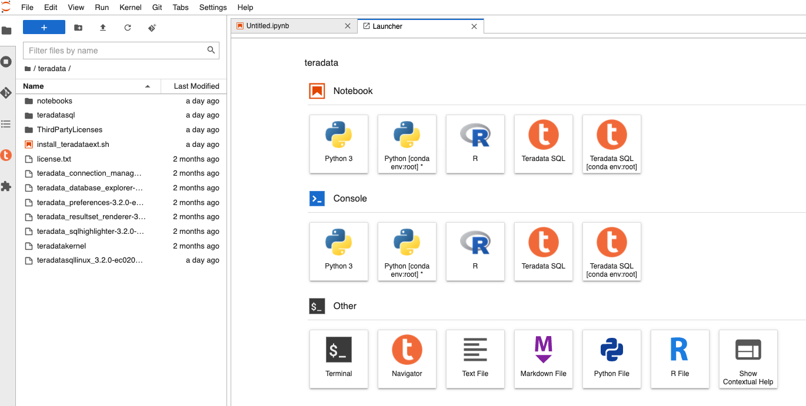
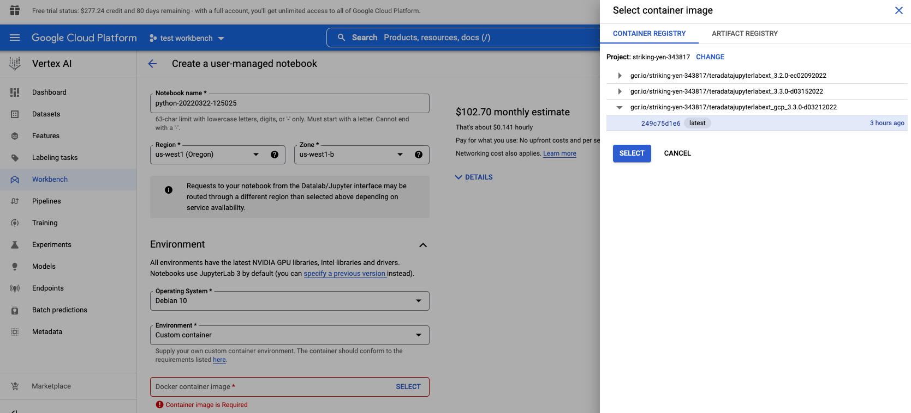

import ClearscapeDocsNote from '../_partials/vantage_clearscape_analytics.mdx'
import JupyterClearscapeNote from '../_partials/jupyter_notebook_clearscape_analytics_note.mdx';

# Google Vertex AIとTeradata Jupyterエクステンションを統合する


<JupyterClearscapeNote />

## 概要
Teradata Jupyter 拡張機能は、Teradata SQL カーネルといくつかの UI 拡張機能を提供し、ユーザーが Jupyter 環境から Teradata データベースに簡単にアクセスして操作できるようにします。Google Vertex AI は、Google Cloud の新しい統合 ML プラットフォームです。Vertex AI Workbench は、データ サイエンス ワークフロー全体のための Jupyter ベースの開発環境を提供します。この記事では、Vertex AI ユーザーが ML パイプラインで Teradata 拡張機能を活用できるように、Jupyter 拡張機能を Vertex AI Workbench と統合する方法について説明します。

Vertex AI ワークベンチは、管理対象ノートブックとユーザー管理ノートブックの 2 種類のノートブックをサポートしています。ここでは、ユーザー管理ノートブックに焦点を当てます。Jupyter 拡張機能をユーザー管理ノートブックと統合する 2 つの方法、つまり起動スクリプトを使用してカーネルと拡張機能をインストールする方法と、カスタム コンテナを使用する方法を紹介します。

## 前提条件

* Teradata Vantageインスタンスへのアクセス。
  <ClearscapeDocsNote />
* Vertex AIを有効にしたGoogle Cloudアカウント
* 起動スクリプトとTeradata Jupyter拡張パッケージを保存するためのGoogleクラウドストレージ

## 統合について

Vertex AIでTeradata Jupyter Extensionsを実行するには、2つの方法があります。

1. [スタートアップスクリプトを使用する](#use-startup-script)
2. [ カスタムコンテナを使用する](#use-custom-container)

この2つの統合方法について、以下に説明します。

### スタートアップスクリプトを使用する

新しいノートブック インスタンスを作成するときに、起動スクリプトを指定できます。このスクリプトは、インスタンスの作成後に 1 回だけ実行されます。手順は次のとおりです。

1. Teradata Jupyter拡張パッケージをダウンロードする

Teradata Jupyter 拡張パッケージ バンドルの Linux バージョンをダウンロードするには、 [Vantage Modules for Jupyter](https://downloads.teradata.com/download/tools/vantage-modules-for-jupyter) ページに移動します。

2. パッケージを Google Cloud ストレージ バケットにアップロードする

3. 起動スクリプトを書いてクラウドストレージバケットにアップロードする

以下は、クラウドストレージバケットからTeradata Jupyter extensionパッケージを取得し、Teradata SQLカーネルとエクステンションをインストールするスクリプトの例です。

``` bash , role="content-editable"
#! /bin/bash

cd /home/jupyter
mkdir teradata
cd teradata
gsutil cp gs://teradata-jupyter/* .
unzip teradatasql*.zip

# Install Teradata kernel
cp teradatakernel /usr/local/bin

jupyter kernelspec install ./teradatasql --prefix=/opt/conda

# Install Teradata extensions
pip install --find-links . teradata_preferences_prebuilt
pip install --find-links . teradata_connection_manager_prebuilt
pip install --find-links . teradata_sqlhighlighter_prebuilt
pip install --find-links . teradata_resultset_renderer_prebuilt
pip install --find-links . teradata_database_explorer_prebuilt

# PIP install the Teradata Python library
pip install teradataml

# Install Teradata R library (optional, uncomment this line only if you use an environment that supports R)
#Rscript -e "install.packages('tdplyr',repos=c('https://r-repo.teradata.com','https://cloud.r-project.org'))"
```


4. 新しいNotebookを作成し、クラウドストレージバケットからスタートアップスクリプトを追加する


5. ノートブックの作成プロセスが完了するまでに数分かかる場合があります。完了したら、 `Open notebook`をクリックします。


### カスタムコンテナを使用する

もう 1 つのオプションは、Notebookの作成時にカスタム コンテナを提供することです。

1. Teradata Jupyter拡張パッケージをダウンロードする

Teradata Jupyter 拡張パッケージ バンドルの Linux バージョンをダウンロードするには、 [Vantage Modules for Jupyter](https://downloads.teradata.com/download/tools/vantage-modules-for-jupyter) ページに移動します。

2. このパッケージを作業ディレクトリにコピーし、解凍する

3. カスタムDockerイメージを構築する

カスタム コンテナはポート 8080 でサービスを公開する必要があります。Google Deep Learning Containersイメージから派生したコンテナを作成することをお勧めします。これらのイメージは、ユーザ管理Notebookと互換性があるようにすでに構成されているからです。

以下は、Teradata SQLカーネルおよび拡張機能をインストールしたDockerイメージを構築するために使用できるDockerfileのサンプルです。

``` bash
# Use one of the deep learning images as base image
# if you need both Python and R, use one of the R images
FROM gcr.io/deeplearning-platform-release/r-cpu:latest

USER root

##############################################################
# Install kernel and copy supporting files
##############################################################

# Copy the kernel
COPY ./teradatakernel /usr/local/bin

RUN chmod 755 /usr/local/bin/teradatakernel

# Copy directory with kernel.json file into image
COPY ./teradatasql teradatasql/

# Copy notebooks and licenses
COPY ./notebooks/ /home/jupyter
COPY ./license.txt /home/jupyter
COPY ./ThirdPartyLicenses/ /home/jupyter

# Install the kernel file to /opt/conda jupyter lab instance
RUN jupyter kernelspec install ./teradatasql --prefix=/opt/conda

##############################################################
# Install Teradata extensions
##############################################################

RUN pip install --find-links . teradata_preferences_prebuilt && \
    pip install --find-links . teradata_connection_manager_prebuilt && \
    pip install --find-links . teradata_sqlhighlighter_prebuilt && \
    pip install --find-links . teradata_resultset_renderer_prebuilt && \
    pip install --find-links . teradata_database_explorer_prebuilt

# Give back ownership of /opt/conda to jovyan
RUN chown -R jupyter:users /opt/conda

# PIP install the Teradata Python libraries
RUN pip install teradataml

# Install Teradata R library (optional, include it only if you use a base image that supports R)
RUN Rscript -e "install.packages('tdplyr',repos=c('https://r-repo.teradata.com','https://cloud.r-project.org'))"
```

4. 作業ディレクトリ（Teradata Jupyter extensionsパッケージを解凍した場所）で、`docker build`を実行してイメージをビルドしてください。

``` bash , id="jupyterlab_ext_on_vertex_first_run", role="content-editable emits-gtm-events
docker build -f Dockerfile imagename:imagetag .
```

5. Docker イメージを Google コンテナ レジストリまたはアーティファクト レジストリにプッシュします。

Docker イメージをレジストリにプッシュするには、次のドキュメントを参照してください。

* [ コンテナレジストリ。イメージのプッシュとプル](https://cloud.google.com/container-registry/docs/pushing-and-pulling)
* [ アーティファクトレジストリ。イメージのプッシュとプル](https://cloud.google.com/artifact-registry/docs/docker/pushing-and-pulling?hl=en)

6. 新しいノートブックを作成する

 `Environment` セクションで、 `custom container` フィールドを新しく作成したカスタム コンテナの場所に設定します。


## さらに詳しく
* [ Teradata Jupyter 拡張機能 Web サイト](https://teradata.github.io/jupyterextensions)
* [ Jupyter用Teradata Vantage™モジュールインストールガイド](https://docs.teradata.com/r/KQLs1kPXZ02rGWaS9Ktoww/root)
* [ Python用Teradata®パッケージユーザガイド](https://docs.teradata.com/r/1YKutX2ODdO9ppo_fnguTA/root)
* [ Vertex AIのドキュメントです。学習用カスタムコンテナイメージを作成します](https://cloud.google.com/vertex-ai/docs/training/create-custom-container)
* [ Vertex AIのドキュメントです。カスタムコンテナを使用してユーザー管理型Notebookインスタンスを作成します](https://cloud.google.com/vertex-ai/docs/workbench/user-managed/custom-container)
* [ Vertex AIのドキュメントです。ユーザーマネージドNotebookのインスタンスを作成します](https://cloud.google.com/vertex-ai/docs/workbench/user-managed/create-new)

import CommunityLinkPartial from '../_partials/community_link.mdx';

<CommunityLinkPartial />
