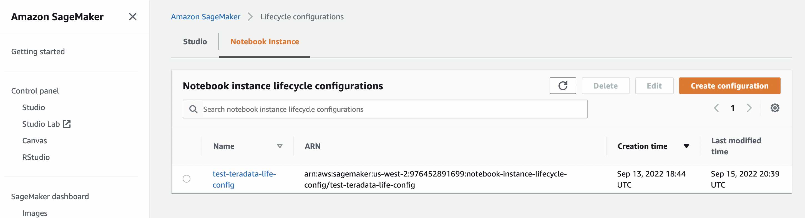
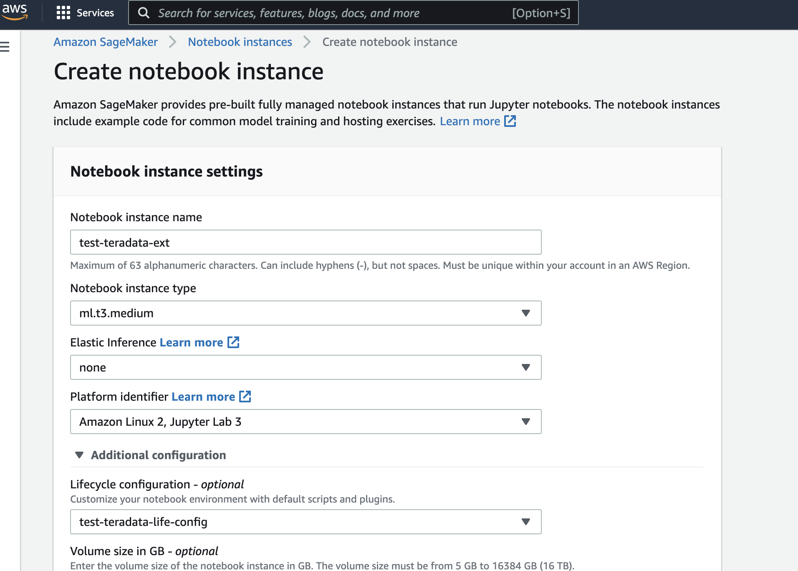
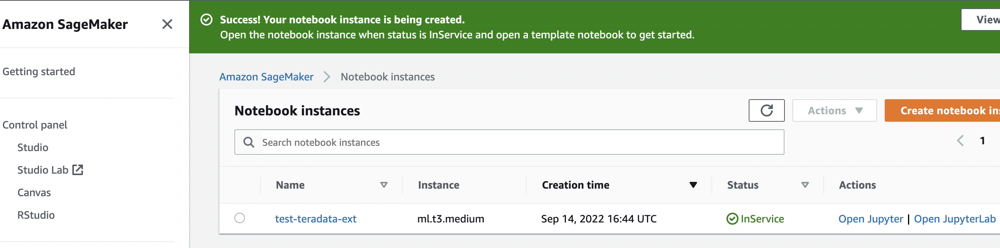
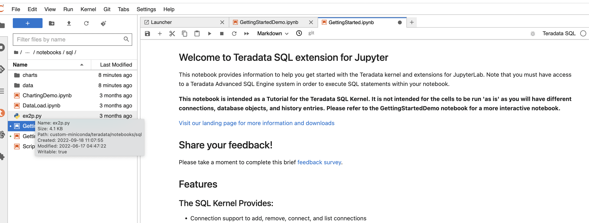

import ClearscapeDocsNote from '../_partials/vantage_clearscape_analytics.mdx'
import JupyterClearScapeNote from '../_partials/jupyter_notebook_clearscape_analytics_note.mdx';

# Teradata Jupyter Extentionsと SageMakerNotebookインスタンスを統合する


<JupyterClearScapeNote />

### 概要
Teradata Jupyter 拡張機能は、Teradata SQL カーネルといくつかの UI 拡張機能を提供し、ユーザーが Jupyter 環境から Teradata データベースに簡単にアクセスして操作できるようにします。この記事では、Jupyter 拡張機能を SageMaker ノートブック インスタンスと統合する方法について説明します。

### 前提条件


* Teradata Vantageインスタンスへのアクセス。
  <ClearscapeDocsNote />
* AWS アカウント
* ライフサイクル構成スクリプトとTeradata Jupyter Extentionsパッケージを格納するためのAWS S3バケット

### 統合について

SageMaker は、ライフサイクル構成スクリプトを使用したノートブック インスタンスのカスタマイズをサポートしています。以下では、ライフサイクル構成スクリプトを使用して、ノートブック インスタンスに Jupyter カーネルと拡張機能をインストールする方法のデモを紹介します。

### notebookインスタンスと連携するための手順

1. Teradata Jupyter拡張パッケージをダウンロードする

https://downloads.teradata.com/download/tools/vantage-modules-for-jupyter から Linux バージョンをダウンロードし、S3 バケットにアップロードします。この圧縮パッケージには、Teradata Jupyter カーネルと拡張機能が含まれています。各拡張機能には 2 つのファイルがあり、名前に「_prebuilt」が含まれるファイルは PIP を使用してインストールできる事前構築済み拡張機能で、もう 1 つは「jupyter labextension」を使用してインストールする必要があるソース拡張機能です。事前構築済み拡張機能を使用することをお勧めします。

2. Notebook インスタンスのライフサイクル構成を作成する


S3 バケットから Teradata パッケージを取得し、Jupyter カーネルと拡張機能をインストールするサンプル スクリプトを次に示します。on-create.sh は、ノートブックの再起動後にインストールが失われないように、ノートブック インスタンスの EBS ボリュームに保持されるカスタム conda env を作成することに注意してください。on-start.sh は、カスタム conda env に Teradata カーネルと拡張機能をインストールします。

on-create.sh

``` bash , role="content-editable
#!/bin/bash

set -e

# This script installs a custom, persistent installation of conda on the Notebook Instance's EBS volume, and ensures
# that these custom environments are available as kernels in Jupyter.
 

sudo -u ec2-user -i <<'EOF'
unset SUDO_UID
# Install a separate conda installation via Miniconda
WORKING_DIR=/home/ec2-user/SageMaker/custom-miniconda
mkdir -p "$WORKING_DIR"
wget https://repo.anaconda.com/miniconda/Miniconda3-4.6.14-Linux-x86_64.sh -O "$WORKING_DIR/miniconda.sh"
bash "$WORKING_DIR/miniconda.sh" -b -u -p "$WORKING_DIR/miniconda"
rm -rf "$WORKING_DIR/miniconda.sh"
# Create a custom conda environment
source "$WORKING_DIR/miniconda/bin/activate"
KERNEL_NAME="teradatasql"

PYTHON="3.8"
conda create --yes --name "$KERNEL_NAME" python="$PYTHON"
conda activate "$KERNEL_NAME"
pip install --quiet ipykernel

EOF
```


on-start.sh

``` bash , role="content-editable"
#!/bin/bash

set -e

# This script installs Teradata Jupyter kernel and extensions.
 

sudo -u ec2-user -i <<'EOF'
unset SUDO_UID

WORKING_DIR=/home/ec2-user/SageMaker/custom-miniconda

source "$WORKING_DIR/miniconda/bin/activate" teradatasql

# fetch Teradata Jupyter extensions package from S3 and unzip it
mkdir -p "$WORKING_DIR/teradata"
aws s3 cp s3://sagemaker-teradata-bucket/teradatasqllinux_3.3.0-ec06172022.zip "$WORKING_DIR/teradata"
cd "$WORKING_DIR/teradata"

unzip -o teradatasqllinux_3.3.0-ec06172022.zip

# install Teradata kernel
cp teradatakernel /home/ec2-user/anaconda3/condabin
jupyter kernelspec install --user ./teradatasql

# install Teradata Jupyter extensions
source /home/ec2-user/anaconda3/bin/activate JupyterSystemEnv

pip install teradata_connection_manager_prebuilt-3.3.0.tar.gz
pip install teradata_database_explorer_prebuilt-3.3.0.tar.gz
pip install teradata_preferences_prebuilt-3.3.0.tar.gz
pip install teradata_resultset_renderer_prebuilt-3.3.0.tar.gz
pip install teradata_sqlhighlighter_prebuilt-3.3.0.tar.gz

conda deactivate
EOF
```

3. Notebookインスタンスを作成します。Platform identifierに「Amazon Linux 2, Jupyter Lab3」を選択しLifecycle configurationに手順2で作成したライフサイクル構成を選択してください。

    

また、Teradataデータベースにアクセスするために「Network」セクションにvpc、サブネット、セキュリティグループを追加する必要がある場合があります。

4. Notebookインスタンスのステータスが「InService」になるまで待ち「Open JupyterLab」をクリックし、Notebookを開く。
    


    Access the demo notebooks to get usage tips
    


### さらに詳しく
* [ Teradata Jupyter 拡張機能 Web サイト](https://teradata.github.io/jupyterextensions)
* [ Jupyter用Teradata Vantage™モジュールインストールガイド](https://docs.teradata.com/r/KQLs1kPXZ02rGWaS9Ktoww/root)
* [ Python用Teradata®パッケージユーザガイド](https://docs.teradata.com/r/1YKutX2ODdO9ppo_fnguTA/root)
* [ ライフサイクル構成スクリプトを使用したNotebook インスタンスのカスタマイズ](https://docs.aws.amazon.com/sagemaker/latest/dg/notebook-lifecycle-config.html)
* [ amazon sagemaker Notebook インスタンスのライフサイクル構成サンプル](https://github.com/aws-samples/amazon-sagemaker-notebook-instance-lifecycle-config-samples/blob/master/scripts/persistent-conda-ebs/on-create.sh)

import CommunityLinkPartial from '../_partials/community_link.mdx';

<CommunityLinkPartial />
