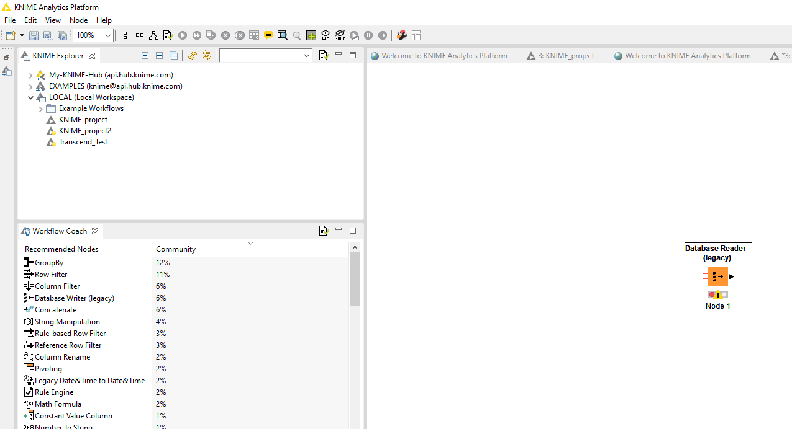

# KNIME Analytics PlatformとVantageを統合する

## 概要

このハウツーでは、KNIME Analytics PlatformからTerdata Vantageに接続する方法について説明します。

### KNIME Analytics Platform について

KNIME Analytics Platform はデータ サイエンス ワークベンチです。Teradata Vantage を含むさまざまなデータ ソースの分析をサポートします。

## 前提条件

import ClearscapeDocsNote from '../_partials/vantage_clearscape_analytics.mdx'

* Teradata Vantage インスタンス、バージョン 17.10 以降へのアクセス。
  <ClearscapeDocsNote />
* KNIMEはローカルにインストールされています。詳細については [KNIME インストール手順](https://www.knime.com/installation) を参照してください。

## 統合手順

1. https://downloads.teradata.com/download/connectivity/jdbc-driver にアクセスし (初めてのユーザーは登録する必要があります)、最新バージョンの JDBC ドライバをダウンロードします。
2. ダウンロードしたファイルを解凍します。 `terajdbc4.jar` ファイルが見つかります。
3. KNIMEで `File → Preference`をクリックします。 `Databases`の下で `Add`をクリックします:

4. 新しいデータベース ドライバを登録します。以下のように `ID`、 `Name` 、 `Description` の値を指定します。 `Add file` をクリックし、先ほどダウンロードした .jar ファイルを指定します。 `Find driver classes` をクリックすると、[] に `Driver class:``jdbc.TeraDriver`が表示されます。

5. `Apply and Close` をクリックします。

6. 接続をテストするために、新しいKNIMEワークフローを作成し、右側のワークスペースにドラッグして  `Database Reader (legacy)`ノードを追加してください。

7. 設定を構成するには、 `Database Reader (legacy)` を右クリックします。ドロップダウンから `com.teradata.jdbc.Teradriver` を選択します。

8. Vantage サーバーの名前とログイン メカニズムを入力します。例:

9. 接続をテストするには、右下のボックスに SQL ステートメントを入力します。たとえば、 `SELECT * FROM DBC.DBCInfoV` と入力し、 `Apply` をクリックしてダイアログを閉じます。

10. 接続をテストするノードを実行します。

11. 正常に実行されると、ノードに緑色のライトが表示されます。結果を表示するには、右クリックして `Data from Database` を選択します。

## まとめ

このハウツーでは、KNIME Analytics PlatformからTeradata Vantageに接続する方法を説明します。

## さらに詳しく
* [SQL のみを使用して Vantage で ML モデルをトレーニングする方法](./ml.md)

import CommunityLinkPartial from '../_partials/community_link.mdx';

<CommunityLinkPartial />