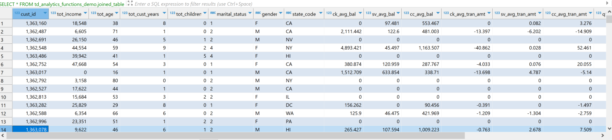
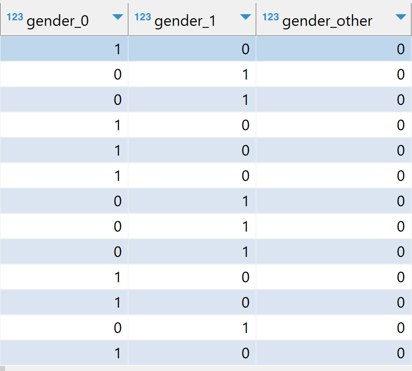

import ClearscapeDocsNote from '../_partials/vantage_clearscape_analytics.mdx'
import CommunityLink from '../_partials/community_link.mdx'

# データベース分析関数を使用して Vantage で ML モデルをトレーニングする

## 概要

機械学習モデルのアイデアをすぐに検証したい場合があります。モデルの種類は決まっています。まだ ML パイプラインで運用化はしたくありません。念頭に置いていた関係が存在するかどうかをテストしたいだけです。また、実稼働環境では、MLops による継続的な再学習が必要ない場合もあります。このような場合は、データベース分析関数を使用して特徴エンジニアリングを行い、さまざまな ML モデルをトレーニングし、モデルにスコアを付け、さまざまなモデル評価関数でモデルを評価できます。

## 前提条件

Teradata Vantageインスタンスへのアクセス。
<ClearscapeDocsNote />

## サンプルデータを読み込む

この例では、 `val` データベースのサンプル データを使用します。 `accounts`、[]、 `customer`、 `transactions` テーブルを使用します。プロセス中にいくつかのテーブルを作成しますが、 `val` データベースにテーブルを作成するときに問題が発生する可能性があるため、独自のデータベース `td_analytics_functions_demo`を作成しましょう。

```
CREATE DATABASE td_analytics_functions_demo
AS PERMANENT = 110e6;
```

:::note
データベース分析関数を使用するには、データベースに対する CREATE TABLE アクセス権が必要です。
:::

 `val` データベース内の対応するテーブルから、データベース `td_analytics_functions_demo` に `accounts`、`customer` 、および `transactions` テーブルを作成しましょう。

```
DATABASE td_analytics_functions_demo;

CREATE TABLE customer AS (
SELECT * FROM val.customer
) WITH DATA;

CREATE TABLE accounts AS (
SELECT * FROM val.accounts
) WITH DATA;

CREATE TABLE transactions AS (
SELECT * FROM val.transactions
) WITH DATA;
```

## サンプルデータを理解する

サンプル テーブルを `td_analytics_functions_demo`にロードしたので、データを調べてみましょう。これは、銀行の顧客 (約 700 行)、口座 (約 1400 行)、取引 (約 77K 行) からなる単純化された架空のデータセットです。これらは、次のように相互に関連しています。


このハウツーの後半では、テーブル内のクレジット カードに関連しないすべての変数に基づいて、銀行顧客のクレジット カードの月平均残高を予測するモデルを構築できるかどうかを検討していきます。

## データセットを準備する

3 つの異なるテーブルにデータがあり、それらを結合して機能を作成します。結合テーブルを作成することから始めましょう。 

```
-- Create a consolidated joined_table from customer, accounts and transactions table
CREATE TABLE td_analytics_functions_demo.joined_table AS (
    SELECT
        T1.cust_id  AS cust_id
       ,MIN(T1.income) AS tot_income
       ,MIN(T1.age) AS tot_age
       ,MIN(T1.years_with_bank) AS tot_cust_years
       ,MIN(T1.nbr_children) AS tot_children
       ,MIN(T1.marital_status)AS marital_status
       ,MIN(T1.gender) AS gender
       ,MAX(T1.state_code) AS state_code
       ,AVG(CASE WHEN T2.acct_type = 'CK' THEN T2.starting_balance+T2.ending_balance ELSE 0 END) AS ck_avg_bal
       ,AVG(CASE WHEN T2.acct_type = 'SV' THEN T2.starting_balance+T2.ending_balance ELSE 0 END) AS sv_avg_bal
       ,AVG(CASE WHEN T2.acct_type = 'CC' THEN T2.starting_balance+T2.ending_balance ELSE 0 END) AS cc_avg_bal
       ,AVG(CASE WHEN T2.acct_type = 'CK' THEN T3.principal_amt+T3.interest_amt ELSE 0 END) AS ck_avg_tran_amt
       ,AVG(CASE WHEN T2.acct_type = 'SV' THEN T3.principal_amt+T3.interest_amt ELSE 0 END) AS sv_avg_tran_amt
       ,AVG(CASE WHEN T2.acct_type = 'CC' THEN T3.principal_amt+T3.interest_amt ELSE 0 END) AS cc_avg_tran_amt
       ,COUNT(CASE WHEN ((EXTRACT(MONTH FROM T3.tran_date) + 2) / 3) = 1 THEN T3.tran_id ELSE NULL END) AS q1_trans_cnt
       ,COUNT(CASE WHEN ((EXTRACT(MONTH FROM T3.tran_date) + 2) / 3) = 2 THEN T3.tran_id ELSE NULL END) AS q2_trans_cnt
       ,COUNT(CASE WHEN ((EXTRACT(MONTH FROM T3.tran_date) + 2) / 3) = 3 THEN T3.tran_id ELSE NULL END) AS q3_trans_cnt
       ,COUNT(CASE WHEN ((EXTRACT(MONTH FROM T3.tran_date) + 2) / 3) = 4 THEN T3.tran_id ELSE NULL END) AS q4_trans_cnt
    FROM Customer AS T1
        LEFT OUTER JOIN Accounts AS T2
            ON T1.cust_id = T2.cust_id
        LEFT OUTER JOIN Transactions AS T3
            ON T2.acct_nbr = T3.acct_nbr
GROUP BY T1.cust_id) WITH DATA UNIQUE PRIMARY INDEX (cust_id);
```

では、データがどのようになっているかを見てみましょう。データセットには、カテゴリと連続の両方の特徴、つまり独立変数があります。この場合、従属変数は `cc_avg_bal` で、これは顧客の平均クレジットカード残高です。



## 特徴量エンジニアリング

データを見ると、`cc_avg_bal`を予測するために考慮できる特徴がいくつかあることがわかります。 

### TD_OneHotEncodingFit

データセットには `gender`、 `marital status` 、 `state code`などのカテゴリ特徴がいくつかあるため、データベース分析関数 [TD_OneHotEncodingFit](https://docs.teradata.com/r/Enterprise_IntelliFlex_VMware/Database-Analytic-Functions/Feature-Engineering-Transform-Functions/TD_OneHotEncodingFit) を利用してカテゴリをワンホット数値ベクトルにエンコードします。 

```
CREATE VIEW td_analytics_functions_demo.one_hot_encoding_joined_table_input AS (
  SELECT * FROM TD_OneHotEncodingFit(
    ON td_analytics_functions_demo.joined_table AS InputTable
    USING
    IsInputDense ('true')
    TargetColumn ('gender','marital_status','state_code')
    CategoryCounts(2,4,33)
Approach('Auto')
) AS dt
);
```

### TD_ScaleFit

データを見ると、 `tot_income`、 `tot_age`、 `ck_avg_bal` などの一部の列には異なる範囲の値があります。勾配降下法などの最適化アルゴリズムでは、収束を高速化し、スケールの一貫性を保ち、モデルのパフォーマンスを向上させるために、値を同じスケールに正規化することが重要です。 [TD_ScaleFit](https://docs.teradata.com/r/Enterprise_IntelliFlex_VMware/Database-Analytic-Functions/Feature-Engineering-Transform-Functions/TD_ScaleFit) 関数を利用して、異なるスケールの値を正規化します。

```
 CREATE VIEW td_analytics_functions_demo.scale_fit_joined_table_input AS (
  SELECT * FROM TD_ScaleFit(
    ON td_analytics_functions_demo.joined_table AS InputTable
    USING
    TargetColumns('tot_income','q1_trans_cnt','q2_trans_cnt','q3_trans_cnt','q4_trans_cnt','ck_avg_bal','sv_avg_bal','ck_avg_tran_amt', 'sv_avg_tran_amt', 'cc_avg_tran_amt')
    ScaleMethod('RANGE')
) AS dt
);
```

### TD_ColumnTransformer

Teradata のデータベース分析関数は、通常、データ変換のためにペアで動作します。最初のステップは、データの「フィッティング」専用です。その後、2 番目の関数は、フィッティング プロセスから得られたパラメータを使用して、データに対して実際の変換を実行します。 [TD_ColumnTransformer](https://docs.teradata.com/r/Enterprise_IntelliFlex_VMware/Database-Analytic-Functions/Feature-Engineering-Transform-Functions/TD_ColumnTransformer)は、FIT テーブルを関数に渡し、入力テーブル列を 1 回の操作で変換します。

```
-- Using a consolidated transform function
CREATE TABLE td_analytics_functions_demo.feature_enriched_accounts_consolidated AS (
SELECT * FROM TD_ColumnTransformer(
ON joined_table AS InputTable
ON one_hot_encoding_joined_table_input AS OneHotEncodingFitTable DIMENSION
ON scale_fit_joined_table_input AS ScaleFitTable DIMENSION
) as dt 
) WITH DATA;
```

変換を実行すると、以下のイメージに示すように、カテゴリ列がone-hot エンコードされ、数値がスケーリングされたことがわかります。たとえば、`tot_income` は [0,1] の範囲内にあり、`gender` は `gender_0`、`gender_1`、`gender_other` にワンホットエンコードされます。





## テスト分割のトレーニング

データセットがスケーリングされ、エンコードされた状態で準備できたので、データセットをトレーニング (75%) とテスト (25%) の部分に分割します。Teradata のデータベース分析関数には、データセットを分割するために活用する [TD_TrainTestSplit](https://docs.teradata.com/r/Enterprise_IntelliFlex_VMware/Database-Analytic-Functions/Model-Evaluation-Functions/TD_TrainTestSplit) 関数が用意されています。

```
-- Train Test Split on Input table 
CREATE VIEW td_analytics_functions_demo.train_test_split AS (
SELECT * FROM TD_TrainTestSplit(
ON td_analytics_functions_demo.feature_enriched_accounts_consolidated AS InputTable
USING
IDColumn('cust_id')
trainSize(0.75)
testSize(0.25)
Seed (42)
) AS dt
);
```

以下のイメージからわかるように、この関数は新しい列 `TD_IsTrainRow` を追加します。 


`TD_IsTrainRow` を使用して、トレーニング用とテスト用の2つのテーブルを作成します。

```
-- Creating Training Table
CREATE TABLE td_analytics_functions_demo.training_table AS (
  SELECT * FROM td_analytics_functions_demo.train_test_split
  WHERE TD_IsTrainRow = 1
) WITH DATA;

-- Creating Testing Table
CREATE TABLE td_analytics_functions_demo.testing_table AS (
  SELECT * FROM td_analytics_functions_demo.train_test_split
  WHERE TD_IsTrainRow = 0
) WITH DATA;
```

## 一般化線形モデルを使用したトレーニング 

ここで、 [TD_GLM](https://docs.teradata.com/r/Enterprise_IntelliFlex_VMware/Database-Analytic-Functions/Model-Training-Functions/TD_GLM) データベース分析関数を使用して、トレーニング データセットをトレーニングします。 `TD_GLM` 関数は、データ セットに対して回帰分析と分類分析を実行する一般化線形モデル (GLM) です。ここでは、 `tot_income`、 `ck_avg_bal`、`cc_avg_tran_amt`、婚姻状況、性別、州のワンホット エンコードされた値など、一連の入力列を使用しました。 `cc_avg_bal` は従属列または応答列であり、連続しているため回帰問題です。 `Family` は回帰の場合は `Gaussian` 、分類の場合は `Binomial` として使用します。 

パラメータ `Tolerance` は、モデルが反復を停止するために必要な予測精度の最小改善を示し、 `MaxIterNum` は許容される反復の最大回数を示します。モデルは、最初に満たされた条件でトレーニングを終了します。たとえば、以下の例では、モデルは 58 回の反復後に `CONVERGED` になります。

```
-- Training the GLM_Model with Training Dataset
CREATE TABLE td_analytics_functions_demo.GLM_model_training AS (
SELECT * FROM TD_GLM (
  ON td_analytics_functions_demo.training_table AS InputTable
  USING
  InputColumns('tot_income','ck_avg_bal','cc_avg_tran_amt','[19:26]')
  ResponseColumn('cc_avg_bal')
  Family ('Gaussian')
  MaxIterNum (300)
  Tolerance (0.001)
  Intercept ('true')
) AS dt
) WITH DATA;
```


## テストデータセットのスコアリング

ここで、モデル `GLM_model_training` を使用して、リンク:[TD_GLMPredict](https://docs.teradata.com/r/Enterprise_IntelliFlex_VMware/Database-Analytic-Functions/Model-Scoring-Functions/TD_GLMPredict)データベース分析関数を使用してテスト データセット `testing_table` にスコアを付けます。

```sql
-- Scoring the GLM_Model with Testing Dataset
CREATE TABLE td_analytics_functions_demo.GLM_model_test_prediction AS (
SELECT * from TD_GLMPredict (
ON td_analytics_functions_demo.testing_table AS InputTable
ON td_analytics_functions_demo.GLM_model_training AS ModelTable DIMENSION
USING
IDColumn ('cust_id')
Accumulate('cc_avg_bal')
) AS dt
) WITH DATA;
```


## モデル評価

最後に、スコア付けされた結果に基づいてモデルを評価します。ここでは [TD_回帰評価ツール](https://docs.teradata.com/r/Enterprise_IntelliFlex_VMware/Database-Analytic-Functions/Model-Evaluation-Functions/TD_RegressionEvaluator) 関数を使用しています。モデルは `R2`、 `RMSE`、 `F_score`などのパラメータに基づいて評価できます。 

```sql
-- Evaluating the model
SELECT * FROM TD_RegressionEvaluator(
ON td_analytics_functions_demo.GLM_model_test_prediction AS InputTable
USING
ObservationColumn('cc_avg_bal')
PredictionColumn('prediction')
Metrics('RMSE','MAE','R2')
) AS dt;
```


:::note
このハウツーの目的は、機能エンジニアリングを説明することではなく、Vantage でさまざまなデータベース分析関数を活用する方法を示すことです。モデルの結果は最適ではない可能性があり、最適なモデルを作成するプロセスはこの記事の範囲外です。
:::

## まとめ

このクイックスタートでは、Teradata データベース分析関数を使用して ML モデルを作成する方法を学習しました。[] データベースの `td_analytics_functions_demo` 、 `customer`、`accounts`、 `val``transactions` データを使用して独自のデータベース [] を構築しました。 `TD_OneHotEncodingFit`、[]、 `TD_ScaleFit` 、 `TD_ColumnTransformer`を使用して列を変換することにより、特徴エンジニアリングを実行しました。次に、 `TD_TrainTestSplit` を使用してトレーニング テスト分割を行いました。 `TD_GLM` モデルを使用してトレーニング データセットをトレーニングし、テスト データセットにスコアを付けました。最後に、 `TD_RegressionEvaluator` 関数を使用してスコア付けされた結果を評価しました。 

## さらに詳しく
* [Vantage データベース分析関数ユーザー ガイド](https://docs.teradata.com/r/Enterprise_IntelliFlex_VMware/Database-Analytic-Functions/Introduction-to-Analytics-Database-Analytic-Functions)

<CommunityLink />
