# VantageのデータをAzure Machine Learning Studioで使用する方法

## 概要

[Azure Machine Learning (ML) Studio](https://docs.microsoft.com/en-us/azure/machine-learning/studio/what-is-ml-studio) は、データに基づく予測分析ソリューションを構築、テスト、およびデプロイするために使用できる、共同作業用のドラッグ アンド ドロップ ツールです。ML Studio は、Azure Blob Storage からデータを利用できます。この入門ガイドでは、ML Studio の「組み込み」Jupter Notebook 機能を使用して、Teradata Vantage データ セットを Blob Storage にコピーする方法を説明します。その後、ML Studio でデータを使用して、機械学習モデルを構築およびトレーニングし、運用環境にデプロイできます。


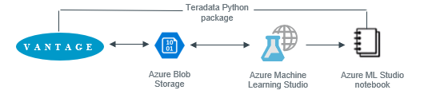


## 前提条件

import ClearscapeDocsNote from '../_partials/vantage_clearscape_analytics.mdx'

* Teradata Vantageインスタンスへのアクセス。
  <ClearscapeDocsNote />
* Azureサブスクリプションまたは作成 [無料アカウント](https://azure.microsoft.com/free)
* [Azure ML Studio ワークスペース](https://docs.microsoft.com/en-us/azure/machine-learning/studio/create-workspace)
* (オプション) [AdventureWorks DW 2016 データベース](https://docs.microsoft.com/en-us/sql/samples/adventureworks-install-configure?view=sql-server-2017) (つまり _「モデルの学習」_ セクション) をダウンロードします
  * _「vTargetMail」_ テーブルを SQL Server から Teradata Vantageに復元およびコピーします。


## 手順

### 初期設定


* ML Studio ワークスペースの作成中に、現在の利用可能な場所にストレージ アカウントがない場合は、「新しい」ストレージ アカウントを作成し、この入門ガイドの [ **Web service plan** に **DEVTEST Standard** を選択する必要がある場合があります。 [Azureポータル](https://portal.azure.com)にログオンし、ストレージ アカウントを開いて、 **コンテナ** がまだ存在しない場合は作成します。
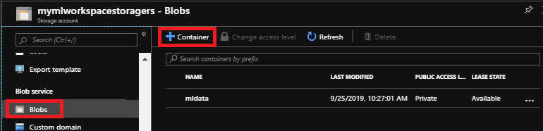

*  **ストレージアカウント名** と **キー** をメモ帳にコピーし、Python3 NotebookでAzure Blob Storageアカウントにアクセスするために使用します。
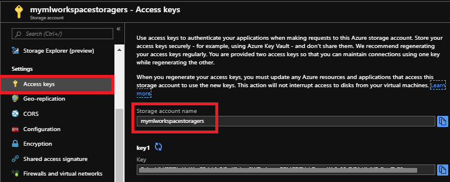

* 最後に、**Configuration** プロパティを開き、**_'Secure transfer required'_** を **_Disabled_** に設定して、ML Studioインポートデータモジュールがブロブストレージアカウントにアクセスできるようにする。
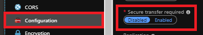

### データのロード

ML Studioにデータを取得するには、まずTeradata VantageからAzure Blob Storageにデータをロードする必要があります。ML Jupyter Notebookを作成し、Teradataに接続してAzure Blob Storageにデータを保存するPythonパッケージをインストールします。

 [Azureポータル](https://portal.azure.com)にログオンし、 **ML Studioワークスペース** と [Machine Learning Studioを起動する](https://studio.azureml.net) と **サインイン**に移動します

1. 以下の画面が表示されます。 **Notebooks** をクリックして、正しいリージョン/ワークスペースにいることを確認し、Notebook の **New**をクリックします。
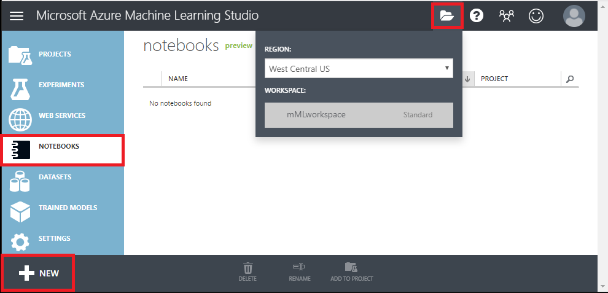

2. *Python3* を選択し、Notebook インスタンスに **名前を付け** ます。
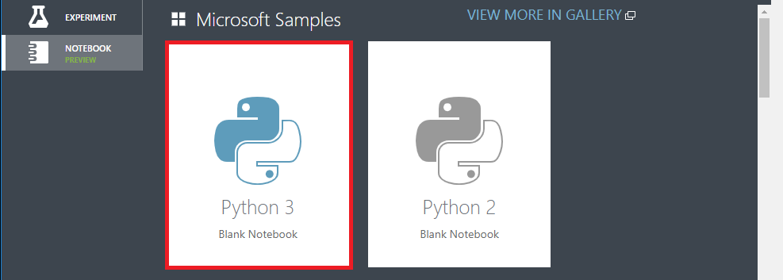

3. Jupyterノートブックインスタンスに [高度な分析のための Teradata Vantage Python パッケージ](https://pypi.org/project/teradataml)をインストールします。

    ``` python
    pip install teradataml
    ```

    :::note
    Microsoft Azure ML StudioとTeradata Vantage Pythonパッケージの間の検証は行われていません。
    :::

4. [Microsoft Azure Storage Blob Client Library for Python](https://pypi.org/project/azure-storage-blob)をインストールします。

    ``` python
    !pip install azure-storage-blob
    ```

5. 以下のライブラリをインポートしてください。

    ``` python
    import teradataml as tdml
    from teradataml import create_context, get_context, remove_context
    from teradataml.dataframe.dataframe import DataFrame
    import pandas as pd
    from azure.storage.blob import (BlockBlobService)
    ```

6. 以下のコマンドを使用して Teradata に接続します。

    ``` python
    create_context(host = '<hostname>', username = '<database user name>', password = '<password>')
    ```

7. Teradata Python DataFrameモジュールを使用してデータを取得します。

    ``` python
    train_data = DataFrame.from_table("<table_name>")
    ```

8. Teradata DataFrameをPanda DataFrameに変換します。

    ``` python
    trainDF = train_data.to_pandas()
    ```

9. データをCSVに変換します。

    ``` python
    trainDF = trainDF.to_csv(head=True,index=False)
    ```

10. Azue Blob Storage アカウント名、キー、コンテナ名の変数を割り当てます。

    ``` python
    accountName="<account_name>"
    accountKey="<account_key>"
    containerName="mldata"
    ```

11. Azure Blob Storageにファイルをアップロードします。

    ``` python , id="azure_ml_studio_first_config", role="content-editable emits-gtm-events
    blobService = BlockBlobService(account_name=accountName, account_key=accountKey)
    blobService.create_blob_from_text(containerNAme, 'vTargetMail.csv', trainDF)
    ```

12. Azure ポータル にログオンし、BLOB ストレージ アカウントを開いて、アップロードされたファイルを表示します。
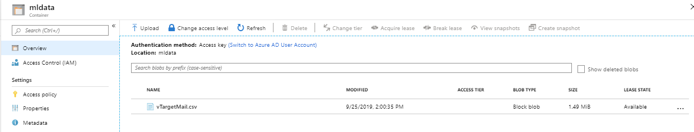

### モデルの学習

既存の [Azure Machine Learning でデータを分析する](https://docs.microsoft.com/en-us/azure/sql-data-warehouse/sql-data-warehouse-get-started-analyze-with-azure-machine-learning) 記事を使用して、Azure Blob Storage のデータに基づく予測機械学習モデルを構築します。顧客が自転車を購入する可能性があるかどうかを予測することで、自転車ショップ Adventure Works 向けのターゲット マーケティング キャンペーンを構築します。

### Import data

データは、上のセクションでコピーした `vTargetMail.csv` という Azure Blob Storage ファイルにあります。

1.  [Azure Machine Learning studio](https://studio.azureml.net) にサインインし、 **Experiments**をクリックします。
2. 画面左下の **+NEW** をクリックし、 **Blank Experiment** を選択します。
3. 実験の名前として「Targeted Marketing」を入力します。
4.  **Data Input and output** の下にある **Import data** モジュールをモジュール ペインからキャンバスにドラッグします。
5. [プロパティ] ペインで Azure Blob Storage の詳細 (アカウント名、キー、コンテナ名) を指定します。

experimentキャンバスの下にある *Run* をクリックして、実験を実行します。

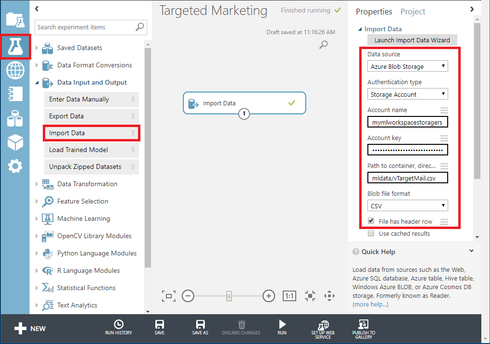

実験が正常に終了したら、Import Data モジュールの下部にある出力ポートをクリックし、 *Visualize* を選択してインポートしたデータを確認します。

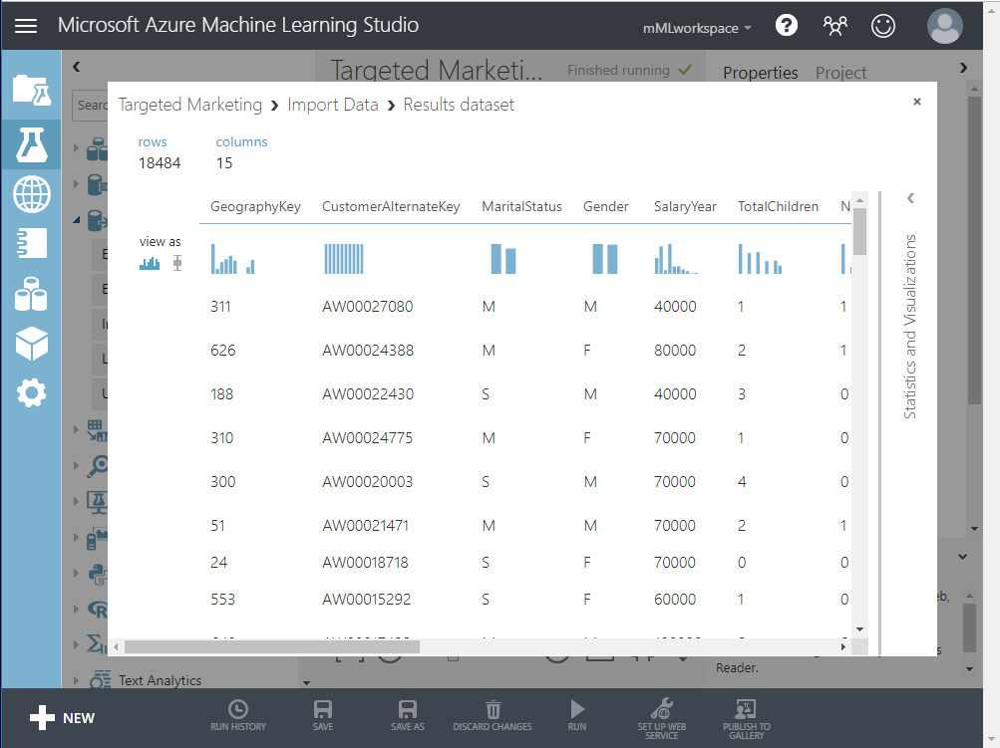


### データのクリーンアップ

データをクリーンアップするには、モデルに関係のない列をいくつか削除します。これを行うには、次の手順を実行します。

1.  *Data Transformation < Manipulation* の下の *Select Columns in Dataset* モジュールをキャンバスにドラッグします。このモジュールを *Import Data* モジュールに接続します。
2. プロパティペインの *Launch column selector* をクリックして、ドロップする列を指定します。
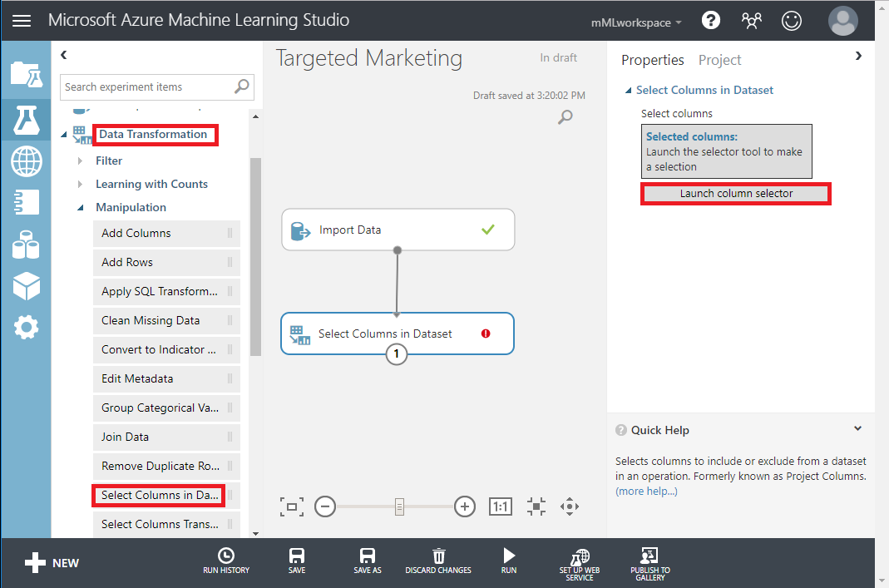
3. *CustomerAlternateKey* と *GeographyKey* の2 つのカラムを除外します。
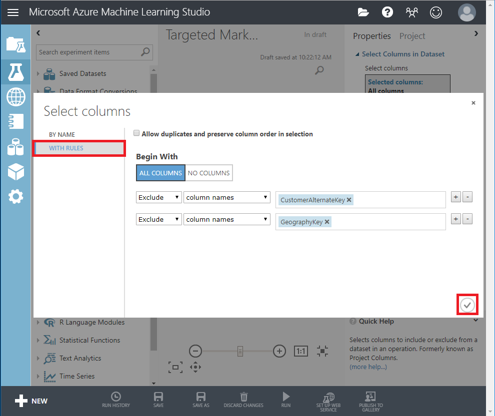

### モデルの構築

データを 80-20 に分割します。80% は機械学習モデルのトレーニングに、20% はモデルのテストに使用します。このバイナリ分類問題には、「2 クラス」アルゴリズムを使用します。

1. **SplitData** モジュールをキャンバスにドラッグし、「Select Columns in DataSet」で接続します。
2. プロパティペインで「Fraction of rows in the first output dataset」に「0.8」を入力します。
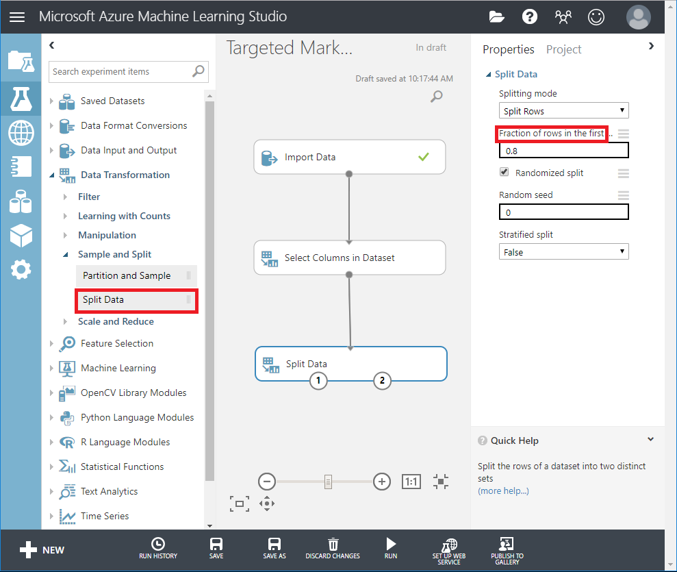

3. **Two-Class Boosted Decision Tree** モジュールを検索し、キャンバスにドラッグします。
4. **Train Model** モジュールを検索してキャンバスにドラッグし、**Two-Class Boosted Decision Tree** (MLアルゴリズム)モジュールと **Split** **Data** (アルゴリズムをトレーニングするためのデータ)モジュールに接続して入力を指定する。
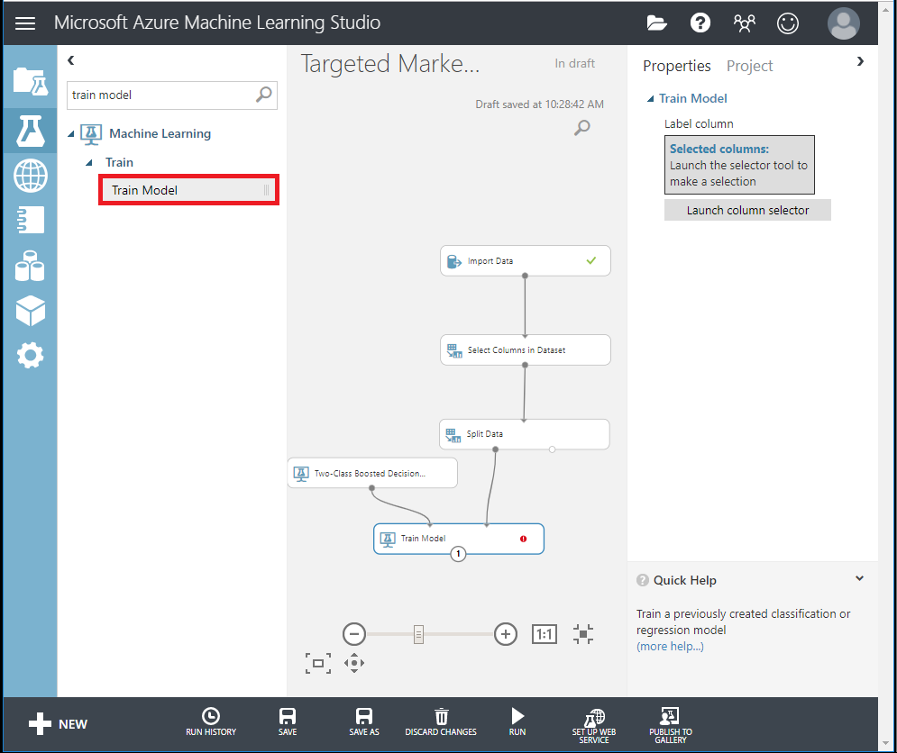

5. 次に、プロパティ ペインで *Launch column selector* をクリックします。予測する列として *BikeBuyer* 列を選択します。
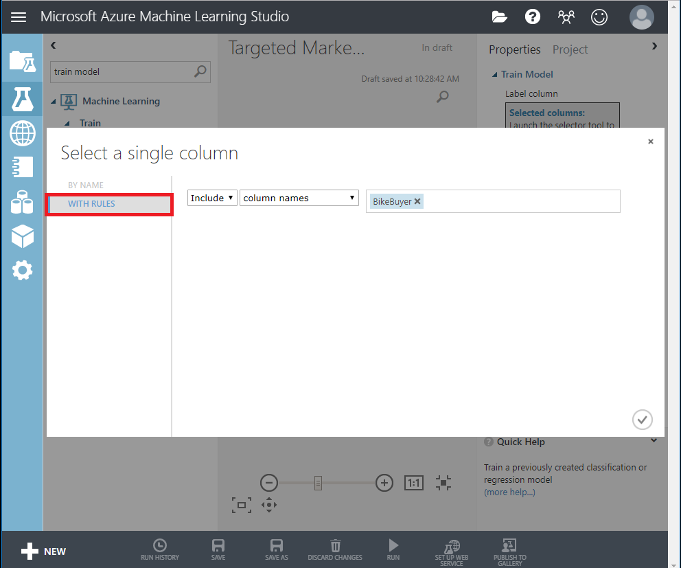

### モデルの評価

ここで、モデルがテスト データに対してどのように機能するかをテストします。選択したアルゴリズムと別のアルゴリズムを比較して、どちらのパフォーマンスが優れているかを確認します。

1.  **Score Model** モジュールをキャンバスにドラッグし、 **Train Model** と **Split Data** モジュールに接続します。

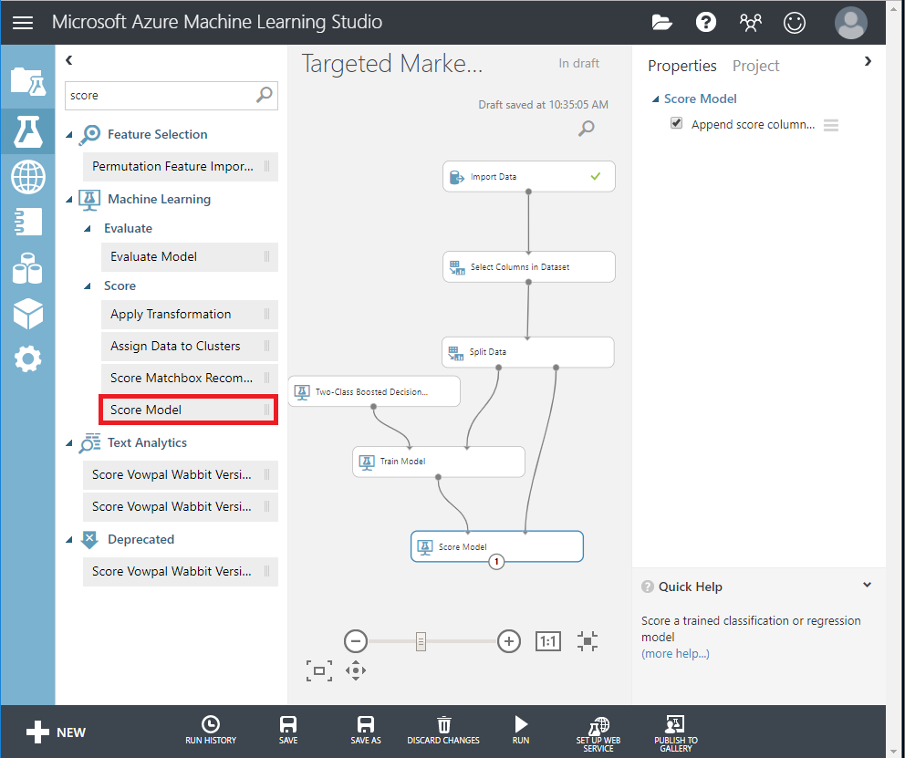

2.  **Two-Class Bayes Point Machine** を検索して実験キャンバスにドラッグします。このアルゴリズムのパフォーマンスを 2 クラス ブースト決定木と比較します。
3. 「Train Model 」と「Score Model」モジュールをコピーして、キャンバスに貼り付けます。
4.  **Evaluate Model** モジュールを検索して、キャンバスにドラッグし、2つのアルゴリズムを比較します。
5. **Run** 実験します。
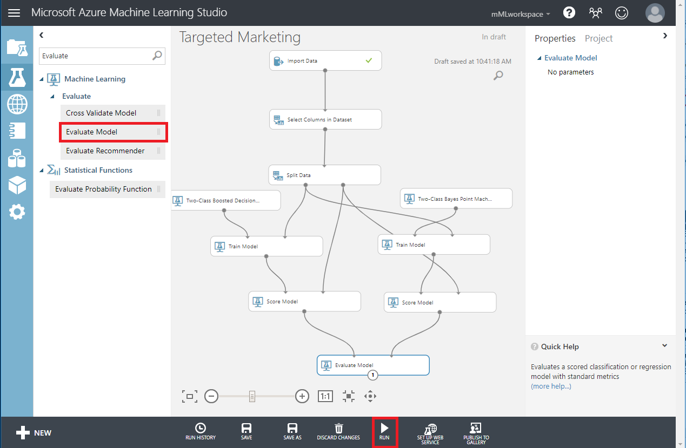
6. Evaluate Model モジュールの下部にある出力ポートをクリックし、Visualize をクリックします。
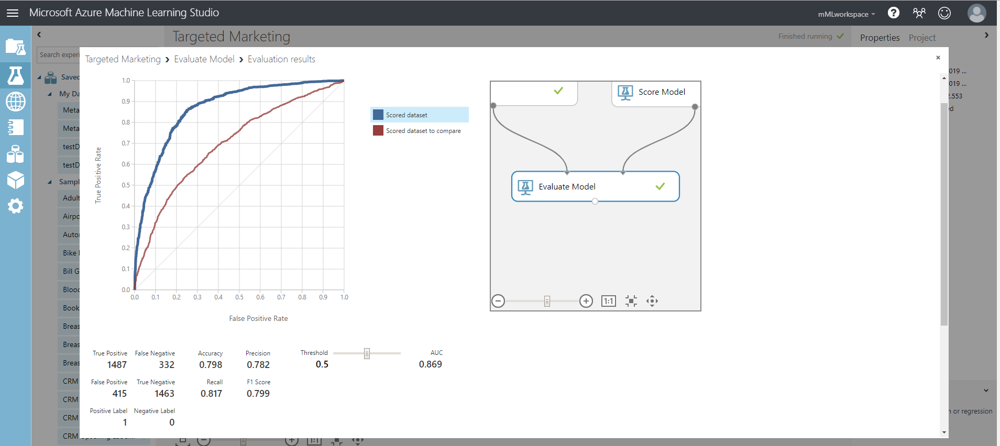


提供されるメトリックは、ROC 曲線、精度再現率図、リフト曲線です。これらのメトリックを見ると、最初のモデルが 2 番目のモデルよりもパフォーマンスが優れていることがわかります。最初のモデルが予測した内容を確認するには、スコア モデルの出力ポートをクリックし、[視覚化] をクリックします。

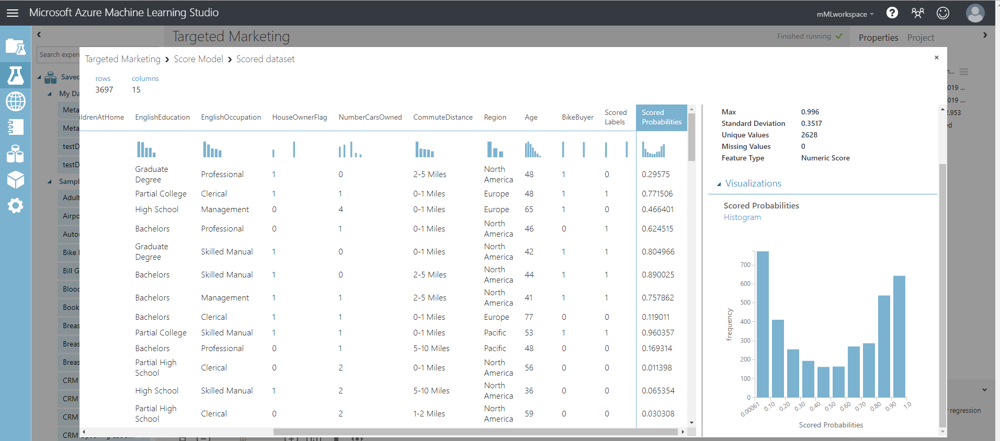

テストデータセットに2つの列が追加されているのがわかります。
1. スコアリングされた確率：顧客がバイクの購入者である可能性。
2. スコア付けされたラベル: モデルによって行われた分類 - 自転車購入者 (1) または非購入者 (0)。このラベル付けの確率しきい値は 50% に設定されており、調整可能です。

BikeBuyer 列 (実際) と Scored Labels (予測) 列を比較すると、モデルのパフォーマンスがどの程度優れているかがわかります。次の手順では、このモデルを使用して新規顧客の予測を行い、このモデルを Web サービスとして公開するか、結果を SQL Data Warehouse に書き戻すことができます。

## さらに詳しく

* 予測型機械学習モデルの構築の詳細については、 [Introduction to Machine Learning on Azure](https://azure.microsoft.com/documentation/articles/machine-learning-what-is-machine-learning)を参照してください。
* 大規模なデータセットのコピーには、Teradata Parallel Transporterのロード/アンロード オペレーターとAzure Blob Storageの間のインターフェイスである [Teradata Access Module for Azure](https://docs.teradata.com/reader/p~0sSD4zl4K8YPbEGnM3Rg/TTu_WJMMIpo2TEaxFMFopQ) の利用を検討してください。

import CommunityLinkPartial from '../_partials/community_link.mdx';

<CommunityLinkPartial />
