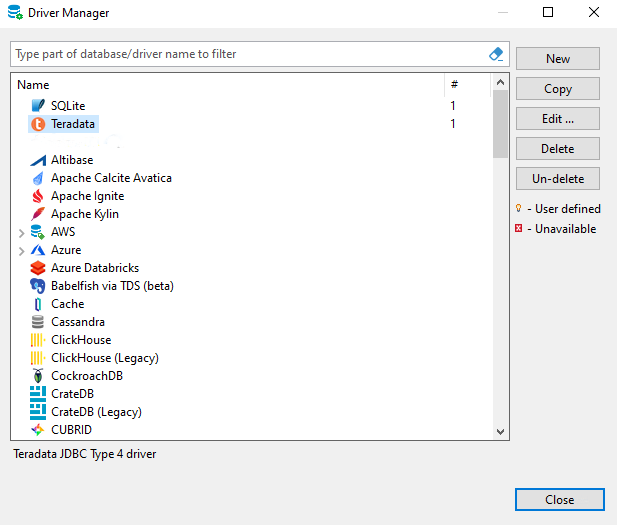

# DBeaverでのTeradata Vantageの接続設定

## 概要

このハウツーでは、DBeaverを使用してTeradata Vantageへの接続を作成する方法を説明します。

## 前提条件

import ClearscapeDocsNote from '../_partials/vantage_clearscape_analytics.mdx'

* Teradata Vantageインスタンスへのアクセス。
  <ClearscapeDocsNote />
* DBeaverがインストールされています。インストールオプションについては [DBeaver コミュニティ](https://dbeaver.io/download) または [DBeaver PRO](https://dbeaver.com/download) を参照してください。

## DBeaverにTeradataの接続を追加する

1. アプリケーションウィンドウの左上隅にあるプラグアイコン（）をクリックするか、 `Database -> New Database Connection`に移動して、新しい接続ウィザードを起動します。
2. `Select your database` 画面で `teradata` と入力し、Teradataアイコンを選択します。

3. メインタブでは、すべての主要な接続設定を設定する必要があります。必須の設定には `Host`、 、 `Port`、 `Database`、[]、 `Username`、 `Password`などがあります。
    :::tip
    Teradata Vantage では、ユーザーが作成されると、同じユーザーに対応するデータベースも作成されます。DBeaver では、データベースを入力する必要があります。接続するデータベースがわからない場合は、 `database` フィールドにユーザー名を入力してください。
    :::

    :::tip
    DBeaver PRO では、テーブルの標準的な順序付けを使用できるだけでなく、テーブルを特定のデータベースまたはユーザーに階層的にリンクすることもできます。データベースまたはユーザーをデプロイしたり折りたたんだりすると、データベース ナビゲータ ウィンドウを圧迫することなく、ある領域から別の領域に移動できます。この設定を有効にするには、 `Show databases and users hierarchically` ボックスをオンにします。
    :::

    :::tip
    多くの環境では、Teradata Vantage には TLS プロトコルを使用してのみアクセスできます。DBeaver PRO の場合は、 `Use TLS protocol` オプションをオンにして TLS を有効にします。
    :::

    

4. `Finish` をクリックします。

## オプション: ログオンメカニズム

DBeaver 接続を作成するときのデフォルトのログオン メカニズムは TD2 です。他のログオン メカニズムを追加するには、次の手順に従います。

1. データベース メニューに移動し、ドライバ マネージャーをクリックします。
2. ドライバ名のリストから Teradata を選択し、「コピー」をクリックします。
  

3. 「URL テンプレート」フィールドで、選択したログオン メカニズムを定義します。
  `jdbc:teradata://\{host}/LOGMECH=LDAP,DATABASE=\{database},DBS_PORT=\{port}` 
  

4. 「OK」をクリックします。
5. 新しいドライバを使用して、選択したログオン メカニズムとの接続を作成できるようになりました。
  
6. 代替メカニズムを使用して新しい接続を設定するプロセスは、上記の新しい接続の追加の場合と同じです。
  

## オプション: SSHトンネリング

データベースに直接アクセスできない場合は、SSH トンネルを使用できます。すべての設定は `SSH` タブで使用できます。DBeaver は、ユーザー/パスワード、公開キー、SSH エージェント認証の認証方法をサポートしています。

## まとめ

このハウツーでは、DBeaver を使用して Teradata Vantage への接続を作成する方法を説明しました。

import CommunityLinkPartial from '../_partials/community_link.mdx';

<CommunityLinkPartial />
